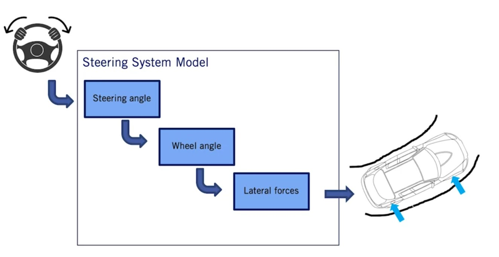
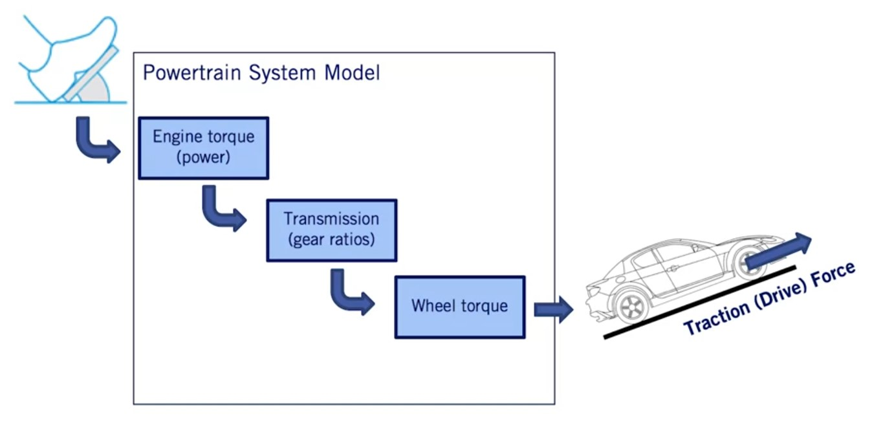
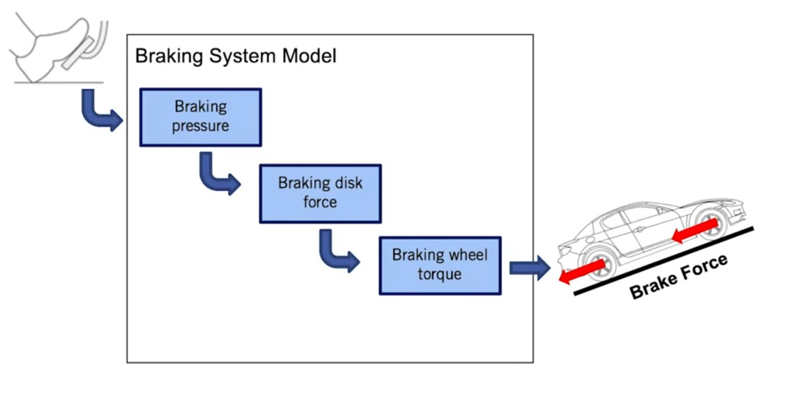

# Vehicle Actuation

## Coupled Lateral & Longitudinal

Main Control Task:
To keep the vehicle on the defined path at the desired velocity

### Steering

* Simple Steering (Usually used for simulations)

* Actual Steering System

### Powertrain System (Driveline)

Throttle and brake commands affect torque balance

#### Throttling (Accelerating)

* Accelerating model 
* Accelerating characteristics plots 

#### Typical Torque Curves for Gasoline Engines

$$T_{e_{max}}\left(\omega_e\right) = A_0 + A_1\omega_e + A_2\omega_e^2$$

$$T_{e_{max}}\left(\omega_e,x_\theta\right) \approx x_\theta \left(A_0 + A_1\omega_e + A_2\omega_e^2 \right)$$

Where $x_\theta$ is the throttle position (persentage)

#### Braking (decelerating)

* Model

$$T_{brake} = k \Delta P$$

## Additional Resources

Read more about vehicle steering system in the Journal article below:

Reimann G., Brenner P., Büring H. (2015) "Steering Actuator Systems". In: Winner H., Hakuli S., Lotz F., Singer C. (eds) Handbook of Driver Assistance Systems. Springer, Cham

Read more about vehicle driveline (throttling and braking system) in the textbook below:

Mashadi, B., Crolla, D, Vehicle Powertrain Systems. Wiley (2012)
