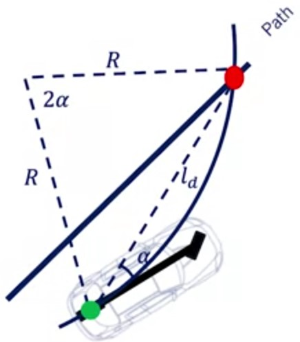

# Geometric Lateral Control - Pure Pursuit

## Geometric path tracking

One of the most popular classes of path tracking in robotics and autonomous vehicle

* Exploits geometric relationship between the vehicle and the path resulting in compact control law solutions to the path tracking problem
* Use of reference point on path to measure error of the vehicle, can be ahead of the vehicle

## Pure pursuit

Pure pursuit method consists of geometrically calculating
the trajectory curvature.

Connect the centre of rear axle location to a target point on
the path ahead of the vehicle.

### Pure pursuit - formulation

Steering angle determined by target point location and angle between the vehicle's heading direction and lookahead direction.

From the law of sines:
$$\frac{l_d}{\sin{2\alpha}} = \frac{R}{\sin{(\frac{\pi}{2}-\alpha)}} \rightarrow \frac{l_d}{\sin{\alpha}} = 2R$$
Then Path Curvature $k$ is defined as:
$$k = \frac{1}{R} = \frac{2\sin{\alpha}}{l_d}$$

### Pure pursuit - formulation (bicycle model)

Using the bicycle model the steering angle is calculated as:

* $k =\frac{2\sin{\alpha}}{l_d}$
* $\delta = \tan^{-1}{(kL)}$

$$\delta = \tan^{-1}\left(\frac{2L\sin{\alpha}}{l_d}\right)$$

### Pure pursuit - formulation crosstrack error

Crosstrack error $(e)$ is defined here as the lateral distance between the heading vector and the target point so:

* $\sin{\alpha} = \frac{e}{l_d}$
* $k =\frac{2\sin{\alpha}}{l_d}$
$$k = \frac{2}{l_d^2}e$$

Pure pursuit is a proportional controller of the steering angle operating on a crosstrack error some look ahead distance in front of the vehicle,

The proportional gain $\frac{2}{l_d^2}$ can be tuned at different speeds (the $l_d$ being assigned as a function of vehicle speed)

Lookahead $l_d$ is assigned as a linear function of vehicle speed:
$l_d = Kv_f$

* $\delta = \tan^{-1}\left(\frac{2L\sin{\alpha}}{l_d} \right)$
* $k = \frac{2}{l_d^2}e$

$$\delta = \tan^{-1}\left(\frac{2L\sin{\alpha}}{K_{dd}v_f} \right)$$
Where $v_f$ is the forward velocity

## Additional resources

Snider, J. M., ["Automatic Steering Methods for Autonomous Automobile Path Tracking"](https://www.ri.cmu.edu/pub_files/2009/2/Automatic_Steering_Methods_for_Autonomous_Automobile_Path_Tracking.pdf), Robotics Institute, Carnegie Mellon University, Pittsburg (February 2009).
