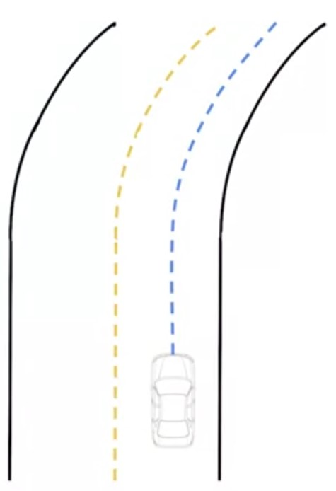

# Map-Aware Motion Prediction

## Assumptions to Improve Prediction

* Positional Assumptions
  * Vehicles on driving lane usually follow the given drive lane
  * Changing drive lanes is usually prompted by an
indicator signal
* Velocity Assumptions
  * Vehicles usually modify their velocity when approaching restrictive geometry (tight turns)
  * Vehicles usually modify the velocity when approaching regulatory elements

## Improvement of Position Estimation

* Roadways with natural curvature
* Vehicles on drive lane usually follow the given drive lane
* The predicted path is set to follow the center of the driving lane which the dynamic vehicle is on

### Improvement of Path Prediction

* Problems with the model:
  * Difficult to predict lane change maneuvers without extra information
  * Multiple possible lanelets such as when on an intersection
* Solution with the model:
  * Most likely prediction
  * Multi-hypothesis prediction

#### Multi-hypothesis Approach

* Consider the range of all possible
motions
  * Left, right, stay stopped
* Provides more information to local planner
* Safer due to human error (forgotten turn signal)

|Models|Proposed|Lane Maneuver Problem|Lane Change Probel|Solution (ulti-hypothesis Approach)|
|-|-|-|-|-|
||||||

## Improvements to Velocity Prediction

* Road curvature can be used to improve the velocity prediction over the path
  * Maximum lateral acceleration: $0.5-1 \ m/s^2$
* Improve the velocity prediction based on regulatory elements in the environment
  * Stop locations, deceleration
profi les
  * Lanelet priors

## Issues with the Assumptions

* Vehicles don't always stay within their lane or stop at
regulatory elements
* Vehicles off of the road map cannot be predicted
using this method
