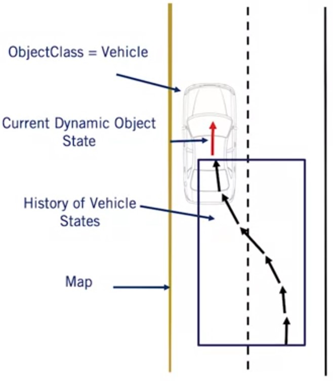

# Motion Prediction

Motion prediction of the dynamic object's attempts t* estimate the future position, heading and velocity
Important as it allows:

* Planning a set of maneuvers t* correctly interact with dynamic objects
* Avoid collisions on a planned trajectory

## Requirements for Motion Prediction Models

Mandatory Requirements:

* Class of Dynamic Object
* Current position, heading and
velocity

Optional Requirements:

* History of the position, heading and velocity
  * Requires object tracking between identifications over a set amount of time
* Current high definition roadmap
* Image of the current dynamic object

## Simplification of Motion Prediction - Cars

|Physics-based Assumptions|Maneuver-based Assumptions|Interactions-aware Assumptions|
|-|-|-|
||||

## Complexities of Motion Prediction - Pedestrians

* Pedestrians are unpredictable
* Can rapidly change speed and heading
* Pedestrians have right of way, but will stop if threatened
* Pedestrians use crossings
* Pedestrians use sidewalks

## Constant Velocity Prediction Model

* Simple
* Computationally efficient
* Assumption is that the dynamic object will maintain its velocity
  * Magnitude
  * Heading

### Algorithm

Input:

* $T$— time horizon to predict
over
* $dt$ — time between predictions
* $x_{\text{obj}}$ current dynamic object state
  * Position: $x_{\text{obj}}$.pos
  * Velocity : $x_{\text{obj}}$.vel

Output:

* $x_{1:T}$ — list of future vehicle states

|**Algorithm Constant Velocity Prediction($x_\text{obj}$)**|
|-|

1. $t \leftarrow 0$
2. $x_0 = x_{\text{obj}}$
3. **while** $t * dt < T$ **do**
4. &emsp; $t=t+1$
5. &emsp; $x_t.\text{pos} \leftarrow x_{t-1}.\text{pos} + dt* x_{t-1}.\text{vel}$
6. &emsp; $x_t.\text{vel} \leftarrow x_{t-1}.\text{vel}$
7. **return** $x_{1:T}$

### Issues

* Don't account for Vehicle Dynamics fully
* Don't account for the Road (Position adjustment)
* Don't account for Road Signs (Velocity adjustment)
* Assumptions are too Strong and Incorrect for most Dynamic Object Motion
