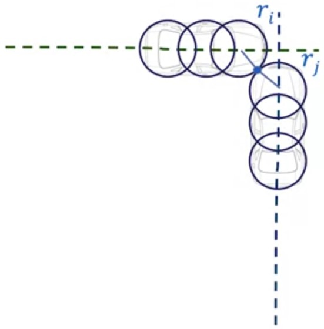

# Time To Collision

## Definition of Time to Collision

* Assuming all dynamic object continue along their predicted path:
  * Will then be a collision between any of the objects?
  * If so how far into the future?
* Time to Collision is comprised of:
  * Collision point between the two dynamic objects
  * Prediction of the time to arrive to the collision point
* Requirements for Accuracy:
  * Accurate predicted trajectories for all dynamic objects (position, heading and velocity)
  * Accurate dynamic objects geometries

## Approaches to calculate time to collision

### Simulation approach

* Simulate the movement of each vehicle as time
passes
* Taking account of the vehicle model over time
* Checking if any part of the two dynamic object
has collided

### Estimation approach

* Geometries of the vehicles are
approximated over duration of the
predicted path
* Collision point is estimated based the
cars predictions
* Many assumptions are usually made
by this method usually to estimate
time to collision

## Relative Strengths and Weaknesses

|Simulation Approach|Estimation Approach|
|-|-|
|Computationally expensive|Computationally inexpensive (Memory footprint, Computational time)|
|Higher accuracy if simulated with high fidelity|Less accurate due to approximations and estimations|
|Offline Applications (Dataset evaluation or Simulations) | Real Time Applications (In Car Prediction)|

## Simulation approach Pseudocode

* Inputs:
  * $D$ — list of all dynamic objects
    * Predicted paths
  * $dt$ — time between simulation steps
  * $N_c$ — number of circles for collision approximation
* Outputs:
  * $P_{\text{col}}$ — list of all collision points
  * $TTC$ — list of all times to collision points

|**Algorithm Constant Velocity TTC($D, T, dt, N_c$)**|
|-|

1. $t \leftarrow 0$
2. $x_0 = x_\text{obj}$
3. **while** %t < T% **do**
4. &emsp; $t = t + dt$
5. &emsp; **for** $i \in \{1,\dots,D\}$ **do**
6. &emsp;&emsp; $d_i.x_t \leftarrow \text{PositionEstimation}(d_i, t)$
7. &emsp;&emsp; **for** $j \in \{i,\dots,D\}$ **do**
8. &emsp;&emsp;&emsp; $d_j.x_t \leftarrow \text{PositionEstimation}(d_i, t)$
9. &emsp;&emsp;&emsp; $P_{\text{col},ij} \leftarrow \text{CollisionEstimation}(d_i.x_t, d_j.x_t,Nc)$
10. &emsp;&emsp;&emsp; **if** $P_{\text{col},ij}$ **then**
11. &emsp;&emsp;&emsp;&emsp; $TTC_{ij} \leftarrow  t$
12. &emsp;&emsp;&emsp; **end**
13. &emsp;&emsp; **end**
14. &emsp; **end**
15. **end**
16. **return** $P_c, TTC$

## Estimation of Dynamic Object State

* Each predicted vehicle state has a predicted time at each location
* Find the closest vehicle state along the predicted path to the current simulation time

## Efficient Collision Detection Method

1. Represent each car as a set of circles
2. Check if a collision will occur between two circles
$$d_{i,j}= \sqrt{(x_j-x_i)^2+(y_j-y_i)^2}, \quad r_i+r_j \ge d_{i,j}$$
3. Calculate collision point $$C_X=\frac{(x_i*r_j)+(x_j*r_i)}{r_i+r_j}, \quad C_Y=\frac{(y_i*r_j)+(y_j*r_i)}{r_i+r_j}$$

Tradeoff between:

* Accuracy
* Number of computations (circles)
