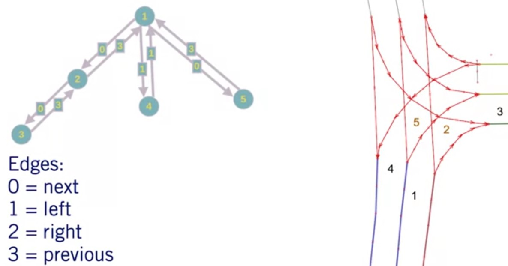
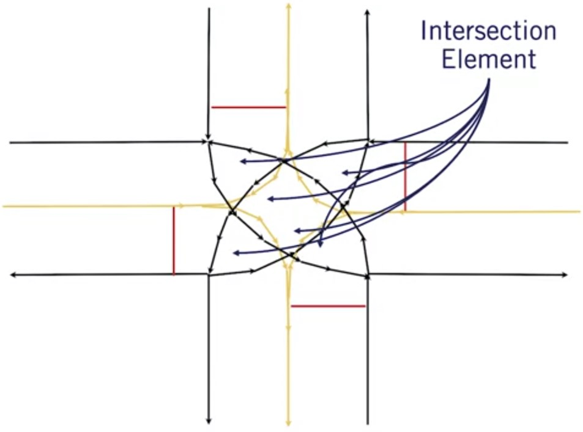

# High Definition Road Maps

## Lanelet Map

### Elements

Defines the following:

* Left and Right Boundaries
* Regulation
  * Elements: Which come at the end of the lanelet
  * Attributes: Which affect the entirety of the lanelet.
* Connectivity to other lanelets
  * Lanelets directly to the left
  * lanelets directly to the right
  * lanelet preceding it
  * lanelet following it.

Regulation elements usually require an action or decision to be made, such as in the case of a traffic light, or the decision to proceed must be based on the current state of that traffic light.

Regulatory attributes persist for the entirety of the lanelet. Examples include speed limits, or whether this lanelet crosses another lanelet as in an intersection or merge.

The entire lanelet structure is connected in a directed graph, which is the base structure of the HD map.

> A new lanelet is created when a new regulatory element is encountered or ends

### Lanelet Boundaries

* Defines the edges of a driving lane
* A list of pointers points creating a polygonal line
  * X, Y, and Z coordinates
* Different operation can be performed on boundaries:
  * Heading
  * Curvature
  * Center line

### Lanelet Regulations

* Elements - a list of points creating a line identifying stop location
  * Stop line
  * Traffic lights line
  * Pedestrian crossings
* Attributes - a set of regulation attributes assigned to a lanelet
  * Speed limit
  * Crossing another lanelet

## Lanelet Connectivity

### Intersections

Intersection Element - pointer to all lanelets which are part of an intersection

Helps with behaviour assignments

## Operations Done On Lanelets

* Path planning through complex road networks
* Localize Dynamic Objects
* Interactions with other Dynamic Objects

### Creations of Lanelets

3 methods to create the lanelet map

* Offline creation
* Online creation
* Offline creation with online updating

## Additional material

* S. Thrun, W. Burgard, and D. Fox, [Probabilistic robotics](http://www.probabilistic-robotics.org/). Cambridge, MA: MIT Press, 2010. Read Chapter 9 - Occupancy Grid Mapping for an overview of how occupancy grids are generated.

* P. Bender, J. Ziegler, and C. Stiller, “[Lanelets: Efficient map representation for autonomous driving](http://static.aixpaper.com/pdf/d/f5/gs.2014.81cd3b9828.v1.pdf),” 2014 IEEE Intelligent Vehicles Symposium Proceedings, 2014. Introduces the concepts of lanelets used in mapping.
