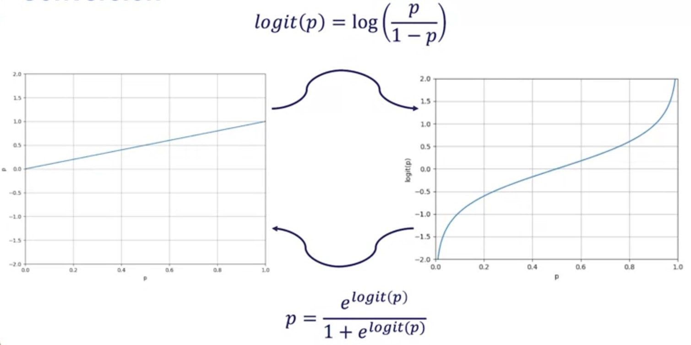

# Populating Occupancy Grids from LIDAR Scan Data

## Bayesian Update Of The Occupancy Grid - Summary

Bayes' theorem is applied for at each update step for each
cell.

$$bel_t(m^i) =n p(y_t|m^i)bel_{t-1}(m^i)$$

* $p(y_t|m^i)$: **Current measurement**
* $bel_{t-1}(m^i)$: **Previous belief map**
* $n$: **Normalizer constant**

## Issue With Standard Bayesian Update

Update a single unoccupied grid cell

|$bel_{t-1}(m)$| $p(y_t\mid m^i)$ |new $bel_t(m)$|
|--|--|--|
|0.000638|0.000012|0.000000008|

Multiplication of numbers close to zero is hard for computers

Store the log odds ratio rather than probability
$$bel_t(m)\rightarrow(-\infty,\infty) \quad \log{\left(\frac{p}{1-p}\right)}$$

### Conversion

$$\text{logit}(p) = \log{\left(\frac{p}{1-p}\right)} \\ p=\frac{e^{\text{logit}(p)}}{1+e^{\text{logit}(p)}}$$

## Bayesian Log Odds Single Cell Update Derivation

Applying Bayes' rule:$$p(m^i\mid y_{1:t})=\frac{p(y_{t}\mid y_{1:t-1},m^i)p(m^i\mid y_{1:t-1})}{p(y_{t}\mid y_{1:t-1})}$$

* $m^i$: Current map cell
* $y_{1:t}$: Sensor measurement for
given cell
* $p(y_{t}\mid y_{1:t-1},m^i)$: Probability of getting measurement $y_t$ given the cell state at all previous measurements $y_{1:t-1},m^i$. **Pulling out current measurement** $y_t$ from past measurements $y_{1:t-1}$
* $p(m^i\mid y_{1:t-1})$: Probability a cell is occupied given all measurements to time $t-1$
* $p(y_{t}\mid y_{1:t-1})$: Probability of getting the measurements $y_t$ given all previous measurements up to time $t-1$. **Pulling out current measurement** $y_t$ from past measurements $y_{1:t-1}$

**Applying the Markov assumption**:

$$p(m^i\mid y_{1:t})=\frac{p(y_{t}\mid m^i)p(m^i\mid y_{1:t-1})}{p(y_{t}\mid y_{1:t-1})}$$

Applying Bayes' rule to measurement model:

$$p(y_t\mid m^i)=\frac{p(m^i \mid y_{t})p(y_{t})}{p(m^i)}$$

Yields:

$$p(m^i\mid y_{1:t})=\frac{p(m^i \mid y_{t})p(y_{t})p(m^i\mid y_{1:t-1})}{p(m^i)p(y_{t}\mid y_{1:t-1})}$$

* Denominator: $1-p$

$$p(\neg m^i\mid y_{1:t})=1-p(m^i\mid y_{1:t})=\frac{p(\neg m^i \mid y_{t})p(y_{t})p(m^i\mid y_{1:t-1})}{p(\neg m^i)p(y_{t}\mid y_{1:t-1})}$$

* Logit function $\text{logit}(p) = \log{\left(\frac{p}{1-p}\right)}$

$$\frac{p(m^i\mid y_{1:t})}{p(\neg m^i\mid y_{1:t})}= \frac{\frac{p(m^i \mid y_{t})p(y_{t})p(m^i\mid y_{1:t-1})}{p(m^i)p(y_{t}\mid y_{1:t-1})}}{\frac{p(\neg m^i \mid y_{t})p(y_{t})p(m^i\mid y_{1:t-1})}{p(\neg m^i)p(y_{t}\mid y_{1:t-1})}}$$

$$\frac{p(m^i\mid y_{1:t})}{p(\neg m^i\mid y_{1:t})}= \frac{p(m^i \mid y_{t})p(\neg m^i)p(y_{t})p(m^i\mid y_{1:t-1})}{p(\neg m^i \mid y_{t})p(m^i)p(\neg m^i\mid y_{1:t-1})}$$

Rewriting

$$\frac{p(m^i\mid y_{1:t})}{p(\neg m^i\mid y_{1:t})}= \frac{p(m^i \mid y_{t})(1-p(m^i))p(y_{t})p(m^i\mid y_{1:t-1})}{(1-p(m^i \mid y_{t}))p(m^i)(1-p(m^i\mid y_{1:t-1}))}$$

Applying logit

$$\text{logit}(p(m^i\mid y_{1:t}))= \text{logit}(p(m^i\mid y_{t}))+\text{logit}(p(m^i\mid y_{1:t-1}))-\text{logit}(p(m^i))$$

Shorthand version

$$l_{t,i}=\text{logit}(p(m^i\mid y_{t}))+l_{t-1,i}-l_{0,i}$$

Where:

* $p(m^i\mid y_{t})$: Inverse Measurement Model
* $l_{t-1,i}$: Previous belief
* $l_{0,i}$: Initial belief

### Advantages

* Numerically stable
* Computationally efficient
