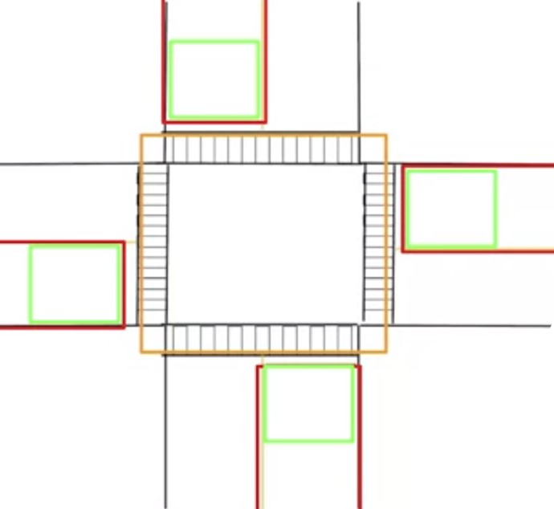

# Handling an Intersection Scenario with Dynamic Objects

Scenario Evaluation

* 4 way Intersection
* Two lane
* Stop Sign for every direction
* Be able to travel:
  * Through the intersection
  * Left at the intersection
  * Right at the intersection
* Interactions **with vehicles** as dynamic objects

## Discretizing the Intersection

* Approaching an intersection **&#9974;**.
* At an intersection **&#9974;**.
* On an intersection **&#9974;**.
* Determining the size of each zone:
  * Ego vehicle velocity
  * Size of the intersection
  * Dynamic vehicle velocity

## Interaction With Dynamic Objects

* Distance to dynamic object
  * distance to the center of any dynamic object
* Distance to collision point
  * distance to the collision point with another dynamic object
* Time to collision (TTC)
  * time to collision between any two dynamic objects

## State Machine States

* Track Speed
  * Follow the current speed limit
* Follow Leader
  * Match the speed of the dynamic object in front
* Decelerate to Stop
  * Stop to a particular point
  * The ego vehicle continues decelerating until the time when it comes to a stop at the stop line. Which will result in a switch to the stop state
  > We have to take into account that a vehicle is able to pull in front of the autonomous car at an intersection, either from a driveway or an overtaking maneuver. Much as before, we perform the follow check throughout the decelerate to stop state when the ego vehicle is in the *approaching* or *at zones*, **and** transition to follow leader if the check returns true.  
  In this case however, the distance check considers whether the lead vehicle distance to collision is less than the stop point distance, so that the leader following modes should take precedence.
* Stop
  * Stay stopped at the current location

## Dynamic Object Edge Cases Not Handled

* Assumption:
  * All dynamic obstacles obey rules of the road
* Not always the case
