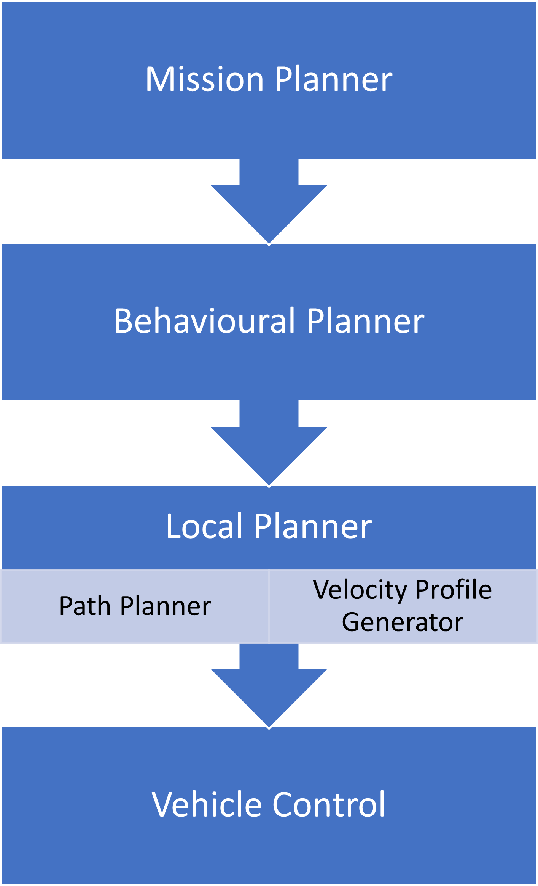

# Hierarchical Motion Planning

* Motion planning broken into hierarchy of subproblems
* Mission planner is highest level, focuses on map-level navigation
* Behavioural planner focuses on other agents, rules of the road, driving behaviours
* Local planner focuses on generating feasible, collision-free paths

## Mission Planner

* Highest level planner
* Focuses on autonomous driving mission
* Navigate to destination at the map level
  * Abstract away lower level details
* Can be solved with graph-based methods (Dijkstra's, A* )

## Behavioural Planner

* Behavioural planner decides when it is safe to proceed
* Takes pedestrians, vehicles, cyclists into consideration
* Also looks at regulatory elements, such as traffic lights and stop signs

### Finite State Machines (FSM)

Composed of states and transitions

* States are based on perception of surroundings
* Transitions are based on inputs to the
driving scenario
  * e.g. stop lights changing colour

FSM is memoryless: Transitions **only depend on input** and current state, and not on past state sequence

### Rule-based System

* Rule-based systems use a hierarchy of rules to determine output behaviour
* Rules are evaluated based on logical predicates
  * Higher priority rules have precedence

Examples:

* green light $\land$ intersection $\rightarrow$ drive straight
* pedestrian $\land$ driving straight $\rightarrow$ emergency stop

### Reinforcement Learning

Reinforcement learning is the process of determining an optimal decision-making policy that maximizes some reward function R.

This reward function values the quality of a given chain of actions for all time steps discounting future states more heavily than the present.

The process of reinforcement learning requires the agent to perform actions in an environment often given by simulation. This agent is then rewarded according to its interaction with the environment.

Which then allows it to converge to an optimal policy through successive interactions. This group of behavior planning approaches is rapidly expanding area of research and unfortunately, a deep dive is beyond the scope of this course.

$$R=\sum_{t=0}^{\infty}\gamma^tR_{a_t}(s_t,s_{t+1})$$

Where:

* $R$: Total Reward
* $\gamma$: Discount factor $\gamma \in[0,1)$
* $R_{a_t}$: Stage reward given action, $a_t$

## Local Planner

* Local planning generates feasible, collision-free paths and comfortable velocity profiles
* Decomposed into path planning and velocity profile generation

### Sampling-based Planners

* Randomly sample the control inputs to quickly explore the workspace
* Collision-checking is performed as new points are added to the explored space
* Often very fast, but can generate poor-quality paths

### Variational Planners

* Optimize trajectory according to cost functional
  * Contains penalties for collision avoidance and robot dynamics $$\min_{\delta x}J(x+\delta x)$$
* Can be slower, and less likely to converge to a feasible solution

### Lattice Planner

* Constrain the search space by limiting actions available to the robot
  * Set of actions known as control set
* Layers of control actions form a graph, which can be searched using Dijkstra's or A*
* Conformal lattice planner fits the control actions to the road structure

## Velocity Profile Generation

* Smoothness $$\int_0^{s_f}||\overset{...}{x}(s)||^2ds$$
* Deviation from reference $$\int_0^{s_f}||v(s)-v_{\text{ref}}(s)||ds$$
* Lateral acceleration limit $$v^2\leq \frac{a_{\text{lat}_{\max}}}{k}$$

## Additional material

* P. Polack, F. Altche, B. Dandrea-Novel, and A. D. L. Fortelle, [The kinematic bicycle model: A consistent model for planning feasible trajectories for autonomous vehicles](https://ieeexplore.ieee.org/abstract/document/7995816) 2017 IEEE Intelligent Vehicles Symposium (IV), 2017.  Gives an overview of the kinematic bicycle model.

* S. Karaman and E. Frazzoli, [Sampling-based optimal motion planning for non-holonomic dynamical systems](http://amav.gatech.edu/sites/default/files/papers/icra2013.Karaman.Frazzoli.submitted.pdf), 2013 IEEE International Conference on Robotics and Automation, 2013. Introduces the RRT* algorithm as an example of sampling-based planning.

* N. Ratliff, M. Zucker, J. A. Bagnell, and S. Srinivasa, [CHOMP: Gradient optimization techniques for efficient motion planning](https://kilthub.cmu.edu/articles/CHOMP_Gradient_Optimization_Techniques_for_Efficient_Motion_Planning/6552254/1), 2009 IEEE International Conference on Robotics and Automation, 2009. Introduces the CHOMP algorithm as an example of applying calculus of variations to planning.

* M. Pivtoraiko, R. A. Knepper, and A. Kelly, [Differentially constrained mobile robot motion planning in state lattices](https://ri.cmu.edu/pub_files/2009/3/ross.pdf), Journal of Field Robotics, vol. 26, no. 3, pp. 308-333, 2009. Introduces the state lattice planning method.
