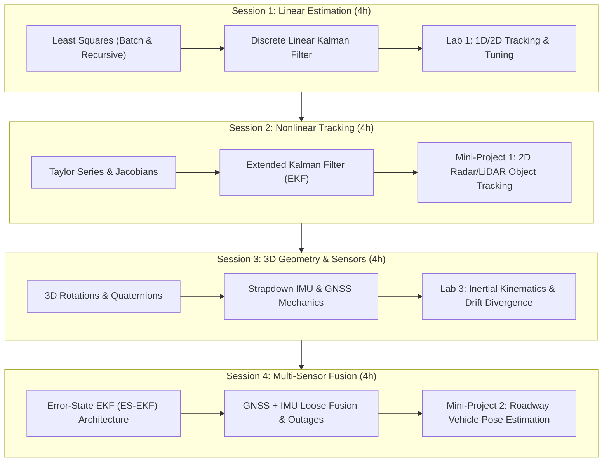

# State Estimation and Localization for Self-Driving Cars
> **Course Syllabus & Instructional Plan**  
> *16-Hour Intensive Curriculum (4 Sessions &times; 4 Hours)*

---

## 📌 Executive Course Overview

This 16-hour intensive course equips students with theoretical foundations and practical implementation skills for **State Estimation and Localization in Autonomous Vehicles**. 

Each 4-hour session is structured with **3 hours of interactive theory and derivations** followed by a **1-hour applied programming lab**. The curriculum culminates in two core mini-projects:
1. **Mini-Project 1:** Target Object Tracking using Kalman Filters (Linear & Extended KF).
2. **Mini-Project 2:** 3D Vehicle Localization fusing IMU and simulated GPS (GNSS) via an Error-State Extended Kalman Filter (ES-EKF).



---

## ⏱️ Master Course Schedule

| Session | Time Allocation | Lecture / Content Focus (3 Hours) | Applied Lab Focus (1 Hour) | Deliverable / Milestone |
| :---: | :---: | :--- | :--- | :--- |
| **[[#Session 1 Foundations of State Estimation The Linear Kalman Filter\|Session 1]]** | 4 Hours | **Probabilistic Estimation & LKF**<br>• Multivariate Gaussians & Uncertainty<br>• Batch Least Squares to Recursive Least Squares (RLS)<br>• Discrete Linear Kalman Filter (LKF) derivation<br>• Observability, filter consistency, & noise tuning ($Q, R$) | **Lab 1: 1D/2D Linear Tracking**<br>Implement an LKF tracking a moving vehicle from noisy distance/position sensors from scratch in Python. | Baseline LKF script & tuning analysis |
| **[[#Session 2 Nonlinear State Estimation Object Tracking Mini-Project 1\|Session 2]]** | 4 Hours | **Nonlinear Estimation & Target Tracking**<br>• Nonlinear dynamics & polar/radar sensing<br>• Extended Kalman Filter (EKF) & Jacobians<br>• Kinematic motion models (CV, CA)<br>• Tracking validation: NEES, NIS, RMSE | **Mini-Project 1 Kickoff:**<br>Simulate 2D object tracking of a lead obstacle/vehicle using noisy range & bearing measurements. | **Mini-Project 1 Submission** (Code, error plots, $3\sigma$ bounds) |
| **[[#Session 3 3D Geometry Inertial Navigation GNSS\|Session 3]]** | 4 Hours | **3D Kinematics, IMUs & Satellite Navigation**<br>• Coordinate frames: ECI, ECEF, Navigation (NED/ENU), Body<br>• Rotation matrices $SO(3)$ & Unit Quaternions $\mathbb{H}$<br>• 6-DOF Strapdown IMU models (specific force, gyros, biases)<br>• GNSS/GPS trilateration, pseudoranges, and GDOP | **Lab 3: IMU Dead Reckoning**<br>Implement quaternion kinematic propagation; measure and visualize quadratic integration drift over time. | Strapdown integration notebook & drift curve |
| **[[#Session 4 Multi-Sensor Fusion Localization Mini-Project 2\|Session 4]]** | 4 Hours | **Error-State EKF & Multi-Sensor Fusion**<br>• Nominal vs. Error state ($\mathbf{x} = \hat{\mathbf{x}} \oplus \delta\mathbf{x}$)<br>• 9D Error-State EKF derivation with quaternions<br>• Asynchronous multi-rate sensor fusion (100 Hz IMU + 10 Hz GPS)<br>• Practicalities: Extrinsic calibration, GPS outages, outlier gating | **Mini-Project 2 Capstone:**<br>Full 3D vehicle pose estimation fusing IMU and simulated GPS along a roadway trajectory. | **Mini-Project 2 Submission** (Trajectory RMSE, outage test, report) |

---

## 📅 Detailed Session Breakdown

---

### Session 1: Foundations of State Estimation & The Linear Kalman Filter

> [!abstract] Session Objective
> Bridge deterministic curve fitting to recursive probabilistic state estimation, deriving the discrete Linear Kalman Filter (LKF) from first principles and implementing it in Python.

#### Hour 1: Probability, Random Variables & Batch Least Squares
* **State vs. Measurement:** Latent dynamic states vs. noisy observable measurements in autonomous driving.
* **Probability Review:** Multivariate normal distributions $\mathcal{N}(\boldsymbol{\mu}, \mathbf{\Sigma})$, marginalization, and linear transformations:
  $$\mathbf{y} = \mathbf{A}\mathbf{x} + \mathbf{b} \implies \mathbf{y} \sim \mathcal{N}(\mathbf{A}\boldsymbol{\mu} + \mathbf{b}, \mathbf{A}\mathbf{\Sigma}\mathbf{A}^T)$$
* **Batch Least Squares (BLS):**
  * Linear observation model: $\mathbf{y} = \mathbf{H}\mathbf{x} + \mathbf{v}$, with noise covariance $\mathbf{R}$.
  * Best Linear Unbiased Estimator (BLUE) normal equations:
    $$\hat{\mathbf{x}} = (\mathbf{H}^T \mathbf{R}^{-1} \mathbf{H})^{-1} \mathbf{H}^T \mathbf{R}^{-1} \mathbf{y}, \quad \mathbf{P} = (\mathbf{H}^T \mathbf{R}^{-1} \mathbf{H})^{-1}$$
* *Associated Material:* `Least Squares/Squared Error Criterion.md`

#### Hour 2: Recursive Least Squares (RLS) & State-Space Systems
* **Computational Bottlenecks of Batch Solvers:** Memory scaling $O(N^3)$ vs. real-time embedded limits.
* **Recursive Least Squares (RLS) Derivation:**
  * Combining prior estimate $\hat{\mathbf{x}}_{k-1}, \mathbf{P}_{k-1}$ with new observation $\mathbf{y}_k$:
    $$\mathbf{K}_k = \mathbf{P}_{k-1}\mathbf{H}_k^T (\mathbf{H}_k \mathbf{P}_{k-1}\mathbf{H}_k^T + \mathbf{R}_k)^{-1}$$
    $$\hat{\mathbf{x}}_k = \hat{\mathbf{x}}_{k-1} + \mathbf{K}_k(\mathbf{y}_k - \mathbf{H}_k\hat{\mathbf{x}}_{k-1})$$
    $$\mathbf{P}_k = (\mathbf{I} - \mathbf{K}_k\mathbf{H}_k)\mathbf{P}_{k-1}$$
* **Adding Dynamic Motion:** Moving from static parameters to time-evolving states via linear dynamic models:
  $$\mathbf{x}_k = \mathbf{F}_{k-1}\mathbf{x}_{k-1} + \mathbf{G}_{k-1}\mathbf{u}_{k-1} + \mathbf{w}_{k-1}, \quad \mathbf{w}_k \sim \mathcal{N}(\mathbf{0}, \mathbf{Q}_k)$$
* *Associated Material:* `Recursive Least Squares/Recursive Least Squares.md`

#### Hour 3: The Discrete Linear Kalman Filter (LKF)
* **The Full LKF Algorithm:**
  1. **Prediction Step:**
     $$\check{\mathbf{x}}_k = \mathbf{F}_{k-1}\hat{\mathbf{x}}_{k-1} + \mathbf{G}_{k-1}\mathbf{u}_{k-1}$$
     $$\check{\mathbf{P}}_k = \mathbf{F}_{k-1}\hat{\mathbf{P}}_{k-1}\mathbf{F}_{k-1}^T + \mathbf{Q}_{k-1}$$
  2. **Kalman Gain Computation:**
     $$\mathbf{K}_k = \check{\mathbf{P}}_k \mathbf{H}_k^T (\mathbf{H}_k \check{\mathbf{P}}_k \mathbf{H}_k^T + \mathbf{R}_k)^{-1}$$
  3. **Correction (Measurement Update) Step:**
     $$\hat{\mathbf{x}}_k = \check{\mathbf{x}}_k + \mathbf{K}_k (\mathbf{y}_k - \mathbf{H}_k \check{\mathbf{x}}_k)$$
     $$\hat{\mathbf{P}}_k = (\mathbf{I} - \mathbf{K}_k \mathbf{H}_k)\check{\mathbf{P}}_k$$
* **Theoretical Properties:**
  * Proof of un-biasedness: $\mathbb{E}[\hat{\mathbf{e}}_k] = \mathbf{0}$.
  * Filter consistency check: $\mathbb{E}[\hat{\mathbf{e}}_k \hat{\mathbf{e}}_k^T] = \hat{\mathbf{P}}_k$.
  * Tuning intuition: Ratio of $\mathbf{Q}$ (trust in model) vs. $\mathbf{R}$ (trust in sensor).
* *Associated Material:* `The Linear Kalman Filter/The (linear) Kalman Filter.md`

#### Hour 4: Applied Programming Lab 1
* **Lab Title:** *Implementation of 1D/2D Kinematic Kalman Filter*
* **Base Workspace Script:** `Recursive Least Squares/Recursive Least Squares.ipynb` (adapted to kinematic tracking).
* **Tasks:**
  - [ ] Initialize prior state $[p_0, v_0]^T$ and large initial covariance $\mathbf{P}_0$.
  - [ ] Implement constant velocity motion model $\mathbf{F} = \begin{bmatrix} 1 & \Delta t \\ 0 & 1 \end{bmatrix}$.
  - [ ] Simulate noisy position GPS/odometry sensor data.
  - [ ] Implement prediction and update steps in vectorized NumPy.
  - [ ] Plot state trajectories, residuals (innovations), and $\pm 2\sigma$ error envelopes.

---

### Session 2: Nonlinear State Estimation & Object Tracking (Mini-Project 1)

> [!abstract] Session Objective
> Master the Extended Kalman Filter (EKF) for non-linear systems, derive measurement Jacobians for range/bearing sensors, and deploy Mini-Project 1 for 2D target tracking.

#### Hour 1: Nonlinearity in Autonomous Driving
* **Why the Linear Kalman Filter Fails:** Passing a Gaussian PDF through a nonlinear kinematic transform creates an asymmetric, non-Gaussian distribution.
* **Kinematic Models:**
  * Unicycle model: $\dot{x} = v \cos\theta$, $\dot{y} = v \sin\theta$, $\dot{\theta} = \omega$.
  * Constant Turn Rate and Velocity (CTRV) / Coordinated Turn models.
* **First-Order Linearization via Taylor Series:**
  $$\mathbf{f}(\mathbf{x}) \approx \mathbf{f}(\mathbf{x}_0) + \left.\frac{\partial \mathbf{f}}{\partial \mathbf{x}}\right|_{\mathbf{x}_0} (\mathbf{x} - \mathbf{x}_0)$$
* **Analytical Jacobians:** Calculating $\mathbf{F}_{k-1}$ and $\mathbf{H}_k$ symbolically and numerically.

#### Hour 2: The Extended Kalman Filter (EKF) Architecture
* **Algorithm Formulation:**
  * **Nonlinear Propagation:** State is propagated nonlinearly: $\check{\mathbf{x}}_k = \mathbf{f}(\hat{\mathbf{x}}_{k-1}, \mathbf{u}_{k-1}, \mathbf{0})$.
  * **Covariance Propagation:** Linearized via Jacobian: $\check{\mathbf{P}}_k = \mathbf{F}_{k-1}\hat{\mathbf{P}}_{k-1}\mathbf{F}_{k-1}^T + \mathbf{L}_{k-1}\mathbf{Q}_{k-1}\mathbf{L}_{k-1}^T$.
  * **Expected Measurement:** Evaluated nonlinearly: $\check{\mathbf{y}}_k = \mathbf{h}(\check{\mathbf{x}}_k, \mathbf{0})$.
  * **Update:** Innovation uses non-linear expected observation:
    $$\mathbf{K}_k = \check{\mathbf{P}}_k \mathbf{H}_k^T (\mathbf{H}_k \check{\mathbf{P}}_k \mathbf{H}_k^T + \mathbf{M}_k \mathbf{R}_k \mathbf{M}_k^T)^{-1}$$
    $$\hat{\mathbf{x}}_k = \check{\mathbf{x}}_k + \mathbf{K}_k(\mathbf{y}_k - \mathbf{h}(\check{\mathbf{x}}_k, \mathbf{0}))$$
* **Common Pitfalls:**
  * Linearization error accumulation (divergence).
  * Overconfidence: Filter under-estimating its actual error covariance.
  * Angle wrap-around errors when computing innovations of bearings.
* *Associated Material:* `The Nonlinear Kalman Filter/The Nonlinear Kalman Filter.md`

#### Hour 3: Sensor Measurement Models & Target Tracking
* **Radar & LiDAR Observation Geometry:**
  * Range: $r = \sqrt{(x - x_{sensor})^2 + (y - y_{sensor})^2}$.
  * Bearing: $\phi = \operatorname{atan2}(y - y_{sensor}, x - x_{sensor}) - \theta_{sensor}$.
* **Measurement Jacobian Derivation:**
  $$\mathbf{H} = \begin{bmatrix} \frac{\Delta x}{r} & \frac{\Delta y}{r} & 0 & 0 \\ -\frac{\Delta y}{r^2} & \frac{\Delta x}{r^2} & 0 & 0 \end{bmatrix}$$
* **Evaluation Metrics:**
  * Root Mean Square Error (RMSE) across time.
  * Normalized Estimation Error Squared (NEES): $\epsilon_k = (\mathbf{x}_k - \hat{\mathbf{x}}_k)^T \mathbf{P}_k^{-1} (\mathbf{x}_k - \hat{\mathbf{x}}_k) \sim \chi_n^2$.
  * Normalized Innovation Squared (NIS).

#### Hour 4: Applied Programming Lab 2 (Mini-Project 1 Kickoff)
* **Lab / Project:** *Mini-Project 1 — 2D Object Tracking using Extended Kalman Filter*
* **Base Workspace Script:** `Estimating a Vehicle Trajectory/Estimating a Vehicle Trajectory.ipynb` (adapted to obstacle/vehicle tracking).
* **Student Deliverables:**
  - [ ] Implement the non-linear measurement model $\mathbf{h}(\mathbf{x})$ and Jacobian $\mathbf{H}_k$.
  - [ ] Ensure angle wrapping for innovation in $[-\pi, \pi]$ using `wraptopi()`.
  - [ ] Run filter over a dynamic trajectory (with known landmarks or tracking a lead vehicle).
  - [ ] Verify convergence and generate $3\sigma$ covariance error bound plots.

---

### Session 3: 3D Geometry, Inertial Navigation & GNSS

> [!abstract] Session Objective
> Understand 3D reference frames, master Unit Quaternions for attitude representation, model MEMS IMU sensors (accelerometers & gyroscopes), and examine GNSS/GPS positioning mechanics.

#### Hour 1: 3D Kinematics, Rotations & Quaternions
* **Coordinate Systems in Navigation:**
  * Earth-Centered Inertial (ECI) vs. Earth-Centered Earth-Fixed (ECEF).
  * Navigation / Local Tangent Frame: North-East-Down (NED) or East-North-Up (ENU).
  * Sensor / Vehicle Body Frame ($b$).
* **Rotation Representations:**
  * Direction Cosine Matrix (DCM) $\mathbf{C}_{nb} \in SO(3)$, orthogonality property $\mathbf{C}^T\mathbf{C} = \mathbf{I}$, $\det(\mathbf{C}) = +1$.
  * Euler angles (roll, pitch, yaw) and the singularity problem (gimbal lock at $\theta = \pm 90^\circ$).
* **Unit Quaternions ($\mathbb{H}$):**
  * Four-parameter representation $\mathbf{q} = [q_w, \mathbf{q}_v]^T = [\cos\frac{\theta}{2}, \mathbf{u}\sin\frac{\theta}{2}]^T$ with $\|\mathbf{q}\| = 1$.
  * Quaternion product operator ($\otimes$), rotation of vectors $\mathbf{v}' = \mathbf{q} \otimes \mathbf{v} \otimes \mathbf{q}^*$.
  * Rotational kinematics: $\dot{\mathbf{q}} = \frac{1}{2}\boldsymbol{\Omega}(\boldsymbol{\omega})\mathbf{q}$.
* *Associated Material:* `GNSS and INS Sensing for Pose Estimation/3D Geometry and Reference Frames.md`

#### Hour 2: Inertial Measurement Units (IMU) & Strapdown Mechanization
* **Accelerometer Principles:**
  * Proper acceleration / specific force measurement: $\mathbf{f} = \ddot{\mathbf{r}} - \mathbf{g}$.
  * Gravity vector compensation in the navigation frame: $\mathbf{a}_n = \mathbf{C}_{ns}\mathbf{f}_s + \mathbf{g}_n$.
* **Rate Gyroscope Principles:**
  * Measures sensor angular rate $\boldsymbol{\omega}_{meas} = \boldsymbol{\omega}_{true} + \mathbf{b}_{gyro} + \mathbf{n}_{gyro}$.
* **Strapdown Inertial Navigation Equations:**
  $$\mathbf{p}_k = \mathbf{p}_{k-1} + \Delta t \mathbf{v}_{k-1} + \frac{\Delta t^2}{2}(\mathbf{C}_{ns}\mathbf{f}_{k-1} + \mathbf{g})$$
  $$\mathbf{v}_k = \mathbf{v}_{k-1} + \Delta t (\mathbf{C}_{ns}\mathbf{f}_{k-1} + \mathbf{g})$$
  $$\mathbf{q}_k = \mathbf{q}_{k-1} \otimes \mathbf{q}(\boldsymbol{\omega}_{k-1}\Delta t)$$
* **The Problem of Dead-Reckoning Drift:** Velocity errors grow linearly with bias ($\sim b t$), position errors grow quadratically ($\sim \frac{1}{2} b t^2$).
* *Associated Material:* `GNSS and INS Sensing for Pose Estimation/The Inertial Measurement Unit.md`

#### Hour 3: Global Navigation Satellite Systems (GNSS / GPS)
* **Satellite Positioning Fundamentals:**
  * Space, control, and user segments.
  * Time of flight (ToF) and pseudorange equation: $\rho_i = \|\mathbf{r}_{sat, i} - \mathbf{r}_{rcv}\| + c \delta t_{rcv} + \epsilon_i$.
  * Trilateration using $\ge 4$ satellites to solve for 3D position $(x,y,z)$ and receiver clock bias $c \delta t_{rcv}$.
* **Error Sources & Dilution of Precision:**
  * Ionospheric / tropospheric delays, ephemeris error, satellite clock jitter, multipath reflections.
  * Geometric Dilution of Precision (GDOP / PDOP).
* **Sensor Complementarity:**
  * *IMU:* High rate ($100\text{--}200\text{ Hz}$), low noise short-term, fatal long-term drift.
  * *GPS:* Low rate ($1\text{--}10\text{ Hz}$), noisy short-term, zero long-term drift (globally referenced).
  * Loosely coupled vs. Tightly coupled integration architectures.
* *Associated Material:* `GNSS and INS Sensing for Pose Estimation/The Global Navigation Satellite Systems (GNSS).md`

#### Hour 4: Applied Programming Lab 3
* **Lab Title:** *Strapdown IMU Kinematics & Drift Divergence Analysis*
* **Base Workspace Script:** `Vehicle State Estimation on a Roadway/rotations.py` and `es_ekf.py` (forward propagation section).
* **Tasks:**
  - [ ] Load IMU specific force and angular rates from `data/pt1_data.pkl`.
  - [ ] Implement the discrete quaternion attitude update $\mathbf{q}_k = \mathbf{q}_{k-1} \otimes \mathbf{q}(\boldsymbol{\omega}_{k-1}\Delta t)$.
  - [ ] Rotate specific force to navigation frame and integrate velocity and position.
  - [ ] Plot estimated trajectory vs. Ground Truth without GPS to witness drift divergence.
  - [ ] Quantify position drift rate in meters per second of dead reckoning.

---

### Session 4: Multi-Sensor Fusion, Localization & The Error-State EKF (Mini-Project 2)

> [!abstract] Session Objective
> Derive and implement the 9D Error-State Extended Kalman Filter (ES-EKF) fusing high-rate IMU and low-rate GPS measurements to achieve robust 3D vehicle pose estimation.

#### Hour 1: The Error-State Extended Kalman Filter (ES-EKF)
* **True State vs. Nominal State vs. Error State:**
  $$\mathbf{x} = \hat{\mathbf{x}} \oplus \delta\mathbf{x}$$
  * True State $\mathbf{x} \in \mathbb{R}^{10}$: Position $\mathbf{p} \in \mathbb{R}^3$, Velocity $\mathbf{v} \in \mathbb{R}^3$, Quaternion $\mathbf{q} \in \mathbb{H}$.
  * Nominal State $\hat{\mathbf{x}} \in \mathbb{R}^{10}$: Propagated by non-linear integration of high-rate IMU.
  * Error State $\delta\mathbf{x} \in \mathbb{R}^9$: Minimal 3D representation $[\delta\mathbf{p}, \delta\mathbf{v}, \delta\boldsymbol{\phi}]^T$.
* **Why Use the Error-State Formulation?**
  * Avoids linearizing constrained 4D unit quaternions (eliminates covariance singularity).
  * Keeps the error state close to zero, minimizing second-order linearization errors.
  * Decouples high-rate inertial integration from lower-rate stochastic filtering.
* *Associated Material:* `Vehicle State Estimation on a Roadway/Solution.md`

#### Hour 2: ES-EKF Mathematics & Multi-Sensor Pipeline
* **Linearized Error Dynamics:**
  $$\delta\mathbf{x}_k = \mathbf{F}_{k-1}\delta\mathbf{x}_{k-1} + \mathbf{L}_{k-1}\mathbf{w}_{k-1}$$
  $$\mathbf{F}_{k-1} = \begin{bmatrix} \mathbf{I}_{3\times3} & \mathbf{I}_{3\times3}\Delta t & \mathbf{0}_{3\times3} \\ \mathbf{0}_{3\times3} & \mathbf{I}_{3\times3} & -[\mathbf{C}_{ns}\mathbf{f}_{k-1}]_\times \Delta t \\ \mathbf{0}_{3\times3} & \mathbf{0}_{3\times3} & \mathbf{I}_{3\times3} \end{bmatrix}$$
  where $[\mathbf{a}]_\times$ denotes the $3\times3$ skew-symmetric cross-product matrix.
* **Covariance Propagation:**
  $$\check{\mathbf{P}}_k = \mathbf{F}_{k-1}\hat{\mathbf{P}}_{k-1}\mathbf{F}_{k-1}^T + \mathbf{L}_{k-1}\mathbf{Q}_{k-1}\mathbf{L}_{k-1}^T$$
* **Measurement Update (GPS Position):**
  * Measurement model: $\mathbf{y}_{GPS} = \mathbf{p} + \mathbf{v}_{GPS}$, so $\mathbf{H} = \begin{bmatrix} \mathbf{I}_{3\times3} & \mathbf{0}_{3\times3} & \mathbf{0}_{3\times3} \end{bmatrix}$.
  * Compute Kalman Gain $\mathbf{K}_k$.
  * Compute error state: $\delta\hat{\mathbf{x}} = \mathbf{K}_k(\mathbf{y}_{GPS} - \check{\mathbf{p}}_k)$.
  * Nominal State Injection:
    $$\hat{\mathbf{p}} = \check{\mathbf{p}} + \delta\hat{\mathbf{p}}, \quad \hat{\mathbf{v}} = \check{\mathbf{v}} + \delta\hat{\mathbf{v}}, \quad \hat{\mathbf{q}} = \mathbf{q}(\delta\hat{\boldsymbol{\phi}}) \otimes \check{\mathbf{q}}$$
  * Error State Reset: $\delta\mathbf{x} \leftarrow \mathbf{0}$ and $\hat{\mathbf{P}} = (\mathbf{I} - \mathbf{K}\mathbf{H})\check{\mathbf{P}}$.

#### Hour 3: Practical State Estimation in Self-Driving Cars
* **Extrinsic Calibration & Lever Arms:**
  * Sensor transformation matrix $\mathbf{C}_{li}$ and translation vector $\mathbf{t}_i^{l}$.
  * Correcting GPS position when antenna is not located at the IMU center of mass.
* **Handling Sensor Dropouts & Outages:**
  * GPS denial in tunnels, underpasses, and urban canyons.
  * Observability during GPS outage: Position covariance expands quadratically, but heading remains partially observable if gyros are high-grade.
* **Outlier Rejection:**
  * Mahalanobis distance gating: $d_M^2 = (\mathbf{y} - \hat{\mathbf{y}})^T \mathbf{S}^{-1} (\mathbf{y} - \hat{\mathbf{y}}) < \gamma_{threshold}$.
* *Associated Material:* `State Estimation in Practice/State Estimation in Practice.md`, `Loss of one or More Sensors.md`, `Sensor Calibration.md`

#### Hour 4: Applied Programming Lab 4 (Mini-Project 2 Capstone)
* **Lab / Project:** *Mini-Project 2 — 3D Localization fusing IMU and Simulated GPS (ES-EKF)*
* **Base Workspace Script:** `Vehicle State Estimation on a Roadway/es_ekf.py`.
* **Student Tasks:**
  - [ ] Implement `prediction()` using quaternion kinematics and gravity compensation.
  - [ ] Construct $\mathbf{F}_{k-1}$ error transition matrix with skew-symmetric acceleration.
  - [ ] Implement `measurement_update()` for GPS 3D fixes.
  - [ ] Inject error state corrections back into nominal position, velocity, and quaternion.
  - [ ] **Outage Experiment:** Simulate a 10-second GPS signal loss and plot the resulting covariance expansion and recovery behavior.

---

## 🔬 Deep Dive: Mini-Project Specifications

### 🎯 Mini-Project 1: 2D Target Tracking using Kalman Filters

```
┌─────────────────────────────────────────────────────────────┐
│                      MINI-PROJECT 1                         │
│       Object Tracking with Linear vs. Extended KF           │
├─────────────────────────────────────────────────────────────┤
│ Target State:      x_k = [x, y, v_x, v_y]^T                 │
│ Dynamic Model:     Constant Velocity (CV) / Unicycle        │
│ Sensor Input:      Range (r) and Bearing (phi) via Radar    │
│ Primary Challenge: Coordinate transformation & Jacobians    │
│ Key Deliverable:   Trajectory plots, RMSE & 3-Sigma bounds  │
└─────────────────────────────────────────────────────────────┘
```

* **Core Objectives:**
  1. Contrast linear state tracking with polar measurement EKF tracking.
  2. Implement analytical measurement Jacobian $\mathbf{H}_k$.
  3. Ensure robust angle handling ($[-\pi, \pi]$ normalization).
* **Expected Student Results:**
  * Estimated $[x, y]$ trajectory matching ground truth within an RMSE threshold ($< 0.5\text{ m}$).
  * Consistency validation: $99.7\%$ of true states fall within the calculated $\pm 3\sigma$ covariance bounds.

---

### 🚗 Mini-Project 2: 3D Vehicle Pose Estimation via Error-State EKF (IMU + GPS)

```
┌─────────────────────────────────────────────────────────────┐
│                      MINI-PROJECT 2                         │
│      3D Vehicle Localization with IMU + Simulated GPS       │
├─────────────────────────────────────────────────────────────┤
│ State Dimension:   Nominal: 10D (p, v, q) | Error: 9D       │
│ Prediction Sensor: 6-DOF Strapdown IMU @ 100 Hz             │
│ Correction Sensor: 3D GNSS / GPS Position @ 10 Hz           │
│ Primary Challenge: Quaternion kinematics & Error injection │
│ Key Deliverable:   3D Trajectory, Covariance tunnel test    │
└─────────────────────────────────────────────────────────────┘
```

* **Core Objectives:**
  1. Implement strapdown inertial propagation with gravity removal.
  2. Implement discrete Error-State Kalman Filter propagation and update.
  3. Correct orientation on the $SO(3)$ manifold without gimbal lock or singularity.
  4. Evaluate filter robustness against sensor dropout (tunnel scenario).
* **Target Performance Criteria:**
  * Position error $< 1.5\text{ m}$ across a $200\text{ m} \times 200\text{ m}$ roadway loop.
  * Orientation error $< 3^\circ$ along roll, pitch, and yaw.

---

## 🛠️ Codebase Inventory & Modification Guide

To adapt the existing workspace files into classroom student starter templates and instructor solutions, execute the following modifications:

```
State Estimation and Localization for Self-Driving Cars/
├── Least Squares/
│   ├── Excersice.ipynb                   --> [Keep as Student Reference]
│   └── Squared Error Criterion.md        --> [Lecture 1 Reference]
├── Recursive Least Squares/
│   ├── Recursive Least Squares.ipynb     --> [Modify: Create Lab 1 Starter Notebook]
│   └── Recursive Least Squares.md        --> [Lecture 1 Reference]
├── The Linear Kalman Filter/
│   └── The (linear) Kalman Filter.md     --> [Lecture 1 Reference]
├── The Nonlinear Kalman Filter/
│   ├── Excersice.ipynb                   --> [Classroom interactive Jacobian demo]
│   └── The Nonlinear Kalman Filter.md    --> [Lecture 2 Reference]
├── Estimating a Vehicle Trajectory/
│   ├── Estimating a Vehicle Trajectory.ipynb --> [Modify: Create Mini-Project 1 Starter]
│   └── data/data.pickle                  --> [Mini-Project 1 Dataset]
├── GNSS and INS Sensing for Pose Estimation/
│   ├── 3D Geometry and Reference Frames.md  --> [Lecture 3 Reference]
│   ├── The Global Navigation Satellite Systems (GNSS).md --> [Lecture 3 Reference]
│   └── The Inertial Measurement Unit.md    --> [Lecture 3 Reference]
├── State Estimation in Practice/
│   ├── Loss of one or More Sensors.md    --> [Lecture 4 Reference]
│   └── Sensor Calibration.md             --> [Lecture 4 Reference]
└── Vehicle State Estimation on a Roadway/
    ├── rotations.py                      --> [Keep: Sensor Math Utility Library]
    ├── es_ekf.py                         --> [Modify: Create Mini-Project 2 Starter]
    ├── solution.py                       --> [Keep: Instructor Solution Key]
    ├── Solution.md                       --> [Lecture 4 Derivations]
    └── data/pt1_data.pkl                 --> [Mini-Project 2 Roadway Dataset]
```

### 1. Modifying `Estimating a Vehicle Trajectory.ipynb` (Mini-Project 1 Starter)
Create `student_tracking_ekf.ipynb` by blanking out the following blocks with student prompt comments:

```python
# ==============================================================================
# TODO (STUDENT ASSIGNMENT - MINI-PROJECT 1):
# 1. Compute measurement Jacobian H_k (2x3) and noise Jacobian M_k (2x2)
# 2. Compute the Kalman Gain K_k
# 3. Correct the predicted state x_check (wrap angle to [-pi, pi])
# 4. Correct the covariance P_check
# ==============================================================================
def measurement_update(lk, rk, bk, P_check, x_check):
    # Student code goes here:
    ...
    return x_check, P_check
```

### 2. Modifying `es_ekf.py` (Mini-Project 2 Starter)
Save a backup of `es_ekf.py` as `solution_es_ekf.py`. In the student file `student_es_ekf.py`:
1. **Measurement Update Function (`line 138`):**
   ```python
   def measurement_update(sensor_var, p_cov_check, y_k, p_check, v_check, q_check):
       # TODO: 
       # 1. Compute Kalman gain
       # 2. Compute 9D error state
       # 3. Correct position, velocity, and quaternion (quaternion multiplication)
       # 4. Correct 9x9 covariance matrix
       pass
   ```
2. **Main Filter Loop (`line 165`):**
   Blank out:
   - State prediction equations (`p_est[k]`, `v_est[k]`, `q_est[k]`).
   - Motion model error Jacobian `F_km`.
   - Covariance propagation equation `p_cov[k] = F @ p_cov @ F.T + L @ Q @ L.T`.
3. **Add Tunnel Outage Simulation:**
   Add a toggle `ENABLE_GPS_DROPOUT = True` where GPS updates are bypassed between $t = 30\text{ s}$ and $t = 45\text{ s}$ to test student filter dead-reckoning behavior.

---

## 💡 Instructor Notes & Pedagogical Recommendations

> [!tip] Pacing the 3h Theory / 1h Lab Split
> * Structure the 3-hour theory into two 80-minute blocks with a 10-minute break in between.
> * Begin the 1-hour lab with a 10-minute live demonstration of data dimensions, arrays, and visualization code so students do not get blocked by I/O syntax.

> [!warning] Top 4 Common Student Bugs to Preempt
> 1. **Quaternion Multiplication Order:** $\mathbf{q}_A \otimes \mathbf{q}_B \neq \mathbf{q}_B \otimes \mathbf{q}_A$. Students often multiply in reverse order when applying attitude corrections.
> 2. **Angle Wrapping in Bearing Updates:** Failing to wrap $(\phi_{meas} - \check{\phi})$ to $[-\pi, \pi]$ causes massive false innovations when an angle crosses $\pm\pi$, causing immediate filter divergence.
> 3. **Gravity Sign Convention:** Forgetting that proper acceleration measured by an accelerometer sitting stationary is $+g$ upwards; in navigation frame equations, gravity must be subtracted or added consistently ($\ddot{\mathbf{r}} = \mathbf{C}_{ns}\mathbf{f} + \mathbf{g}$).
> 4. **Matrix Transposes:** Missing a transpose on $\mathbf{H}_k^T$ or $\mathbf{F}_{k-1}^T$ in covariance propagation and Kalman gain calculations.

---

## 📋 Evaluation & Grading Rubric

```
Mini-Project 1: Object Tracking (40% Total Grade)
├── [15%] Mathematical derivation and correct Jacobian H_k implementation
├── [15%] Kalman update loop, angle wrapping, and filter stability
└── [10%] Plot quality (True vs. Estimate, residuals, 3-sigma confidence bounds)

Mini-Project 2: Vehicle Localization (60% Total Grade)
├── [20%] Forward IMU mechanization & quaternion integration kinematics
├── [20%] Error-state Jacobian F_k and GPS measurement correction
├── [10%] Localization accuracy (Position RMSE < 1.5 m on roadway data)
└── [10%] GPS outage analysis (correct covariance expansion during signal loss)
```

---

## 📚 Primary Textbooks & References
* **Barfoot, Timothy D.** (2017). *State Estimation for Robotics*. Cambridge University Press. (*Available in workspace: `The Linear Kalman Filter/State estimation for robotics-e.pdf`*).
* **Solà, Joan** (2017). *Quaternion kinematics for the error-state Kalman filter*. arXiv:1711.02508.
* **Farrell, Jay A.** (2008). *Aided Navigation: GPS with High Rate Sensors*. McGraw-Hill.
* **Simon, Dan** (2006). *Optimal State Estimation: Kalman, H-infinity, and Nonlinear Approaches*. John Wiley & Sons.


Session 1: Foundations of Estimation
   Least Squares (Batch & Recursive)
   Linear Kalman Filter (LKF) & Observability
   Lab: 1D/2D Recursive Estimator & Tracking from Scratch
Session 2: Nonlinear Filtering & Tracking (Mini-Project 1)
     Linearization & The Extended Kalman Filter (EKF)
    Motion Models (CV/CA) & Measurement Models
    Lab / Mini-Project 1: 2D Object Tracking using EKF
Session 3: 3D Geometry, IMU & GPS Sensing
    3D Kinematics, SO(3), Quaternions
    Inertial Navigation (IMU) & GNSS/GPS Mechanics
    Lab: Strapdown Dead-Reckoning & Drift Analysis
Session 4: Multi-Sensor Fusion & Localization (Mini-Project 2)
    Error-State Kalman Filter (ES-EKF) Architecture
    Sensor Fusion (GPS + IMU), Sensor Drops, Outliers
     Lab / Mini-Project 2: Vehicle Pose Estimation (IMU + GNSS Fusion) ? Fusionarlo con Lab de sesión 3