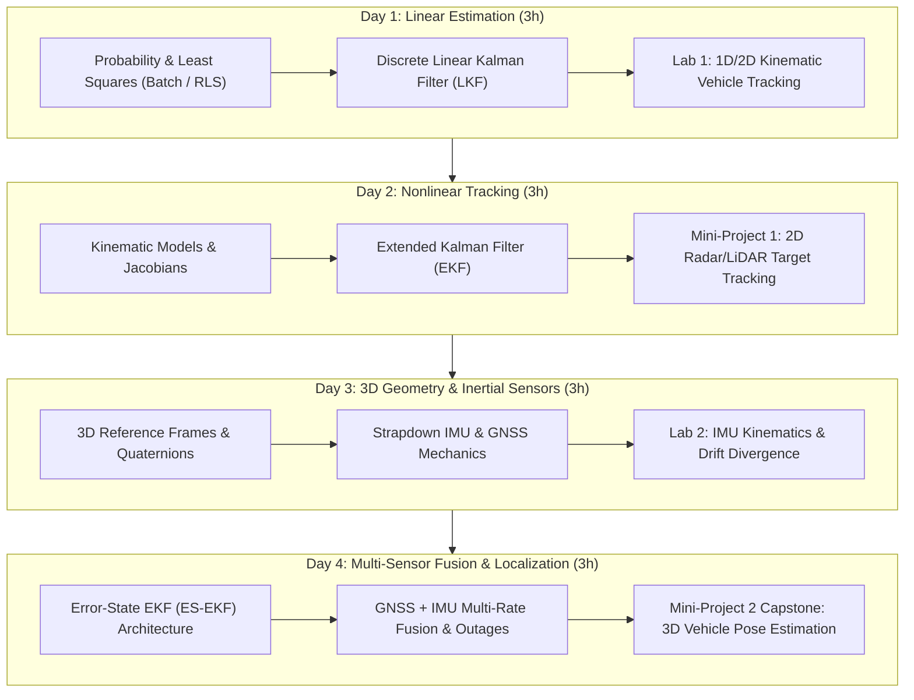

# State Estimation and Localization for Self-Driving Cars
> **Course Syllabus & Instructional Plan**  
> *12-Hour Intensive Curriculum (4 Sessions &times; 3 Hours &bull; 1-Week Schedule)*

---

## 📌 Executive Course Overview

This **12-hour intensive course** (delivered over **4 days, 3 hours per day across a single week**) equips students with theoretical foundations and practical implementation skills for **State Estimation and Localization in Autonomous Vehicles**. 

Each 3-hour session is structured into **2 hours of interactive theory and mathematical derivations** followed by a **1-hour applied programming lab / project session**. The curriculum culminates in two core industry-standard mini-projects:
1. **Mini-Project 1 (Day 2):** Target Object Tracking using Linear & Extended Kalman Filters (EKF) with polar Radar/LiDAR observations.
2. **Mini-Project 2 (Day 4 Capstone):** 3D Roadway Vehicle Localization fusing 6-DOF IMU and GNSS/GPS data via an Error-State Extended Kalman Filter (ES-EKF).



---

## ⏱️ Master Course Schedule

| Day / Session | Total Time | Lecture / Theoretical Focus (2 Hours) | Applied Lab Focus (1 Hour) | Deliverable / Milestone |
| :---: | :---: | :--- | :--- | :--- |
| **[[#Day 1 Foundations of State Estimation The Linear Kalman Filter\|Day 1]]** | 3 Hours | **Probabilistic Estimation & LKF**<br>• Multivariate Gaussians, Uncertainty & BLS<br>• Recursive Least Squares (RLS) & State-Space Systems<br>• Discrete Linear Kalman Filter (LKF) Derivation<br>• Filter Consistency, Observability & Noise Tuning ($Q, R$) | **Lab 1: 1D/2D Kinematic Tracking**<br>Implement an LKF tracking a moving vehicle from noisy distance/position sensors from scratch in Python/NumPy. | Baseline LKF script, innovation analysis & $\pm 3\sigma$ error bounds |
| **[[#Day 2 Nonlinear State Estimation Object Tracking Mini-Project 1\|Day 2]]** | 3 Hours | **Nonlinear Estimation & EKF Architecture**<br>• Kinematic Motion Models (CV, CTRV) & Linearization<br>• Analytical Jacobians ($\mathbf{F}, \mathbf{H}$) via First-Order Taylor Series<br>• Polar Radar/LiDAR Measurement Models & Angle Wrapping<br>• Tracking Validation: NEES ($\chi^2$), NIS, and RMSE | **Mini-Project 1:**<br>Simulate 2D object tracking of a lead obstacle/vehicle using noisy range & bearing measurements with an EKF. | **Mini-Project 1 Submission** (Code, trajectory plots, $3\sigma$ consistency bounds) |
| **[[#Day 3 3D Geometry Inertial Navigation GNSS Sensing\|Day 3]]** | 3 Hours | **3D Kinematics, IMU & Satellite Navigation**<br>• Coordinate frames: ECI, ECEF, Local NED/ENU, Body<br>• Rotation matrices $SO(3)$ & Unit Quaternions $\mathbb{H}$<br>• 6-DOF Strapdown IMU models (specific force, gyros, biases)<br>• GNSS/GPS trilateration, pseudoranges, and GDOP | **Lab 2: Strapdown Dead Reckoning**<br>Implement quaternion kinematic integration on roadway IMU data; measure and visualize quadratic drift divergence. | Strapdown integration notebook & drift divergence curve |
| **[[#Day 4 Multi-Sensor Fusion Localization Mini-Project 2 Capstone\|Day 4]]** | 3 Hours | **Error-State EKF & Multi-Sensor Fusion**<br>• Nominal vs. Error state ($\mathbf{x} = \hat{\mathbf{x}} \oplus \delta\mathbf{x}$)<br>• 9D Error-State EKF formulation on the $SO(3)$ manifold<br>• Asynchronous multi-rate fusion (100 Hz IMU + 10 Hz GPS)<br>• Practicalities: Extrinsic calibration, outlier gating, GPS outages | **Mini-Project 2 Capstone:**<br>Full 3D vehicle pose estimation fusing IMU and simulated GPS along a roadway trajectory + 10s tunnel outage test. | **Mini-Project 2 Submission** (Trajectory RMSE $< 1.5\text{ m}$, outage test, final report) |

---

## 📅 Detailed Daily Session Breakdown

---

### Day 1: Foundations of State Estimation & The Linear Kalman Filter

> [!abstract] Session Objective
> Bridge deterministic curve fitting to recursive probabilistic state estimation, deriving the discrete Linear Kalman Filter (LKF) from first principles and implementing a 2D tracking estimator from scratch in Python.

#### Hour 1: Probability Foundations, Random Variables & Least Squares (BLS & RLS)
* **State vs. Measurement:** Latent dynamic states vs. noisy observable measurements in autonomous driving.
* **Probability Review:** Multivariate normal distributions $\mathcal{N}(\boldsymbol{\mu}, \mathbf{\Sigma})$, marginalization, and linear transformations:
  $$\mathbf{y} = \mathbf{A}\mathbf{x} + \mathbf{b} \implies \mathbf{y} \sim \mathcal{N}(\mathbf{A}\boldsymbol{\mu} + \mathbf{b}, \mathbf{A}\mathbf{\Sigma}\mathbf{A}^T)$$
* **Batch Least Squares (BLS):**
  * Linear observation model: $\mathbf{y} = \mathbf{H}\mathbf{x} + \mathbf{v}$, with noise covariance $\mathbf{R}$.
  * Best Linear Unbiased Estimator (BLUE) normal equations:
    $$\hat{\mathbf{x}} = (\mathbf{H}^T \mathbf{R}^{-1} \mathbf{H})^{-1} \mathbf{H}^T \mathbf{R}^{-1} \mathbf{y}, \quad \mathbf{P} = (\mathbf{H}^T \mathbf{R}^{-1} \mathbf{H})^{-1}$$
* **Recursive Least Squares (RLS):**
  * Real-time computational bottlenecks of batch solvers ($O(N^3)$ vs $O(1)$ updates).
  * Recursive information blending: Prior $\hat{\mathbf{x}}_{k-1}, \mathbf{P}_{k-1}$ + new measurement $\mathbf{y}_k$.
* *Associated Material:* `Least Squares/Squared Error Criterion.md`, `Recursive Least Squares/Recursive Least Squares.md`

#### Hour 2: State-Space Systems & The Discrete Linear Kalman Filter (LKF)
* **Linear Dynamic Motion Models:** Transitioning from static parameter estimation to time-evolving states:
  $$\mathbf{x}_k = \mathbf{F}_{k-1}\mathbf{x}_{k-1} + \mathbf{G}_{k-1}\mathbf{u}_{k-1} + \mathbf{w}_{k-1}, \quad \mathbf{w}_k \sim \mathcal{N}(\mathbf{0}, \mathbf{Q}_k)$$
* **The 5 Core LKF Equations:**
  1. **State Prediction:** $\check{\mathbf{x}}_k = \mathbf{F}_{k-1}\hat{\mathbf{x}}_{k-1} + \mathbf{G}_{k-1}\mathbf{u}_{k-1}$
  2. **Covariance Prediction:** $\check{\mathbf{P}}_k = \mathbf{F}_{k-1}\hat{\mathbf{P}}_{k-1}\mathbf{F}_{k-1}^T + \mathbf{Q}_{k-1}$
  3. **Kalman Gain:** $\mathbf{K}_k = \check{\mathbf{P}}_k \mathbf{H}_k^T (\mathbf{H}_k \check{\mathbf{P}}_k \mathbf{H}_k^T + \mathbf{R}_k)^{-1}$
  4. **State Correction:** $\hat{\mathbf{x}}_k = \check{\mathbf{x}}_k + \mathbf{K}_k (\mathbf{y}_k - \mathbf{H}_k \check{\mathbf{x}}_k)$
  5. **Covariance Correction:** $\hat{\mathbf{P}}_k = (\mathbf{I} - \mathbf{K}_k \mathbf{H}_k)\check{\mathbf{P}}_k$
* **Filter Properties & Tuning:**
  * Proof of un-biasedness: $\mathbb{E}[\hat{\mathbf{e}}_k] = \mathbf{0}$.
  * Filter consistency check: $\mathbb{E}[\hat{\mathbf{e}}_k \hat{\mathbf{e}}_k^T] = \hat{\mathbf{P}}_k$.
  * Tuning trade-offs: Ratio of process noise $\mathbf{Q}$ (trust in model) vs. measurement noise $\mathbf{R}$ (trust in sensor).
* *Associated Material:* `The Linear Kalman Filter/The (linear) Kalman Filter.md`

#### Hour 3: Applied Programming Lab 1 (1D & 2D Kinematic Tracking)
* **Lab Title:** *Implementation of 1D/2D Kinematic Kalman Filter from Scratch*
* **Base Workspace Script:** `Recursive Least Squares/Recursive Least Squares.ipynb` (adapted for kinematic tracking).
* **Tasks:**
  - [ ] Initialize prior state $[p_0, v_0]^T$ and initial error covariance $\mathbf{P}_0$.
  - [ ] Implement constant velocity motion model $\mathbf{F} = \begin{bmatrix} 1 & \Delta t \\ 0 & 1 \end{bmatrix}$.
  - [ ] Simulate noisy position measurements from a GPS/odometry source.
  - [ ] Implement prediction and update cycles in vectorized NumPy.
  - [ ] Plot estimated trajectory against ground truth, innovation sequence, and $\pm 3\sigma$ error envelopes.

---

### Day 2: Nonlinear State Estimation & Object Tracking (Mini-Project 1)

> [!abstract] Session Objective
> Master the Extended Kalman Filter (EKF) for non-linear vehicle dynamics and polar sensor observation models, derive measurement Jacobians, and implement Mini-Project 1 for 2D target object tracking.

#### Hour 1: Nonlinear Kinematics, Motion Models & Analytical Jacobians
* **Why the Linear Kalman Filter Fails:** Passing Gaussian uncertainty through nonlinear kinematics yields non-Gaussian, asymmetric distributions.
* **Vehicle Kinematic Motion Models:**
  * Unicycle model: $\dot{x} = v \cos\theta$, $\dot{y} = v \sin\theta$, $\dot{\theta} = \omega$.
  * Constant Turn Rate and Velocity (CTRV) / Coordinated Turn models.
* **First-Order Linearization via Taylor Series:**
  $$\mathbf{f}(\mathbf{x}) \approx \mathbf{f}(\mathbf{x}_0) + \left.\frac{\partial \mathbf{f}}{\partial \mathbf{x}}\right|_{\mathbf{x}_0} (\mathbf{x} - \mathbf{x}_0)$$
* **Analytical Jacobians:** Symbolic and numerical computation of motion Jacobian $\mathbf{F}_{k-1}$ and observation Jacobian $\mathbf{H}_k$.

#### Hour 2: The Extended Kalman Filter (EKF) & Sensor Observation Models
* **EKF Algorithmic Formulation:**
  * **Nonlinear State Propagation:** $\check{\mathbf{x}}_k = \mathbf{f}(\hat{\mathbf{x}}_{k-1}, \mathbf{u}_{k-1}, \mathbf{0})$
  * **Linearized Covariance Propagation:** $\check{\mathbf{P}}_k = \mathbf{F}_{k-1}\hat{\mathbf{P}}_{k-1}\mathbf{F}_{k-1}^T + \mathbf{L}_{k-1}\mathbf{Q}_{k-1}\mathbf{L}_{k-1}^T$
  * **Nonlinear Observation Model:** $\check{\mathbf{y}}_k = \mathbf{h}(\check{\mathbf{x}}_k, \mathbf{0})$
  * **Innovation & Correction:** $\mathbf{K}_k = \check{\mathbf{P}}_k \mathbf{H}_k^T (\mathbf{H}_k \check{\mathbf{P}}_k \mathbf{H}_k^T + \mathbf{M}_k \mathbf{R}_k \mathbf{M}_k^T)^{-1}$, $\hat{\mathbf{x}}_k = \check{\mathbf{x}}_k + \mathbf{K}_k(\mathbf{y}_k - \mathbf{h}(\check{\mathbf{x}}_k, \mathbf{0}))$
* **Radar & LiDAR Observation Geometry:**
  * Range: $r = \sqrt{(x - x_{sensor})^2 + (y - y_{sensor})^2}$
  * Bearing: $\phi = \operatorname{atan2}(y - y_{sensor}, x - x_{sensor}) - \theta_{sensor}$
  * Measurement Jacobian $\mathbf{H} = \begin{bmatrix} \frac{\Delta x}{r} & \frac{\Delta y}{r} & 0 & 0 \\ -\frac{\Delta y}{r^2} & \frac{\Delta x}{r^2} & 0 & 0 \end{bmatrix}$
* **Critical Pitfalls:** Angle wrap-around errors in $[-\pi, \pi]$ and linearization divergence.
* **Evaluation Metrics:** Normalized Estimation Error Squared (NEES $\sim \chi^2$), Normalized Innovation Squared (NIS), and RMSE.
* *Associated Material:* `The Nonlinear Kalman Filter/The Nonlinear Kalman Filter.md`

#### Hour 3: Applied Lab / Mini-Project 1 (2D Radar/LiDAR Object Tracking)
* **Lab / Project:** *Mini-Project 1 — 2D Target Tracking using Extended Kalman Filter*
* **Base Workspace Script:** `Estimating a Vehicle Trajectory/Estimating a Vehicle Trajectory.ipynb`.
* **Tasks & Deliverables:**
  - [ ] Implement nonlinear measurement function $\mathbf{h}(\mathbf{x})$ and Jacobian $\mathbf{H}_k$.
  - [ ] Implement robust angle normalization for bearing innovations via `wraptopi()`.
  - [ ] Run EKF over a dynamic trajectory tracking a lead obstacle/vehicle.
  - [ ] Validate filter consistency with $3\sigma$ error bound plots and NEES metrics (RMSE $< 0.5\text{ m}$).

---

### Day 3: 3D Geometry, Inertial Navigation & GNSS Sensing

> [!abstract] Session Objective
> Master 3D coordinate frames, Unit Quaternions for singularity-free attitude representation, 6-DOF Strapdown IMU mechanization equations, and GNSS/GPS pseudorange positioning principles.

#### Hour 1: 3D Reference Frames, Kinematics & Unit Quaternions
* **Coordinate Systems in Autonomous Navigation:**
  * Earth-Centered Inertial (ECI) vs. Earth-Centered Earth-Fixed (ECEF).
  * Navigation / Local Tangent Frame: North-East-Down (NED) or East-North-Up (ENU).
  * Vehicle Body Frame ($b$) & Sensor Frames ($s$).
* **Rotation Representations:**
  * Direction Cosine Matrix (DCM) $\mathbf{C}_{nb} \in SO(3)$, orthogonality ($\mathbf{C}^T\mathbf{C} = \mathbf{I}$).
  * Euler angles (roll, pitch, yaw) and Gimbal Lock singularity at pitch $\theta = \pm 90^\circ$.
* **Unit Quaternions ($\mathbb{H}$):**
  * Definition: $\mathbf{q} = [q_w, \mathbf{q}_v]^T = [\cos\frac{\theta}{2}, \mathbf{u}\sin\frac{\theta}{2}]^T$ with $\|\mathbf{q}\| = 1$.
  * Quaternion product ($\otimes$) and vector rotation $\mathbf{v}' = \mathbf{q} \otimes \mathbf{v} \otimes \mathbf{q}^*$.
  * Rotational kinematics: $\dot{\mathbf{q}} = \frac{1}{2}\boldsymbol{\Omega}(\boldsymbol{\omega})\mathbf{q}$.
* *Associated Material:* `GNSS and INS Sensing for Pose Estimation/3D Geometry and Reference Frames.md`

#### Hour 2: Strapdown IMU Mechanization & GNSS/GPS Positioning
* **Inertial Measurement Units (IMU):**
  * Accelerometers: Specific force measurement $\mathbf{f} = \ddot{\mathbf{r}} - \mathbf{g}$ & gravity compensation ($\mathbf{a}_n = \mathbf{C}_{ns}\mathbf{f}_s + \mathbf{g}_n$).
  * Rate Gyroscopes: Angular rate measurement $\boldsymbol{\omega}_{meas} = \boldsymbol{\omega}_{true} + \mathbf{b}_{gyro} + \mathbf{n}_{gyro}$.
* **Strapdown Inertial Navigation Equations:**
  $$\mathbf{p}_k = \mathbf{p}_{k-1} + \Delta t \mathbf{v}_{k-1} + \frac{\Delta t^2}{2}(\mathbf{C}_{ns}\mathbf{f}_{k-1} + \mathbf{g})$$
  $$\mathbf{v}_k = \mathbf{v}_{k-1} + \Delta t (\mathbf{C}_{ns}\mathbf{f}_{k-1} + \mathbf{g})$$
  $$\mathbf{q}_k = \mathbf{q}_{k-1} \otimes \mathbf{q}(\boldsymbol{\omega}_{k-1}\Delta t)$$
* **Dead-Reckoning Drift:** Velocity error grows linearly ($\sim b t$), position error grows quadratically ($\sim \frac{1}{2} b t^2$).
* **Global Navigation Satellite Systems (GNSS / GPS):**
  * Time of Flight (ToF), pseudorange equations: $\rho_i = \|\mathbf{r}_{sat, i} - \mathbf{r}_{rcv}\| + c \delta t_{rcv} + \epsilon_i$.
  * Geometric Dilution of Precision (GDOP / PDOP).
  * Sensor Complementarity: High-rate drifting IMU (100 Hz) + low-rate drift-free GPS (10 Hz).
* *Associated Material:* `GNSS and INS Sensing for Pose Estimation/The Inertial Measurement Unit.md`, `The Global Navigation Satellite Systems (GNSS).md`

#### Hour 3: Applied Programming Lab 2 (Strapdown Kinematics & Drift Analysis)
* **Lab Title:** *Strapdown IMU Kinematics & Drift Divergence Analysis*
* **Base Workspace Script:** `Vehicle State Estimation on a Roadway/rotations.py` and forward propagation in `es_ekf.py`.
* **Tasks:**
  - [ ] Load 100 Hz IMU specific force and angular velocity from `data/pt1_data.pkl`.
  - [ ] Implement quaternion attitude integration $\mathbf{q}_k = \mathbf{q}_{k-1} \otimes \mathbf{q}(\boldsymbol{\omega}_{k-1}\Delta t)$.
  - [ ] Rotate specific force to navigation frame, remove gravity, and integrate velocity & position.
  - [ ] Plot estimated dead-reckoning trajectory vs. Ground Truth to quantify quadratic drift rate ($\text{m/s}$).

---

### Day 4: Multi-Sensor Fusion & Localization (Mini-Project 2 Capstone)

> [!abstract] Session Objective
> Formulate, derive, and implement the 9D Error-State Extended Kalman Filter (ES-EKF) fusing 100 Hz IMU and 10 Hz GPS for robust 3D vehicle localization, and validate resilience during GPS outages.

#### Hour 1: The Error-State Extended Kalman Filter (ES-EKF) Architecture
* **True State vs. Nominal State vs. Error State:**
  $$\mathbf{x} = \hat{\mathbf{x}} \oplus \delta\mathbf{x}$$
  * True State $\mathbf{x} \in \mathbb{R}^{10}$: Position $\mathbf{p} \in \mathbb{R}^3$, Velocity $\mathbf{v} \in \mathbb{R}^3$, Quaternion $\mathbf{q} \in \mathbb{H}$.
  * Nominal State $\hat{\mathbf{x}} \in \mathbb{R}^{10}$: High-rate nonlinear integration of IMU measurements.
  * Error State $\delta\mathbf{x} \in \mathbb{R}^9$: Minimal 3D representation $[\delta\mathbf{p}, \delta\mathbf{v}, \delta\boldsymbol{\phi}]^T$.
* **Advantages of the Error-State Formulation:**
  * Eliminates singularity/overparameterization of 4D quaternion covariance.
  * Keeps error states near zero, virtually eliminating high-order linearization errors.
  * Decouples high-rate strapdown propagation from lower-rate stochastic correction.
* **Linearized Error State Dynamics:**
  $$\delta\mathbf{x}_k = \mathbf{F}_{k-1}\delta\mathbf{x}_{k-1} + \mathbf{L}_{k-1}\mathbf{w}_{k-1}$$
  $$\mathbf{F}_{k-1} = \begin{bmatrix} \mathbf{I}_{3\times3} & \mathbf{I}_{3\times3}\Delta t & \mathbf{0}_{3\times3} \\ \mathbf{0}_{3\times3} & \mathbf{I}_{3\times3} & -[\mathbf{C}_{ns}\mathbf{f}_{k-1}]_\times \Delta t \\ \mathbf{0}_{3\times3} & \mathbf{0}_{3\times3} & \mathbf{I}_{3\times3} \end{bmatrix}$$
  where $[\mathbf{a}]_\times$ is the $3\times3$ skew-symmetric cross-product matrix.
* *Associated Material:* `Vehicle State Estimation on a Roadway/Solution.md`

#### Hour 2: Multi-Sensor Fusion Pipeline, Calibration & Sensor Outages
* **Measurement Update with 3D GPS Position Fixes:**
  * Observation matrix: $\mathbf{H} = \begin{bmatrix} \mathbf{I}_{3\times3} & \mathbf{0}_{3\times3} & \mathbf{0}_{3\times3} \end{bmatrix}$.
  * Kalman gain $\mathbf{K}_k$ and error state estimate: $\delta\hat{\mathbf{x}} = \mathbf{K}_k(\mathbf{y}_{GPS} - \check{\mathbf{p}}_k)$.
  * **Nominal State Injection:**
    $$\hat{\mathbf{p}} = \check{\mathbf{p}} + \delta\hat{\mathbf{p}}, \quad \hat{\mathbf{v}} = \check{\mathbf{v}} + \delta\hat{\mathbf{v}}, \quad \hat{\mathbf{q}} = \mathbf{q}(\delta\hat{\boldsymbol{\phi}}) \otimes \check{\mathbf{q}}$$
  * **Error State Reset:** $\delta\mathbf{x} \leftarrow \mathbf{0}$ and $\hat{\mathbf{P}} = (\mathbf{I} - \mathbf{K}\mathbf{H})\check{\mathbf{P}}$.
* **Practical Estimation in Autonomous Vehicles:**
  * **Sensor Calibration & Lever-Arm Effects:** Correcting GPS antenna offset relative to vehicle IMU center.
  * **Outlier Gating:** Mahalanobis distance gating ($d_M^2 = (\mathbf{y} - \hat{\mathbf{y}})^T \mathbf{S}^{-1} (\mathbf{y} - \hat{\mathbf{y}}) < \gamma_{th}$).
  * **GPS Denial / Tunnel Outages:** Observability analysis during signal dropout and covariance bounds management.
* *Associated Material:* `State Estimation in Practice/State Estimation in Practice.md`, `Loss of one or More Sensors.md`, `Sensor Calibration.md`

#### Hour 3: Applied Lab / Mini-Project 2 Capstone (3D Vehicle Pose Estimation)
* **Lab / Capstone:** *Mini-Project 2 — 3D Roadway Vehicle Localization with ES-EKF*
* **Base Workspace Script:** `Vehicle State Estimation on a Roadway/es_ekf.py`.
* **Tasks & Capstone Deliverables:**
  - [ ] Implement strapdown prediction with gravity compensation and quaternion kinematics.
  - [ ] Construct $\mathbf{F}_{k-1}$ error transition matrix with skew-symmetric acceleration.
  - [ ] Implement `measurement_update()` for 3D GPS position corrections.
  - [ ] Inject error state corrections back into nominal state and perform covariance reset.
  - [ ] **Tunnel Outage Simulation:** Disable GPS for a 10-second window ($t = 30\text{--}40\text{ s}$), evaluate covariance growth, and confirm filter stability upon signal re-acquisition.
  - [ ] Achieve Position RMSE $< 1.5\text{ m}$ and orientation error $< 3^\circ$.

---

## 🔬 Deep Dive: Mini-Project Specifications

### 🎯 Mini-Project 1: 2D Target Tracking using Kalman Filters (Day 2)

```
┌─────────────────────────────────────────────────────────────┐
│                      MINI-PROJECT 1                         │
│       Object Tracking with Linear vs. Extended KF           │
├─────────────────────────────────────────────────────────────┤
│ Target State:      x_k = [x, y, v_x, v_y]^T                 │
│ Dynamic Model:     Constant Velocity (CV) / Unicycle        │
│ Sensor Input:      Range (r) and Bearing (phi) via Radar    │
│ Primary Challenge: Coordinate transformation & Jacobians    │
│ Key Deliverable:   Trajectory plots, RMSE & 3-Sigma bounds  │
└─────────────────────────────────────────────────────────────┘
```

* **Core Objectives:**
  1. Contrast linear state tracking with polar measurement EKF tracking.
  2. Implement analytical measurement Jacobian $\mathbf{H}_k$.
  3. Ensure robust angle handling ($[-\pi, \pi]$ normalization).
* **Expected Student Results:**
  * Estimated $[x, y]$ trajectory matching ground truth within an RMSE threshold ($< 0.5\text{ m}$).
  * Consistency validation: $99.7\%$ of true states fall within the calculated $\pm 3\sigma$ covariance bounds.

---

### 🚗 Mini-Project 2: 3D Vehicle Pose Estimation via Error-State EKF (Day 4 Capstone)

```
┌─────────────────────────────────────────────────────────────┐
│                      MINI-PROJECT 2                         │
│      3D Vehicle Localization with IMU + Simulated GPS       │
├─────────────────────────────────────────────────────────────┤
│ State Dimension:   Nominal: 10D (p, v, q) | Error: 9D       │
│ Prediction Sensor: 6-DOF Strapdown IMU @ 100 Hz             │
│ Correction Sensor: 3D GNSS / GPS Position @ 10 Hz           │
│ Primary Challenge: Quaternion kinematics & Error injection │
│ Key Deliverable:   3D Trajectory, Covariance tunnel test    │
└─────────────────────────────────────────────────────────────┘
```

* **Core Objectives:**
  1. Implement strapdown inertial propagation with gravity removal.
  2. Implement discrete Error-State Kalman Filter propagation and update.
  3. Correct orientation on the $SO(3)$ manifold without gimbal lock or singularity.
  4. Evaluate filter robustness against sensor dropout (tunnel scenario).
* **Target Performance Criteria:**
  * Position error $< 1.5\text{ m}$ across a $200\text{ m} \times 200\text{ m}$ roadway loop.
  * Orientation error $< 3^\circ$ along roll, pitch, and yaw.

---

## 🛠️ Codebase Inventory & Modification Guide

To adapt the existing workspace files into classroom student starter templates and instructor solutions, follow this codebase mapping:

```
State Estimation and Localization for Self-Driving Cars/
├── Least Squares/
│   ├── Excersice.ipynb                   --> [Keep as Student Reference]
│   └── Squared Error Criterion.md        --> [Day 1 Lecture Reference]
├── Recursive Least Squares/
│   ├── Recursive Least Squares.ipynb     --> [Modify: Day 1 Lab 1 Starter Notebook]
│   └── Recursive Least Squares.md        --> [Day 1 Lecture Reference]
├── The Linear Kalman Filter/
│   └── The (linear) Kalman Filter.md     --> [Day 1 Lecture Reference]
├── The Nonlinear Kalman Filter/
│   ├── Excersice.ipynb                   --> [Day 2 Interactive Jacobian Demo]
│   └── The Nonlinear Kalman Filter.md    --> [Day 2 Lecture Reference]
├── Estimating a Vehicle Trajectory/
│   ├── Estimating a Vehicle Trajectory.ipynb --> [Modify: Day 2 Mini-Project 1 Starter]
│   └── data/data.pickle                  --> [Mini-Project 1 Dataset]
├── GNSS and INS Sensing for Pose Estimation/
│   ├── 3D Geometry and Reference Frames.md  --> [Day 3 Lecture Reference]
│   ├── The Global Navigation Satellite Systems (GNSS).md --> [Day 3 Lecture Reference]
│   └── The Inertial Measurement Unit.md    --> [Day 3 Lecture Reference]
├── State Estimation in Practice/
│   ├── Loss of one or More Sensors.md    --> [Day 4 Lecture Reference]
│   └── Sensor Calibration.md             --> [Day 4 Lecture Reference]
└── Vehicle State Estimation on a Roadway/
    ├── rotations.py                      --> [Keep: Sensor Math Utility Library]
    ├── es_ekf.py                         --> [Modify: Day 4 Mini-Project 2 Starter]
    ├── solution.py                       --> [Keep: Instructor Solution Key]
    ├── Solution.md                       --> [Day 4 Derivations]
    └── data/pt1_data.pkl                 --> [Mini-Project 2 Roadway Dataset]
```

### 1. Starter File for Mini-Project 1 (`student_tracking_ekf.ipynb`)
Create a student starter notebook by blanking out the update routine:

```python
# ==============================================================================
# TODO (STUDENT ASSIGNMENT - MINI-PROJECT 1):
# 1. Compute measurement Jacobian H_k (2x3) and noise Jacobian M_k (2x2)
# 2. Compute the Kalman Gain K_k
# 3. Correct the predicted state x_check (wrap angle to [-pi, pi])
# 4. Correct the covariance P_check
# ==============================================================================
def measurement_update(lk, rk, bk, P_check, x_check):
    # Student code goes here:
    ...
    return x_check, P_check
```

### 2. Starter File for Mini-Project 2 (`student_es_ekf.py`)
Save a backup of `es_ekf.py` as `solution_es_ekf.py`. In `student_es_ekf.py`:
1. **Measurement Update Function:**
   ```python
   def measurement_update(sensor_var, p_cov_check, y_k, p_check, v_check, q_check):
       # TODO: 
       # 1. Compute Kalman gain
       # 2. Compute 9D error state
       # 3. Correct position, velocity, and quaternion (quaternion multiplication)
       # 4. Correct 9x9 covariance matrix
       pass
   ```
2. **Main Filter Loop:**
   Blank out:
   - State prediction equations (`p_est[k]`, `v_est[k]`, `q_est[k]`).
   - Motion model error Jacobian `F_km`.
   - Covariance propagation equation `p_cov[k] = F @ p_cov @ F.T + L @ Q @ L.T`.
3. **Tunnel Outage Simulation:**
   Add `ENABLE_GPS_DROPOUT = True` where GPS updates are bypassed between $t = 30\text{ s}$ and $t = 40\text{ s}$ to test student filter dead-reckoning behavior.

---

## 💡 Instructor Notes & Pedagogical Recommendations

> [!tip] Pacing the 2h Theory / 1h Lab Daily Split
> * **First 55 minutes:** Mathematical foundations, derivations, and conceptual intuition.
> * **10-minute break:** Cognitive rest before deep algorithmic formulation.
> * **Next 55 minutes:** Discrete algorithm derivations, Jacobian formulations, and edge cases.
> * **Final 60 minutes:** Hands-on programming lab / mini-project implementation with live debugging support.

> [!warning] Top 4 Common Student Bugs to Preempt
> 1. **Quaternion Multiplication Order:** $\mathbf{q}_A \otimes \mathbf{q}_B \neq \mathbf{q}_B \otimes \mathbf{q}_A$. Students often multiply in reverse order when applying attitude corrections.
> 2. **Angle Wrapping in Bearing Updates:** Failing to wrap $(\phi_{meas} - \check{\phi})$ to $[-\pi, \pi]$ causes massive false innovations when an angle crosses $\pm\pi$, causing immediate filter divergence.
> 3. **Gravity Sign Convention:** Proper acceleration measured by a stationary accelerometer is $+g$ upwards; in navigation frame equations, gravity must be added or subtracted consistently ($\ddot{\mathbf{r}} = \mathbf{C}_{ns}\mathbf{f} + \mathbf{g}$).
> 4. **Matrix Transposes:** Missing a transpose on $\mathbf{H}_k^T$ or $\mathbf{F}_{k-1}^T$ in covariance propagation and Kalman gain calculations.

---

## 📋 Evaluation & Grading Rubric

```
Mini-Project 1: Object Tracking (40% Total Grade)
├── [15%] Mathematical derivation and correct Jacobian H_k implementation
├── [15%] Kalman update loop, angle wrapping, and filter stability
└── [10%] Plot quality (True vs. Estimate, residuals, 3-sigma confidence bounds)

Mini-Project 2: Vehicle Localization (60% Total Grade)
├── [20%] Forward IMU mechanization & quaternion integration kinematics
├── [20%] Error-state Jacobian F_k and GPS measurement correction
├── [10%] Localization accuracy (Position RMSE < 1.5 m on roadway data)
└── [10%] GPS outage analysis (correct covariance expansion during signal loss)
```

---

## 📚 Primary Textbooks & References
* **Barfoot, Timothy D.** (2017). *State Estimation for Robotics*. Cambridge University Press. (*Available in workspace: `The Linear Kalman Filter/State estimation for robotics-e.pdf`*).
* **Solà, Joan** (2017). *Quaternion kinematics for the error-state Kalman filter*. arXiv:1711.02508.
* **Farrell, Jay A.** (2008). *Aided Navigation: GPS with High Rate Sensors*. McGraw-Hill.
* **Simon, Dan** (2006). *Optimal State Estimation: Kalman, H-infinity, and Nonlinear Approaches*. John Wiley & Sons.