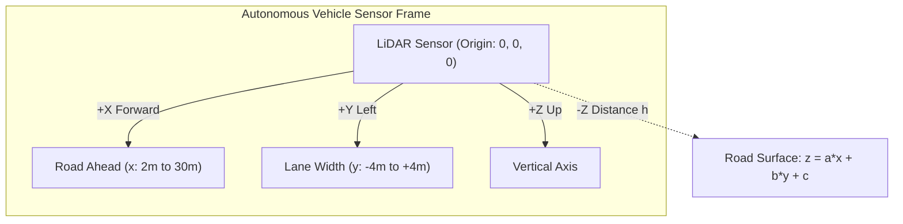

# 🚗 Classroom Exercise: 3D LiDAR Road Surface & Sensor Calibration via Batch Least Squares
**Course:** State Estimation and Localization for Self-Driving Cars  
**Day 01:** Foundations of State Estimation & Parameter Calibration  
**Target Time:** 45 minutes (Interactive Coding Session)

---

## 🎯 Learning Objectives
By completing this exercise, you will:
1. Formulate a real-world perception estimation problem as a **Linear Measurement Model** $\mathbf{y} = \mathbf{H}\mathbf{x} + \mathbf{v}$.
2. Derive and construct the **Regressor / Observation Matrix $\mathbf{H}$** from 3D LiDAR point cloud coordinates.
3. Implement the **Weighted Batch Least Squares (WLS)** normal equations $\hat{\mathbf{x}} = (\mathbf{H}^T \mathbf{R}^{-1} \mathbf{H})^{-1} \mathbf{H}^T \mathbf{R}^{-1} \mathbf{y}$ from scratch.
4. Derive physical automotive parameters from mathematical coefficients:
   - **Road Longitudinal Pitch Angle ($\theta$)** (uphill / downhill gradient)
   - **Road Lateral Roll Angle ($\phi$)** (camber / banking)
   - **LiDAR Sensor Mounting Height ($h$)** above the asphalt
   - **3D Ground Plane Unit Normal Vector ($\hat{\mathbf{n}}$)**
5. Compute parameter uncertainty and $3\sigma$ confidence intervals via the **Posterior Covariance Matrix $\mathbf{P} = (\mathbf{H}^T \mathbf{R}^{-1} \mathbf{H})^{-1}$**.
6. Render the raw point cloud and fitted ground surface in **Plotly 3D**.

---

## 📐 1. Problem Formulation & Physical Setup

### 1.1 Sensor Frame Coordinate System (ISO 8855 / ROS REP 103)
Our autonomous test vehicle is equipped with a roof-mounted 3D LiDAR sensor located at the origin $(0, 0, 0)$ of the sensor coordinate frame:
- **$+X$ axis:** Points **Forward** (Longitudinal range in front of the vehicle, $x \in [2.0\text{ m}, 30.0\text{ m}]$).
- **$+Y$ axis:** Points **Left** (Lateral cross-track range across the lanes, $y \in [-4.0\text{ m}, +4.0\text{ m}]$).
- **$+Z$ axis:** Points **Upward** (Elevation above the sensor).



### 1.2 Mathematical Plane Model
A planar road surface is described by the linear equation:
$$z_i = a x_i + b y_i + c + v_i, \quad v_i \sim \mathcal{N}(0, \sigma_z^2)$$

Where:
- $\mathbf{x} = \begin{bmatrix} a \\ b \\ c \end{bmatrix} \in \mathbb{R}^3$ is our **unknown state parameter vector**.
- $a = \frac{\partial z}{\partial x} = \tan(\theta_{\text{pitch}})$ is the **longitudinal slope slope** (pitch gradient).
- $b = \frac{\partial z}{\partial y} = \tan(\phi_{\text{roll}})$ is the **lateral cross-slope** (camber / bank gradient).
- $c$ is the **$z$-intercept** (approximately $-h_{\text{sensor}}$, the sensor height below the origin).
- $\mathbf{y} = [z_1, z_2, \dots, z_N]^T \in \mathbb{R}^N$ is the **measurement vector** (vertical heights).
- $\mathbf{v} \in \mathbb{R}^N$ is zero-mean Gaussian LiDAR ranging noise with covariance $\mathbf{R} = \sigma_z^2 \mathbf{I}_{N \times N}$.

---

## 💻 2. Student Coding Workspace (Fill in the TODOs)

Follow the step-by-step instructions below. Replace all `None` and `# TODO: YOUR CODE HERE` with your implementation.

```python
import numpy as np
import plotly.graph_objects as go

# ==============================================================================
# Step 0: Synthetic LiDAR Ground Cloud Generator (Pre-implemented)
# ==============================================================================
def generate_synthetic_lidar_ground_cloud(
    num_points: int = 200,
    a_true: float = 0.02,       # +1.15 deg uphill pitch
    b_true: float = -0.01,      # -0.57 deg road bank/camber roll
    c_true: float = -1.70,      # Sensor mounted 1.70 m above asphalt
    sigma_noise: float = 0.03,  # 3 cm LiDAR range noise
    random_seed: int = 42
):
    """Generates synthetic 3D point cloud of road asphalt ahead of the car."""
    np.random.seed(random_seed)
    # Forward range: 2m to 30m, Lateral range: -4m to +4m
    x = np.random.uniform(2.0, 30.0, num_points)
    y = np.random.uniform(-4.0, 4.0, num_points)
    noise = np.random.normal(0, sigma_noise, num_points)
    z = a_true * x + b_true * y + c_true + noise
    return x, y, z, sigma_noise

# Generate classroom dataset
x_pts, y_pts, z_pts, sigma_meas = generate_synthetic_lidar_ground_cloud()
print(f"Generated {len(x_pts)} LiDAR ground returns.")
```

---

### 📝 Task 1: Construct the Observation Matrix $\mathbf{H}$ and Measurement Vector $\mathbf{y}$
Recall that each point $(x_i, y_i, z_i)$ produces a scalar linear equation:
$$z_i = \begin{bmatrix} x_i & y_i & 1 \end{bmatrix} \begin{bmatrix} a \\ b \\ c \end{bmatrix} + v_i$$

Stacking all $N$ observations into matrix form:
$$\mathbf{y} = \mathbf{H} \mathbf{x} + \mathbf{v}$$

```python
def build_measurement_system(x: np.ndarray, y: np.ndarray, z: np.ndarray):
    """Construct the regressor matrix H and measurement vector y.
    
    Args:
        x: (N,) array of forward LiDAR point coordinates.
        y: (N,) array of lateral LiDAR point coordinates.
        z: (N,) array of vertical LiDAR point elevations.
        
    Returns:
        H: (N, 3) regressor matrix [[x_1, y_1, 1], ..., [x_N, y_N, 1]].
        y_vec: (N, 1) column vector of measured z coordinates.
    """
    N = len(x)
    
    # -------------------------------------------------------------------------
    # TODO 1.1: Construct the N x 3 regressor matrix H
    # Hint: np.column_stack([x, y, np.ones(N)])
    # -------------------------------------------------------------------------
    H = None  # <-- TODO: YOUR CODE HERE
    
    # -------------------------------------------------------------------------
    # TODO 1.2: Shape the z measurements into an N x 1 column vector
    # -------------------------------------------------------------------------
    y_vec = None  # <-- TODO: YOUR CODE HERE
    
    return H, y_vec

# Test Task 1
H_mat, y_meas = build_measurement_system(x_pts, y_pts, z_pts)
print(f"H matrix shape: {H_mat.shape} (Expected: ({len(x_pts)}, 3))")
print(f"y vector shape: {y_meas.shape} (Expected: ({len(x_pts)}, 1))")
```

---

### 📝 Task 2: Implement Weighted Batch Least Squares Solver
Given $\mathbf{H}$, $\mathbf{y}$, and noise variance $\sigma_z^2$ (where $\mathbf{R} = \sigma_z^2 \mathbf{I}$):
1. **Solve for State Estimate $\hat{\mathbf{x}}$:**
   $$\hat{\mathbf{x}} = \left(\mathbf{H}^T \mathbf{R}^{-1} \mathbf{H}\right)^{-1} \mathbf{H}^T \mathbf{R}^{-1} \mathbf{y}$$
2. **Compute Posterior Covariance $\mathbf{P}$:**
   $$\mathbf{P} = \left(\mathbf{H}^T \mathbf{R}^{-1} \mathbf{H}\right)^{-1}$$
3. **Compute Residuals & Cost:**
   $$\mathbf{e} = \mathbf{y} - \mathbf{H}\hat{\mathbf{x}}, \quad J = \mathbf{e}^T \mathbf{R}^{-1} \mathbf{e}$$

```python
def solve_weighted_least_squares(H: np.ndarray, y: np.ndarray, sigma_z: float):
    """Solve the normal equations for Weighted Batch Least Squares.
    
    Args:
        H: (N, 3) Regressor matrix.
        y: (N, 1) Observation vector.
        sigma_z: Measurement standard deviation (meters).
        
    Returns:
        x_hat: (3, 1) estimated parameters [a, b, c]^T.
        P: (3, 3) parameter error covariance matrix.
        residuals: (N, 1) measurement error e = y - H*x_hat.
        cost: scalar weighted residual sum of squares.
    """
    N = H.shape[0]
    
    # Measurement covariance inverse R^-1 = (1 / sigma_z^2) * I_N
    # -------------------------------------------------------------------------
    # TODO 2.1: Compute H^T * R^-1 * H
    # Hint: Since R = sigma_z^2 * I, H^T R^-1 H = (1 / sigma_z^2) * (H^T @ H)
    # -------------------------------------------------------------------------
    Ht_Rinv_H = None  # <-- TODO: YOUR CODE HERE
    
    # -------------------------------------------------------------------------
    # TODO 2.2: Invert to find parameter covariance P = (H^T R^-1 H)^-1
    # Hint: np.linalg.inv(...)
    # -------------------------------------------------------------------------
    P = None  # <-- TODO: YOUR CODE HERE
    
    # -------------------------------------------------------------------------
    # TODO 2.3: Compute H^T * R^-1 * y
    # -------------------------------------------------------------------------
    Ht_Rinv_y = None  # <-- TODO: YOUR CODE HERE
    
    # -------------------------------------------------------------------------
    # TODO 2.4: Compute state estimate x_hat = P @ (H^T R^-1 y)
    # -------------------------------------------------------------------------
    x_hat = None  # <-- TODO: YOUR CODE HERE
    
    # Residuals and cost
    residuals = y - H @ x_hat
    cost = float((residuals.T @ residuals) / (sigma_z ** 2))
    
    return x_hat, P, residuals, cost

# Test Task 2
x_est, P_cov, resids, fit_cost = solve_weighted_least_squares(H_mat, y_meas, sigma_meas)
a_hat, b_hat, c_hat = x_est.flatten()
print(f"Estimated parameters: a={a_hat:.5f}, b={b_hat:.5f}, c={c_hat:.5f}")
```

---

### 📝 Task 3: Physical Interpretation (Angles, Height & Normal Vector)
The plane equation is:
$$-a x - b y + 1 z - c = 0$$

1. **Unit Normal Vector $\hat{\mathbf{n}}$:**
   $$\hat{\mathbf{n}} = \frac{[-a, -b, 1]^T}{\sqrt{a^2 + b^2 + 1}}$$
2. **Sensor Mounting Height ($h_{\text{sensor}}$):**
   The perpendicular distance from origin $(0,0,0)$ to the plane is:
   $$h = \frac{|c|}{\sqrt{a^2 + b^2 + 1}}$$
3. **Road Pitch Angle ($\theta$):**
   $$\theta = \arctan(a) \quad \text{[radians]}$$
4. **Road Roll Angle ($\phi$):**
   $$\phi = \arctan(-b) \quad \text{[radians]}$$

```python
def extract_physical_parameters(a: float, b: float, c: float, P: np.ndarray):
    """Converts mathematical plane parameters into automotive physical metrics."""
    # -------------------------------------------------------------------------
    # TODO 3.1: Calculate normalisation denominator sqrt(a^2 + b^2 + 1)
    # -------------------------------------------------------------------------
    norm_factor = None  # <-- TODO: YOUR CODE HERE
    
    # -------------------------------------------------------------------------
    # TODO 3.2: Compute unit normal vector [nx, ny, nz]
    # -------------------------------------------------------------------------
    normal_vec = None  # <-- TODO: YOUR CODE HERE
    
    # -------------------------------------------------------------------------
    # TODO 3.3: Compute true orthogonal sensor height h
    # -------------------------------------------------------------------------
    sensor_height = None  # <-- TODO: YOUR CODE HERE
    
    # -------------------------------------------------------------------------
    # TODO 3.4: Compute pitch angle and roll angle in degrees
    # -------------------------------------------------------------------------
    pitch_deg = None  # <-- TODO: YOUR CODE HERE
    roll_deg = None   # <-- TODO: YOUR CODE HERE
    
    # 3-sigma parameter uncertainties from sqrt(diag(P))
    param_std = np.sqrt(np.diag(P))
    sigma_3 = 3.0 * param_std
    
    return {
        "normal_vector": normal_vec,
        "sensor_height_m": sensor_height,
        "pitch_deg": pitch_deg,
        "roll_deg": roll_deg,
        "3_sigma_bounds": sigma_3
    }

# Test Task 3
physics = extract_physical_parameters(a_hat, b_hat, c_hat, P_cov)
print("=== Physical Calibration Results ===")
print(f"Road Pitch Angle:      {physics['pitch_deg']:.3f}°")
print(f"Road Roll Angle:       {physics['roll_deg']:.3f}°")
print(f"LiDAR Sensor Height:   {physics['sensor_height_m']:.3f} m")
print(f"Plane Unit Normal:     {physics['normal_vector']}")
print(f"Parameter 3-Sigma:     [a: ±{physics['3_sigma_bounds'][0]:.5f}, b: ±{physics['3_sigma_bounds'][1]:.5f}, c: ±{physics['3_sigma_bounds'][2]:.5f}]")
```

---

### 📝 Task 4: Interactive 3D Plotly Visualization

```python
def plot_lidar_ground_plane(x_pts, y_pts, z_pts, a_est, b_est, c_est):
    """Renders interactive 3D point cloud and fitted ground surface in Plotly."""
    
    # -------------------------------------------------------------------------
    # TODO 4.1: Create 2D grid for the fitted plane surface
    # Forward: 2m to 30m (15 steps), Lateral: -4m to +4m (10 steps)
    # -------------------------------------------------------------------------
    xx, yy = np.meshgrid(np.linspace(2.0, 30.0, 15), np.linspace(-4.0, 4.0, 10))
    zz = a_est * xx + b_est * yy + c_est
    
    fig = go.Figure()
    
    # -------------------------------------------------------------------------
    # TODO 4.2: Add Scatter3d trace for raw LiDAR points
    # -------------------------------------------------------------------------
    fig.add_trace(go.Scatter3d(
        x=x_pts, y=y_pts, z=z_pts,
        mode='markers',
        marker=dict(size=3, color=z_pts, colorscale='Turbo', opacity=0.8),
        name='LiDAR Ground Points'
    ))
    
    # -------------------------------------------------------------------------
    # TODO 4.3: Add Surface trace for fitted road plane
    # -------------------------------------------------------------------------
    fig.add_trace(go.Surface(
        x=xx, y=yy, z=zz,
        opacity=0.6,
        colorscale='Viridis',
        showscale=False,
        name='Fitted Road Plane'
    ))
    
    fig.update_layout(
        title='<b>LiDAR Ground Plane Least Squares Estimation (ISO 8855 Frame)</b>',
        scene=dict(
            xaxis_title='X [m] (Forward / Longitudinal)',
            yaxis_title='Y [m] (Lateral / Left)',
            zaxis_title='Z [m] (Elevation / Up)'
        ),
        margin=dict(l=0, r=0, b=0, t=40)
    )
    return fig

# Render 3D Scene
fig = plot_lidar_ground_plane(x_pts, y_pts, z_pts, a_hat, b_hat, c_hat)
fig.show()
```

---

### 📝 Task 5: Initializing Recursive Least Squares (RLS) from Datasheet Specifications

In practical autonomy engineering, before collecting real sensor data, **we must initialize our filters directly from component datasheets**.

**Datasheet Scenario:** A precision current sensor shunt resistor has:
* Nominal resistance: $R_{\text{datasheet}} = 5.0\text{ }\Omega$
* Manufacturer tolerance: $\pm 10\%$ ($\Delta R = 0.50\text{ }\Omega$)

#### Formulas:
1. **Initial State:** $\hat{x}_0 = R_{\text{datasheet}} = 5.0\text{ }\Omega$
2. **Initial Variance ($3\sigma$ Rule):**
   $$\sigma_0 = \frac{\Delta R}{3} = \frac{0.50}{3} \approx 0.1667\text{ }\Omega \implies P_0 = \sigma_0^2 = \left(\frac{0.50}{3}\right)^2 \approx 0.0278\text{ }\Omega^2$$
3. **Recursive Update for Streaming Sample $k$ ($V_k = I_k \cdot R + v_k$ with sensor variance $R_{\text{meas}}$):**
   * Innovation: $\nu_k = y_k - H_k \hat{x}_{k-1}$
   * Innovation Covariance: $S_k = H_k P_{k-1} H_k^T + R_{\text{meas}}$
   * Gain: $K_k = P_{k-1} H_k^T S_k^{-1}$
   * Updated Estimate: $\hat{x}_k = \hat{x}_{k-1} + K_k \nu_k$
   * Updated Variance: $P_k = (1 - K_k H_k) P_{k-1}$

```python
def run_datasheet_initialized_rls():
    """Demonstrates RLS initialization from manufacturer datasheet specs."""
    R_nom = 5.0
    tolerance = 0.10  # 10%
    delta_R = R_nom * tolerance
    
    # -------------------------------------------------------------------------
    # TODO 5.1: Calculate x0 and P0 from datasheet tolerance
    # -------------------------------------------------------------------------
    x0 = None  # <-- TODO: YOUR CODE HERE (Hint: np.array([[R_nom]]))
    P0 = None  # <-- TODO: YOUR CODE HERE (Hint: np.array([[(delta_R / 3.0)**2]]))
    
    # Streaming measurements (currents and voltages)
    currents = np.array([0.2, 0.3, 0.4, 0.5, 0.6])
    voltages = np.array([1.05, 1.58, 2.10, 2.62, 3.16])
    R_meas = 0.01  # 100 mV voltage sensor variance
    
    x_hat = x0.copy() if x0 is not None else None
    P_mat = P0.copy() if P0 is not None else None
    
    if x_hat is not None and P_mat is not None:
        for k in range(len(currents)):
            H_k = np.array([[currents[k]]])
            y_k = np.array([[voltages[k]]])
            
            # -----------------------------------------------------------------
            # TODO 5.2: Implement 1D RLS Equations
            # -----------------------------------------------------------------
            nu_k = y_k - H_k @ x_hat
            S_k = H_k @ P_mat @ H_k.T + R_meas
            K_k = P_mat @ H_k.T / S_k
            x_hat = x_hat + K_k @ nu_k
            P_mat = (1.0 - K_k @ H_k) @ P_mat
            
            print(f"Sample {k+1}: R_est = {x_hat[0,0]:.3f} Ω, P = {P_mat[0,0]:.5f} Ω²")
            
    return x_hat, P_mat

x_final, P_final = run_datasheet_initialized_rls()
```

---

## 🧪 3. Self-Grading Verification Test Suite

Run this test cell to verify your solution automatically:

```python
def run_verification_tests():
    print("Running Self-Grading Test Suite...")
    
    # 1. Shape Checks
    assert H_mat.shape == (len(x_pts), 3), f"H shape mismatch: {H_mat.shape}"
    assert y_meas.shape == (len(x_pts), 1), f"y shape mismatch: {y_meas.shape}"
    assert P_cov.shape == (3, 3), f"Covariance shape mismatch: {P_cov.shape}"
    
    # 2. Parameter Accuracy Tests (within 3 sigma of truth: a=0.02, b=-0.01, c=-1.70)
    assert np.isclose(a_hat, 0.02, atol=0.01), f"Estimated pitch slope {a_hat} is too far from true 0.02"
    assert np.isclose(b_hat, -0.01, atol=0.01), f"Estimated roll slope {b_hat} is too far from true -0.01"
    assert np.isclose(c_hat, -1.70, atol=0.05), f"Estimated z-intercept {c_hat} is too far from true -1.70"
    
    # 3. Covariance Positive Definiteness
    eigenvalues = np.linalg.eigvals(P_cov)
    assert np.all(eigenvalues > 0), f"P must be positive definite, got eigenvalues: {eigenvalues}"
    
    # 4. Normal Vector Unit Norm
    n_norm = np.linalg.norm(physics['normal_vector'])
    assert np.isclose(n_norm, 1.0, atol=1e-6), f"Normal vector is not unit norm: {n_norm}"
    
    # 5. Sensor Height
    assert np.isclose(physics['sensor_height_m'], 1.70, atol=0.05), f"Sensor height mismatch: {physics['sensor_height_m']}"
    
    print("🎉 ALL TESTS PASSED SUCCESSFULLY! Excellent work!")

run_verification_tests()
```
