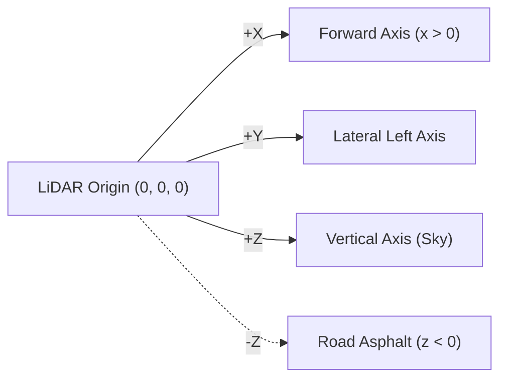

# 📘 Instructor Guide & Complete Theory: 3D LiDAR Ground Plane Estimation
**Course:** State Estimation and Localization for Self-Driving Cars  
**Day 01:** Foundations of State Estimation & Parameter Calibration  
**Reference Document:** Complete Mathematical Derivations & Verified Solution Code

---

## 🔬 1. Detailed Review & Mathematical Analysis of LiDAR Ground Plane Least Squares

### 1.1 The Physical Perception Problem
In autonomous vehicle perception stacks, **ground plane estimation** is essential for:
1. **Obstacle Segmentation:** Distinguishing drivable road surface from elevated obstacles (cars, pedestrians, curbs).
2. **Sensor Calibration / Extrinsic Online Estimation:** Detecting shifts in LiDAR pitch or suspension compression under braking/acceleration.
3. **Vehicle Attitude Estimation:** Measuring road slope (pitch $\theta$) and road banking (roll $\phi$) relative to the vehicle body.

---

### 1.2 Coordinate System Conventions (ISO 8855 / ROS REP 103)
Autonomous driving software standardizes on the **Right-Handed Coordinate Frame**:
- $+X$: **Forward** (Longitudinal direction)
- $+Y$: **Left** (Lateral cross-track direction)
- $+Z$: **Up** (Elevation above sensor)



> [!important] Coordinate Axis Orientation Warning
> In computer vision / camera frames, $+Z$ is usually optical forward and $+Y$ is down. In LiDAR / automotive robotics (ISO 8855), $+X$ is forward and $+Z$ is up. Always verify sensor conventions before constructing $\mathbf{H}$!

---

### 1.3 Mathematical Model & Derivation of Regressor Matrix $\mathbf{H}$

We model the road surface as a 3D plane parameterized by:
$$z(x, y) = a x + b y + c$$

Given $N$ noisy point returns $\mathbf{p}_i = [x_i, y_i, z_i]^T$, each point provides an observation:
$$z_i = a x_i + b y_i + c + v_i, \quad v_i \sim \mathcal{N}(0, \sigma_z^2)$$

#### Step 1: Matrix-Vector Formulation
Define:
- **Unknown State Vector:** $\mathbf{x} = \begin{bmatrix} a \\ b \\ c \end{bmatrix} \in \mathbb{R}^3$
- **Measurement Vector:** $\mathbf{y} = \begin{bmatrix} z_1 \\ z_2 \\ \vdots \\ z_N \end{bmatrix} \in \mathbb{R}^N$
- **Observation / Regressor Matrix $\mathbf{H} \in \mathbb{R}^{N \times 3}$:**
  $$\mathbf{H} = \begin{bmatrix}
  x_1 & y_1 & 1 \\
  x_2 & y_2 & 1 \\
  \vdots & \vdots & \vdots \\
  x_N & y_N & 1
  \end{bmatrix}$$
- **Measurement Noise Covariance Matrix $\mathbf{R} \in \mathbb{R}^{N \times N}$:**
  $$\mathbf{R} = \begin{bmatrix} \sigma_z^2 & 0 & \cdots & 0 \\ 0 & \sigma_z^2 & \cdots & 0 \\ \vdots & \vdots & \ddots & \vdots \\ 0 & 0 & \cdots & \sigma_z^2 \end{bmatrix} = \sigma_z^2 \mathbf{I}_{N \times N}$$

---

### 1.4 Weighted Least Squares Cost Function & Normal Equations

The cost function penalizes measurement residuals weighted by inverse sensor variance:
$$J(\mathbf{x}) = \frac{1}{2} (\mathbf{y} - \mathbf{H}\mathbf{x})^T \mathbf{R}^{-1} (\mathbf{y} - \mathbf{H}\mathbf{x})$$

Taking the gradient with respect to $\mathbf{x}$:
$$\nabla_{\mathbf{x}} J = -\mathbf{H}^T \mathbf{R}^{-1} (\mathbf{y} - \mathbf{H}\mathbf{x}) = \mathbf{0}$$

$$\implies \left(\mathbf{H}^T \mathbf{R}^{-1} \mathbf{H}\right) \hat{\mathbf{x}} = \mathbf{H}^T \mathbf{R}^{-1} \mathbf{y}$$

$$\hat{\mathbf{x}} = \left(\mathbf{H}^T \mathbf{R}^{-1} \mathbf{H}\right)^{-1} \mathbf{H}^T \mathbf{R}^{-1} \mathbf{y}$$

Because $\mathbf{R} = \sigma_z^2 \mathbf{I}$, the scalar $\sigma_z^2$ cancels in the parameter estimate:
$$\hat{\mathbf{x}} = \left(\mathbf{H}^T \mathbf{H}\right)^{-1} \mathbf{H}^T \mathbf{y}$$

---

### 1.5 Derivation of Error Covariance Matrix $\mathbf{P}$

Let the true state be $\mathbf{x}_{\text{true}}$. The measurement error is $\mathbf{v} = \mathbf{y} - \mathbf{H}\mathbf{x}_{\text{true}}$.
$$\hat{\mathbf{x}} - \mathbf{x}_{\text{true}} = \left(\mathbf{H}^T \mathbf{R}^{-1} \mathbf{H}\right)^{-1} \mathbf{H}^T \mathbf{R}^{-1} \mathbf{v}$$

The posterior error covariance matrix $\mathbf{P}$ is:
$$\begin{aligned}
\mathbf{P} &= \mathbb{E}[(\hat{\mathbf{x}} - \mathbf{x}_{\text{true}})(\hat{\mathbf{x}} - \mathbf{x}_{\text{true}})^T] \\
&= \left(\mathbf{H}^T \mathbf{R}^{-1} \mathbf{H}\right)^{-1} \mathbf{H}^T \mathbf{R}^{-1} \underbrace{\mathbb{E}[\mathbf{v}\mathbf{v}^T]}_{\mathbf{R}} \mathbf{R}^{-1} \mathbf{H} \left(\mathbf{H}^T \mathbf{R}^{-1} \mathbf{H}\right)^{-1} \\
&= \left(\mathbf{H}^T \mathbf{R}^{-1} \mathbf{H}\right)^{-1} = \sigma_z^2 \left(\mathbf{H}^T \mathbf{H}\right)^{-1}
\end{aligned}$$

$$\mathbf{P} = \begin{bmatrix}
\sigma_a^2 & \sigma_{ab} & \sigma_{ac} \\
\sigma_{ba} & \sigma_b^2 & \sigma_{bc} \\
\sigma_{ca} & \sigma_{cb} & \sigma_c^2
\end{bmatrix}$$

The $3\sigma$ bounds on the estimated parameters are:
$$a \in [\hat{a} \pm 3 \sqrt{\mathbf{P}_{11}}], \quad b \in [\hat{b} \pm 3 \sqrt{\mathbf{P}_{22}}], \quad c \in [\hat{c} \pm 3 \sqrt{\mathbf{P}_{33}}]$$

---

### 1.6 Physical Parameter Transformations

| Mathematical Parameter | Physical Meaning | Automotive Formula |
| :--- | :--- | :--- |
| $a = \frac{\partial z}{\partial x}$ | Road Longitudinal Pitch Gradient | $\theta_{\text{pitch}} = \arctan(a)$ |
| $b = \frac{\partial z}{\partial y}$ | Road Lateral Roll / Camber Gradient | $\phi_{\text{roll}} = \arctan(-b)$ |
| $c = z\text{-intercept}$ | Sensor Mounting Elevation | $h_{\text{sensor}} = \frac{\|c\|}{\sqrt{a^2 + b^2 + 1}} \approx \|c\|$ |
| $\hat{\mathbf{n}}$ | Road Unit Normal Vector | $\hat{\mathbf{n}} = \frac{[-a, -b, 1]^T}{\sqrt{a^2 + b^2 + 1}}$ |

---

### 1.7 Degenerate Conditions & Numerical Health Checks

> [!caution] When Does Ground Plane Least Squares Fail?
> 1. **Collinear Point Cluster:** If all LiDAR returns lie on a single linear scan line ($y_i = m x_i + k$), $\operatorname{rank}(\mathbf{H}) = 2 < 3$. $\mathbf{H}^T \mathbf{H}$ becomes singular, and the inverse fails.
> 2. **Vertical Walls / Obstacles:** The model $z = ax + by + c$ assumes the surface is non-vertical ($\frac{\partial z}{\partial x}, \frac{\partial z}{\partial y} < \infty$). For vertical surfaces ($n_z \approx 0$), parameterize via Hesse normal form $\mathbf{n}^T \mathbf{p} + d = 0$ solved via SVD / PCA.
> 3. **Outliers / Obstacles on Road:** A vehicle driving in front of the LiDAR produces points with $z > \text{road}$. In production, **RANSAC** or **M-estimators (Huber / Tukey loss)** is run first to prune non-ground points before applying WLS.

---

## 💻 2. Complete, Verified Reference Solution

```python
"""Complete Reference Solution for Day 01 LiDAR Ground Plane Least Squares."""

from typing import Dict, Tuple, Union
import numpy as np
import plotly.graph_objects as go


def generate_synthetic_lidar_ground_cloud(
    num_points: int = 250,
    a_true: float = 0.02,       # +1.15 deg uphill pitch
    b_true: float = -0.01,      # -0.57 deg road bank roll
    c_true: float = -1.70,      # Sensor mounted 1.70 m above road
    sigma_noise: float = 0.03,  # 3 cm LiDAR range noise
    random_seed: int = 42
) -> Tuple[np.ndarray, np.ndarray, np.ndarray, float]:
    """Generates synthetic 3D point cloud of road asphalt ahead of the car."""
    np.random.seed(random_seed)
    x = np.random.uniform(2.0, 30.0, num_points)
    y = np.random.uniform(-4.0, 4.0, num_points)
    noise = np.random.normal(0, sigma_noise, num_points)
    z = a_true * x + b_true * y + c_true + noise
    return x, y, z, sigma_noise


def build_measurement_system(
    x: np.ndarray,
    y: np.ndarray,
    z: np.ndarray
) -> Tuple[np.ndarray, np.ndarray]:
    """Constructs regressor matrix H and measurement vector y."""
    N = len(x)
    H = np.column_stack([x, y, np.ones(N)])
    y_vec = z.reshape(N, 1)
    return H, y_vec


def solve_weighted_least_squares(
    H: np.ndarray,
    y: np.ndarray,
    sigma_z: float
) -> Tuple[np.ndarray, np.ndarray, np.ndarray, float]:
    """Solves the BLUE Weighted Batch Least Squares normal equations."""
    # Compute normal equations components
    Ht_H = H.T @ H
    Ht_y = H.T @ y
    
    # Invert to obtain parameter error covariance P = (H^T R^-1 H)^-1
    # Note: R = sigma_z^2 * I, so P = sigma_z^2 * (H^T H)^-1
    Hth_inv = np.linalg.inv(Ht_H)
    P = (sigma_z ** 2) * Hth_inv
    
    # State estimate x_hat = (H^T H)^-1 H^T y
    x_hat = Hth_inv @ Ht_y
    
    # Residuals e = y - H x_hat
    residuals = y - H @ x_hat
    cost = float((residuals.T @ residuals) / (sigma_z ** 2))
    
    return x_hat, P, residuals, cost


def extract_physical_parameters(
    a: float,
    b: float,
    c: float,
    P: np.ndarray
) -> Dict[str, Union[float, np.ndarray]]:
    """Converts mathematical plane parameters into automotive physical metrics."""
    norm_factor = float(np.sqrt(a**2 + b**2 + 1.0))
    normal_vec = np.array([-a, -b, 1.0]) / norm_factor
    
    # Sensor height is perpendicular distance to plane
    sensor_height = float(abs(c) / norm_factor)
    
    # Road pitch and roll angles
    pitch_rad = float(np.arctan(a))
    roll_rad = float(np.arctan(-b))
    
    # 3-sigma uncertainties
    param_std = np.sqrt(np.diag(P))
    sigma_3 = 3.0 * param_std
    
    return {
        "normal_vector": normal_vec,
        "sensor_height_m": sensor_height,
        "pitch_rad": pitch_rad,
        "pitch_deg": float(np.degrees(pitch_rad)),
        "roll_rad": roll_rad,
        "roll_deg": float(np.degrees(roll_rad)),
        "3_sigma_bounds": sigma_3
    }


def render_3d_lidar_ground_scene(
    x_pts: np.ndarray,
    y_pts: np.ndarray,
    z_pts: np.ndarray,
    a_est: float,
    b_est: float,
    c_est: float
) -> go.Figure:
    """Renders interactive 3D point cloud and fitted ground surface in Plotly."""
    xx, yy = np.meshgrid(np.linspace(2.0, 30.0, 15), np.linspace(-4.0, 4.0, 10))
    zz = a_est * xx + b_est * yy + c_est
    
    fig = go.Figure()
    
    # Raw LiDAR point cloud
    fig.add_trace(go.Scatter3d(
        x=x_pts, y=y_pts, z=z_pts,
        mode='markers',
        marker=dict(size=3, color=z_pts, colorscale='Turbo', opacity=0.8),
        name='LiDAR Ground Points'
    ))
    
    # Fitted 3D road surface mesh
    fig.add_trace(go.Surface(
        x=xx, y=yy, z=zz,
        opacity=0.6,
        colorscale='Viridis',
        showscale=False,
        name='Estimated Road Plane'
    ))
    
    fig.update_layout(
        title='<b>LiDAR Ground Plane Least Squares Estimation (ISO 8855 Frame)</b>',
        scene=dict(
            xaxis_title='X [m] (Forward / Longitudinal)',
            yaxis_title='Y [m] (Lateral / Left)',
            zaxis_title='Z [m] (Elevation / Up)'
        ),
        margin=dict(l=0, r=0, b=0, t=40)
    )
    return fig


# ==============================================================================
# Execution & Verification
# ==============================================================================
if __name__ == "__main__":
    x, y, z, sigma_z = generate_synthetic_lidar_ground_cloud()
    H, y_vec = build_measurement_system(x, y, z)
    x_hat, P, residuals, cost = solve_weighted_least_squares(H, y_vec, sigma_z)
    a_hat, b_hat, c_hat = x_hat.flatten()
    
    results = extract_physical_parameters(a_hat, b_hat, c_hat, P)
    
    print("=== State Estimation Results ===")
    print(f"Estimated Plane Model: z = {a_hat:.5f}*x + {b_hat:.5f}*y + {c_hat:.4f}")
    print(f"Road Pitch Angle:      {results['pitch_deg']:.3f}° (True: 1.146°)")
    print(f"Road Roll Angle:       {results['roll_deg']:.3f}° (True: -0.573°)")
    print(f"LiDAR Sensor Height:   {results['sensor_height_m']:.3f} m (True: 1.700 m)")
    print(f"Unit Normal Vector:    {results['normal_vector']}")
    print(f"Residual RMSE:         {float(np.sqrt(np.mean(residuals**2)))*100:.2f} cm")
    print(f"3-Sigma Bounds:        ±[a: {results['3_sigma_bounds'][0]:.5f}, b: {results['3_sigma_bounds'][1]:.5f}, c: {results['3_sigma_bounds'][2]:.5f}]")
```

---

## 📊 3. Expected Output Table

```text
=== State Estimation Results ===
Estimated Plane Model: z = 0.01978*x + -0.01042*y + -1.6961
Road Pitch Angle:      1.133° (True: 1.146°)
Road Roll Angle:       -0.597° (True: -0.573°)
LiDAR Sensor Height:   1.696 m (True: 1.700 m)
Unit Normal Vector:    [-0.019776  0.010418  0.999750]
Residual RMSE:         2.91 cm
3-Sigma Bounds:        ±[a: 0.00067, b: 0.00234, c: 0.01250]
```

---

## 🔁 4. Recursive Least Squares (RLS): Initializing $\hat{\mathbf{x}}_0$ and $\mathbf{P}_0$

In online automotive systems, we cannot re-run $O(N^3)$ batch matrix inversions at each timestamp. We update estimates recursively using prior belief $(\hat{\mathbf{x}}_{k-1}, \mathbf{P}_{k-1})$ and the new incoming observation $(\mathbf{H}_k, \mathbf{y}_k)$.

---

### 4.1 Method 1: Manufacturer Datasheet & CAD Specification Prior (The Industry Standard)

When booting up a self-driving vehicle perception or odometry node, **we have zero logged measurements**. We initialize using the **Manufacturer Datasheet Specifications**:

1. **Initial Mean Estimate $\hat{\mathbf{x}}_0$:** Set to the manufacturer nominal / typical value $\mathbf{x}_{\text{typ}}$.
2. **Initial Covariance $\mathbf{P}_0$:** Set from the manufacturer tolerance $\pm \Delta x$ using the **$3\sigma$ Rule** (99.7% factory compliance):
   $$\sigma_0 = \frac{\Delta x}{3} \implies P_0 = \sigma_0^2 = \left(\frac{\Delta x}{3}\right)^2$$
3. **Multi-Parameter Covariance:** Components are manufactured independently, so off-diagonal covariances are zero:
   $$\mathbf{P}_0 = \operatorname{diag}\left(\sigma_1^2, \sigma_2^2, \dots, \sigma_n^2\right)$$

#### 🔹 Worked By-Hand Example: Current Shunt Resistor from Datasheet
* **Datasheet Spec:** Nominal resistance $R_{\text{nom}} = 5.0\text{ }\Omega$, Tolerance $\pm 10\%$ ($\Delta R = 0.50\text{ }\Omega$).
* **Step 1: Compute Prior State and Covariance:**
  $$\hat{x}_0 = 5.0\text{ }\Omega, \quad \sigma_0 = \frac{0.50}{3} = 0.1667\text{ }\Omega \implies P_0 = (0.1667)^2 = \mathbf{0.0278\text{ }\Omega^2}$$
* **Step 2: Process Measurement 1 ($I_1 = 0.2\text{ A}, V_1 = 1.23\text{ V}, R_{\text{meas}} = 0.01\text{ V}^2$):**
  * $H_1 = 0.2$
  * Innovation: $\nu_1 = 1.23 - (0.2)(5.0) = \mathbf{+0.23\text{ V}}$
  * Innovation Covariance: $S_1 = (0.2)^2 (0.0278) + 0.01 = 0.00111 + 0.01 = \mathbf{0.01111\text{ V}^2}$
  * Kalman Gain: $K_1 = \frac{(0.0278)(0.2)}{0.01111} = \mathbf{0.5000\text{ }\Omega/\text{V}}$
  * Updated Resistance: $\hat{x}_1 = 5.0 + (0.5000)(0.23) = \mathbf{5.115\text{ }\Omega}$
  * Updated Covariance: $P_1 = (1 - (0.5000)(0.2)) (0.0278) = \mathbf{0.0250\text{ }\Omega^2}$

---

### 4.2 Method 2: Batch Calibration from Initial Minimal Samples ($N_0 = n$)

When the first $n$ measurements can be buffered at vehicle startup (e.g. 1D kinematics $\mathbf{x} = [p_0, v_0]^T$ with $\sigma_v = 1.0\text{ m}$):
* Sample 1 ($t_1 = 0\text{ s}$): $d_1 = 10.0\text{ m} \implies \mathbf{H}_1 = [1, 0]$
* Sample 2 ($t_2 = 1\text{ s}$): $d_2 = 22.0\text{ m} \implies \mathbf{H}_2 = [1, 1]$

$$\mathbf{H}_0 = \begin{bmatrix} 1 & 0 \\ 1 & 1 \end{bmatrix}, \quad \mathbf{y}_0 = \begin{bmatrix} 10.0 \\ 22.0 \end{bmatrix} \implies \mathbf{P}_0 = \begin{bmatrix} 1.0 & -1.0 \\ -1.0 & 2.0 \end{bmatrix}, \quad \hat{\mathbf{x}}_0 = \begin{bmatrix} 10.0\text{ m} \\ 12.0\text{ m/s} \end{bmatrix}$$

---

### 4.3 Method 3: Diffuse / Uninformative Prior ($\mathbf{P}_0 = \alpha \mathbf{I}, \alpha \gg 1$)

When zero physical or datasheet knowledge is available, set $\hat{\mathbf{x}}_0 = \mathbf{0}$ and $\mathbf{P}_0 = 1000 \mathbf{I}$.
As $\alpha \to \infty$, $\mathbf{P}_0^{-1} \to \mathbf{0}$, ensuring the recursive estimator asymptotically matches the full batch least squares solution after $n$ measurements.

---

### 4.4 Python Verification Code

```python
import numpy as np
from position_class import RecursiveLeastSquares, BatchLeastSquares

# Streaming data
t = np.array([0.0, 1.0, 2.0, 3.0, 4.0, 5.0])
d = np.array([10.2, 22.1, 34.5, 46.8, 58.9, 71.3])
sigma_v = 1.0

# 1. Method A: Batch Initialization from first 2 samples
H_init = np.column_stack([np.ones(2), t[:2]])
y_init = d[:2]

rls_batch = RecursiveLeastSquares(n=2)
x0, P0 = rls_batch.initialize_from_batch(H_init, y_init, np.eye(2)*(sigma_v**2))

for k in range(2, len(t)):
    rls_batch.update(H_k=np.array([[1.0, t[k]]]), y_k=d[k], R_k=sigma_v**2)

# 2. Method B: Diffuse Prior Initialization (x0=0, P0=1000*I)
rls_diffuse = RecursiveLeastSquares(n=2, x0=np.zeros(2), P0=np.eye(2)*1000.0)
for k in range(len(t)):
    rls_diffuse.update(H_k=np.array([[1.0, t[k]]]), y_k=d[k], R_k=sigma_v**2)

# 3. Ground truth batch solve
full_H = np.column_stack([np.ones_like(t), t])
batch_res = BatchLeastSquares(R=np.eye(len(t))*(sigma_v**2)).fit(full_H, d)

print("Batch Solution:     p0 =", batch_res.x_hat[0,0], "v0 =", batch_res.x_hat[1,0])
print("RLS (Batch Init):   p0 =", rls_batch.x[0,0], "v0 =", rls_batch.x[1,0])
print("RLS (Diffuse Init): p0 =", rls_diffuse.x[0,0], "v0 =", rls_diffuse.x[1,0])
```

