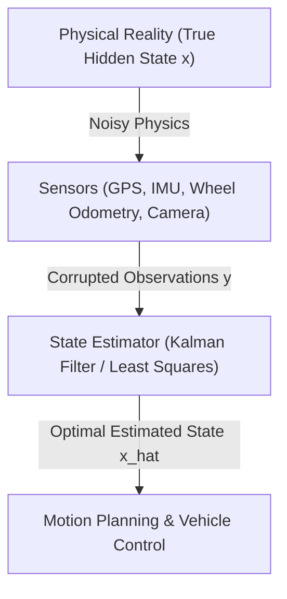

# Hour 1: Probability, Random Variables & Batch Least Squares

> [!abstract] Key Learning Objectives
> 1. Understand why state estimation is inherently probabilistic in autonomous robotics.
> 2. Master the algebra of multivariate Gaussian distributions and linear transformations.
> 3. Understand where the **Observation Matrix $\mathbf{H}$** and **Error Covariance $\mathbf{P}$** come from.
> 4. Derive the Best Linear Unbiased Estimator (BLUE) via Weighted Batch Least Squares from first principles.
> 5. Explore four real-world automotive parameter estimation examples (Ohm's law, wheel odometry calibration, initial state tracking, LiDAR plane fitting).
> 6. Implement a batch least-squares solver in Python to estimate physical parameters from noisy data.

---

## 1. Why State Estimation? The Challenge of Autonomous Vehicles

Imagine an autonomous vehicle driving down a highway at $100\text{ km/h}$ ($28\text{ m/s}$). To plan paths, change lanes, and avoid collisions, the vehicle's computer must know its **state**:
* Where is the vehicle located in the world? (Position: $x, y, z$)
* How fast is it traveling and in what direction? (Velocity: $\dot{x}, \dot{y}, \dot{z}$)
* Which way is it pointing? (Orientation/Attitude: roll $\phi$, pitch $\theta$, yaw $\psi$)

However, a vehicle **cannot directly read its true state from reality**. Every sensor on board is imperfect:
* **GNSS / GPS receivers** suffer from satellite clock errors, atmospheric delays, and multipath reflections. An off-the-shelf GPS might be off by $2\text{ to }5\text{ meters}$.
* **Wheel encoders (Odometry)** slip on wet asphalt or lose traction over bumps.
* **Inertial Measurement Units (IMUs)** measure acceleration and angular rate, but constant sensor biases cause integrated positions to drift uncontrollably within seconds.
* **LiDAR and Cameras** provide rich spatial cues, but weather, lighting, and occlusions introduce noise and false detections.



> [!important] The Core Principle of State Estimation
> **State estimation** is the art and science of fusing noisy, incomplete, and indirect sensor measurements with a mathematical model of physics to produce the **best possible estimate of the hidden state**, along with an honest assessment of its **uncertainty**.

---

## 2. Mathematical Foundations: Random Variables and Multivariate Gaussians

Because sensor measurements are noisy and physical models are approximations, we model quantities as **random variables**.

### 2.1 Mean and Covariance
Let $\mathbf{x} = [x_1, x_2, \dots, x_n]^T \in \mathbb{R}^n$ be a continuous random vector representing the vehicle state.
1. **Expected Value (Mean):** The first moment, representing our best center guess:
   $$\boldsymbol{\mu} = \mathbb{E}[\mathbf{x}] = \int_{-\infty}^{\infty} \mathbf{x} p(\mathbf{x}) d\mathbf{x}$$
2. **Covariance Matrix:** The second central moment, capturing the spread (uncertainty) and correlations:
   $$\mathbf{\Sigma} = \operatorname{Cov}(\mathbf{x}) = \mathbb{E}[(\mathbf{x} - \boldsymbol{\mu})(\mathbf{x} - \boldsymbol{\mu})^T] = \begin{bmatrix} \sigma_{1}^2 & \sigma_{12} & \dots & \sigma_{1n} \\ \sigma_{21} & \sigma_2^2 & \dots & \sigma_{2n} \\ \vdots & \vdots & \ddots & \vdots \\ \sigma_{n1} & \sigma_{n2} & \dots & \sigma_n^2 \end{bmatrix}$$
   * The diagonal elements $\sigma_i^2 = \operatorname{Var}(x_i)$ are the **variances** of each variable.
   * The off-diagonal elements $\sigma_{ij} = \operatorname{Cov}(x_i, x_j)$ represent the **cross-correlations**.
   * **Symmetry:** $\mathbf{\Sigma} = \mathbf{\Sigma}^T$ because $\sigma_{ij} = \sigma_{ji}$.
   * **Positive Semi-Definite:** For any non-zero vector $\mathbf{u}$, $\mathbf{u}^T \mathbf{\Sigma} \mathbf{u} \ge 0$.

### 2.2 The Multivariate Gaussian Distribution
A random vector $\mathbf{x} \in \mathbb{R}^n$ is distributed according to a multivariate normal (Gaussian) distribution, written as $\mathbf{x} \sim \mathcal{N}(\boldsymbol{\mu}, \mathbf{\Sigma})$, if its probability density function (PDF) is:

$$p(\mathbf{x}) = \frac{1}{\sqrt{(2\pi)^n \det(\mathbf{\Sigma})}} \exp\left( -\frac{1}{2} (\mathbf{x} - \boldsymbol{\mu})^T \mathbf{\Sigma}^{-1} (\mathbf{x} - \boldsymbol{\mu}) \right)$$

The quadratic term in the exponent:
$$d_M^2 = (\mathbf{x} - \boldsymbol{\mu})^T \mathbf{\Sigma}^{-1} (\mathbf{x} - \boldsymbol{\mu})$$
is known as the **squared Mahalanobis distance**.

### 2.3 Fundamental Property: Linear Transformations of Gaussians
> [!tip] Linear Transformation Theorem
> If $\mathbf{x} \sim \mathcal{N}(\boldsymbol{\mu}_x, \mathbf{\Sigma}_{xx})$ and $\mathbf{y}$ is formed by a linear affine transformation $\mathbf{y} = \mathbf{A}\mathbf{x} + \mathbf{b}$, then $\mathbf{y}$ is **also strictly Gaussian**:
> $$\mathbf{y} \sim \mathcal{N}(\mathbf{A}\boldsymbol{\mu}_x + \mathbf{b}, \mathbf{A}\mathbf{\Sigma}_{xx}\mathbf{A}^T)$$

---

## 3. Deep Dive: Where Does $\mathbf{H}$ Come From?

In state estimation, sensors rarely measure the full state vector $\mathbf{x}$ directly. The matrix $\mathbf{H}$ is the **Measurement Matrix** (or **Observation Matrix / Measurement Jacobian**). It maps the **State Space** to the **Measurement Space**.

### Mathematical Formulation
Let $\mathbf{x} \in \mathbb{R}^n$ be the state to estimate, and $\mathbf{y} \in \mathbb{R}^m$ be the sensor readings. Physics provides a sensor model $\mathbf{h}(\mathbf{x})$:
$$\mathbf{y} = \mathbf{h}(\mathbf{x}) + \mathbf{v}$$

$\mathbf{H}$ is defined as the **Jacobian matrix** of the measurement function with respect to the state:
$$\mathbf{H} = \frac{\partial \mathbf{h}(\mathbf{x})}{\partial \mathbf{x}} = \begin{bmatrix}
\frac{\partial h_1}{\partial x_1} & \frac{\partial h_1}{\partial x_2} & \cdots & \frac{\partial h_1}{\partial x_n} \\
\frac{\partial h_2}{\partial x_1} & \frac{\partial h_2}{\partial x_2} & \cdots & \frac{\partial h_2}{\partial x_n} \\
\vdots & \vdots & \ddots & \vdots \\
\frac{\partial h_m}{\partial x_1} & \frac{\partial h_m}{\partial x_2} & \cdots & \frac{\partial h_m}{\partial x_n}
\end{bmatrix} \in \mathbb{R}^{m \times n}$$

---

## 4. Four Concrete Real-World Examples of Defining $\mathbf{H}$

### 🔹 Example 1: Electrical Resistance Estimation (Ohm's Law)
* **Goal:** Estimate resistance $R$ (our state $x = R$) from current $I_i$ and voltage measurements $V_i$.
* **Physics Law:** $V_i = I_i \cdot R + v_i \implies h_i(R) = I_i \cdot R$.
* **Deriving $\mathbf{H}$:**
  $$H_i = \frac{\partial h_i(R)}{\partial R} = I_i \implies \mathbf{H} = \begin{bmatrix} I_1 \\ I_2 \\ \vdots \\ I_N \end{bmatrix}, \quad \mathbf{y} = \begin{bmatrix} V_1 \\ V_2 \\ \vdots \\ V_N \end{bmatrix}$$

---

### 🔹 Example 2: Wheel Odometry & Effective Radius Calibration ($r_{\text{eff}}$)
* **Goal:** Calibrate effective tire radius $r_{\text{eff}}$ from GPS linear velocity $v_{\text{gps}}$ and wheel encoder rate $\omega$.
* **Physics Law:** $v_{\text{gps}, i} = r_{\text{eff}} \cdot \omega_i + v_i$.
* **Deriving $\mathbf{H}$:**
  $$\mathbf{H} = \begin{bmatrix} \omega_1 \\ \omega_2 \\ \vdots \\ \omega_N \end{bmatrix}, \quad \mathbf{y} = \begin{bmatrix} v_{\text{gps}, 1} \\ v_{\text{gps}, 2} \\ \vdots \\ v_{\text{gps}, N} \end{bmatrix} \implies \hat{r}_{\text{eff}} = (\mathbf{H}^T \mathbf{R}^{-1} \mathbf{H})^{-1}\mathbf{H}^T \mathbf{R}^{-1}\mathbf{y}$$

---

### 🔹 Example 3: Initial Vehicle Position and Constant Speed ($p_0, v_0$)
* **Goal:** Estimate initial position $p_0$ and velocity $v_0$ from timed distance measurements $d_i$ at timestamps $t_i$.
* **Physics Law:** $d_i = p_0 + v_0 t_i + v_i$.
* **State & Observation Matrix:**
  $$\mathbf{x} = \begin{bmatrix} p_0 \\ v_0 \end{bmatrix}, \quad \mathbf{H} = \begin{bmatrix} 1 & t_1 \\ 1 & t_2 \\ \vdots & \vdots \\ 1 & t_N \end{bmatrix}, \quad \mathbf{y} = \begin{bmatrix} d_1 \\ d_2 \\ \vdots \\ d_N \end{bmatrix}$$

---

### 🔹 Example 4: LiDAR Ground Surface & Road Slope Estimation ($a, b, c$)
* **Goal:** Fit a 3D road surface plane $z = ax + by + c$ to LiDAR ground point cloud $(x_i, y_i, z_i)$.
* **State & Observation Matrix:**
  $$\mathbf{x} = \begin{bmatrix} a \\ b \\ c \end{bmatrix}, \quad \mathbf{H} = \begin{bmatrix} x_1 & y_1 & 1 \\ x_2 & y_2 & 1 \\ \vdots & \vdots & \vdots \\ x_N & y_N & 1 \end{bmatrix}, \quad \mathbf{y} = \begin{bmatrix} z_1 \\ z_2 \\ \vdots \\ z_N \end{bmatrix}$$

---

## 5. Derivation of BLUE & Where Does $\mathbf{P}$ Come From?

### 5.1 Weighted Least Squares Cost Function
$$J(\mathbf{x}) = \frac{1}{2} (\mathbf{y} - \mathbf{H}\mathbf{x})^T \mathbf{R}^{-1} (\mathbf{y} - \mathbf{H}\mathbf{x})$$

Minimizing $J(\mathbf{x})$ by setting $\frac{\partial J}{\partial \mathbf{x}} = \mathbf{0}$ yields the **Normal Equations**:
$$\hat{\mathbf{x}} = \left(\mathbf{H}^T \mathbf{R}^{-1} \mathbf{H}\right)^{-1} \mathbf{H}^T \mathbf{R}^{-1} \mathbf{y}$$

### 5.2 Deriving Error Covariance $\mathbf{P}$
Let $\mathbf{e}_x = \hat{\mathbf{x}} - \mathbf{x} = (\mathbf{H}^T \mathbf{R}^{-1} \mathbf{H})^{-1} \mathbf{H}^T \mathbf{R}^{-1} \mathbf{v}$.
$$\begin{aligned}
\mathbf{P} &= \mathbb{E}[\mathbf{e}_x \mathbf{e}_x^T] = (\mathbf{H}^T \mathbf{R}^{-1} \mathbf{H})^{-1} \mathbf{H}^T \mathbf{R}^{-1} \underbrace{\mathbb{E}[\mathbf{v}\mathbf{v}^T]}_{\mathbf{R}} \mathbf{R}^{-1} \mathbf{H} (\mathbf{H}^T \mathbf{R}^{-1} \mathbf{H})^{-1} \\
&= (\mathbf{H}^T \mathbf{R}^{-1} \mathbf{H})^{-1}
\end{aligned}$$

$$\mathbf{P} = \left(\mathbf{H}^T \mathbf{R}^{-1} \mathbf{H}\right)^{-1}$$

---

## 6. Cross-Disciplinary Notation Reference

| Symbol | State Estimation / Robotics | Control Theory (LTI) | Machine Learning / Statistics | Aerospace / Navigation |
| :---: | :--- | :--- | :--- | :--- |
| $\mathbf{H}$ | **Observation Matrix / Jacobian** | Output Matrix ($\mathbf{C}$) | Design Matrix ($\mathbf{X}$) | Measurement Matrix |
| $\mathbf{x}$ | **State / Parameter Vector** | State ($\mathbf{x}$) | Weights / Parameters ($\mathbf{w}, \boldsymbol{\beta}$) | Ephemeris / State |
| $\mathbf{y}$ | **Sensor Measurements** | Output ($\mathbf{y}$) | Labels / Targets ($\mathbf{y}$) | Observables |
| $\mathbf{P}$ | **Error Covariance** | State Covariance ($\mathbf{\Sigma}_{xx}$) | Parameter Variance ($\mathbf{V}_\beta$) | Uncertainty Ellipsoid |
| $\mathbf{R}$ | **Measurement Noise Covariance** | Sensor Noise ($\mathbf{\Sigma}_v, \mathbf{V}$) | Noise Variance ($\sigma^2 \mathbf{I}$) | Sensor Error Matrix |

---

## 7. Python Implementation Walkthrough

All four examples are implemented and verified in [`position_class/src/position_class/least_squares.py`](file:///Users/yasuomaidana/Projects/classes/Self-Driving-Cars/State%20Estimation%20and%20Localization%20for%20Self-Driving%20Cars/position_class/src/position_class/least_squares.py):

```python
import numpy as np
from position_class import BatchLeastSquares, ohms_law_example, wheel_odometry_calibration_example

# 1. Run Ohm's Law example
R_est, R_std = ohms_law_example()
print(f"Estimated Resistance: {R_est:.4f} Ohms +/- {3*R_std:.4f} (3-sigma)")

# 2. Run Wheel Odometry Calibration
r_eff, r_std = wheel_odometry_calibration_example()
print(f"Calibrated Tire Radius: {r_eff:.4f} m +/- {3*r_std:.4f} m")
```
