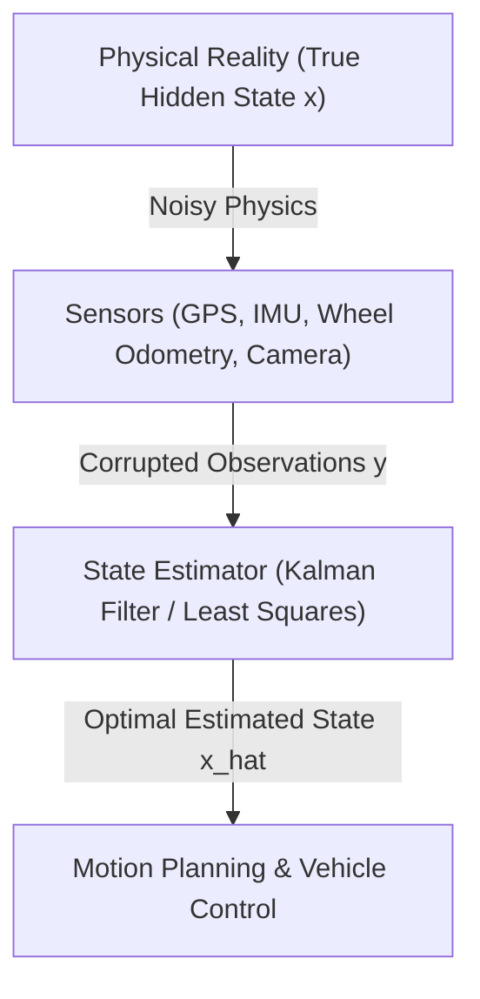

# Hour 1: Probability, Random Variables & Batch Least Squares

> [!abstract] Key Learning Objectives
> 1. Understand why state estimation is inherently probabilistic in autonomous robotics.
> 2. Master the algebra of multivariate Gaussian distributions and linear transformations.
> 3. Derive the Best Linear Unbiased Estimator (BLUE) via Weighted Batch Least Squares from first principles.
> 4. Implement a batch least-squares solver in Python to estimate physical parameters from noisy data.

---

## 1. Why State Estimation? The Challenge of Autonomous Vehicles

Imagine an autonomous vehicle driving down a highway at $100\text{ km/h}$ ($28\text{ m/s}$). To plan paths, change lanes, and avoid collisions, the vehicle's computer must know its **state**:
* Where is the vehicle located in the world? (Position: $x, y, z$)
* How fast is it traveling and in what direction? (Velocity: $\dot{x}, \dot{y}, \dot{z}$)
* Which way is it pointing? (Orientation/Attitude: roll $\phi$, pitch $\theta$, yaw $\psi$)

However, a vehicle **cannot directly read its true state from reality**. Every sensor on board is imperfect:
* **GNSS / GPS receivers** suffer from satellite clock errors, atmospheric delays, and multipath reflections (buildings bouncing signals). An off-the-shelf GPS might be off by $2\text{ to }5\text{ meters}$.
* **Wheel encoders (Odometry)** slip on wet asphalt or lose traction over bumps.
* **Inertial Measurement Units (IMUs)** measure acceleration and angular rate, but constant sensor biases cause integrated positions to drift uncontrollably within seconds.
* **LiDAR and Cameras** provide rich spatial cues, but weather, lighting, and occlusions introduce noise and false detections.



> [!important] The Core Principle of State Estimation
> **State estimation** is the art and science of fusing noisy, incomplete, and indirect sensor measurements with a mathematical model of physics to produce the **best possible estimate of the hidden state**, along with an honest assessment of its **uncertainty**.

---

## 2. Mathematical Foundations: Random Variables and Multivariate Gaussians

Because sensor measurements are noisy and physical models are approximations, we model quantities as **random variables**.

### 2.1 Mean and Covariance
Let $\mathbf{x} = [x_1, x_2, \dots, x_n]^T \in \mathbb{R}^n$ be a continuous random vector representing the vehicle state.
1. **Expected Value (Mean):** The first moment, representing our best center guess:
   $$\boldsymbol{\mu} = \mathbb{E}[\mathbf{x}] = \int_{-\infty}^{\infty} \mathbf{x} p(\mathbf{x}) d\mathbf{x}$$
2. **Covariance Matrix:** The second central moment, capturing the spread (uncertainty) and correlations:
   $$\mathbf{\Sigma} = \operatorname{Cov}(\mathbf{x}) = \mathbb{E}[(\mathbf{x} - \boldsymbol{\mu})(\mathbf{x} - \boldsymbol{\mu})^T] = \begin{bmatrix} \sigma_{1}^2 & \sigma_{12} & \dots & \sigma_{1n} \\ \sigma_{21} & \sigma_2^2 & \dots & \sigma_{2n} \\ \vdots & \vdots & \ddots & \vdots \\ \sigma_{n1} & \sigma_{n2} & \dots & \sigma_n^2 \end{bmatrix}$$
   * The diagonal elements $\sigma_i^2 = \operatorname{Var}(x_i)$ are the **variances** of each variable.
   * The off-diagonal elements $\sigma_{ij} = \operatorname{Cov}(x_i, x_j)$ represent the **cross-correlations**.
   * **Symmetry:** $\mathbf{\Sigma} = \mathbf{\Sigma}^T$ because $\sigma_{ij} = \sigma_{ji}$.
   * **Positive Semi-Definite:** For any non-zero vector $\mathbf{u}$, $\mathbf{u}^T \mathbf{\Sigma} \mathbf{u} \ge 0$.

### 2.2 The Multivariate Gaussian Distribution
A random vector $\mathbf{x} \in \mathbb{R}^n$ is distributed according to a multivariate normal (Gaussian) distribution, written as $\mathbf{x} \sim \mathcal{N}(\boldsymbol{\mu}, \mathbf{\Sigma})$, if its probability density function (PDF) is:

$$p(\mathbf{x}) = \frac{1}{\sqrt{(2\pi)^n \det(\mathbf{\Sigma})}} \exp\left( -\frac{1}{2} (\mathbf{x} - \boldsymbol{\mu})^T \mathbf{\Sigma}^{-1} (\mathbf{x} - \boldsymbol{\mu}) \right)$$

The quadratic term in the exponent:
$$d_M^2 = (\mathbf{x} - \boldsymbol{\mu})^T \mathbf{\Sigma}^{-1} (\mathbf{x} - \boldsymbol{\mu})$$
is known as the **squared Mahalanobis distance**. It scales Euclidean distance by the directional uncertainty of the covariance matrix. Contours of constant probability density form **hyper-ellipsoids** centered at $\boldsymbol{\mu}$.

```
      y ^                  ...--''''--...
        |             .-''       |        ''-.  Major Axis (Highest Uncertainty)
        |          .-'           |            '-.
        |        .'              |               '.
        |       /                |                 \
        |      |                 * \ mu             |
        |       \                 \                /
        |        '.                \             .'
        |          '-.              \         .-'
        |             '-..       ...--\....-''  Minor Axis (Lowest Uncertainty)
        +---------------------------------------------> x
```

### 2.3 Fundamental Property: Linear Transformations of Gaussians
One of the primary reasons Kalman filters exist is that **linear transformations preserve Gaussianity**.

> [!tip] Linear Transformation Theorem
> If $\mathbf{x} \sim \mathcal{N}(\boldsymbol{\mu}_x, \mathbf{\Sigma}_{xx})$ and $\mathbf{y}$ is formed by a linear affine transformation:
> $$\mathbf{y} = \mathbf{A}\mathbf{x} + \mathbf{b}$$
> where $\mathbf{A} \in \mathbb{R}^{m \times n}$ and $\mathbf{b} \in \mathbb{R}^m$ are deterministic, then $\mathbf{y}$ is **also strictly Gaussian**:
> $$\mathbf{y} \sim \mathcal{N}(\boldsymbol{\mu}_y, \mathbf{\Sigma}_{yy})$$
> with:
> $$\boldsymbol{\mu}_y = \mathbb{E}[\mathbf{A}\mathbf{x} + \mathbf{b}] = \mathbf{A}\boldsymbol{\mu}_x + \mathbf{b}$$
> $$\mathbf{\Sigma}_{yy} = \mathbb{E}[(\mathbf{y} - \boldsymbol{\mu}_y)(\mathbf{y} - \boldsymbol{\mu}_y)^T] = \mathbf{A}\mathbf{\Sigma}_{xx}\mathbf{A}^T$$

*Proof of Covariance:*
$$\mathbf{\Sigma}_{yy} = \mathbb{E}[(\mathbf{A}\mathbf{x} + \mathbf{b} - (\mathbf{A}\boldsymbol{\mu}_x + \mathbf{b}))(\mathbf{A}\mathbf{x} + \mathbf{b} - (\mathbf{A}\boldsymbol{\mu}_x + \mathbf{b}))^T]$$
$$\mathbf{\Sigma}_{yy} = \mathbb{E}[(\mathbf{A}(\mathbf{x} - \boldsymbol{\mu}_x))(\mathbf{A}(\mathbf{x} - \boldsymbol{\mu}_x))^T] = \mathbf{A} \underbrace{\mathbb{E}[(\mathbf{x} - \boldsymbol{\mu}_x)(\mathbf{x} - \boldsymbol{\mu}_x)^T]}_{\mathbf{\Sigma}_{xx}} \mathbf{A}^T = \mathbf{A}\mathbf{\Sigma}_{xx}\mathbf{A}^T \quad \blacksquare$$

---

## 3. Batch Least Squares (BLS) Formulation

Let us now solve the fundamental parameter estimation problem: given a collection of noisy sensor observations, what is the best estimate of the underlying parameter vector $\mathbf{x}$?

### 3.1 Linear Measurement Model
Suppose we collect $m$ scalar measurements relating to an unknown state $\mathbf{x} \in \mathbb{R}^n$ ($m \ge n$):
$$\mathbf{y} = \mathbf{H}\mathbf{x} + \mathbf{v}$$
Where:
* $\mathbf{y} \in \mathbb{R}^m$ is the stacked vector of measurements.
* $\mathbf{H} \in \mathbb{R}^{m \times n}$ is the observation matrix mapping state space to measurement space.
* $\mathbf{v} \in \mathbb{R}^m$ is zero-mean measurement noise with covariance:
  $$\mathbb{E}[\mathbf{v}] = \mathbf{0}, \quad \operatorname{Cov}(\mathbf{v}) = \mathbf{R} = \begin{bmatrix} \sigma_{v1}^2 & 0 & \dots \\ 0 & \sigma_{v2}^2 & \dots \\ \vdots & \vdots & \ddots \end{bmatrix}$$

### 3.2 The Weighted Squared Error Criterion
Not all sensors are equally trustworthy. If Sensor A has noise variance $\sigma_A^2 = 0.01$ and Sensor B has variance $\sigma_B^2 = 1.0$, Sensor A should be weighted $100\times$ more heavily!

We formulate the **Weighted Least Squares Cost Function**:
$$J(\mathbf{x}) = \frac{1}{2} (\mathbf{y} - \mathbf{H}\mathbf{x})^T \mathbf{R}^{-1} (\mathbf{y} - \mathbf{H}\mathbf{x})$$

Let us expand this quadratic scalar cost:
$$J(\mathbf{x}) = \frac{1}{2} \left( \mathbf{y}^T \mathbf{R}^{-1} \mathbf{y} - \mathbf{y}^T \mathbf{R}^{-1} \mathbf{H}\mathbf{x} - \mathbf{x}^T \mathbf{H}^T \mathbf{R}^{-1} \mathbf{y} + \mathbf{x}^T \mathbf{H}^T \mathbf{R}^{-1} \mathbf{H}\mathbf{x} \right)$$
Since $\mathbf{y}^T \mathbf{R}^{-1} \mathbf{H}\mathbf{x}$ is a scalar, it equals its transpose $\mathbf{x}^T \mathbf{H}^T \mathbf{R}^{-1} \mathbf{y}$:
$$J(\mathbf{x}) = \frac{1}{2} \mathbf{y}^T \mathbf{R}^{-1} \mathbf{y} - \mathbf{x}^T \mathbf{H}^T \mathbf{R}^{-1} \mathbf{y} + \frac{1}{2} \mathbf{x}^T \mathbf{H}^T \mathbf{R}^{-1} \mathbf{H}\mathbf{x}$$

### 3.3 Derivation of the Normal Equations
To find the state $\hat{\mathbf{x}}$ that minimizes $J(\mathbf{x})$, take the matrix derivative with respect to $\mathbf{x}$ and set it to $\mathbf{0}$:

$$\frac{\partial J}{\partial \mathbf{x}} = -\mathbf{H}^T \mathbf{R}^{-1} \mathbf{y} + \mathbf{H}^T \mathbf{R}^{-1} \mathbf{H}\mathbf{x} = \mathbf{0}$$

Rearranging gives the celebrated **Normal Equations**:
$$(\mathbf{H}^T \mathbf{R}^{-1} \mathbf{H})\hat{\mathbf{x}} = \mathbf{H}^T \mathbf{R}^{-1} \mathbf{y}$$

Assuming $\mathbf{H}$ has full column rank ($\operatorname{rank}(\mathbf{H}) = n$), the matrix $(\mathbf{H}^T \mathbf{R}^{-1} \mathbf{H})$ is invertible:

$$\hat{\mathbf{x}}_{BLUE} = \left( \mathbf{H}^T \mathbf{R}^{-1} \mathbf{H} \right)^{-1} \mathbf{H}^T \mathbf{R}^{-1} \mathbf{y}$$

### 3.4 Covariance of the Estimate
What is the uncertainty in our estimated state $\hat{\mathbf{x}}$?
Recall $\hat{\mathbf{x}} = \mathbf{K}_{batch} \mathbf{y}$, where $\mathbf{K}_{batch} = (\mathbf{H}^T \mathbf{R}^{-1} \mathbf{H})^{-1} \mathbf{H}^T \mathbf{R}^{-1}$.
Using our linear transformation rule $\mathbf{\Sigma}_{yy} = \mathbf{A}\mathbf{\Sigma}_{xx}\mathbf{A}^T$:

$$\mathbf{P} = \operatorname{Cov}(\hat{\mathbf{x}}) = \mathbf{K}_{batch} \operatorname{Cov}(\mathbf{y}) \mathbf{K}_{batch}^T = \mathbf{K}_{batch} \mathbf{R} \mathbf{K}_{batch}^T$$
$$\mathbf{P} = \left( (\mathbf{H}^T \mathbf{R}^{-1} \mathbf{H})^{-1} \mathbf{H}^T \mathbf{R}^{-1} \right) \mathbf{R} \left( \mathbf{R}^{-1} \mathbf{H} (\mathbf{H}^T \mathbf{R}^{-1} \mathbf{H})^{-1} \right)$$
Notice that $\mathbf{R}^{-1} \mathbf{R} = \mathbf{I}$:
$$\mathbf{P} = (\mathbf{H}^T \mathbf{R}^{-1} \mathbf{H})^{-1} (\mathbf{H}^T \mathbf{R}^{-1} \mathbf{H}) (\mathbf{H}^T \mathbf{R}^{-1} \mathbf{H})^{-1} = (\mathbf{H}^T \mathbf{R}^{-1} \mathbf{H})^{-1}$$

> [!important] The Best Linear Unbiased Estimator (BLUE)
> For any linear measurement system with zero-mean noise, the weighted least squares estimate:
> $$\hat{\mathbf{x}} = (\mathbf{H}^T \mathbf{R}^{-1} \mathbf{H})^{-1} \mathbf{H}^T \mathbf{R}^{-1} \mathbf{y}$$
> achieves the **minimum variance** among all possible linear unbiased estimators (Gauss-Markov Theorem). Its covariance is:
> $$\mathbf{P} = (\mathbf{H}^T \mathbf{R}^{-1} \mathbf{H})^{-1}$$

---

## 4. Python Implementation Walkthrough

Let us apply this to estimate the resistance $R$ of an electrical resistor following Ohm's law ($V = R \cdot I$) using the data in `Least Squares/Excersice.ipynb`.

```python
import numpy as np
import matplotlib.pyplot as plt

# 1. Given measurement data (Current I in Amps, Voltage V in Volts)
I = np.array([[0.2, 0.3, 0.4, 0.5, 0.6]]).T   # (5, 1) matrix (H)
V = np.array([[1.23, 1.38, 2.06, 2.47, 3.17]]).T # (5, 1) observations (y)

# 2. Measurement noise variance (suppose standard deviation is 0.1 V)
sigma_v = 0.1
R_cov = (sigma_v ** 2) * np.eye(len(I))  # (5, 5) covariance matrix

# 3. Solve Normal Equations
# x_hat = (H^T R^-1 H)^-1 H^T R^-1 y
H = I
R_inv = np.linalg.inv(R_cov)

# Calculate state estimate and covariance
P_est = np.linalg.inv(H.T @ R_inv @ H)
x_hat = P_est @ (H.T @ R_inv @ V)

print(f"Estimated Resistance R: {x_hat.item():.4f} Ohms")
print(f"Estimation Uncertainty (Variance): {P_est.item():.6f}")
print(f"Estimation 1-sigma bound: {np.sqrt(P_est.item()):.4f} Ohms")

# 4. Plotting
plt.figure(figsize=(8, 5))
plt.scatter(I, V, color='red', label='Multimeter Measurements', zorder=5)
I_line = np.linspace(0, 0.7, 100).reshape(-1, 1)
V_line = I_line * x_hat.item()
plt.plot(I_line, V_line, 'b-', label=f'Fit: V = {x_hat.item():.2f} I')
plt.xlabel('Current (A)')
plt.ylabel('Voltage (V)')
plt.title('Batch Least Squares Estimation (Ohm\'s Law)')
plt.legend()
plt.grid(True)
plt.show()
```

---

## 5. Self-Assessment & Checkpoint Questions

1. **Why does $\mathbf{\Sigma}_{yy} = \mathbf{A}\mathbf{\Sigma}_{xx}\mathbf{A}^T$ rather than $\mathbf{A}^2 \mathbf{\Sigma}_{xx}$?**
   * *Answer:* Covariance is defined as $\mathbb{E}[\mathbf{e}\mathbf{e}^T]$. When $\mathbf{e}_y = \mathbf{A}\mathbf{e}_x$, the transpose of the product is $(\mathbf{A}\mathbf{e}_x)^T = \mathbf{e}_x^T \mathbf{A}^T$. Thus, $\mathbf{A}$ appears on the left and $\mathbf{A}^T$ on the right.

2. **What happens if $\operatorname{rank}(\mathbf{H}) < n$?**
   * *Answer:* $\mathbf{H}^T \mathbf{R}^{-1} \mathbf{H}$ is singular and cannot be inverted. This represents an **unobservable system**—the sensors do not contain enough information to uniquely solve for all state dimensions (e.g., trying to solve for 3D position using only a 1D distance sensor without multiple landmarks).

3. **What is the critical drawback of Batch Least Squares if we collect sensor data at $100\text{ Hz}$ for 10 minutes?**
   * *Answer:* The matrix $\mathbf{H}$ would have $60,000$ rows. Storing and inverting $(\mathbf{H}^T \mathbf{R}^{-1} \mathbf{H})$ would require recalculating over all historical data at every single timestamp, which quickly exhausts memory and violates real-time latency limits. This directly motivates **Hour 2: Recursive Least Squares!**
