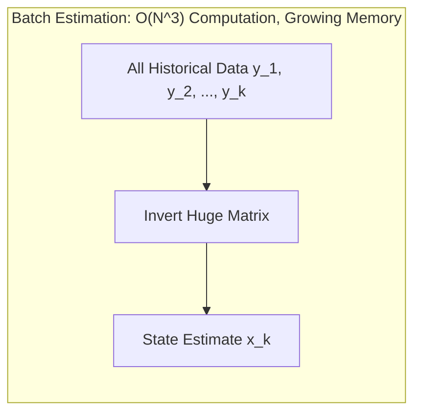
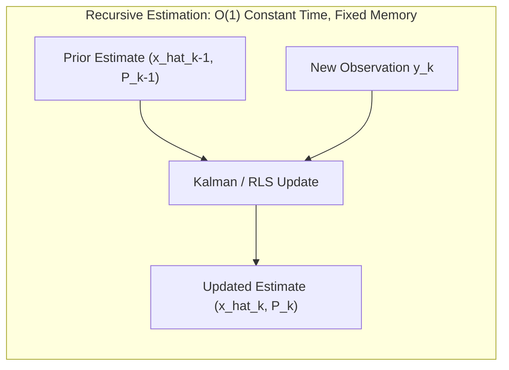

# Hour 2: Recursive Least Squares (RLS) & Dynamic State Models

> [!abstract] Key Learning Objectives
> 1. Understand the computational limitations of batch estimation in real-time embedded systems.
> 2. Derive Recursive Least Squares (RLS) using the Sherman-Morrison-Woodbury matrix inversion lemma.
> 3. Understand how prior knowledge and new measurements are weighted via the estimator gain matrix.
> 4. Formulate discrete-time state-space dynamic models ($\mathbf{F}, \mathbf{G}, \mathbf{H}, \mathbf{Q}, \mathbf{R}$) for moving vehicles.

---

## 1. The Need for Recursion: Memory and Real-Time Limits

In Hour 1, we derived the Batch Least Squares (BLS) estimator:
$$\hat{\mathbf{x}} = (\mathbf{H}^T \mathbf{R}^{-1} \mathbf{H})^{-1} \mathbf{H}^T \mathbf{R}^{-1} \mathbf{y}$$

Consider an autonomous vehicle driving for 30 minutes with an IMU streaming measurements at $100\text{ Hz}$:
* Number of samples: $N = 30 \times 60 \times 100 = 180,000$ measurements!
* At each new sample $k$, the matrix $\mathbf{H}_k$ gains another row.
* Computing $(\mathbf{H}_k^T \mathbf{R}_k^{-1} \mathbf{H}_k)^{-1}$ requires re-processing **all previous $k-1$ data points**.
* Inversion scales with cubic complexity: $O(N^3)$. Storing the history requires $O(N)$ growing RAM.



In an autonomous vehicle, a state estimate is required **every few milliseconds** to prevent crashes. We cannot wait to re-invert historical matrices. We need an algorithm that:
1. Discards raw historical data immediately after processing.
2. Maintains a compact summary of our best knowledge: **a current estimate $\hat{\mathbf{x}}_{k-1}$ and its covariance $\mathbf{P}_{k-1}$**.
3. Takes only the **single new measurement $\mathbf{y}_k$** and updates the state in $O(1)$ constant time.



---

## 2. Derivation of Recursive Least Squares (RLS)

Let us estimate a state $\mathbf{x} \in \mathbb{R}^n$. Suppose at step $k-1$ we have an estimate $\hat{\mathbf{x}}_{k-1}$ with covariance $\mathbf{P}_{k-1}$.
At time $k$, a new measurement arrives:
$$\mathbf{y}_k = \mathbf{H}_k \mathbf{x} + \mathbf{v}_k, \quad \mathbf{v}_k \sim \mathcal{N}(\mathbf{0}, \mathbf{R}_k)$$

### 2.1 The Recursive Cost Function
We form a cost function that balances our **trust in our prior estimate** against the **new measurement**:

$$J(\mathbf{x}) = \frac{1}{2} (\mathbf{x} - \hat{\mathbf{x}}_{k-1})^T \mathbf{P}_{k-1}^{-1} (\mathbf{x} - \hat{\mathbf{x}}_{k-1}) + \frac{1}{2} (\mathbf{y}_k - \mathbf{H}_k \mathbf{x})^T \mathbf{R}_k^{-1} (\mathbf{y}_k - \mathbf{H}_k \mathbf{x})$$

Taking the gradient with respect to $\mathbf{x}$:
$$\frac{\partial J}{\partial \mathbf{x}} = \mathbf{P}_{k-1}^{-1}(\mathbf{x} - \hat{\mathbf{x}}_{k-1}) - \mathbf{H}_k^T \mathbf{R}_k^{-1}(\mathbf{y}_k - \mathbf{H}_k \mathbf{x}) = \mathbf{0}$$

Rearranging terms:
$$\left( \mathbf{P}_{k-1}^{-1} + \mathbf{H}_k^T \mathbf{R}_k^{-1} \mathbf{H}_k \right) \mathbf{x} = \mathbf{P}_{k-1}^{-1} \hat{\mathbf{x}}_{k-1} + \mathbf{H}_k^T \mathbf{R}_k^{-1} \mathbf{y}_k$$

Define the **updated covariance** $\mathbf{P}_k$:
$$\mathbf{P}_k^{-1} = \mathbf{P}_{k-1}^{-1} + \mathbf{H}_k^T \mathbf{R}_k^{-1} \mathbf{H}_k$$
Notice what this means: **information (inverse covariance) is additive!** Each new measurement adds information $\mathbf{H}_k^T \mathbf{R}_k^{-1} \mathbf{H}_k$.

Multiplying both sides by $\mathbf{P}_k$:
$$\hat{\mathbf{x}}_k = \mathbf{P}_k \mathbf{P}_{k-1}^{-1} \hat{\mathbf{x}}_{k-1} + \mathbf{P}_k \mathbf{H}_k^T \mathbf{R}_k^{-1} \mathbf{y}_k$$

Notice that $\mathbf{P}_k \mathbf{P}_{k-1}^{-1} = \mathbf{P}_k (\mathbf{P}_k^{-1} - \mathbf{H}_k^T \mathbf{R}_k^{-1} \mathbf{H}_k) = \mathbf{I} - \mathbf{P}_k \mathbf{H}_k^T \mathbf{R}_k^{-1} \mathbf{H}_k$. Substituting this in:
$$\hat{\mathbf{x}}_k = (\mathbf{I} - \mathbf{P}_k \mathbf{H}_k^T \mathbf{R}_k^{-1} \mathbf{H}_k) \hat{\mathbf{x}}_{k-1} + \mathbf{P}_k \mathbf{H}_k^T \mathbf{R}_k^{-1} \mathbf{y}_k$$
$$\hat{\mathbf{x}}_k = \hat{\mathbf{x}}_{k-1} + \underbrace{\mathbf{P}_k \mathbf{H}_k^T \mathbf{R}_k^{-1}}_{\mathbf{K}_k} (\mathbf{y}_k - \mathbf{H}_k \hat{\mathbf{x}}_{k-1})$$

### 2.2 The Matrix Inversion Lemma (Sherman-Morrison-Woodbury)
Computing $\mathbf{P}_k = (\mathbf{P}_{k-1}^{-1} + \mathbf{H}_k^T \mathbf{R}_k^{-1} \mathbf{H}_k)^{-1}$ directly requires inverting an $n \times n$ matrix at every step.
Using the **Matrix Inversion Lemma**:
$$(\mathbf{A} + \mathbf{B}\mathbf{C}\mathbf{D})^{-1} = \mathbf{A}^{-1} - \mathbf{A}^{-1}\mathbf{B}(\mathbf{C}^{-1} + \mathbf{D}\mathbf{A}^{-1}\mathbf{B})^{-1}\mathbf{D}\mathbf{A}^{-1}$$
Setting $\mathbf{A} = \mathbf{P}_{k-1}^{-1}$, $\mathbf{B} = \mathbf{H}_k^T$, $\mathbf{C} = \mathbf{R}_k^{-1}$, and $\mathbf{D} = \mathbf{H}_k$:

$$\mathbf{P}_k = \mathbf{P}_{k-1} - \mathbf{P}_{k-1} \mathbf{H}_k^T (\mathbf{H}_k \mathbf{P}_{k-1} \mathbf{H}_k^T + \mathbf{R}_k)^{-1} \mathbf{H}_k \mathbf{P}_{k-1}$$

Define the **Gain Matrix** $\mathbf{K}_k$:
$$\mathbf{K}_k = \mathbf{P}_{k-1} \mathbf{H}_k^T (\mathbf{H}_k \mathbf{P}_{k-1} \mathbf{H}_k^T + \mathbf{R}_k)^{-1}$$

Substituting $\mathbf{K}_k$ into our covariance update yields the elegant formula:
$$\mathbf{P}_k = (\mathbf{I} - \mathbf{K}_k \mathbf{H}_k) \mathbf{P}_{k-1}$$

> [!important] The Three RLS Update Equations
> 1. **Compute Gain:**
>    $$\mathbf{K}_k = \mathbf{P}_{k-1} \mathbf{H}_k^T \left( \mathbf{H}_k \mathbf{P}_{k-1} \mathbf{H}_k^T + \mathbf{R}_k \right)^{-1}$$
> 2. **Update State Estimate:**
>    $$\hat{\mathbf{x}}_k = \hat{\mathbf{x}}_{k-1} + \mathbf{K}_k \underbrace{(\mathbf{y}_k - \mathbf{H}_k \hat{\mathbf{x}}_{k-1})}_{\text{Innovation } \mathbf{e}_k}$$
> 3. **Update Covariance:**
>    $$\mathbf{P}_k = (\mathbf{I} - \mathbf{K}_k \mathbf{H}_k) \mathbf{P}_{k-1}$$
> **Crucial Efficiency:** The matrix to invert $(\mathbf{H}_k \mathbf{P}_{k-1} \mathbf{H}_k^T + \mathbf{R}_k)$ is $m \times m$ (the dimension of the *measurement*). If we measure a scalar (e.g., a single GPS coordinate or range), $m=1$, which is simply dividing by a scalar!

---

## 3. The Concept of Innovation

The term:
$$\mathbf{e}_k = \mathbf{y}_k - \mathbf{H}_k \hat{\mathbf{x}}_{k-1}$$
is called the **innovation** (or residual). It represents the **new information** brought by sensor measurement $\mathbf{y}_k$ that was not already predicted by $\hat{\mathbf{x}}_{k-1}$.

* If $\mathbf{e}_k = \mathbf{0}$, the measurement matches our prediction perfectly $\implies \hat{\mathbf{x}}_k = \hat{\mathbf{x}}_{k-1}$.
* If our prior confidence is very high ($\mathbf{P}_{k-1} \to \mathbf{0}$), then $\mathbf{K}_k \to \mathbf{0}$; the filter ignores the noisy measurement.
* If our sensor is extremely accurate ($\mathbf{R}_k \to \mathbf{0}$), then $\mathbf{K}_k \to \mathbf{H}_k^{-1}$; the filter snaps directly to the measurement.

---

## 4. Transition to Dynamic Systems: The State-Space Representation

RLS works brilliantly for estimating **static constants** (like the resistance of a resistor, or a constant sensor bias).
**However, an autonomous vehicle is NOT static.** It accelerates, turns, and moves through space!

If we applied RLS directly to a moving car, $\mathbf{P}_k$ would continuously decrease toward zero with every measurement. Eventually, $\mathbf{P}_k \to \mathbf{0}$, meaning $\mathbf{K}_k \to \mathbf{0}$. The filter would become **blind to the vehicle's motion**, believing it already knows the position with zero uncertainty!

We must introduce a **Motion Model** that describes how the state evolves across time steps $k-1 \to k$.

### 4.1 Discrete-Time State-Space Formulation
In modern robotics, we model dynamic systems using discrete linear state-space equations:

$$\mathbf{x}_k = \mathbf{F}_{k-1} \mathbf{x}_{k-1} + \mathbf{G}_{k-1} \mathbf{u}_{k-1} + \mathbf{w}_{k-1}$$
$$\mathbf{y}_k = \mathbf{H}_k \mathbf{x}_k + \mathbf{v}_k$$

Where:
* $\mathbf{x}_k \in \mathbb{R}^n$ is the **state vector** at time $t_k$ (e.g., position and velocity: $[p, v]^T$).
* $\mathbf{F}_{k-1} \in \mathbb{R}^{n \times n}$ is the **State Transition Matrix** (encapsulates the physics of motion).
* $\mathbf{u}_{k-1} \in \mathbb{R}^p$ is the known **control input** (e.g., accelerator/brake pedal, steering angle).
* $\mathbf{G}_{k-1} \in \mathbb{R}^{n \times p}$ is the **Control Input Matrix**.
* $\mathbf{w}_{k-1} \sim \mathcal{N}(\mathbf{0}, \mathbf{Q}_{k-1})$ is the **Process Noise** (unmodeled forces, wind gusts, engine torque fluctuations, road bumps).
* $\mathbf{Q}_{k-1} = \operatorname{Cov}(\mathbf{w}_{k-1})$ is the **Process Noise Covariance Matrix**.
* $\mathbf{y}_k \in \mathbb{R}^m$ is the **measurement vector**.
* $\mathbf{H}_k \in \mathbb{R}^{m \times n}$ is the **Measurement Matrix**.
* $\mathbf{v}_k \sim \mathcal{N}(\mathbf{0}, \mathbf{R}_k)$ is the **Measurement Noise** with covariance $\mathbf{R}_k$.

### 4.2 Example: 1D Vehicle Motion
Let a vehicle move along a straight line with position $p_k$ and velocity $v_k$.
Using basic kinematics with time step $\Delta t$:
$$p_k = p_{k-1} + v_{k-1} \Delta t + \frac{1}{2} a_{k-1} \Delta t^2$$
$$v_k = v_{k-1} + a_{k-1} \Delta t$$

In state-space matrix form with state $\mathbf{x}_k = \begin{bmatrix} p_k \\ v_k \end{bmatrix}$ and control input $u_{k-1} = a_{k-1}$ (commanded acceleration):

$$\begin{bmatrix} p_k \\ v_k \end{bmatrix} = \underbrace{\begin{bmatrix} 1 & \Delta t \\ 0 & 1 \end{bmatrix}}_{\mathbf{F}} \begin{bmatrix} p_{k-1} \\ v_{k-1} \end{bmatrix} + \underbrace{\begin{bmatrix} \frac{\Delta t^2}{2} \\ \Delta t \end{bmatrix}}_{\mathbf{G}} u_{k-1} + \mathbf{w}_{k-1}$$

If our sensor only measures position $p_k$ (e.g., a GPS receiver):
$$\mathbf{y}_k = \underbrace{\begin{bmatrix} 1 & 0 \end{bmatrix}}_{\mathbf{H}} \begin{bmatrix} p_k \\ v_k \end{bmatrix} + v_k$$

> [!tip] Conceptual Bridge to Hour 3
> How do we combine the **recursive measurement update** of RLS with this **dynamic motion propagation**?
> That combination is precisely **The Kalman Filter**!

---

## 5. Python Walkthrough: Recursive Parameter Estimation

Here is a runnable simulation showing how RLS updates parameter estimates recursively, step-by-step:

```python
import numpy as np
import plotly.graph_objects as go
from plotly.subplots import make_subplots

# Simulate ground truth constant: True Resistance R = 5.0 Ohms
R_true = 5.0
N_samples = 20
currents = np.linspace(0.1, 1.0, N_samples)
noise_std = 0.2
voltages = R_true * currents + np.random.normal(0, noise_std, size=N_samples)

# Initialize RLS estimator
# Prior guess: R = 2.0 Ohms (deliberately wrong initial guess), High uncertainty P = 10.0
x_hat = np.array([[2.0]])
P = np.array([[10.0]])
R_meas_var = noise_std ** 2

estimates = []
covariances = []
steps = list(range(1, N_samples + 1))

for k in range(N_samples):
    H = np.array([[currents[k]]])  # y = H * x -> V = I * R
    y = voltages[k]
    
    # 1. Compute Kalman Gain K
    K = P @ H.T / (H @ P @ H.T + R_meas_var)
    
    # 2. Update state with innovation
    innovation = y - (H @ x_hat)
    x_hat = x_hat + K * innovation
    
    # 3. Update covariance
    P = (np.eye(1) - K @ H) @ P
    
    estimates.append(x_hat.item())
    covariances.append(P.item())

# Interactive Plotly Visualization
fig = make_subplots(specs=[[{"secondary_y": True}]])

# Trace 1: Parameter Estimate
fig.add_trace(
    go.Scatter(x=steps, y=estimates, mode='lines+markers', name='Recursive Estimate R_hat', line=dict(color='blue', width=2)),
    secondary_y=False
)
fig.add_trace(
    go.Scatter(x=steps, y=[R_true]*N_samples, mode='lines', name='True R = 5.0 Ω', line=dict(color='green', dash='dash')),
    secondary_y=False
)

# Trace 2: Estimation Variance
fig.add_trace(
    go.Scatter(x=steps, y=covariances, mode='lines+markers', name='Variance P_k', line=dict(color='red', dash='dot')),
    secondary_y=True
)

fig.update_xaxes(title_text="Measurement Step (k)")
fig.update_yaxes(title_text="Resistance (Ω)", secondary_y=False)
fig.update_yaxes(title_text="Estimation Variance P", secondary_y=True)
fig.update_layout(
    title="Recursive Least Squares: Convergence and Uncertainty Contraction",
    template="plotly_white",
    height=450
)
fig.show()
```

---

## 6. Self-Assessment & Checkpoint Questions

1. **Why does the variance $P_k$ always decrease or stay equal in RLS?**
   * *Answer:* Because $\mathbf{P}_k = (\mathbf{I} - \mathbf{K}_k \mathbf{H}_k) \mathbf{P}_{k-1}$. Since $\mathbf{K}_k \mathbf{H}_k \ge \mathbf{0}$, each observation extracts information from the environment and reduces state uncertainty.

2. **What role does the prior covariance $P_0$ play in RLS?**
   * *Answer:* It reflects initial confidence. If $P_0$ is large ($\to \infty$), the filter places almost zero weight on the initial guess $x_0$ and relies immediately on the first measurements. If $P_0 \to 0$, the filter stubbornly retains its initial guess regardless of sensor data.

3. **Why cannot standard RLS track an accelerating car?**
   * *Answer:* RLS assumes the state is constant ($\mathbf{x}_k = \mathbf{x}_{k-1}$). As $P_k \to 0$, the gain $K_k \to 0$, causing the filter to lock up and ignore future motion changes. To fix this, we must inject **process noise** $\mathbf{Q}$, leading directly to **Hour 3: The Linear Kalman Filter**!
