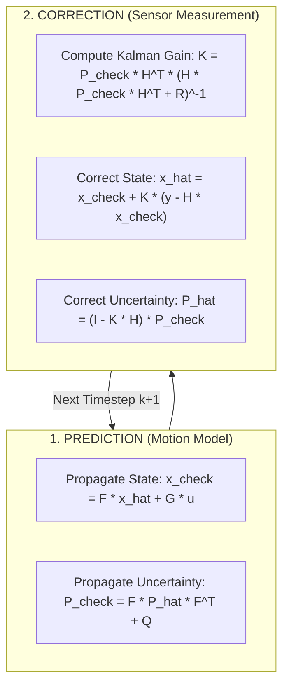

# Hour 3: The Discrete Linear Kalman Filter (LKF)

> [!abstract] Key Learning Objectives
> 1. Master the 5 fundamental equations of the Discrete Linear Kalman Filter.
> 2. Distinguish between a priori (predicted $\check{\mathbf{x}}_k$) and a posteriori (corrected $\hat{\mathbf{x}}_k$) states and covariances.
> 3. Understand the mathematical derivation of the optimal Kalman Gain $\mathbf{K}_k$ via trace minimization.
> 4. Analyze filter properties: Unbiasedness, statistical consistency, and the practical art of tuning $\mathbf{Q}$ vs. $\mathbf{R}$.

---

## 1. Introduction: The World's Most Famous Estimator

In 1960, Hungarian-American mathematician **Rudolf E. Kálmán** published his landmark paper: *"A New Approach to Linear Filtering and Prediction Problems"*. Shortly after, NASA incorporated it into the Apollo Navigation Computer, enabling Apollo 11 to land on the Moon.

Today, the Kalman Filter is the foundational algorithm powering localization, object tracking, and sensor fusion in every autonomous vehicle and modern mobile robot.



---

## 2. Notation Conventions

To keep track of time and information flow, we use standard notation:
* $\mathbf{x}_{k-1}$: True state at time $t_{k-1}$.
* $\hat{\mathbf{x}}_{k-1}$ ("Hatted"): **Corrected / a posteriori estimate** at time $t_{k-1}$ using all measurements up to time $k-1$.
* $\check{\mathbf{x}}_k$ ("Checked"): **Predicted / a priori estimate** at time $t_k$ using the motion model, **before** the new sensor measurement $\mathbf{y}_k$ is incorporated.
* $\hat{\mathbf{x}}_k$ ("Hatted"): **Corrected / a posteriori estimate** at time $t_k$, updated with sensor measurement $\mathbf{y}_k$.
* $\check{\mathbf{P}}_k$ and $\hat{\mathbf{P}}_k$: The corresponding a priori and a posteriori state error covariance matrices.

---

## 3. The 5 Core Kalman Filter Equations

### Step 1: State Prediction (Propagation)
We project our state forward in time using our mathematical understanding of vehicle kinematics and control inputs $\mathbf{u}_{k-1}$:

$$\check{\mathbf{x}}_k = \mathbf{F}_{k-1}\hat{\mathbf{x}}_{k-1} + \mathbf{G}_{k-1}\mathbf{u}_{k-1}$$

### Step 2: Covariance Prediction (Uncertainty Expansion)
Because physical models are never perfect, motion adds uncertainty. Process noise $\mathbf{Q}_{k-1}$ is added to the projected covariance:

$$\check{\mathbf{P}}_k = \mathbf{F}_{k-1}\hat{\mathbf{P}}_{k-1}\mathbf{F}_{k-1}^T + \mathbf{Q}_{k-1}$$

> [!note] Why does $\mathbf{Q}$ add to $\check{\mathbf{P}}_k$?
> If a car drives in complete darkness with no GPS or cameras, its position uncertainty $\check{\mathbf{P}}_k$ grows continuously due to wheel slippage, bumps, and wind ($\mathbf{Q}$). This equation captures that physical reality.

### Step 3: Compute the Optimal Kalman Gain
The Kalman Gain $\mathbf{K}_k \in \mathbb{R}^{n \times m}$ determines how much weight to place on the new sensor measurement versus the model prediction:

$$\mathbf{K}_k = \check{\mathbf{P}}_k \mathbf{H}_k^T \left( \mathbf{H}_k \check{\mathbf{P}}_k \mathbf{H}_k^T + \mathbf{R}_k \right)^{-1}$$

* The denominator term $\mathbf{S}_k = \mathbf{H}_k \check{\mathbf{P}}_k \mathbf{H}_k^T + \mathbf{R}_k$ is the **Innovation Covariance**.

### Step 4: State Correction (Measurement Update)
We compute the innovation (discrepancy between observation and prediction) and scale it by $\mathbf{K}_k$ to correct the state:

$$\hat{\mathbf{x}}_k = \check{\mathbf{x}}_k + \mathbf{K}_k \underbrace{(\mathbf{y}_k - \mathbf{H}_k \check{\mathbf{x}}_k)}_{\text{Innovation } \boldsymbol{\nu}_k}$$

### Step 5: Covariance Correction (Uncertainty Contraction)
The sensor observation provides new information, shrinking the state uncertainty:

$$\hat{\mathbf{P}}_k = (\mathbf{I} - \mathbf{K}_k \mathbf{H}_k)\check{\mathbf{P}}_k$$

> [!tip] The Joseph Form for Numerical Stability
> In floating-point arithmetic, round-off errors can cause $(\mathbf{I} - \mathbf{K}_k \mathbf{H}_k)\check{\mathbf{P}}_k$ to become slightly asymmetric or non-positive definite. The **Joseph form** guarantees symmetry and positive semi-definiteness:
> $$\hat{\mathbf{P}}_k = (\mathbf{I} - \mathbf{K}_k \mathbf{H}_k)\check{\mathbf{P}}_k(\mathbf{I} - \mathbf{K}_k \mathbf{H}_k)^T + \mathbf{K}_k \mathbf{R}_k \mathbf{K}_k^T$$

---

## 4. Derivation: Why is $\mathbf{K}_k$ "Optimal"?

Why is the Kalman Gain defined this way?
Let us define the a posteriori estimation error:
$$\hat{\mathbf{e}}_k = \hat{\mathbf{x}}_k - \mathbf{x}_k$$
Substitute the correction equation:
$$\hat{\mathbf{x}}_k = \check{\mathbf{x}}_k + \mathbf{K}_k(\mathbf{H}_k \mathbf{x}_k + \mathbf{v}_k - \mathbf{H}_k \check{\mathbf{x}}_k) = (\mathbf{I} - \mathbf{K}_k \mathbf{H}_k)\check{\mathbf{x}}_k + \mathbf{K}_k \mathbf{H}_k \mathbf{x}_k + \mathbf{K}_k \mathbf{v}_k$$
Subtract the true state $\mathbf{x}_k$:
$$\hat{\mathbf{e}}_k = (\mathbf{I} - \mathbf{K}_k \mathbf{H}_k)\check{\mathbf{e}}_k + \mathbf{K}_k \mathbf{v}_k$$

Now calculate the covariance $\hat{\mathbf{P}}_k = \mathbb{E}[\hat{\mathbf{e}}_k \hat{\mathbf{e}}_k^T]$. Since prediction error $\check{\mathbf{e}}_k$ and measurement noise $\mathbf{v}_k$ are uncorrelated:
$$\hat{\mathbf{P}}_k = (\mathbf{I} - \mathbf{K}_k \mathbf{H}_k)\check{\mathbf{P}}_k(\mathbf{I} - \mathbf{K}_k \mathbf{H}_k)^T + \mathbf{K}_k \mathbf{R}_k \mathbf{K}_k^T$$

To find the **optimal** $\mathbf{K}_k$ that minimizes total estimation variance, we minimize the **trace of the covariance matrix**:
$$\operatorname{Tr}(\hat{\mathbf{P}}_k) = \sum_{i=1}^n \operatorname{Var}(x_{i,k})$$

Taking matrix derivative with respect to $\mathbf{K}_k$ and equating to $\mathbf{0}$:
$$\frac{\partial \operatorname{Tr}(\hat{\mathbf{P}}_k)}{\partial \mathbf{K}_k} = -2(\check{\mathbf{P}}_k \mathbf{H}_k^T) + 2\mathbf{K}_k(\mathbf{H}_k \check{\mathbf{P}}_k \mathbf{H}_k^T + \mathbf{R}_k) = \mathbf{0}$$
$$\mathbf{K}_k(\mathbf{H}_k \check{\mathbf{P}}_k \mathbf{H}_k^T + \mathbf{R}_k) = \check{\mathbf{P}}_k \mathbf{H}_k^T$$
$$\mathbf{K}_k = \check{\mathbf{P}}_k \mathbf{H}_k^T (\mathbf{H}_k \check{\mathbf{P}}_k \mathbf{H}_k^T + \mathbf{R}_k)^{-1} \quad \blacksquare$$

---

## 5. Statistical Properties: Bias and Consistency

### 5.1 Unbiasedness
An estimator is **unbiased** if the expected value of its estimation error is zero across many trials:
$$\mathbb{E}[\hat{\mathbf{e}}_k] = \mathbb{E}[\hat{\mathbf{x}}_k - \mathbf{x}_k] = \mathbf{0}$$

From our error dynamic equation:
$$\mathbb{E}[\hat{\mathbf{e}}_k] = (\mathbf{I} - \mathbf{K}_k \mathbf{H}_k)\mathbb{E}[\check{\mathbf{e}}_k] + \mathbf{K}_k \underbrace{\mathbb{E}[\mathbf{v}_k]}_{\mathbf{0}}$$
Since $\mathbb{E}[\mathbf{w}] = \mathbf{0}$ and $\mathbb{E}[\mathbf{v}] = \mathbf{0}$, if the filter is initialized unbiased ($\mathbb{E}[\mathbf{e}_0] = \mathbf{0}$), **it remains completely unbiased for all future time $k$!**

### 5.2 Filter Consistency
A Kalman filter is called **consistent** if its computed covariance matrix $\hat{\mathbf{P}}_k$ accurately reflects the true statistical spread of estimation errors:
$$\mathbb{E}[\hat{\mathbf{e}}_k \hat{\mathbf{e}}_k^T] = \hat{\mathbf{P}}_k$$

In practice, we check this via the **$3\sigma$ (3-sigma) rule**:
For each state dimension $i$, the actual error should remain inside the bounds:
$$-3\sqrt{P_{ii, k}} \le \hat{e}_{i,k} \le +3\sqrt{P_{ii, k}} \quad (99.7\%\text{ of the time})$$

* If actual errors repeatedly exceed $3\sigma$, the filter is **overconfident** (danger: could cause a collision).
* If errors are tiny compared to $3\sigma$, the filter is **underconfident** (conservative).

---

## 6. The Engineering Art of Tuning $\mathbf{Q}$ and $\mathbf{R}$

In classroom textbooks, $\mathbf{Q}$ and $\mathbf{R}$ are given. In self-driving car engineering, **tuning $\mathbf{Q}$ and $\mathbf{R}$ is the primary job of the localization engineer**.

| Parameter | Meaning | If set TOO HIGH | If set TOO LOW |
| :--- | :--- | :--- | :--- |
| **Measurement Noise $\mathbf{R}$** | Uncertainty of sensors (GPS, Radar, etc.) | Filter ignores sensor; clings to motion model. Sluggish response. | Filter trusts sensor blindly; estimates become jittery and noisy. |
| **Process Noise $\mathbf{Q}$** | Uncertainty of motion model (unmodeled physics) | Filter assumes motion model is unreliable; gain $\mathbf{K}$ increases; noisy trajectory. | Filter assumes motion model is perfect; ignores sensor corrections; suffers from dynamic lag. |

---

## 7. Python Implementation: 1D Tracking Estimator

Let us track a car moving at $10\text{ m/s}$ with a GPS receiver that outputs position at $10\text{ Hz}$ ($\Delta t = 0.1\text{ s}$):

```python
import numpy as np
import plotly.graph_objects as go
from plotly.subplots import make_subplots

# 1. Simulation parameters
dt = 0.1
time = np.arange(0, 10, dt)
N = len(time)

true_velocity = 10.0  # m/s
true_pos = true_velocity * time

# Sensor noise: GPS position std = 1.5 m
gps_std = 1.5
measurements = true_pos + np.random.normal(0, gps_std, size=N)

# 2. Kalman Filter Matrices
# State: [position, velocity]^T
F = np.array([[1.0, dt],
              [0.0, 1.0]])

H = np.array([[1.0, 0.0]])  # Measuring position only

# Process noise (vehicle might accelerate slightly)
q_accel = 0.5  # acceleration variance
Q = np.array([[dt**4 / 4, dt**3 / 2],
              [dt**3 / 2, dt**2]]) * q_accel

R = np.array([[gps_std ** 2]])  # Measurement noise

# 3. Initialization
x_hat = np.array([[0.0], [0.0]])  # initial guess: 0 pos, 0 vel
P_hat = np.diag([10.0, 10.0])     # high initial uncertainty

pos_est = []
vel_est = []
pos_cov = []

# 4. Main Kalman Filter Loop
for k in range(N):
    # --- PREDICTION ---
    x_check = F @ x_hat
    P_check = F @ P_hat @ F.T + Q
    
    # --- CORRECTION ---
    y = np.array([[measurements[k]]])
    innovation = y - H @ x_check
    S = H @ P_check @ H.T + R
    K = P_check @ H.T @ np.linalg.inv(S)
    
    x_hat = x_check + K @ innovation
    P_hat = (np.eye(2) - K @ H) @ P_check
    
    pos_est.append(x_hat[0, 0])
    vel_est.append(x_hat[1, 0])
    pos_cov.append(P_hat[0, 0])

# 5. Interactive Plotly Visualization
fig = make_subplots(rows=2, cols=1, shared_xaxes=True, subplot_titles=("Position Tracking & ±3σ Confidence Bounds", "Velocity Estimation (Unmeasured Latent State!)"))

sigma_pos = 3 * np.sqrt(np.array(pos_cov))
pos_upper = np.array(pos_est) + sigma_pos
pos_lower = np.array(pos_est) - sigma_pos

# Subplot 1: Position
fig.add_trace(go.Scatter(x=time, y=true_pos, mode='lines', line=dict(color='black', width=2), name='True Position'), row=1, col=1)
fig.add_trace(go.Scatter(x=time, y=measurements, mode='markers', marker=dict(color='gray', size=5, opacity=0.6), name='Noisy GPS Pings'), row=1, col=1)
fig.add_trace(go.Scatter(x=time, y=pos_est, mode='lines', line=dict(color='blue', width=2), name='Kalman Estimated Position'), row=1, col=1)
fig.add_trace(go.Scatter(x=np.concatenate([time, time[::-1]]), y=np.concatenate([pos_upper, pos_lower[::-1]]), fill='toself', fillcolor='rgba(0,0,255,0.15)', line=dict(color='rgba(255,255,255,0)'), hoverinfo="skip", showlegend=True, name='±3σ Uncertainty Envelope'), row=1, col=1)

# Subplot 2: Velocity
fig.add_trace(go.Scatter(x=time, y=[true_velocity]*N, mode='lines', line=dict(color='black', dash='dash'), name='True Velocity (10 m/s)'), row=2, col=1)
fig.add_trace(go.Scatter(x=time, y=vel_est, mode='lines', line=dict(color='green', width=2), name='Kalman Estimated Velocity'), row=2, col=1)

fig.update_xaxes(title_text="Time (s)", row=2, col=1)
fig.update_yaxes(title_text="Position (m)", row=1, col=1)
fig.update_yaxes(title_text="Velocity (m/s)", row=2, col=1)
fig.update_layout(title="Linear Kalman Filter: 1D Kinematic Vehicle Tracking", template="plotly_white", height=600)
fig.show()
```

> [!important] Notice the Miracle of the Kalman Filter!
> We **never measured velocity directly** (our sensor only measured noisy position). Yet, through the dynamic model and cross-covariance terms in $\mathbf{P}$, the Kalman filter successfully **estimated the unmeasured vehicle velocity**!

---

## 8. Self-Assessment & Checkpoint Questions

1. **Why does the Kalman Gain $\mathbf{K}_k$ have $\mathbf{H}_k^T$ in its numerator?**
   * *Answer:* Because $\mathbf{H}_k$ maps from state space to measurement space ($\mathbb{R}^n \to \mathbb{R}^m$). Its transpose $\mathbf{H}_k^T$ maps back from measurement space to state space ($\mathbb{R}^m \to \mathbb{R}^n$), ensuring the innovation vector updates the state vector with correct dimensions.

2. **If a sensor fails completely and stops sending measurements, what does the Kalman filter do?**
   * *Answer:* It simply skips the Correction step! It runs only the **Prediction step**, propagating $\check{\mathbf{x}}_k = \mathbf{F}\hat{\mathbf{x}}_{k-1}$. The covariance $\check{\mathbf{P}}_k$ grows steadily with each step (+ $\mathbf{Q}$), correctly signaling to the autonomous vehicle that position uncertainty is expanding.

3. **In the Python code, why does the estimated velocity converge to $10\text{ m/s}$ even though we initialized it at $0\text{ m/s}$?**
   * *Answer:* The off-diagonal term in $\mathbf{F}$ ($p_k = p_{k-1} + v_{k-1}\Delta t$) couples velocity into position. When position innovations persist in one direction, the Kalman gain distributes corrections into both position and velocity state estimates.
