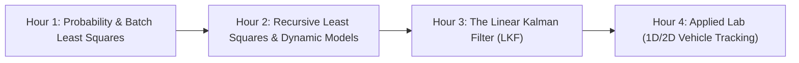

# Day 1: Foundations of State Estimation & The Linear Kalman Filter

Welcome to **Day 1** of State Estimation and Localization for Self-Driving Cars!

The goal of today is to bridge the gap between static curve fitting (deterministic Least Squares) and real-time probabilistic tracking (The Discrete Linear Kalman Filter). By the end of today, you will not only understand the mathematics behind Kalman Filtering, but you will have built a 1D/2D tracking estimator from scratch in Python.

---

## 🧭 Day 1 Roadmap

---

## 📂 Module Index

1. **[[Hour_01_Probability_and_Batch_Least_Squares/README|Hour 1: Probability, Random Variables & Batch Least Squares]]**
   * Why autonomous vehicles need state estimation.
   * Multivariate Gaussian distributions, mean vectors, and covariance matrices.
   * Batch Least Squares (BLS) formulation and the Best Linear Unbiased Estimator (BLUE).

2. **[[Hour_02_Recursive_Least_Squares_and_Dynamic_Systems/README|Hour 2: Recursive Least Squares (RLS) & Dynamic State Models]]**
   * Real-time computational constraints and memory limits ($O(N^3)$ vs $O(1)$).
   * Derivation of Recursive Least Squares: Information updates and correction steps.
   * Transitioning from static parameter estimation to dynamic state-space models.

3. **[[Hour_03_The_Linear_Kalman_Filter/README|Hour 3: The Discrete Linear Kalman Filter (LKF)]]**
   * Discrete state-space motion and measurement equations.
   * Step-by-step derivation: Prediction, Optimal Kalman Gain, and Measurement Correction.
   * Filter properties: Bias, consistency ($E[e_k e_k^T] = P_k$), and tuning $Q$ vs. $R$.

4. **[[Hour_04_Lab_1D_and_2D_Linear_Tracking/README|Hour 4: Applied Programming Lab (1D & 2D Vehicle Tracking)]]**
   * Hands-on Python implementation of a 2D Linear Kalman Filter.
   * Tracking position and velocity under a Constant Velocity (CV) model.
   * Visualizing true trajectory, noisy measurements, filter estimates, and $\pm 3\sigma$ bounds.

---

## 🎯 Day 1 Learning Outcomes

By the end of this session, you should be able to:
- [ ] Explain why deterministic estimation fails in noisy physical environments.
- [ ] Manipulate multivariate Gaussian distributions (mean, covariance, linear transforms).
- [ ] Derive the normal equations for Weighted Least Squares.
- [ ] Formulate discrete-time state-space models ($\mathbf{F}, \mathbf{G}, \mathbf{H}$).
- [ ] State and apply the 5 core equations of the Linear Kalman Filter.
- [ ] Code a functional 2D Kalman filter in Python using NumPy.
