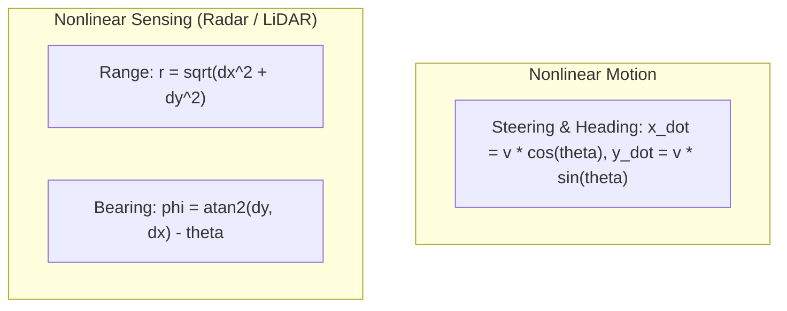

# Hour 1: Nonlinear Kinematics & Jacobian Linearization

> [!abstract] Key Learning Objectives
> 1. Understand why linear Kalman filters fail when applied to non-linear physical systems.
> 2. Visualize what happens when a Gaussian probability distribution passes through a nonlinear function.
> 3. Master the first-order multivariate Taylor series expansion.
> 4. Derive analytical Jacobian matrices for 2D unicycle motion and polar range-bearing sensors.
> 5. Validate analytical Jacobians in Python using numerical finite differences.

---

## 1. The Nonlinear Reality of Robotics

In Day 1, we made two comforting mathematical assumptions:
1. **Linear Motion:** The next state is a linear matrix multiplication of the past state: $\mathbf{x}_k = \mathbf{F}\mathbf{x}_{k-1}$.
2. **Linear Measurements:** Sensors measure state elements linearly: $\mathbf{y}_k = \mathbf{H}\mathbf{x}_k$.

**In autonomous vehicles, both assumptions are almost always false!**



* **Non-holonomic vehicle kinematics:** A car cannot move sideways directly. Its position changes depend trigonometrically on its heading angle $\theta$:
  $$\dot{x} = v \cos\theta, \quad \dot{y} = v \sin\theta$$
* **Radar and LiDAR sensors:** Physical sensors do not output Cartesian $[x, y]^T$. They emit electromagnetic or laser pulses and measure:
  1. Time of Flight $\to$ **Range** $r = \sqrt{x^2 + y^2}$
  2. Rotating Mirror Angle $\to$ **Azimuth / Bearing** $\phi = \operatorname{atan2}(y, x)$

Because square roots, sines, cosines, and arc-tangents are **nonlinear functions**, we cannot write $\mathbf{y} = \mathbf{H}\mathbf{x}$ or $\mathbf{x}_k = \mathbf{F}\mathbf{x}_{k-1}$.

---

## 2. What Happens to a Gaussian Passing Through a Nonlinear Function?

Recall the Gaussian linear property from Day 1: if $\mathbf{x}$ is Gaussian and $\mathbf{y} = \mathbf{A}\mathbf{x} + \mathbf{b}$, then $\mathbf{y}$ is strictly Gaussian.

**What happens if $\mathbf{y} = g(\mathbf{x})$, where $g(\cdot)$ is nonlinear?**

Let $x \sim \mathcal{N}(0, 1)$ and let $y = x^2$.
* The support of $x$ is $(-\infty, +\infty)$ with mean $0$.
* The support of $y = x^2$ is $[0, +\infty)$. **A Gaussian cannot have support restricted to positive numbers!**
* The output distribution is a Chi-square ($\chi_1^2$) distribution, which is heavily skewed with a long right tail.

```
Input Gaussian PDF p(x)           Nonlinear Function y = g(x)        Output Non-Gaussian PDF p(y)
         ^                                    ^                                    ^
       /   \                                 /                                   / |
      /  |  \           ========>           /           ========>               /  |
    /    |    \                            /                                   /   |   (Heavily Skewed!)
  -------+-------> x                      +-------> x                         -----+---------> y
        \mu                                                                        E[y]
```

When a Gaussian distribution passes through a nonlinear function:
1. The output distribution is **no longer Gaussian**.
2. The true mean of the output is **not** equal to the function evaluated at the input mean:
   $$\mathbb{E}[g(\mathbf{x})] \neq g(\mathbb{E}[\mathbf{x}])$$
3. The resulting distribution cannot be completely described by just a mean $\boldsymbol{\mu}$ and covariance $\mathbf{\Sigma}$.

---

## 3. The Solution: Taylor Series & The Jacobian Matrix

To keep using the efficient Kalman filter equations, we must approximate the nonlinear function with a **linear tangent plane** around our current best estimate.

### 3.1 Multivariate Taylor Series
Let $\mathbf{f}: \mathbb{R}^n \to \mathbb{R}^m$ be a smooth vector-valued function. We expand $\mathbf{f}(\mathbf{x})$ around an operating point $\mathbf{x}_0$ using a Taylor series:

$$\mathbf{f}(\mathbf{x}) = \mathbf{f}(\mathbf{x}_0) + \left.\frac{\partial \mathbf{f}}{\partial \mathbf{x}}\right|_{\mathbf{x}_0} (\mathbf{x} - \mathbf{x}_0) + \frac{1}{2!} \sum_{i=1}^m \mathbf{e}_i (\mathbf{x} - \mathbf{x}_0)^T \left.\frac{\partial^2 f_i}{\partial \mathbf{x}^2}\right|_{\mathbf{x}_0} (\mathbf{x} - \mathbf{x}_0) + \dots$$

In the **Extended Kalman Filter (EKF)**, we truncate the series after the **first-order linear term**:
$$\mathbf{f}(\mathbf{x}) \approx \mathbf{f}(\mathbf{x}_0) + \mathbf{J}_{\mathbf{f}}(\mathbf{x}_0) (\mathbf{x} - \mathbf{x}_0)$$

### 3.2 Definition of the Jacobian Matrix
The matrix of all first-order partial derivatives is the **Jacobian Matrix**:

$$\mathbf{J} = \frac{\partial \mathbf{f}}{\partial \mathbf{x}} = \begin{bmatrix} \frac{\partial f_1}{\partial x_1} & \frac{\partial f_1}{\partial x_2} & \dots & \frac{\partial f_1}{\partial x_n} \\ \frac{\partial f_2}{\partial x_1} & \frac{\partial f_2}{\partial x_2} & \dots & \frac{\partial f_2}{\partial x_n} \\ \vdots & \vdots & \ddots & \vdots \\ \frac{\partial f_m}{\partial x_1} & \frac{\partial f_m}{\partial x_2} & \dots & \frac{\partial f_m}{\partial x_n} \end{bmatrix} \in \mathbb{R}^{m \times n}$$

* Row $i$ corresponds to function component $f_i$.
* Column $j$ corresponds to state variable $x_j$.
* Intuitively, element $J_{ij} = \frac{\partial f_i}{\partial x_j}$ tells us: *"If state variable $x_j$ nudges by a tiny $\epsilon$, by how much does output $f_i$ change?"*

---

## 4. Derivation 1: 2D Vehicle Motion Jacobian

Let a self-driving car have state $\mathbf{x} = [x, y, \theta]^T$, driven by linear velocity $v$ and angular velocity $\omega$ with sampling period $\Delta t$:

$$\mathbf{x}_k = \mathbf{f}(\mathbf{x}_{k-1}, \mathbf{u}_{k-1}) = \begin{bmatrix} x_{k-1} + v_{k-1} \Delta t \cos\theta_{k-1} \\ y_{k-1} + v_{k-1} \Delta t \sin\theta_{k-1} \\ \theta_{k-1} + \omega_{k-1} \Delta t \end{bmatrix}$$

We want to find the **State Transition Jacobian** $\mathbf{F}_{k-1} = \left.\frac{\partial \mathbf{f}}{\partial \mathbf{x}}\right|_{\hat{\mathbf{x}}_{k-1}}$:

$$\mathbf{F}_{k-1} = \begin{bmatrix} \frac{\partial f_1}{\partial x} & \frac{\partial f_1}{\partial y} & \frac{\partial f_1}{\partial \theta} \\ \frac{\partial f_2}{\partial x} & \frac{\partial f_2}{\partial y} & \frac{\partial f_2}{\partial \theta} \\ \frac{\partial f_3}{\partial x} & \frac{\partial f_3}{\partial y} & \frac{\partial f_3}{\partial \theta} \end{bmatrix}$$

Computing each entry:
* Row 1 ($f_1 = x + v \Delta t \cos\theta$):
  $$\frac{\partial f_1}{\partial x} = 1, \quad \frac{\partial f_1}{\partial y} = 0, \quad \frac{\partial f_1}{\partial \theta} = -v \Delta t \sin\theta$$
* Row 2 ($f_2 = y + v \Delta t \sin\theta$):
  $$\frac{\partial f_2}{\partial x} = 0, \quad \frac{\partial f_2}{\partial y} = 1, \quad \frac{\partial f_2}{\partial \theta} = v \Delta t \cos\theta$$
* Row 3 ($f_3 = \theta + \omega \Delta t$):
  $$\frac{\partial f_3}{\partial x} = 0, \quad \frac{\partial f_3}{\partial y} = 0, \quad \frac{\partial f_3}{\partial \theta} = 1$$

Putting it together:
$$\mathbf{F}_{k-1} = \begin{bmatrix} 1 & 0 & -v_{k-1}\Delta t \sin\theta_{k-1} \\ 0 & 1 & v_{k-1}\Delta t \cos\theta_{k-1} \\ 0 & 0 & 1 \end{bmatrix}$$

---

## 5. Derivation 2: Range & Bearing Measurement Jacobian

Consider a landmark at known global coordinates $(x_l, y_l)$. The vehicle at pose $\mathbf{x} = [x, y, \theta]^T$ observes the landmark via radar:
$$\Delta x = x_l - x, \quad \Delta y = y_l - y$$
$$\mathbf{h}(\mathbf{x}) = \begin{bmatrix} r \\ \phi \end{bmatrix} = \begin{bmatrix} \sqrt{\Delta x^2 + \Delta y^2} \\ \operatorname{atan2}(\Delta y, \Delta x) - \theta \end{bmatrix}$$

We want the **Measurement Jacobian** $\mathbf{H}_k = \left.\frac{\partial \mathbf{h}}{\partial \mathbf{x}}\right|_{\check{\mathbf{x}}_k} \in \mathbb{R}^{2 \times 3}$:
$$\mathbf{H}_k = \begin{bmatrix} \frac{\partial r}{\partial x} & \frac{\partial r}{\partial y} & \frac{\partial r}{\partial \theta} \\ \frac{\partial \phi}{\partial x} & \frac{\partial \phi}{\partial y} & \frac{\partial \phi}{\partial \theta} \end{bmatrix}$$

### Partial Derivatives for Range $r = (\Delta x^2 + \Delta y^2)^{1/2}$:
Using the chain rule, noting $\frac{\partial \Delta x}{\partial x} = -1$:
$$\frac{\partial r}{\partial x} = \frac{1}{2}(\Delta x^2 + \Delta y^2)^{-1/2} \cdot 2\Delta x \cdot (-1) = -\frac{\Delta x}{r}$$
$$\frac{\partial r}{\partial y} = \frac{1}{2}(\Delta x^2 + \Delta y^2)^{-1/2} \cdot 2\Delta y \cdot (-1) = -\frac{\Delta y}{r}$$
$$\frac{\partial r}{\partial \theta} = 0$$

### Partial Derivatives for Bearing $\phi = \operatorname{atan2}(\Delta y, \Delta x) - \theta$:
Recall that $\frac{d}{du} \operatorname{atan2}(y, u) = -\frac{y}{u^2 + y^2}$ and $\frac{d}{dv} \operatorname{atan2}(v, x) = \frac{x}{x^2 + v^2}$:
$$\frac{\partial \phi}{\partial x} = \left( -\frac{\Delta y}{\Delta x^2 + \Delta y^2} \right) \cdot \frac{\partial \Delta x}{\partial x} = \left( -\frac{\Delta y}{r^2} \right) \cdot (-1) = \frac{\Delta y}{r^2}$$
$$\frac{\partial \phi}{\partial y} = \left( \frac{\Delta x}{\Delta x^2 + \Delta y^2} \right) \cdot \frac{\partial \Delta y}{\partial y} = \left( \frac{\Delta x}{r^2} \right) \cdot (-1) = -\frac{\Delta x}{r^2}$$
$$\frac{\partial \phi}{\partial \theta} = -1$$

### The Final Measurement Jacobian Matrix:
$$\mathbf{H}_k = \begin{bmatrix} -\frac{\Delta x}{r} & -\frac{\Delta y}{r} & 0 \\ \frac{\Delta y}{r^2} & -\frac{\Delta x}{r^2} & -1 \end{bmatrix}$$

> [!tip] Verification Trick: Dimension Check
> Notice that range derivatives have units $\frac{\text{meters}}{\text{meters}} = \text{dimensionless}$, while bearing derivatives have units $\frac{\text{radians}}{\text{meter}} = \frac{1}{\text{meter}}$ because of the $r^2$ in the denominator!

---

## 6. Python Walkthrough: Validating Analytical Jacobians via Finite Differences

In production robotics, **every analytical Jacobian should be tested against numerical differentiation** to guarantee no missing negative signs!

```python
import numpy as np

def measurement_model(x_state, landmark):
    """
    Nonlinear measurement function h(x)
    x_state = [x, y, theta]
    landmark = [x_l, y_l]
    """
    x, y, theta = x_state[0], x_state[1], x_state[2]
    dx = landmark[0] - x
    dy = landmark[1] - y
    
    r = np.sqrt(dx**2 + dy**2)
    phi = np.arctan2(dy, dx) - theta
    return np.array([r, phi])

def analytical_jacobian(x_state, landmark):
    """
    Analytically derived Jacobian H
    """
    x, y, theta = x_state[0], x_state[1], x_state[2]
    dx = landmark[0] - x
    dy = landmark[1] - y
    r = np.sqrt(dx**2 + dy**2)
    
    H = np.zeros((2, 3))
    # Row 1: dr/dx, dr/dy, dr/dtheta
    H[0, 0] = -dx / r
    H[0, 1] = -dy / r
    H[0, 2] = 0.0
    
    # Row 2: dphi/dx, dphi/dy, dphi/dtheta
    H[1, 0] = dy / (r ** 2)
    H[1, 1] = -dx / (r ** 2)
    H[1, 2] = -1.0
    return H

def numerical_jacobian(func, x_state, landmark, eps=1e-6):
    """
    Numerical approximation using central finite differences:
    d f / d x_i approx (f(x + eps) - f(x - eps)) / (2 * eps)
    """
    n = len(x_state)
    m = len(func(x_state, landmark))
    J_num = np.zeros((m, n))
    
    for i in range(n):
        x_plus = np.copy(x_state)
        x_minus = np.copy(x_state)
        x_plus[i] += eps
        x_minus[i] -= eps
        
        diff = (func(x_plus, landmark) - func(x_minus, landmark)) / (2.0 * eps)
        J_num[:, i] = diff
        
    return J_num

# Test at an arbitrary vehicle pose and landmark
x_test = np.array([5.0, 3.0, 0.4])  # x=5m, y=3m, theta=0.4 rad
l_test = np.array([12.0, 15.0])     # landmark at (12, 15)

H_analytical = analytical_jacobian(x_test, l_test)
H_numerical = numerical_jacobian(measurement_model, x_test, l_test)

print("--- Analytical Jacobian H ---")
print(np.round(H_analytical, 6))
print("\n--- Numerical Jacobian H ---")
print(np.round(H_numerical, 6))

# Check difference
error = np.max(np.abs(H_analytical - H_numerical))
print(f"\nMaximum Absolute Error: {error:.2e}")
assert error < 1e-5, "Jacobian derivation mismatch!"
print("✅ Analytical derivation successfully verified!")
```

---

## 7. Self-Assessment & Checkpoint Questions

1. **Why does the EKF choose the most recent state estimate ($\hat{\mathbf{x}}_{k-1}$ or $\check{\mathbf{x}}_k$) as the Taylor series operating point $\mathbf{x}_0$?**
   * *Answer:* Taylor series accuracy depends heavily on $\|\mathbf{x} - \mathbf{x}_0\|$ being as small as possible. The current best estimate $\hat{\mathbf{x}}$ is our point of highest probability density, minimizing the expected linearization error.

2. **If a radar landmark is extremely close to the vehicle ($r \to 0$), what happens to the measurement Jacobian?**
   * *Answer:* The terms $\frac{\Delta y}{r^2}$ and $-\frac{\Delta x}{r^2}$ diverge toward infinity ($\infty$). In practice, nearby landmarks can cause numerical instability in the EKF if not thresholded or filtered out.

3. **What is the difference between the Jacobian with respect to the state ($\mathbf{F}$) and the Jacobian with respect to noise ($\mathbf{L}$)?**
   * *Answer:* $\mathbf{F} = \frac{\partial \mathbf{f}}{\partial \mathbf{x}}$ describes how errors in our state estimate propagate forward in time. $\mathbf{L} = \frac{\partial \mathbf{f}}{\partial \mathbf{w}}$ describes how physical noise disturbances (like motor torque jitter or road bumps) enter the state equations.
