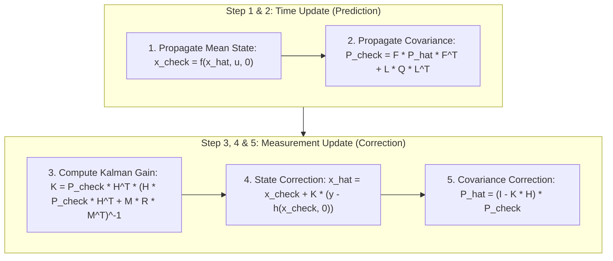

# Hour 2: The Extended Kalman Filter (EKF) Framework

> [!abstract] Key Learning Objectives
> 1. Master the complete architecture and algorithmic loop of the Extended Kalman Filter (EKF).
> 2. Understand the fundamental duality of the EKF: **Nonlinear state evaluation** vs. **Linearized uncertainty propagation**.
> 3. Implement the full 5-step EKF algorithm with non-additive process and measurement noise.
> 4. Analyze EKF failure modes: Linearization error accumulation, covariance divergence, and contrast with the Unscented Kalman Filter (UKF).

---

## 1. The Core Philosophy of the Extended Kalman Filter

In Hour 1, we learned that non-linear functions warp Gaussians into non-Gaussian shapes. The **Extended Kalman Filter (EKF)** resolves this dilemma with an ingenious compromise:

> [!important] The EKF Compromise
> 1. **States are propagated through the EXACT NONLINEAR functions:** We evaluate $\mathbf{f}(\mathbf{x})$ and $\mathbf{h}(\mathbf{x})$ directly without linearizing the states themselves. This preserves full kinematic accuracy.
> 2. **Covariances are propagated using LINEARIZED JACOBIANS:** Because we cannot propagate an entire covariance matrix through an arbitrary curve, we use the local tangent plane (Jacobians $\mathbf{F}$ and $\mathbf{H}$) to transform the uncertainty ellipsoids.

```
       Exact State Propagation                     Uncertainty Propagation
    (Using full nonlinear physics)                 (Using local Jacobians)
                 f(x)                                        F * P * F^T
x_hat_{k-1} --------------> x_check_k         P_hat_{k-1} ==================> P_check_k
```

---

## 2. General Nonlinear System Formulation

We model the autonomous vehicle's state-space system as:

$$\mathbf{x}_k = \mathbf{f}_{k-1}(\mathbf{x}_{k-1}, \mathbf{u}_{k-1}, \mathbf{w}_{k-1})$$
$$\mathbf{y}_k = \mathbf{h}_k(\mathbf{x}_k, \mathbf{v}_k)$$

Where:
* $\mathbf{f}_{k-1}(\cdot)$ is the nonlinear motion model.
* $\mathbf{h}_k(\cdot)$ is the nonlinear observation model.
* $\mathbf{w}_{k-1} \sim \mathcal{N}(\mathbf{0}, \mathbf{Q}_{k-1})$ is process noise.
* $\mathbf{v}_k \sim \mathcal{N}(\mathbf{0}, \mathbf{R}_k)$ is measurement noise.

### The Four System Jacobians
At each time step $k$, we evaluate four Jacobians around our latest estimates with zero assumed noise ($\mathbf{w} = \mathbf{0}, \mathbf{v} = \mathbf{0}$):

1. **State Transition Jacobian:**
   $$\mathbf{F}_{k-1} = \left.\frac{\partial \mathbf{f}_{k-1}}{\partial \mathbf{x}_{k-1}}\right|_{\hat{\mathbf{x}}_{k-1}, \mathbf{u}_{k-1}, \mathbf{0}}$$
2. **Process Noise Jacobian:**
   $$\mathbf{L}_{k-1} = \left.\frac{\partial \mathbf{f}_{k-1}}{\partial \mathbf{w}_{k-1}}\right|_{\hat{\mathbf{x}}_{k-1}, \mathbf{u}_{k-1}, \mathbf{0}}$$
3. **Measurement Jacobian:**
   $$\mathbf{H}_k = \left.\frac{\partial \mathbf{h}_k}{\partial \mathbf{x}_k}\right|_{\check{\mathbf{x}}_k, \mathbf{0}}$$
4. **Measurement Noise Jacobian:**
   $$\mathbf{M}_k = \left.\frac{\partial \mathbf{h}_k}{\partial \mathbf{v}_k}\right|_{\check{\mathbf{x}}_k, \mathbf{0}}$$

*(Note: If measurement noise is purely additive, i.e., $\mathbf{y}_k = \mathbf{h}(\mathbf{x}_k) + \mathbf{v}_k$, then $\mathbf{M}_k = \mathbf{I}$.)*

---

## 3. The 5 Equations of the Extended Kalman Filter



### 1. State Prediction (Nonlinear Integration)
Evaluate the nonlinear motion model using the previous best estimate $\hat{\mathbf{x}}_{k-1}$ and known control $\mathbf{u}_{k-1}$:
$$\check{\mathbf{x}}_k = \mathbf{f}_{k-1}(\hat{\mathbf{x}}_{k-1}, \mathbf{u}_{k-1}, \mathbf{0})$$

### 2. Covariance Prediction (Linearized Projection)
Linearly transform the error covariance using the motion Jacobians $\mathbf{F}_{k-1}$ and $\mathbf{L}_{k-1}$:
$$\check{\mathbf{P}}_k = \mathbf{F}_{k-1}\hat{\mathbf{P}}_{k-1}\mathbf{F}_{k-1}^T + \mathbf{L}_{k-1}\mathbf{Q}_{k-1}\mathbf{L}_{k-1}^T$$

### 3. Compute the Kalman Gain
Compute the optimal weighting matrix using measurement Jacobian $\mathbf{H}_k$:
$$\mathbf{K}_k = \check{\mathbf{P}}_k \mathbf{H}_k^T \left( \mathbf{H}_k \check{\mathbf{P}}_k \mathbf{H}_k^T + \mathbf{M}_k \mathbf{R}_k \mathbf{M}_k^T \right)^{-1}$$

### 4. State Correction (Nonlinear Innovation)
Compute the innovation using the **exact nonlinear observation function** $\mathbf{h}_k(\check{\mathbf{x}}_k, \mathbf{0})$:
$$\hat{\mathbf{x}}_k = \check{\mathbf{x}}_k + \mathbf{K}_k \underbrace{(\mathbf{y}_k - \mathbf{h}_k(\check{\mathbf{x}}_k, \mathbf{0}))}_{\text{Innovation } \boldsymbol{\nu}_k}$$

### 5. Covariance Correction
Shrink the uncertainty covariance matrix:
$$\hat{\mathbf{P}}_k = (\mathbf{I} - \mathbf{K}_k \mathbf{H}_k)\check{\mathbf{P}}_k$$

---

## 4. Comparison: Linear KF vs. Extended KF vs. Unscented KF

| Property | Linear Kalman Filter (LKF) | Extended Kalman Filter (EKF) | Unscented Kalman Filter (UKF) |
| :--- | :--- | :--- | :--- |
| **System Dynamics** | Strictly Linear ($\mathbf{F}\mathbf{x}$) | Smoothly Nonlinear ($\mathbf{f}(\mathbf{x})$) | Highly Nonlinear ($\mathbf{f}(\mathbf{x})$) |
| **State Mean Propagation** | $\mathbf{F}\hat{\mathbf{x}}$ | Exact Nonlinear: $\mathbf{f}(\hat{\mathbf{x}})$ | Deterministic Sigma Points transformed through $\mathbf{f}(\cdot)$ |
| **Covariance Propagation** | Exact: $\mathbf{F}\mathbf{P}\mathbf{F}^T + \mathbf{Q}$ | 1st-Order Taylor Series: $\mathbf{F}\mathbf{P}\mathbf{F}^T$ | 2nd-Order Accurate: Weighted recombination of sigma points |
| **Jacobian Derivation** | Not required | **Required** (Analytical $\frac{\partial \mathbf{f}}{\partial \mathbf{x}}$) | **Not required** (Derivative-free) |
| **Computational Cost** | Very Fast ($O(n^3)$) | Fast ($O(n^3) +$ Jacobian evals) | Slightly slower ($2n+1$ function evals) |
| **Primary Risk** | Inapplicable to nonlinear models | Linearization divergence / human derivative errors | Higher computation in very high dimensions |

---

## 5. Pitfalls and Limitations of the EKF

While the EKF is the workhorse of robotics, it has specific failure modes every engineer must know:

### 5.1 Linearization Error Accumulation
The first-order Taylor approximation assumes the function is locally a flat plane:
$$f(x) \approx f(x_0) + f'(x_0)(x - x_0)$$
If the true function has significant curvature ($f''(x) \gg 0$) and the uncertainty $\mathbf{P}$ is wide, the true distribution deviates substantially from the tangent plane.

### 5.2 False Overconfidence
Linearization can cause the estimated covariance $\hat{\mathbf{P}}_k$ to contract **faster than reality warrants**. The filter begins to believe its estimate is accurate (small $\hat{\mathbf{P}}_k$), which drives the Kalman gain $\mathbf{K}_k \to \mathbf{0}$. Once $\mathbf{K} \to \mathbf{0}$, the filter **ignores incoming sensor measurements**, drifting blindly away from reality.

> [!warning] The Danger of Overconfidence
> A localization filter that knows it is lost can trigger emergency braking. An overconfident filter that *believes* it is in the lane center while drifting toward oncoming traffic will cause a catastrophic accident.

---

## 6. Python Implementation Walkthrough

Let us implement a complete step of the EKF for tracking a vehicle with range and bearing measurements:

```python
import numpy as np

# 1. Timestep and Control Inputs
dt = 0.5
v_cmd = 10.0   # 10 m/s linear velocity
w_cmd = 0.05   # 0.05 rad/s angular turn rate

# 2. Previous Corrected State and Covariance: [x, y, theta]^T
x_hat_prev = np.array([[2.0], [5.0], [0.1]])
P_hat_prev = np.diag([0.5, 0.5, 0.05])

# Process and Measurement Noise Covariances
Q = np.diag([0.1, 0.1, 0.01])       # Motion noise
R = np.diag([0.2**2, np.deg2rad(1)**2]) # Range std = 0.2m, Bearing std = 1 deg

# Landmark Location in Global Frame
landmark = np.array([20.0, 30.0])

# ==========================================
# STEP 1: PREDICTION (State & Covariance)
# ==========================================
theta_prev = x_hat_prev[2, 0]

# 1a. Propagate state nonlinearly
x_check = np.zeros((3, 1))
x_check[0, 0] = x_hat_prev[0, 0] + v_cmd * dt * np.cos(theta_prev)
x_check[1, 0] = x_hat_prev[1, 0] + v_cmd * dt * np.sin(theta_prev)
x_check[2, 0] = x_hat_prev[2, 0] + w_cmd * dt

# 1b. Compute Motion Jacobian F
F = np.array([
    [1.0, 0.0, -v_cmd * dt * np.sin(theta_prev)],
    [0.0, 1.0,  v_cmd * dt * np.cos(theta_prev)],
    [0.0, 0.0,  1.0]
])

# 1c. Propagate Covariance
P_check = F @ P_hat_prev @ F.T + Q

print("--- Step 1: Predicted State ---")
print(np.round(x_check, 4))
print("--- Predicted Covariance Diagonal ---")
print(np.round(np.diag(P_check), 4))

# ==========================================
# STEP 2: CORRECTION (Sensor Measurement)
# ==========================================
# Simulate incoming sensor measurement: [range=28.2m, bearing=0.82 rad]
y_meas = np.array([[28.2], [0.82]])

# 2a. Expected Measurement via Nonlinear Model h(x_check)
dx = landmark[0] - x_check[0, 0]
dy = landmark[1] - x_check[1, 0]
r_exp = np.sqrt(dx**2 + dy**2)
phi_exp = np.arctan2(dy, dx) - x_check[2, 0]
h_check = np.array([[r_exp], [phi_exp]])

# 2b. Compute Measurement Jacobian H
H = np.zeros((2, 3))
H[0, 0] = -dx / r_exp
H[0, 1] = -dy / r_exp
H[0, 2] = 0.0

H[1, 0] = dy / (r_exp ** 2)
H[1, 1] = -dx / (r_exp ** 2)
H[1, 2] = -1.0

# 2c. Kalman Gain
S = H @ P_check @ H.T + R
K = P_check @ H.T @ np.linalg.inv(S)

# 2d. Innovation with Angle Normalization
innovation = y_meas - h_check
# Normalize bearing innovation to [-pi, pi]
innovation[1, 0] = (innovation[1, 0] + np.pi) % (2 * np.pi) - np.pi

# 2e. State & Covariance Correction
x_hat_new = x_check + K @ innovation
P_hat_new = (np.eye(3) - K @ H) @ P_check

print("\n--- Step 2: Corrected State ---")
print(np.round(x_hat_new, 4))
print("--- Corrected Covariance Diagonal ---")
print(np.round(np.diag(P_hat_new), 4))
print("Uncertainty shrank successfully!")
```

---

## 7. Self-Assessment & Checkpoint Questions

1. **Why do we evaluate $\mathbf{h}(\check{\mathbf{x}}_k)$ rather than $\mathbf{H}_k \check{\mathbf{x}}_k$ when computing innovation?**
   * *Answer:* $\mathbf{h}(\check{\mathbf{x}}_k)$ is the true physical prediction of what the sensor should observe. Using $\mathbf{H}_k \check{\mathbf{x}}_k$ would introduce unnecessary first-order truncation error into our measurement residuals.

2. **What would happen if we did not normalize the bearing innovation to $[-\pi, \pi]$?**
   * *Answer:* If the true bearing is $+3.14\text{ rad}$ and the estimated bearing is $-3.14\text{ rad}$, they represent almost the exact same physical direction. But their algebraic difference is $+6.28\text{ rad}$ ($360^\circ$). Multiplying this huge false residual by $\mathbf{K}$ causes the filter state to violently jump and permanently diverge!

3. **Under what conditions is the EKF guaranteed to be an optimal estimator?**
   * *Answer:* **Never.** Unlike the Linear Kalman Filter (which is mathematically proven to be BLUE), the EKF is an *approximation* with no general guarantee of optimality or even asymptotic convergence. However, when properly tuned and linearized around accurate states, it works remarkably well in practice.
