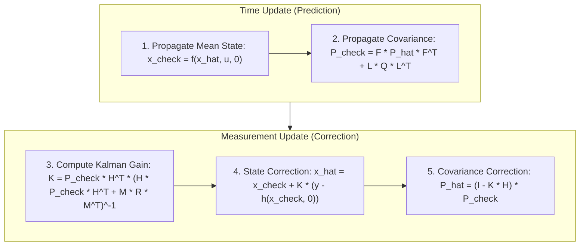

# Hour 2: The Extended Kalman Filter (EKF) Framework & The Unscented Kalman Filter

> [!abstract] Key Learning Objectives
> 1. Master the complete architecture and algorithmic loop of the Extended Kalman Filter (EKF).
> 2. Derive and compute the four fundamental EKF Jacobians: $\mathbf{F}_{k-1}, \mathbf{L}_{k-1}, \mathbf{H}_k, \mathbf{M}_k$.
> 3. Explore three concrete formulation examples: Optical Landmark Bearing, 2D Radar Target Tracking, and Unicycle Kinematics with non-additive noise.
> 4. Master the **Unscented Kalman Filter (UKF)**: The Unscented Transform, Sigma Points generation, and higher-order moment propagation with **zero Jacobians**.
> 5. Compare EKF vs. UKF in Python using the `position_class` library.

---

## 1. General Nonlinear System Formulation & The 4 Jacobians

We model the autonomous vehicle's state-space system as:

$$\begin{aligned}
\mathbf{x}_k &= \mathbf{f}_{k-1}(\mathbf{x}_{k-1}, \mathbf{u}_{k-1}, \mathbf{w}_{k-1}), \quad &\mathbf{w}_{k-1} \sim \mathcal{N}(\mathbf{0}, \mathbf{Q}_{k-1}) \\
\mathbf{y}_k &= \mathbf{h}_k(\mathbf{x}_k, \mathbf{v}_k), \quad &\mathbf{v}_k \sim \mathcal{N}(\mathbf{0}, \mathbf{R}_k)
\end{aligned}$$

Using a first-order Taylor series expansion about operating points $(\hat{\mathbf{x}}_{k-1}, \mathbf{w}=\mathbf{0})$ and $(\check{\mathbf{x}}_k, \mathbf{v}=\mathbf{0})$, we define the four fundamental Jacobian matrices:

| Jacobian           | Mathematical Definition                                                    |                        Dimensions                        | Physical Meaning |                                                                                    |
| :----------------- | :------------------------------------------------------------------------- | :------------------------------------------------------: | :--------------- | ---------------------------------------------------------------------------------- |
| $\mathbf{F}_{k-1}$ | $\left. \frac{\partial \mathbf{f}_{k-1}}{\partial \mathbf{x}_{k-1}} \right | _{\hat{\mathbf{x}}_{k-1}, \mathbf{u}_{k-1}, \mathbf{0}}$ | $n \times n$     | **Motion Jacobian:** Sensitivity of predicted state to prior state errors.         |
| $\mathbf{L}_{k-1}$ | $\left. \frac{\partial \mathbf{f}_{k-1}}{\partial \mathbf{w}_{k-1}} \right | _{\hat{\mathbf{x}}_{k-1}, \mathbf{u}_{k-1}, \mathbf{0}}$ | $n \times n_w$   | **Process Noise Jacobian:** How disturbances/actuator noise map into state errors. |
| $\mathbf{H}_k$     | $\left. \frac{\partial \mathbf{h}_k}{\partial \mathbf{x}_k} \right         |           _{\check{\mathbf{x}}_k, \mathbf{0}}$           | $m \times n$     | **Measurement Jacobian:** Sensitivity of sensor readings to state changes.         |
| $\mathbf{M}_k$     | $\left. \frac{\partial \mathbf{h}_k}{\partial \mathbf{v}_k} \right         |           _{\check{\mathbf{x}}_k, \mathbf{0}}$           | $m \times n_v$   | **Measurement Noise Jacobian:** How raw sensor noise couples into observations.    |

---

## 2. Three Detailed Formulation Examples

### 🔹 Example 1: Optical Landmark Bearing (`The Nonlinear Kalman Filter/Excersice.ipynb`)

#### System Setup
* **State vector:** $\mathbf{x} = [p, v]^T$ (1D position along road, velocity).
* **Control input:** Commanded longitudinal acceleration $u_k$.
* **Motion model:**
  $$\mathbf{f}(\mathbf{x}_{k-1}, u_{k-1}, \mathbf{w}_{k-1}) = \begin{bmatrix} p_{k-1} + v_{k-1}\Delta t \\ v_{k-1} + u_{k-1}\Delta t \end{bmatrix} + \mathbf{w}_{k-1}$$
* **Measurement model:** Camera measures bearing angle $\theta$ to a landmark with lateral offset $S$ and longitudinal distance $D$:
  $$y_k = h(p_k, v_k) + v_k = \arctan\left(\frac{S}{D - p_k}\right) + v_k$$

#### Jacobians Derivation:
1. **$\mathbf{F}_{k-1}$ (Motion Jacobian):**
   $$\mathbf{F}_{k-1} = \begin{bmatrix} \frac{\partial f_1}{\partial p} & \frac{\partial f_1}{\partial v} \\ \frac{\partial f_2}{\partial p} & \frac{\partial f_2}{\partial v} \end{bmatrix} = \begin{bmatrix} 1 & \Delta t \\ 0 & 1 \end{bmatrix}$$
2. **$\mathbf{L}_{k-1}$ (Process Noise Jacobian):**
   $$\mathbf{L}_{k-1} = \frac{\partial \mathbf{f}}{\partial \mathbf{w}} = \begin{bmatrix} 1 & 0 \\ 0 & 1 \end{bmatrix}$$
3. **$\mathbf{H}_k$ (Measurement Jacobian):**
   Using chain rule on $u(p) = \frac{S}{D - p}$:
   $$\frac{\partial h}{\partial p} = \frac{1}{1 + \left(\frac{S}{D - p}\right)^2} \cdot \left( \frac{S}{(D - p)^2} \right) = \frac{S}{(D - p)^2 + S^2}, \quad \frac{\partial h}{\partial v} = 0$$
   $$\mathbf{H}_k = \begin{bmatrix} \frac{S}{(D - \check{p}_k)^2 + S^2} & 0 \end{bmatrix}$$
4. **$\mathbf{M}_k$ (Measurement Noise Jacobian):**
   $$M_k = \frac{\partial h}{\partial v} = 1$$

---

### 🔹 Example 2: 2D Target Object Tracking (Polar Radar / LiDAR)

#### System Setup
* **State vector:** $\mathbf{x} = [x, y, \dot{x}, \dot{y}]^T$.
* **Motion model (Constant Velocity):** $\mathbf{x}_k = \mathbf{F}\mathbf{x}_{k-1} + \mathbf{w}_{k-1}$ where $\mathbf{F} = \begin{bmatrix} \mathbf{I}_{2\times2} & \Delta t \mathbf{I}_{2\times2} \\ \mathbf{0}_{2\times2} & \mathbf{I}_{2\times2} \end{bmatrix}$, $\mathbf{L} = \mathbf{I}_{4\times4}$.
* **Measurement model:** Radar reports radial range $r$ and azimuth angle $\phi$:
  $$\mathbf{y}_k = \begin{bmatrix} h_1(\mathbf{x}) \\ h_2(\mathbf{x}) \end{bmatrix} + \mathbf{v}_k = \begin{bmatrix} \sqrt{x^2 + y^2} \\ \operatorname{atan2}(y, x) \end{bmatrix} + \mathbf{v}_k$$

#### Jacobians Derivation:
1. **Range Derivatives ($h_1 = \sqrt{x^2 + y^2}$):**
   $$\frac{\partial h_1}{\partial x} = \frac{x}{\sqrt{x^2 + y^2}} = \frac{x}{r}, \quad \frac{\partial h_1}{\partial y} = \frac{y}{\sqrt{x^2 + y^2}} = \frac{y}{r}, \quad \frac{\partial h_1}{\partial \dot{x}} = 0, \quad \frac{\partial h_1}{\partial \dot{y}} = 0$$
2. **Bearing Derivatives ($h_2 = \operatorname{atan2}(y, x)$):**
   $$\frac{\partial h_2}{\partial x} = -\frac{y}{x^2 + y^2} = -\frac{y}{r^2}, \quad \frac{\partial h_2}{\partial y} = \frac{x}{x^2 + y^2} = \frac{x}{r^2}, \quad \frac{\partial h_2}{\partial \dot{x}} = 0, \quad \frac{\partial h_2}{\partial \dot{y}} = 0$$
3. **Matrices:**
   $$\mathbf{H}_k = \begin{bmatrix} \frac{\check{x}_k}{\check{r}} & \frac{\check{y}_k}{\check{r}} & 0 & 0 \\ -\frac{\check{y}_k}{\check{r}^2} & \frac{\check{x}_k}{\check{r}^2} & 0 & 0 \end{bmatrix}, \quad \mathbf{M}_k = \mathbf{I}_{2\times2}$$

---

### 🔹 Example 3: Unicycle Kinematics with Non-Additive Process Noise

#### System Setup
* **State vector:** $\mathbf{x} = [x, y, \theta, v]^T$.
* **Noise vector:** $\mathbf{w} = [w_a, w_\omega]^T$ (acceleration noise and yaw rate disturbance).
* **Nonlinear Dynamics:**
  $$\mathbf{f}(\mathbf{x}, \mathbf{w}) = \begin{bmatrix} x + (v + w_a \Delta t)\cos(\theta)\Delta t \\ y + (v + w_a \Delta t)\sin(\theta)\Delta t \\ \theta + (\omega + w_\omega)\Delta t \\ v + w_a \Delta t \end{bmatrix}$$

#### Deriving State-Dependent Noise Jacobian $\mathbf{L}_{k-1}$:
$$\mathbf{F}_{k-1} = \left. \frac{\partial \mathbf{f}}{\partial \mathbf{x}} \right|_{\mathbf{w}=\mathbf{0}} = \begin{bmatrix}
1 & 0 & -v\sin(\theta)\Delta t & \cos(\theta)\Delta t \\
0 & 1 & v\cos(\theta)\Delta t & \sin(\theta)\Delta t \\
0 & 0 & 1 & 0 \\
0 & 0 & 0 & 1
\end{bmatrix}$$

$$\mathbf{L}_{k-1} = \left. \frac{\partial \mathbf{f}}{\partial \mathbf{w}} \right|_{\mathbf{w}=\mathbf{0}} = \begin{bmatrix}
\frac{\partial f_1}{\partial w_a} & \frac{\partial f_1}{\partial w_\omega} \\
\frac{\partial f_2}{\partial w_a} & \frac{\partial f_2}{\partial w_\omega} \\
\frac{\partial f_3}{\partial w_a} & \frac{\partial f_3}{\partial w_\omega} \\
\frac{\partial f_4}{\partial w_a} & \frac{\partial f_4}{\partial w_\omega}
\end{bmatrix} = \begin{bmatrix}
\cos(\theta)\Delta t^2 & 0 \\
\sin(\theta)\Delta t^2 & 0 \\
0 & \Delta t \\
\Delta t & 0
\end{bmatrix}$$

---

## 3. The 5 Equations of the Extended Kalman Filter (EKF)

---

## 4. The Unscented Kalman Filter (UKF)

### Why Use the UKF?
EKF approximates nonlinear functions with a 1st-order tangent line ($\mathbf{F}, \mathbf{H}$), which can diverge for severe nonlinearities.  
The **Unscented Kalman Filter (UKF)** uses the **Unscented Transform (UT)** with $2n+1$ deterministic **Sigma Points** to capture the true Gaussian distribution with **ZERO analytical Jacobians**.

### The Scaled Unscented Transform Algorithm

For an $n$-dimensional state vector $\mathbf{x}$ with covariance $\mathbf{P}$:

#### 1. Generate $2n+1$ Sigma Points:
$$\lambda = \alpha^2 (n + \kappa) - n, \quad \gamma = \sqrt{n + \lambda}$$
$$\boldsymbol{\mathcal{X}}_0 = \hat{\mathbf{x}}$$
$$\boldsymbol{\mathcal{X}}_i = \hat{\mathbf{x}} + \gamma \left[ \sqrt{\mathbf{P}} \right]_i, \quad \boldsymbol{\mathcal{X}}_{i+n} = \hat{\mathbf{x}} - \gamma \left[ \sqrt{\mathbf{P}} \right]_i, \quad i = 1, \dots, n$$
*(where $\left[\sqrt{\mathbf{P}}\right]_i$ is the $i$-th column of the Cholesky factorization $\mathbf{L}\mathbf{L}^T = \mathbf{P}$).*

#### 2. Recombination Weights:
$$W_0^{(m)} = \frac{\lambda}{n + \lambda}, \quad W_0^{(c)} = \frac{\lambda}{n + \lambda} + (1 - \alpha^2 + \beta)$$
$$W_i^{(m)} = W_i^{(c)} = \frac{1}{2(n + \lambda)}, \quad i = 1, \dots, 2n$$

#### 3. Time Propagation:
$$\boldsymbol{\mathcal{X}}_{k|k-1}^{(i)} = \mathbf{f}(\boldsymbol{\mathcal{X}}_{k-1}^{(i)}, \mathbf{u}_{k-1}), \quad \check{\mathbf{x}}_k = \sum_{i=0}^{2n} W_i^{(m)} \boldsymbol{\mathcal{X}}_{k|k-1}^{(i)}$$
$$\check{\mathbf{P}}_k = \sum_{i=0}^{2n} W_i^{(c)} \left( \boldsymbol{\mathcal{X}}_{k|k-1}^{(i)} - \check{\mathbf{x}}_k \right)\left( \boldsymbol{\mathcal{X}}_{k|k-1}^{(i)} - \check{\mathbf{x}}_k \right)^T + \mathbf{Q}_k$$

#### 4. Measurement Correction:
$$\boldsymbol{\mathcal{Y}}_k^{(i)} = \mathbf{h}\left(\boldsymbol{\mathcal{X}}_{k|k-1}^{(i)}\right), \quad \hat{\mathbf{y}}_k = \sum_{i=0}^{2n} W_i^{(m)} \boldsymbol{\mathcal{Y}}_k^{(i)}$$
$$\mathbf{S}_k = \sum_{i=0}^{2n} W_i^{(c)} \left( \boldsymbol{\mathcal{Y}}_k^{(i)} - \hat{\mathbf{y}}_k \right)\left( \boldsymbol{\mathcal{Y}}_k^{(i)} - \hat{\mathbf{y}}_k \right)^T + \mathbf{R}_k$$
$$\mathbf{P}_{xy} = \sum_{i=0}^{2n} W_i^{(c)} \left( \boldsymbol{\mathcal{X}}_{k|k-1}^{(i)} - \check{\mathbf{x}}_k \right)\left( \boldsymbol{\mathcal{Y}}_k^{(i)} - \hat{\mathbf{y}}_k \right)^T$$
$$\mathbf{K}_k = \mathbf{P}_{xy} \mathbf{S}_k^{-1}$$
$$\hat{\mathbf{x}}_k = \check{\mathbf{x}}_k + \mathbf{K}_k (\mathbf{y}_k - \hat{\mathbf{y}}_k), \quad \hat{\mathbf{P}}_k = \check{\mathbf{P}}_k - \mathbf{K}_k \mathbf{S}_k \mathbf{K}_k^T$$

---

## 5. Python Implementation in Workspace

Both EKF and UKF are fully implemented with unit tests in:
* EKF: [`position_class/src/position_class/extended_kalman_filter.py`](file:///Users/yasuomaidana/Projects/classes/Self-Driving-Cars/State%20Estimation%20and%20Localization%20for%20Self-Driving%20Cars/position_class/src/position_class/extended_kalman_filter.py)
* UKF: [`position_class/src/position_class/unscented_kalman_filter.py`](file:///Users/yasuomaidana/Projects/classes/Self-Driving-Cars/State%20Estimation%20and%20Localization%20for%20Self-Driving%20Cars/position_class/src/position_class/unscented_kalman_filter.py)
