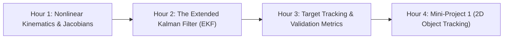

# Day 2: Nonlinear State Estimation & Object Tracking (Mini-Project 1)

Welcome to **Day 2**! Today we tackle the non-linear reality of autonomous robotics. 

In Day 1, we assumed physical systems move linearly and sensors measure Cartesian coordinates directly. In the real world, vehicles rotate and turn, and sensors like Radar and LiDAR report observations in **polar or spherical coordinates** (range and bearing). Today, we master the **Extended Kalman Filter (EKF)** and apply it to **Mini-Project 1: Object Tracking**.

---

## 🧭 Day 2 Roadmap

---

## 📂 Module Index

1. **[[Hour_01_Nonlinear_Kinematics_and_Jacobians/README|Hour 1: Nonlinear Kinematics & Jacobian Linearization]]**
   * Why linear Kalman filters fail for nonlinear dynamics and polar observations.
   * What happens when a Gaussian distribution passes through a nonlinear function.
   * First-order Taylor series approximation and analytical Jacobian derivations.

2. **[[Hour_02_The_Extended_Kalman_Filter/README|Hour 2: The Extended Kalman Filter (EKF) Framework]]**
   * Full formulation of the continuous-discrete Extended Kalman Filter.
   * Nonlinear state propagation vs. linearized covariance propagation.
   * Pitfalls of the EKF: Linearization errors, divergence, and angle wrapping.

3. **[[Hour_03_Target_Tracking_and_Validation_Metrics/README|Hour 3: Target Tracking Models & Filter Validation Metrics]]**
   * Target tracking representations: Constant Velocity (CV), Constant Acceleration (CA), and Coordinated Turn (CT).
   * Radar and LiDAR observation geometry: Range, azimuth (bearing), and elevation.
   * Performance diagnostics: RMSE, Normalized Estimation Error Squared (NEES), and covariance ellipses.

4. **[[Hour_04_Mini_Project_1_Object_Tracking/README|Hour 4: Mini-Project 1 — 2D Object Tracking using Kalman Filters]]**
   * Complete implementation of an EKF tracking a moving vehicle/obstacle.
   * Deriving the measurement Jacobian $\mathbf{H}_k$ for range and bearing observations.
   * Evaluation: Trajectory reconstruction, error residuals, and $\pm 3\sigma$ consistency envelopes.

---

## 🎯 Day 2 Learning Outcomes

By the end of this session, you should be able to:
- [ ] Calculate analytical Jacobian matrices for nonlinear kinematics and polar sensor models.
- [ ] Implement the Extended Kalman Filter prediction and update steps in NumPy.
- [ ] Handle angle wrapping discontinuities in $[-\pi, \pi]$ within innovation vectors.
- [ ] Compute NEES and NIS statistical tests to evaluate filter health.
- [ ] Complete and validate **Mini-Project 1** against ground truth data.
