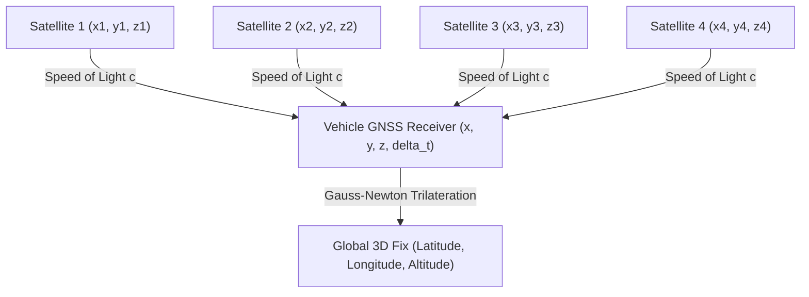

# Hour 3: GNSS & GPS Satellite Positioning

> [!abstract] Key Learning Objectives
> 1. Understand the architecture and signal propagation physics of Global Navigation Satellite Systems (GNSS).
> 2. Formulate the pseudorange measurement equation and understand why 4 satellites are required.
> 3. Solve for 3D position and receiver clock bias using non-linear least squares (Gauss-Newton).
> 4. Analyze Dilution of Precision (GDOP/PDOP) and environmental error sources (multipath, ionosphere).
> 5. Understand why GNSS and IMU are mathematically ideal partners for sensor fusion.

---

## 1. Global Navigation Satellite Systems (GNSS)

A **Global Navigation Satellite System (GNSS)** is a constellation of satellites broadcasting radio signals from space that allow receivers on Earth to calculate their exact 3D position, velocity, and time.

Major Global Constellations:
* **GPS (Navstar):** United States (31 satellites)
* **Galileo:** European Union (24+ satellites)
* **GLONASS:** Russia (24 satellites)
* **BeiDou:** China (35 satellites)

Satellites orbit in Medium Earth Orbit (MEO) at an altitude of approximately $\sim 20,200\text{ km}$, completing two orbits around Earth every 24 hours.



---

## 2. Principle of Operation: Satellite Trilateration

Every satellite carries ultra-precise **atomic clocks** (rubidium or cesium) synchronized to within nanoseconds of GPS master time.
Each satellite continuously broadcasts:
1. **Ephemeris Data:** Its exact mathematical orbital trajectory $\mathbf{r}_{sat, i}(t) = [x_i, y_i, z_i]^T$.
2. **Timestamp:** The exact time $t_{transmit}$ the radio signal left the satellite antenna.

When the vehicle's receiver receives the signal at time $t_{receive}$, it calculates the transit time:
$$\Delta t_i = t_{receive} - t_{transmit}$$
Multiplying by the speed of light ($c \approx 299,792,458\text{ m/s}$), we get the distance to the satellite!

### The Pseudorange Equation
Why is this called a **pseudorange** ($\rho_i$) rather than a true range?

Satellites have $\$100,000$ atomic clocks, but your car's receiver has an inexpensive quartz crystal oscillator. If the car's clock is off by just **$1\text{ microsecond}$ ($10^{-6}\text{ s}$)**:
$$\text{Distance Error} = c \cdot 10^{-6}\text{ s} \approx \mathbf{300\text{ meters}}!$$

Therefore, the receiver clock bias $\delta t_{rcv}$ is an **unknown state variable** that must be estimated alongside $(x, y, z)$!

$$\rho_i = \|\mathbf{r}_{sat, i} - \mathbf{r}_{rcv}\| + c \delta t_{rcv} - c \delta t_{sat, i} + I_i + T_i + \epsilon_i$$

Where:
* $\rho_i$ is the measured pseudorange to satellite $i$.
* $\mathbf{r}_{sat, i} = [x_i, y_i, z_i]^T$ is the satellite position in ECEF coordinates.
* $\mathbf{r}_{rcv} = [x, y, z]^T$ is the unknown receiver position.
* $\delta t_{rcv}$ is the **receiver clock bias** (seconds).
* $\delta t_{sat, i}$ is the satellite clock bias (broadcast in ephemeris; known).
* $I_i$ is ionospheric delay (signal slowed by free electrons in the upper atmosphere).
* $T_i$ is tropospheric delay (signal refracted by water vapor and temperature).
* $\epsilon_i$ is multipath and thermal noise.

> [!important] Why Four Satellites Are Required
> To determine our position, we have **4 unknowns**:
> 1. Receiver X coordinate ($x$)
> 2. Receiver Y coordinate ($y$)
> 3. Receiver Z coordinate ($z$)
> 4. Receiver Clock Bias ($c \delta t_{rcv}$)
>
> We therefore require a minimum of **$4$ independent pseudorange equations** from $4$ satellites to solve the system!

---

## 3. Solving for Position: Non-linear Least Squares

The geometric distance is non-linear:
$$h_i(x, y, z, c\delta t) = \sqrt{(x_i - x)^2 + (y_i - y)^2 + (z_i - z)^2} + c \delta t_{rcv}$$

We solve for $\mathbf{x} = [x, y, z, c\delta t]^T \in \mathbb{R}^4$ using **Iterative Gauss-Newton Least Squares**.

Linearizing around our current guess $\mathbf{x}_0$:
$$\Delta \rho_i = \rho_i - h_i(\mathbf{x}_0) = -\frac{x_i - x_0}{r_{0,i}} \Delta x - \frac{y_i - y_0}{r_{0,i}} \Delta y - \frac{z_i - z_0}{r_{0,i}} \Delta z + \Delta(c\delta t)$$

Define the unit line-of-sight vector pointing from the receiver toward satellite $i$:
$$\mathbf{u}_i = \begin{bmatrix} \frac{x_i - x_0}{r_{0,i}} & \frac{y_i - y_0}{r_{0,i}} & \frac{z_i - z_0}{r_{0,i}} \end{bmatrix}$$

Stacking for $m \ge 4$ satellites forms the **Geometry Matrix** $\mathbf{G} \in \mathbb{R}^{m \times 4}$:
$$\begin{bmatrix} \Delta \rho_1 \\ \Delta \rho_2 \\ \vdots \\ \Delta \rho_m \end{bmatrix} = \underbrace{\begin{bmatrix} -u_{1,x} & -u_{1,y} & -u_{1,z} & 1 \\ -u_{2,x} & -u_{2,y} & -u_{2,z} & 1 \\ \vdots & \vdots & \vdots & \vdots \\ -u_{m,x} & -u_{m,y} & -u_{m,z} & 1 \end{bmatrix}}_{\mathbf{G}} \begin{bmatrix} \Delta x \\ \Delta y \\ \Delta z \\ \Delta(c\delta t) \end{bmatrix}$$

Solving for the state correction at each iteration:
$$\Delta\mathbf{x} = (\mathbf{G}^T \mathbf{G})^{-1} \mathbf{G}^T \Delta\boldsymbol{\rho}$$
$$\mathbf{x}_{k+1} = \mathbf{x}_k + \Delta\mathbf{x}$$
Iterate until $\|\Delta\mathbf{x}\| < 10^{-4}\text{ m}$ (typically converges in 3–5 iterations).

---

## 4. Geometric Dilution of Precision (GDOP)

Even if pseudorange measurements are precise, **the geometric arrangement of satellites in the sky strongly dictates positioning error**.

```
    POOR GEOMETRY (High GDOP)                       GOOD GEOMETRY (Low GDOP)
         Sat 1    Sat 2                                      Sat 1 (Zenith)
           \      /                                                |
            \    /                                                 |
             \  /                                     Sat 2        |        Sat 3
              \/                                        \          |          /
             User                                        \         |         /
     (Tight acute intersection                              \      |        /
      causes huge uncertainty)                                    User
                                                       (Wide angular diversity
                                                        gives tight intersection)
```

The covariance of the positioning error is:
$$\operatorname{Cov}(\Delta\mathbf{x}) = (\mathbf{G}^T \mathbf{G})^{-1} \sigma_{\rho}^2$$
Define the DOP matrix $\mathbf{Q} = (\mathbf{G}^T \mathbf{G})^{-1}$:
* **GDOP (Geometric DOP):** $\sqrt{\operatorname{Tr}(\mathbf{Q})}$ (overall 3D position + time).
* **PDOP (Position DOP):** $\sqrt{Q_{11} + Q_{22} + Q_{33}}$ (3D spatial positioning).
* **HDOP (Horizontal DOP):** $\sqrt{Q_{11} + Q_{22}}$ (East-North positioning).
* **VDOP (Vertical DOP):** $\sqrt{Q_{33}}$ (Altitude positioning).

> [!tip] Why Vertical Error is Always Worse
> Notice that all satellites are in the sky **above the vehicle**; no satellite can be positioned underneath the Earth! Because there is no geometric angular diversity from below, **vertical altitude error (VDOP) is always $1.5\times\text{ to }2\times$ worse than horizontal error (HDOP)**.

---

## 5. High-Precision GNSS: RTK Positioning

Standard automotive GPS chips give $2\text{--}5\text{ meter}$ accuracy. For autonomous lane keeping, we need $< 10\text{ cm}$ accuracy.

* **Real-Time Kinematic (RTK) Positioning:**
  * Uses a stationary base station with known coordinates within $10\text{--}20\text{ km}$.
  * Measures the **phase of the radio carrier wave** ($L_1$ frequency $\lambda \approx 19\text{ cm}$) rather than just the digital code.
  * Solves integer carrier-cycle ambiguities to achieve **$1\text{ to }2\text{ centimeter}$ positioning accuracy**!

---

## 6. The Perfect Partnership: GNSS + IMU

Compare the complementary traits of GNSS and IMU sensors:

| Metric | Standalone GNSS / GPS | Standalone Strapdown IMU |
| :--- | :--- | :--- |
| **Update Rate** | Slow ($1\text{--}10\text{ Hz}$) | Very Fast ($100\text{--}200\text{ Hz}$) |
| **Short-Term Accuracy** | Noisy (jitter $\pm 1\text{ m}$) | Extremely smooth and accurate |
| **Long-Term Stability** | **Zero Drift** (globally referenced) | **Fatal Divergence** (quadratic/cubic drift) |
| **Attitude / Heading** | Poor when stationary | Excellent dynamic attitude tracking |
| **Vulnerability** | Tunnels, urban canyons, tree cover | Completely immune to external environment |

> [!important] The Central Insight of Localization
> **GPS and IMU are mathematical soulmates.**
> * The **IMU** provides high-bandwidth, smooth, low-latency state prediction between GPS updates.
> * The **GPS** provides global absolute anchors that periodically rein in and eliminate IMU drift!
>
> Fusing these two systems is the objective of **Day 4 & Mini-Project 2**!

---

## 7. Python Walkthrough: Solving GPS Trilateration via Gauss-Newton

```python
import numpy as np

# True receiver position (ECEF coordinates in meters)
true_rcv = np.array([4000000.0, 500000.0, 4900000.0])
true_bias = 300.0  # 300 meters equivalent clock bias

# 4 Satellites in orbit around Earth
satellites = np.array([
    [15000000.0,  8000000.0, 20000000.0],
    [-8000000.0, 18000000.0, 19000000.0],
    [ 7000000.0, -15000000.0, 22000000.0],
    [-12000000.0, -10000000.0, 21000000.0]
])

# Generate true pseudoranges + 1 meter noise
ranges = np.linalg.norm(satellites - true_rcv, axis=1)
pseudoranges = ranges + true_bias + np.random.normal(0, 1.0, size=4)

# Gauss-Newton Solver
# Initial guess: Earth center [0, 0, 0] with zero bias
x_est = np.array([0.0, 0.0, 0.0, 0.0])

for iteration in range(10):
    pos_est = x_est[:3]
    bias_est = x_est[3]
    
    # 1. Compute predicted pseudoranges and Geometry Matrix G
    est_ranges = np.linalg.norm(satellites - pos_est, axis=1)
    rho_pred = est_ranges + bias_est
    
    delta_rho = pseudoranges - rho_pred
    
    # Construct G matrix
    G = np.zeros((4, 4))
    for i in range(4):
        G[i, :3] = -(satellites[i] - pos_est) / est_ranges[i]
        G[i, 3] = 1.0
        
    # Solve least squares update: delta_x = (G^T G)^-1 G^T delta_rho
    delta_x = np.linalg.inv(G.T @ G) @ G.T @ delta_rho
    x_est += delta_x
    
    if np.linalg.norm(delta_x) < 1e-4:
        print(f"Converged in {iteration + 1} iterations!")
        break

print(f"True Position:      {true_rcv}")
print(f"Estimated Position: {np.round(x_est[:3], 2)}")
print(f"Estimated Clock Bias: {x_est[3]:.2f} m (True: {true_bias} m)")
error = np.linalg.norm(true_rcv - x_est[:3])
print(f"3D Position Error:  {error:.3f} meters")
```

---

## 8. Self-Assessment & Checkpoint Questions

1. **Why does an autonomous vehicle lose GPS reception inside a tunnel, and what prevents it from crashing immediately?**
   * *Answer:* The mountain or concrete ceiling blocks the weak 50-watt microwave signals from space ($1.5\text{ GHz}$). The vehicle prevents crashing by falling back on **inertial dead reckoning (IMU)** and wheel odometry, maintaining accurate short-term localization until the vehicle exits the tunnel.

2. **If we have 8 satellites in view instead of 4, how does the Gauss-Newton algorithm change?**
   * *Answer:* The geometry matrix $\mathbf{G}$ becomes $8 \times 4$. The system is **overdetermined**, and $(\mathbf{G}^T \mathbf{G})^{-1}\mathbf{G}^T \Delta\boldsymbol{\rho}$ computes the **Weighted Least Squares** solution, averaging out noise across all 8 satellites to yield a lower GDOP and higher accuracy.

3. **Why do tall glass skyscrapers in downtown Chicago or Manhattan cause GPS errors of $20\text{--}50\text{ meters}$?**
   * *Answer:* This is called the **multipath effect**. Signals reflect off the glass facades before reaching the car antenna. The reflected path is longer than the direct line of sight, creating an artificially delayed transit time that fools the receiver into estimating a position inside a building or on the wrong block.
