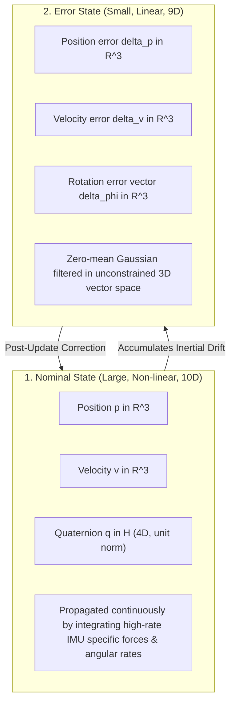

# Hour 1: The Error-State Extended Kalman Filter (ES-EKF)

> [!abstract] Key Learning Objectives
> 1. Understand why the standard (vanilla) EKF fails when applied to 3D unit quaternions.
> 2. Master the separation of state: **Nominal State** ($\hat{\mathbf{x}} \in \mathbb{R}^{10}$) vs. **Error State** ($\delta\mathbf{x} \in \mathbb{R}^9$).
> 3. Derive the $9\times9$ error-state motion transition matrix $\mathbf{F}_{k-1}$ including the skew-symmetric cross-product coupling term $-[\mathbf{C}_{ns}\mathbf{f}]_\times$.
> 4. Implement post-measurement state injection and error reset.

---

## 1. Why Vanilla EKF Fails for 3D Orientation

In Day 3, we learned that 3D vehicle orientation is parameterized by a **Unit Quaternion** $\mathbf{q} \in \mathbb{H}$ with 4 components ($q_w, q_x, q_y, q_z$) subject to the unit-norm constraint:
$$\|\mathbf{q}\|^2 = q_w^2 + q_x^2 + q_y^2 + q_z^2 = 1$$

If we try to construct a standard "vanilla" EKF with a $10$-dimensional state vector:
$$\mathbf{x} = \begin{bmatrix} \mathbf{p} \\ \mathbf{v} \\ \mathbf{q} \end{bmatrix} \in \mathbb{R}^{10}$$

We face two fatal mathematical roadblocks:
1. **Singular Covariance Matrix:** Because 3D orientation has only 3 degrees of freedom, the $4 \times 4$ covariance block for the quaternion has rank 3. It is **singular (non-invertible)**, which breaks the Kalman equations.
2. **Constraint Violation:** The standard Kalman update is additive:
   $$\hat{\mathbf{q}} = \check{\mathbf{q}} + \mathbf{K} \boldsymbol{\nu}$$
   Adding a correction vector directly to a unit quaternion **destroys its unit norm** ($\|\hat{\mathbf{q}}\| \neq 1$), warping the geometry and corrupting coordinate transformations.

---

## 2. The Solution: The Error-State Extended Kalman Filter (ES-EKF)

The **Error-State EKF** (also known as the Indirect Kalman Filter) solves this problem by decomposing the true state into two distinct components:

$$\mathbf{x} = \hat{\mathbf{x}} \oplus \delta\mathbf{x}$$



### 2.1 The Two States Defined
1. **Nominal State $\hat{\mathbf{x}} \in \mathbb{R}^{10}$:**
   $$\hat{\mathbf{x}} = \begin{bmatrix} \hat{\mathbf{p}} \\ \hat{\mathbf{v}} \\ \hat{\mathbf{q}} \end{bmatrix}$$
   * Carries the "large" physical values (e.g. $p_x = 4500\text{ m}$, $v_x = 25\text{ m/s}$).
   * Integrated nonlinearly at high frequency ($100\text{ Hz}$) using raw IMU readings.
   * Does not account for noise or drift.

2. **Error State $\delta\mathbf{x} \in \mathbb{R}^9$:**
   $$\delta\mathbf{x} = \begin{bmatrix} \delta\mathbf{p} \\ \delta\mathbf{v} \\ \delta\boldsymbol{\phi} \end{bmatrix} \in \mathbb{R}^9$$
   * $\delta\mathbf{p} \in \mathbb{R}^3$: Position error.
   * $\delta\mathbf{v} \in \mathbb{R}^3$: Velocity error.
   * $\delta\boldsymbol{\phi} \in \mathbb{R}^3$: **3D Rotation error vector** (a minimal, unconstrained 3D angle vector representing small yaw, pitch, roll errors).
   * Operates close to zero ($\delta\mathbf{x} \approx \mathbf{0}$), making linear filtering **extraordinarily accurate**!

---

## 3. Derivation of the Error Dynamics & The Motion Jacobian $\mathbf{F}_{k-1}$

We now derive how the error state propagates over time step $\Delta t$:
$$\delta\mathbf{x}_k = \mathbf{F}_{k-1} \delta\mathbf{x}_{k-1} + \mathbf{L}_{k-1} \mathbf{w}_{k-1}$$

### 3.1 Position Error Dynamic
Position is the integral of velocity:
$$\mathbf{p}_k = \mathbf{p}_{k-1} + \mathbf{v}_{k-1} \Delta t$$
Perturbing with errors ($\mathbf{p} = \hat{\mathbf{p}} + \delta\mathbf{p}$, $\mathbf{v} = \hat{\mathbf{v}} + \delta\mathbf{v}$):
$$\hat{\mathbf{p}}_k + \delta\mathbf{p}_k = \hat{\mathbf{p}}_{k-1} + \delta\mathbf{p}_{k-1} + (\hat{\mathbf{v}}_{k-1} + \delta\mathbf{v}_{k-1})\Delta t$$
Subtracting the nominal model $\hat{\mathbf{p}}_k = \hat{\mathbf{p}}_{k-1} + \hat{\mathbf{v}}_{k-1}\Delta t$:
$$\delta\mathbf{p}_k = \delta\mathbf{p}_{k-1} + \Delta t \cdot \delta\mathbf{v}_{k-1}$$

### 3.2 Velocity Error Dynamic & The Gravity Coupling Term
The true acceleration in the navigation frame is:
$$\mathbf{a}_n = \mathbf{C}_{ns}(\mathbf{q})\mathbf{f} + \mathbf{g}$$

How does a small orientation error $\delta\boldsymbol{\phi}$ alter the rotation matrix $\mathbf{C}_{ns}$?
For small angles, the perturbed rotation matrix is:
$$\mathbf{C}_{ns}(\mathbf{q}) \approx \mathbf{C}_{ns}(\hat{\mathbf{q}}) \left( \mathbf{I}_{3\times3} - [\delta\boldsymbol{\phi}]_\times \right)$$
Where $[\mathbf{a}]_\times$ is the **skew-symmetric cross-product matrix** of $\mathbf{a} = [a_x, a_y, a_z]^T$:
$$[\mathbf{a}]_\times = \begin{bmatrix} 0 & -a_z & a_y \\ a_z & 0 & -a_x \\ -a_y & a_x & 0 \end{bmatrix}$$
Note that $[\mathbf{a}]_\times \mathbf{b} = \mathbf{a} \times \mathbf{b} = -(\mathbf{b} \times \mathbf{a}) = -[\mathbf{b}]_\times \mathbf{a}$.

Substituting this into acceleration:
$$\mathbf{a}_{true} = \mathbf{C}_{ns}(\hat{\mathbf{q}})\mathbf{f} - \mathbf{C}_{ns}(\hat{\mathbf{q}})[\delta\boldsymbol{\phi}]_\times \mathbf{f} + \mathbf{g}$$
Notice that $-\mathbf{C}_{ns}(\hat{\mathbf{q}})[\delta\boldsymbol{\phi}]_\times \mathbf{f} = + [\mathbf{C}_{ns}\mathbf{f}]_\times \delta\boldsymbol{\phi}$!
Therefore, the acceleration error is:
$$\delta\mathbf{a} = -[\mathbf{C}_{ns}\mathbf{f}_{k-1}]_\times \delta\boldsymbol{\phi}_{k-1}$$

Integrating for velocity:
$$\delta\mathbf{v}_k = \delta\mathbf{v}_{k-1} - [\mathbf{C}_{ns}\mathbf{f}_{k-1}]_\times \Delta t \cdot \delta\boldsymbol{\phi}_{k-1}$$

### 3.3 Rotation Error Dynamic
In the local error formulation, orientation error remains constant over $\Delta t$ plus gyro noise:
$$\delta\boldsymbol{\phi}_k = \delta\boldsymbol{\phi}_{k-1}$$

---

## 4. The Complete $9 \times 9$ Error Transition Matrix

Stacking the three blocks together forms the elegant **Error State Transition Matrix** $\mathbf{F}_{k-1} \in \mathbb{R}^{9 \times 9}$:

$$\mathbf{F}_{k-1} = \begin{bmatrix} \mathbf{I}_{3\times3} & \mathbf{I}_{3\times3}\Delta t & \mathbf{0}_{3\times3} \\ \mathbf{0}_{3\times3} & \mathbf{I}_{3\times3} & -[\mathbf{C}_{ns}\mathbf{f}_{k-1}]_\times \Delta t \\ \mathbf{0}_{3\times3} & \mathbf{0}_{3\times3} & \mathbf{I}_{3\times3} \end{bmatrix}$$

And the **Process Noise Matrix** $\mathbf{L}_{k-1} \in \mathbb{R}^{9 \times 6}$:
$$\mathbf{L}_{k-1} = \begin{bmatrix} \mathbf{0}_{3\times3} & \mathbf{0}_{3\times3} \\ \mathbf{I}_{3\times3} & \mathbf{0}_{3\times3} \\ \mathbf{0}_{3\times3} & \mathbf{I}_{3\times3} \end{bmatrix}, \quad \mathbf{Q}_{k-1} = \Delta t^2 \begin{bmatrix} \sigma_{accel}^2 \mathbf{I}_{3\times3} & \mathbf{0}_{3\times3} \\ \mathbf{0}_{3\times3} & \sigma_{gyro}^2 \mathbf{I}_{3\times3} \end{bmatrix}$$

Uncertainty covariance propagates in $9\text{D}$ space:
$$\check{\mathbf{P}}_k = \mathbf{F}_{k-1} \hat{\mathbf{P}}_{k-1} \mathbf{F}_{k-1}^T + \mathbf{L}_{k-1} \mathbf{Q}_{k-1} \mathbf{L}_{k-1}^T$$

---

## 5. Error State Injection & Reset

When an external measurement (e.g. GPS) arrives:
1. We compute the $9\text{D}$ error state estimate:
   $$\delta\hat{\mathbf{x}} = \begin{bmatrix} \delta\hat{\mathbf{p}} \\ \delta\hat{\mathbf{v}} \\ \delta\hat{\boldsymbol{\phi}} \end{bmatrix} = \mathbf{K}_k (\mathbf{y}_k - \mathbf{h}(\check{\mathbf{x}}_k))$$
2. **Inject Corrections into Nominal State:**
   * Position: $\hat{\mathbf{p}} \leftarrow \check{\mathbf{p}} + \delta\hat{\mathbf{p}}$
   * Velocity: $\hat{\mathbf{v}} \leftarrow \check{\mathbf{v}} + \delta\hat{\mathbf{v}}$
   * **Quaternion (Multiplicative injection on $SO(3)$):**
     $$\hat{\mathbf{q}} \leftarrow \mathbf{q}(\delta\hat{\boldsymbol{\phi}}) \otimes \check{\mathbf{q}}$$
     Where $\mathbf{q}(\delta\hat{\boldsymbol{\phi}}) \approx \begin{bmatrix} 1 \\ \frac{1}{2}\delta\hat{\boldsymbol{\phi}} \end{bmatrix}$.
3. **Reset Error State:**
   Because all accumulated error has now been absorbed into the nominal state:
   $$\delta\hat{\mathbf{x}} \leftarrow \mathbf{0}_{9\times1}$$

> [!tip] Why ES-EKF is Superior
> Because $\delta\mathbf{x}$ is reset to $\mathbf{0}$ after every measurement update, the filter always operates around the origin $\mathbf{0}$. Linearization errors are virtually non-existent!

---

## 6. Python Implementation: Building $\mathbf{F}_{k-1}$

```python
import numpy as np
import sys
sys.path.append('../../Vehicle State Estimation on a Roadway')
from rotations import Quaternion, skew_symmetric

# Given:
dt = 0.01  # 100 Hz IMU
f_imu = np.array([0.5, -0.2, 9.8])  # measured specific force
q_est = Quaternion(euler=[0.05, 0.02, 1.2])  # current orientation

# 1. Rotate specific force to navigation frame
C_ns = q_est.to_mat()
f_nav = C_ns @ f_imu

# 2. Build 9x9 Error Transition Matrix F
F = np.eye(9)
F[0:3, 3:6] = np.eye(3) * dt
F[3:6, 6:9] = -skew_symmetric(f_nav) * dt

print("--- 9x9 Error State Transition Matrix F ---")
print(np.round(F, 3))

# 3. Build 9x6 Noise Jacobian L
L = np.zeros((9, 6))
L[3:6, 0:3] = np.eye(3)
L[6:9, 3:6] = np.eye(3)

print("\n--- 9x6 Noise Jacobian L ---")
print(L)
```

---

## 7. Self-Assessment & Checkpoint Questions

1. **Why is the error state 9-dimensional while the nominal state is 10-dimensional?**
   * *Answer:* The nominal state uses a 4-dimensional unit quaternion $[q_w, q_x, q_y, q_z]^T$ to avoid gimbal lock, bringing the total to $3+3+4 = 10$. The error state represents small 3D angular deviations $\delta\boldsymbol{\phi} = [\delta\phi_x, \delta\phi_y, \delta\phi_z]^T$, bringing the total to $3+3+3 = 9$.

2. **What is the physical meaning of the term $-[\mathbf{C}_{ns}\mathbf{f}_{k-1}]_\times \Delta t$ in the matrix $\mathbf{F}$?**
   * *Answer:* It represents the **cross-coupling between orientation error and acceleration**. If our vehicle's attitude estimate is tilted by a small angle $\delta\boldsymbol{\phi}$, the rotated specific force vector will point slightly in the wrong direction, leaking acceleration into the orthogonal axis.

3. **Why do we reset $\delta\mathbf{x} \leftarrow \mathbf{0}$ after every measurement update?**
   * *Answer:* Because the estimated errors $(\delta\mathbf{p}, \delta\mathbf{v}, \delta\boldsymbol{\phi})$ have already been incorporated into the nominal state $(\hat{\mathbf{p}}, \hat{\mathbf{v}}, \hat{\mathbf{q}})$. Resetting to zero ensures the error state remains truly a "perturbation," keeping the filter centered at the point of lowest linearization error.
