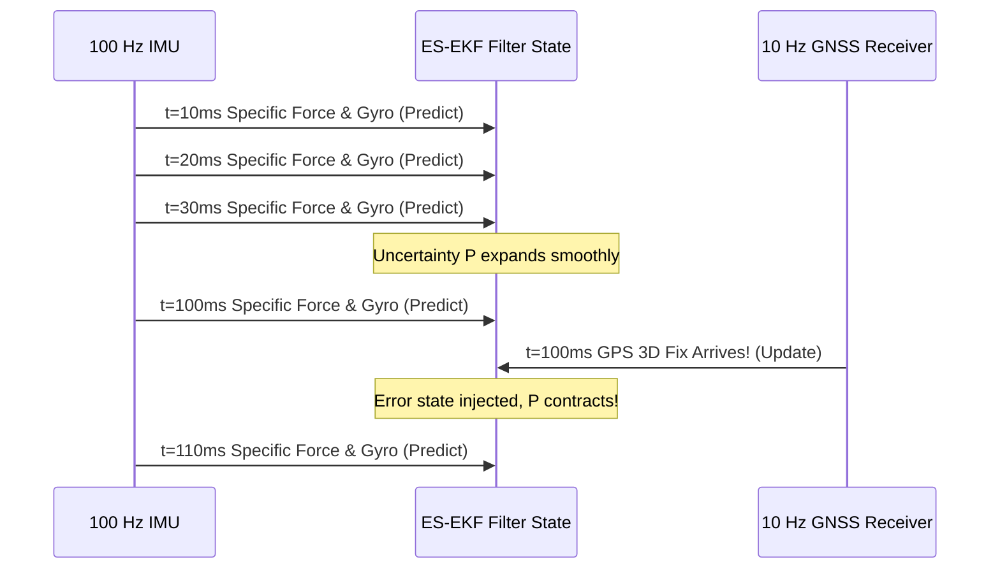

# Hour 2: IMU + GNSS Sensor Fusion Pipeline

> [!abstract] Key Learning Objectives
> 1. Understand asynchronous, multi-rate sensor fusion in autonomous robotics.
> 2. Formulate the linear GPS position measurement model in the 9D Error-State space.
> 3. Implement the complete `measurement_update()` function fusing GPS updates into the ES-EKF.
> 4. Analyze how GPS updates eliminate drift and correct both unmeasured velocity and attitude errors.

---

## 1. The Multi-Rate Asynchronous Reality

In textbook examples, all sensors tick together at a single synchronized clock. **In an actual autonomous car, sensors operate at drastically different frequencies and latencies:**
* **IMU:** Streams acceleration and angular velocity at **$100\text{--}200\text{ Hz}$** ($\Delta t = 10\text{ ms}$).
* **GNSS / GPS:** Outputs position fixes at **$5\text{--}10\text{ Hz}$** ($\Delta t = 100\text{ ms}$).
* **Wheel Encoders:** Tick at $50\text{ Hz}$.
* **LiDAR Odometry:** Delivers scan-matched relative poses at $10\text{ Hz}$.



### The Architecture: High-Rate Prediction, Event-Driven Update
The filter loop is driven by the **highest-rate sensor (the IMU)**:
1. Every IMU packet triggers a **Prediction Step**:
   * Nominal state $\hat{\mathbf{x}}$ is integrated forward by $\Delta t$.
   * Covariance $\mathbf{P}$ expands via $\mathbf{F}_{k-1} \mathbf{P}_{k-1} \mathbf{F}_{k-1}^T + \mathbf{Q}$.
2. When an external measurement arrives (e.g. GPS timestamp $\le t_{IMU}$), the filter triggers an **Update Step**:
   * Computes innovation, evaluates Kalman gain $\mathbf{K}$, corrects nominal state, and contracts $\mathbf{P}$.

---

## 2. The GPS Position Measurement Model

Suppose a GNSS receiver outputs estimated 3D position in the navigation frame:
$$\mathbf{y}_{GPS} = \mathbf{p} + \mathbf{v}_{GPS}$$
Where $\mathbf{v}_{GPS} \sim \mathcal{N}(\mathbf{0}, \mathbf{R}_{GNSS})$ with covariance $\mathbf{R}_{GNSS} = \sigma_{GNSS}^2 \mathbf{I}_{3\times3}$.

### The Measurement Jacobian in Error Space $\mathbf{H}$
Recall our error state vector $\delta\mathbf{x} \in \mathbb{R}^9$:
$$\delta\mathbf{x} = \begin{bmatrix} \delta\mathbf{p} \\ \delta\mathbf{v} \\ \delta\boldsymbol{\phi} \end{bmatrix}$$

Because GPS observes position directly and has **zero direct dependence on velocity or attitude**:
$$\mathbf{y}_{GPS} - \check{\mathbf{p}} = \mathbf{H} \delta\mathbf{x} + \mathbf{v}_{GPS}$$

The measurement matrix is completely linear, constant, and simple:
$$\mathbf{H} = \begin{bmatrix} \mathbf{I}_{3\times3} & \mathbf{0}_{3\times3} & \mathbf{0}_{3\times3} \end{bmatrix} = \begin{bmatrix} 1 & 0 & 0 & 0 & 0 & 0 & 0 & 0 & 0 \\ 0 & 1 & 0 & 0 & 0 & 0 & 0 & 0 & 0 \\ 0 & 0 & 1 & 0 & 0 & 0 & 0 & 0 & 0 \end{bmatrix} \in \mathbb{R}^{3 \times 9}$$

> [!tip] Computational Beauty of the ES-EKF
> Because $\mathbf{H}$ has only identity and zero matrices, computing $\mathbf{H}\check{\mathbf{P}}\mathbf{H}^T$ simply extracts the top-left $3\times3$ position block of the covariance matrix! No complex nonlinear derivations needed!

---

## 3. The Complete Measurement Update Algorithm

When a GPS measurement $\mathbf{y}_{GPS}$ arrives at step $k$:

### Step 1: Innovation Covariance and Inversion
$$\mathbf{S}_k = \mathbf{H} \check{\mathbf{P}}_k \mathbf{H}^T + \mathbf{R}_{GNSS} = \check{\mathbf{P}}_{pp, k} + \mathbf{R}_{GNSS} \in \mathbb{R}^{3 \times 3}$$

### Step 2: Kalman Gain Computation
$$\mathbf{K}_k = \check{\mathbf{P}}_k \mathbf{H}^T \mathbf{S}_k^{-1} \in \mathbb{R}^{9 \times 3}$$
Notice the structure of $\mathbf{K}_k$:
$$\mathbf{K}_k = \begin{bmatrix} \mathbf{K}_{pos} \\ \mathbf{K}_{vel} \\ \mathbf{K}_{rot} \end{bmatrix} \begin{matrix} \} \text{ updates position} \\ \} \text{ updates velocity} \\ \} \text{ updates attitude!} \end{matrix}$$
Even though GPS measures *only position*, cross-covariances in $\check{\mathbf{P}}$ enable the filter to **correct unmeasured velocity and attitude errors**!

### Step 3: Compute the $9\text{D}$ Error State
$$\delta\hat{\mathbf{x}} = \mathbf{K}_k (\mathbf{y}_{GPS} - \check{\mathbf{p}}_k)$$

### Step 4: Correct the Nominal State
$$\hat{\mathbf{p}}_k = \check{\mathbf{p}}_k + \delta\hat{\mathbf{p}}_k$$
$$\hat{\mathbf{v}}_k = \check{\mathbf{v}}_k + \delta\hat{\mathbf{v}}_k$$
$$\hat{\mathbf{q}}_k = \operatorname{Quaternion}(\text{euler} = \delta\hat{\boldsymbol{\phi}}_k) \otimes \check{\mathbf{q}}_k$$

### Step 5: Covariance Contraction
$$\hat{\mathbf{P}}_k = (\mathbf{I}_{9\times9} - \mathbf{K}_k \mathbf{H})\check{\mathbf{P}}_k$$

---

## 4. Python Implementation: `measurement_update()`

Here is the exact modular measurement update function used in `Vehicle State Estimation on a Roadway/es_ekf.py`:

```python
import numpy as np
import sys
sys.path.append('../../Vehicle State Estimation on a Roadway')
from rotations import Quaternion

# Pre-defined Measurement Jacobian (3x9)
H_jac = np.zeros([3, 9])
H_jac[:, :3] = np.eye(3)

def measurement_update(sensor_var, p_cov_check, y_k, p_check, v_check, q_check):
    """
    Executes an ES-EKF measurement update from a 3D position sensor (GPS / LiDAR).
    
    :param sensor_var: Variance scalar (e.g. var_gnss = 0.01)
    :param p_cov_check: (9, 9) predicted error covariance matrix
    :param y_k: (3,) incoming sensor position measurement [x, y, z]
    :param p_check: (3,) predicted nominal position
    :param v_check: (3,) predicted nominal velocity
    :param q_check: (4,) predicted nominal quaternion
    :return: p_hat, v_hat, q_hat, p_cov_hat (corrected nominal states & covariance)
    """
    R_cov = np.eye(3) * sensor_var
    
    # 1. Innovation Covariance S (3x3)
    S = H_jac @ p_cov_check @ H_jac.T + R_cov
    
    # Check for singularity
    if np.linalg.det(S) == 0:
        raise ValueError("Singular innovation covariance matrix!")
        
    # 2. Compute Kalman Gain K (9x3)
    K = p_cov_check @ H_jac.T @ np.linalg.inv(S)
    
    # 3. Compute 9D Error State delta_x
    innovation = y_k - p_check
    delta_x = K @ innovation
    
    # 4. Correct Nominal States
    p_hat = p_check + delta_x[0:3]
    v_hat = v_check + delta_x[3:6]
    
    # Orientation update using quaternion multiplication
    delta_q = Quaternion(euler=delta_x[6:9])
    q_hat = delta_q.quat_mult_left(Quaternion(*q_check)).to_numpy()
    
    # Normalize quaternion
    q_hat = q_hat / np.linalg.norm(q_hat)
    
    # 5. Correct Covariance (9x9)
    p_cov_hat = (np.eye(9) - K @ H_jac) @ p_cov_check
    
    return p_hat, v_hat, q_hat, p_cov_hat
```

---

## 5. Self-Assessment & Checkpoint Questions

1. **How can a GPS measurement (which contains no velocity information) correct the vehicle's velocity estimate?**
   * *Answer:* Through the off-diagonal position-velocity cross-covariance blocks in $\mathbf{P}$ ($\mathbf{P}_{pv} = \mathbb{E}[\delta\mathbf{p}\delta\mathbf{v}^T]$). If the filter observes consistent positive position innovations, the gain block $\mathbf{K}_{vel}$ assigns an upward correction to velocity.

2. **Why do we use `quat_mult_left` when applying orientation correction $\delta\hat{\boldsymbol{\phi}}$?**
   * *Answer:* Because the error angle vector $\delta\boldsymbol{\phi}$ in this formulation represents a global attitude correction expressed in the navigation frame ($n$). Rotations in the global navigation frame multiply from the left ($\hat{\mathbf{q}} = \delta\mathbf{q} \otimes \check{\mathbf{q}}$).

3. **What happens in the filter loop during a 1-second gap where 100 IMU packets arrive, but 0 GPS fixes arrive?**
   * *Answer:* The filter executes 100 consecutive **Prediction steps**, advancing the nominal state $\hat{\mathbf{x}}$ via inertial dead reckoning while allowing covariance $\mathbf{P}$ to expand. The moment GPS packet 101 arrives, a single **Update step** instantly contracts $\mathbf{P}$ and corrects the accumulated drift!
