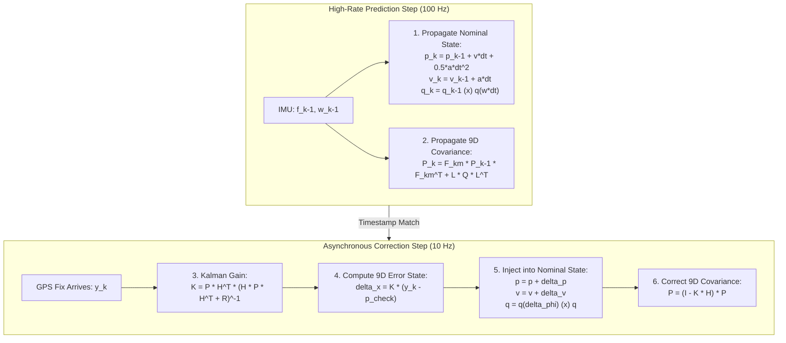

# Hour 4: Mini-Project 2 — 3D Vehicle Localization (Capstone)

> [!abstract] Capstone Project Mission
> Build a production-grade **3D Error-State Extended Kalman Filter (ES-EKF)** in Python fusing real $100\text{ Hz}$ IMU readings (specific force and angular velocity) with $10\text{ Hz}$ GNSS/GPS position fixes to estimate the full 6-DOF trajectory of a self-driving vehicle on a roadway.

---

## 1. Project Background & Data Files

In this capstone assignment, you will complete the localization pipeline in `Vehicle State Estimation on a Roadway/`.
* **Starter Script:** `Vehicle State Estimation on a Roadway/es_ekf.py`
* **Math Utility Library:** `Vehicle State Estimation on a Roadway/rotations.py`
* **Real Dataset:** `Vehicle State Estimation on a Roadway/data/pt1_data.pkl`
* **Reference Solution:** `Vehicle State Estimation on a Roadway/Solution.md`

### 1.1 Dataset Variables
Loading `pt1_data.pkl` provides:
* `gt`: Ground truth object containing true position `gt.p`, velocity `gt.v`, and Euler angles `gt.r`.
* `imu_f`: Stamped specific force measurements $[f_x, f_y, f_z]$ in the vehicle frame ($100\text{ Hz}$).
* `imu_w`: Stamped angular velocity measurements $[\omega_x, \omega_y, \omega_z]$ in the vehicle frame ($100\text{ Hz}$).
* `gnss`: Stamped GPS 3D position observations ($10\text{ Hz}$).
* `lidar`: Stamped scan-matched LiDAR 3D position observations ($10\text{ Hz}$).

---

## 2. Mathematical System Architecture



---

## 3. Step-by-Step Implementation Guide

Open `Vehicle State Estimation on a Roadway/es_ekf.py` and implement the missing logic across the three core sections.

### Task 1: The Measurement Update Function
Implement the `measurement_update()` function to process 3D position fixes from either GNSS or LiDAR:

```python
def measurement_update(sensor_var, p_cov_check: np.ndarray, y_k, p_check: np.ndarray, v_check, q_check):
    """
    Computes the measurement update for a 3D position observation.
    """
    # 1. Measurement noise covariance matrix R (3x3)
    R_sensor = np.eye(3) * sensor_var
    
    # 2. Innovation Covariance S (3x3)
    # H_jac is pre-defined as np.zeros([3, 9]); H_jac[:, :3] = np.eye(3)
    to_invert = h_jac @ p_cov_check @ h_jac.T + R_sensor
    if np.linalg.det(to_invert) == 0:
        raise ValueError("Singular matrix in measurement update!")
        
    # 3. Kalman Gain K_k (9x3)
    k_k = p_cov_check @ h_jac.T @ np.linalg.inv(to_invert)
    
    # 4. Compute 9D Error State delta_x
    innovation = y_k - p_check
    error_state = k_k @ innovation
    
    # 5. Correct Nominal State
    p_hat = p_check + error_state[0:3]
    v_hat = v_check + error_state[3:6]
    
    # Attitude correction via quaternion multiplication
    delta_q = Quaternion(euler=error_state[6:9])
    q_hat = delta_q.quat_mult_left(Quaternion(*q_check)).to_numpy()
    q_hat = q_hat / np.linalg.norm(q_hat)  # Re-normalize
    
    # 6. Correct Covariance (9x9)
    p_cov_hat = (np.eye(9) - k_k @ h_jac) @ p_cov_check
    
    return p_hat, v_hat, q_hat, p_cov_hat
```

### Task 2 & 3: The Main Filter Prediction & Event Loop
Inside the main loop iterating through each IMU sample `k`:

```python
for k in range(1, imu_f.data.shape[0]):
    delta_t = imu_f.t[k] - imu_f.t[k - 1]

    # -------------------------------------------------------------
    # 1. Update Nominal State with IMU Inputs
    # -------------------------------------------------------------
    C_ns = Quaternion(*q_est[k - 1]).to_mat()
    f_nav = C_ns @ imu_f.data[k - 1]
    a_net = f_nav + g  # Gravity compensation (g = [0, 0, -9.81])

    p_est[k] = p_est[k - 1] + delta_t * v_est[k - 1] + 0.5 * (delta_t ** 2) * a_net
    v_est[k] = v_est[k - 1] + delta_t * a_net
    
    delta_q = Quaternion(axis_angle=imu_w.data[k - 1] * delta_t)
    q_est[k] = Quaternion(*q_est[k - 1]).quat_mult_right(delta_q).to_numpy()
    q_est[k] = q_est[k] / np.linalg.norm(q_est[k])

    # -------------------------------------------------------------
    # 2. Linearize Motion Model & Propagate Uncertainty
    # -------------------------------------------------------------
    F_km = np.eye(9)
    F_km[0:3, 3:6] = np.eye(3) * delta_t
    F_km[3:6, 6:9] = -skew_symmetric(f_nav) * delta_t

    Q = np.eye(6)
    Q[:3, :3] = var_imu_f * (delta_t ** 2) * np.eye(3)
    Q[3:, 3:] = var_imu_w * (delta_t ** 2) * np.eye(3)

    p_cov[k] = F_km @ p_cov[k - 1] @ F_km.T + l_jac @ Q @ l_jac.T

    # -------------------------------------------------------------
    # 3. Check Availability of GNSS and LiDAR Measurements
    # -------------------------------------------------------------
    # Check LiDAR
    if lidar_i < lidar.t.shape[0] and lidar.t[lidar_i] <= imu_f.t[k - 1]:
        p_est[k], v_est[k], q_est[k], p_cov[k] = measurement_update(
            var_lidar, p_cov[k], lidar.data[lidar_i].T, p_est[k], v_est[k], q_est[k])
        lidar_i += 1

    # Check GNSS
    if gnss_i < gnss.t.shape[0] and gnss.t[gnss_i] <= imu_f.t[k - 1]:
        p_est[k], v_est[k], q_est[k], p_cov[k] = measurement_update(
            var_gnss, p_cov[k], gnss.data[gnss_i].T, p_est[k], v_est[k], q_est[k])
        gnss_i += 1
```

---

## 4. Benchmark Validation & 3D Trajectory Visualization

Run your solver and plot the results:

```python
# 1. 3D Trajectory Plot
fig = plt.figure(figsize=(10, 8))
ax = fig.add_subplot(111, projection='3d')
ax.plot(p_est[:, 0], p_est[:, 1], p_est[:, 2], 'b-', linewidth=2, label='ES-EKF Estimated Trajectory')
ax.plot(gt.p[:, 0], gt.p[:, 1], gt.p[:, 2], 'g--', linewidth=2, label='Ground Truth')
ax.scatter(gnss.data[:, 0], gnss.data[:, 1], gnss.data[:, 2], color='red', s=4, alpha=0.3, label='Noisy GPS Fixes')
ax.set_xlabel('Easting [m]')
ax.set_ylabel('Northing [m]')
ax.set_zlabel('Up [m]')
ax.set_title('Mini-Project 2: 3D Vehicle Localization via ES-EKF')
ax.legend()
plt.show()

# 2. Compute Position Error & Verification Assertions
pos_error = np.linalg.norm(p_est - gt.p, axis=1)
max_error = np.max(pos_error)
mean_rmse = np.sqrt(np.mean(pos_error ** 2))

print(f"\n==========================================")
print(f"Mean Position RMSE: {mean_rmse:.3f} meters")
print(f"Max Position Error: {max_error:.3f} meters")
print(f"==========================================")

assert mean_rmse < 1.5, f"Filter error too high! RMSE: {mean_rmse:.2f} m (Target: < 1.5 m)"
print("🎉 CONGRATULATIONS! Localization criteria satisfied!")
```

---

## 5. Capstone Challenge: The Tunnel Outage Experiment

Simulate an autonomous vehicle entering a tunnel where GPS reception is completely blocked for $15\text{ seconds}$:
1. Add a conditional check around the GNSS update:
   ```python
   # Tunnel simulation between t = 30s and t = 45s
   is_in_tunnel = (imu_f.t[k] >= 30000) and (imu_f.t[k] <= 45000)
   if not is_in_tunnel:
       # Normal GNSS measurement update
       ...
   ```
2. Plot the position uncertainty $\sqrt{P_{xx} + P_{yy}}$ over time.
3. Observe how the covariance correctly inflates while inside the tunnel, and immediately collapses back to $< 0.1\text{ m}$ the instant the vehicle exits and re-acquires satellites!

---

## 6. Mini-Project 2 Grading Rubric

| Component | Weight | Target Benchmark |
| :--- | :---: | :--- |
| **Measurement Update Implementation** | 25% | Correct Kalman gain, 9D error state, nominal state injection, and covariance update. |
| **Inertial Propagation & Jacobians** | 25% | Exact quaternion kinematics, gravity subtraction, and skew-symmetric $\mathbf{F}_{km}$. |
| **Localization Accuracy** | 25% | Trajectory Position RMSE $< 1.5\text{ m}$ across the full roadway dataset. |
| **Tunnel Outage Experiment** | 15% | Correct simulation of GPS loss; covariance expansion curve plotted and analyzed. |
| **Code Modularity & Cleanliness** | 10% | Professional comments, vectorized NumPy operations, no hardcoded constants. |
| **Total** | **100%** | Full functional 3D ES-EKF vehicle localizer. |
