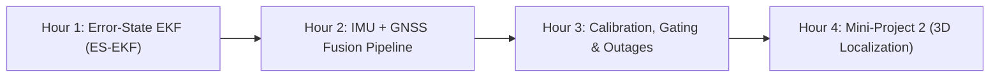

# Day 4: Multi-Sensor Fusion & Localization (Mini-Project 2)

Welcome to **Day 4**—the capstone session of our course!

Today, we bring together every concept mastered over the last three days: probability theory, linear Kalman filtering, non-linear Jacobians, 3D quaternion kinematics, and sensor mechanics. We will build the **Error-State Extended Kalman Filter (ES-EKF)**, the gold standard in aerospace and autonomous vehicle localization, and implement **Mini-Project 2: Full 3D Vehicle Localization using IMU and simulated GPS**.

---

## 🧭 Day 4 Roadmap

---

## 📂 Module Index

1. **[[Hour_01_Error_State_Extended_Kalman_Filter/README|Hour 1: The Error-State Extended Kalman Filter (ES-EKF)]]**
   * True state vs. Nominal state vs. Error state ($\mathbf{x} = \hat{\mathbf{x}} \oplus \delta\mathbf{x}$).
   * Why standard EKF fails for 3D quaternions (covariance singularities).
   * Mathematical derivation of the $9\times9$ error-state motion Jacobian $\mathbf{F}_{k-1}$.

2. **[[Hour_02_IMU_GNSS_Sensor_Fusion_Pipeline/README|Hour 2: IMU + GNSS Sensor Fusion Pipeline]]**
   * Multi-rate asynchronous sensor fusion: 100 Hz IMU prediction + 10 Hz GPS updates.
   * GPS position observation model and the linear measurement Jacobian $\mathbf{H} \in \mathbb{R}^{3 \times 9}$.
   * Post-update state injection and error state reset ($\delta\mathbf{x} \leftarrow \mathbf{0}$).

3. **[[Hour_03_Practical_Estimation_Calibration_and_Outages/README|Hour 3: Practical Estimation: Calibration, Outliers & Dropouts]]**
   * Extrinsic sensor calibration ($\mathbf{C}_{li}, \mathbf{t}_i^l$) and lever-arm compensation.
   * Outlier rejection using Chi-Square Mahalanobis distance gating.
   * Filter behavior during GPS denial (urban canyons and tunnels).

4. **[[Hour_04_Mini_Project_2_Vehicle_Localization/README|Hour 4: Mini-Project 2 — 3D Vehicle Localization (Capstone)]]**
   * Complete implementation of 3D roadway pose estimation in Python.
   * Fusing real 100 Hz IMU acceleration/gyro data with simulated GPS position fixes.
   * Tunnel outage experiment: Observing covariance expansion and recovery behavior.

---

## 🎯 Day 4 Learning Outcomes

By the end of this session, you should be able to:
- [ ] Explain why the Error-State EKF is mathematically superior to vanilla EKF for 3D rotations.
- [ ] Derive the skew-symmetric acceleration coupling term $-[\mathbf{C}_{ns}\mathbf{f}]_\times$ in the motion Jacobian.
- [ ] Implement an asynchronous multi-rate sensor fusion architecture in Python.
- [ ] Implement Mahalanobis distance gating to reject erroneous sensor updates.
- [ ] Complete, test, and validate **Mini-Project 2** against ground truth vehicle trajectories.
