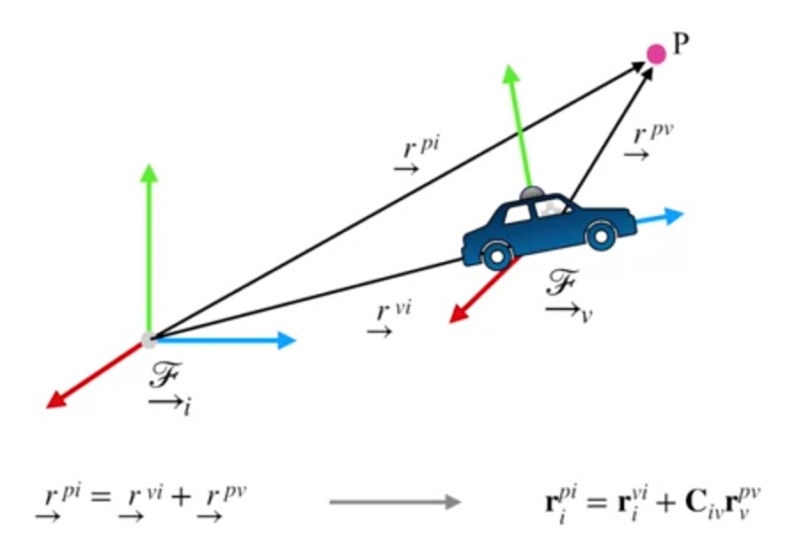
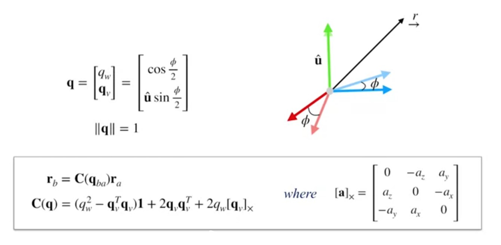
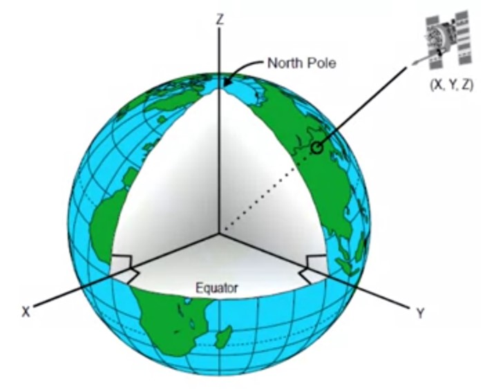
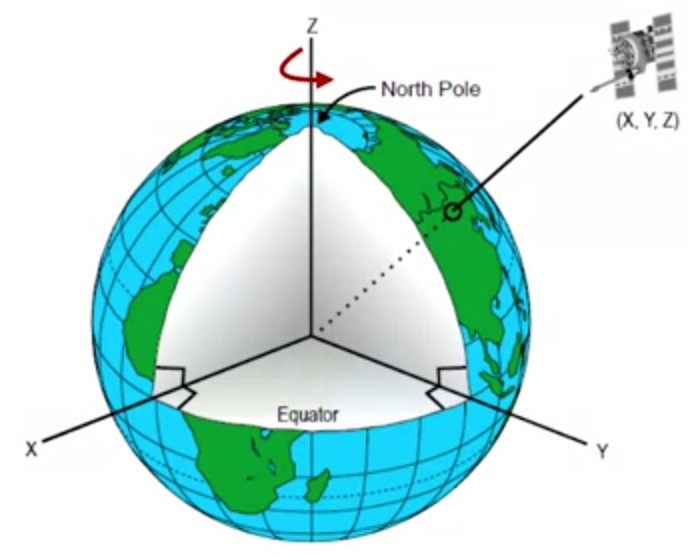
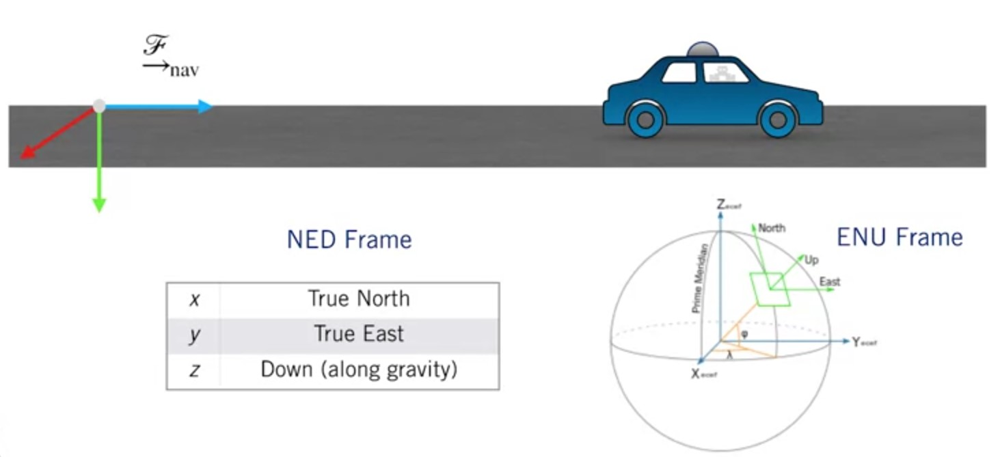

# 3D Geometry and Reference Frames

## Coordinate Rotations

Vectors can be expressed in different
coordinate frames:

The coordinates of the vector are related through a rotation matrix:
$$\bm{r}_b=\bm{C}_{ba}\bm{r}_a$$

Where $\bm{C}_{ba}$ takes coordinates in frame a
and rotates them into frame b

### Transformations

## How can we represent a rotation?

1. Rotation matrix 
2. Unit quaternions 
3. Euler angles 

### Quaternion Multiplication and Rotations

Quaternions multiplication is a special operation that is associative but is
not commutative in general (just like matrix multiplication!):

$$\bm{p} \otimes \bm{q} = \begin{bmatrix}
p_w-q_w-\bm{p}_v^T\bm{q}_v\\
p_w\bm{q}_v+q_w\bm{p}_v+ [\bm{p}_v]_\times\bm{q}_v
\end{bmatrix}$$

Sequential rotation operations can also be performed by taking
advantage of quaternion multiplication:
$$\bm{C}(\bm{p} \otimes \bm{q} ) =  \bm{C}(\bm{p})\bm{C}(\bm{q})$$

## Which rotation representation should I use?

||Rotation Matrix | Unit Quaternion | Euler angles
|-|-----|---|---|
|Expression|$\bm{C}$|$\bm{q}=\begin{bmatrix}\cos{\frac{\phi}{2}}\\ \hat{\bm{u}}\sin{\frac{\phi}{2}}\end{bmatrix}$|$\{\theta_3,\theta_2,\theta_1 \}$|
Parameters|9|4|3|
Constraints| $\bm{C}\bm{C}^T=\bm{1}$|$\bm{q}=1$|*None\**|
Singularities?|No|No|Yes|

## Refernce Frames
### ECIF Earth-Centred Inertial Frame

ECIF coordinate frame is fixed,
Earth rotates about the z axis.
$$\xrightarrow{\mathcal{F}}_{ECIF}$$
||||
|--|--|--|
|x| fixed w.r.t stars|
|y| fixed w.r.t stars|
|z| true north|

### ECEF

ECEF coordinate frame rotates
with the Earth.
$$\xrightarrow{\mathcal{F}}_{ECEF}$$
||||
|--|--|--|
|x| prime meridian (on equator)|
|y| RHR|
|z| true north|

## Navigation

## Sensor & Vehicle

## Supplementary Reading: 3D Geometry and Reference Frames

* Read Chapter 6, Sections 1 to 3 of Timothy D. Barfoot, [State Estimation for Robotics](http://asrl.utias.utoronto.ca/~tdb/bib/barfoot_ser17.pdf) (2017).

* Make use of this [online interactive quaternion calculator](https://quaternions.online/)
 and a handy online [3D rotation converter](https://www.andre-gaschler.com/rotationconverter/).

* Read the [Wikipedia article](https://en.wikipedia.org/wiki/Rotation_matrix) on rotation matrices.
