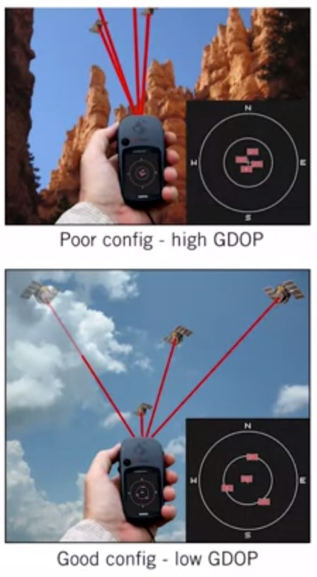

# The Global Navigation Satellite Systems (GNSS)

Each GPS satellite transmits a signal that encodes

1. its position (via accurate ephemeris information)
2. time of signal transmission (via onboard atomic clock)

To compute a GPS position fix in the Earth-centred frame, the receiver uses the speed of light to compute distances to each satellite based on time of signal arrival

At least four satellites are required to solve for 3D position, three if only 2D is required
(e.g., if altitude is known)

## Trilateration

For each satellite, we measure the **pseudorange** as follows:
$$\rho^{(i)}=c(t_r-t_s) = \sqrt{(\bm{\rho}^{(i)}-\bm{r})^T(\bm{\rho}^{(i)}-\bm{r})}+c\Delta t_r+ c\Delta t_a^{(i)} + \eta^{(i)}$$

Where:

* $\bm{r}$ receiver (3D) position
* $\bm{p}^{(i)}$ position of satellite $i$
* $\Delta t_r$ receiver clock error
* $\Delta t_a^{(i)}$ atmospheric propagation delay
* $\eta$ measurement noise
* $c$ speed of light
* $t_s,t_r$ time sent, time received

By using at least 4 satellites, we can solve for:

* $\bm{r}$
* $\Delta t_r$

## GPS | Error Sources

* Ionospheric delay: Charged ions in the atmosphere affect signal propagation

* Multipath effects: Surrounding terrain, buildings can cause unwanted reflections

* Ephemeris & clock errors: A clock error of I x 10-6 s gives a 300m position error!

* Geometric Dilution of Precision (GDOP): The configuration of the visible satellites affects position precision.

## Improvements

|Basic GPS|Differential GPS (DGPS)| Real-Time Kinematic (RTK) GPS|
|--|--|--|
|mobile receiver| mobile receiver + fixed base station(s)| mobile receiver + fixed base station|
|no error correction | estimate error caused by atmospheric effects| estimate relative position using phase of carrier signal|
|~10m accuracy | ~10cm accuracy| ~2cm accuracy|

## Additional resources

Read this [article](https://www.geospatialworld.net/article/global-navigation-satellite-system-gnss/) about the evolution of the various GNSS constellations.

Review overviews of the [Galileo](https://m.esa.int/Our_Activities/Navigation/Galileo/Galileo_satellites) global navigation satellite system developed by the European Union, the [GLONASS](https://gssc.esa.int/navipedia/index.php/GLONASS_General_Introduction) system developed by the Russian Federation, and [COMPASS (BeiDou-2)](https://en.wikipedia.org/wiki/BeiDou_Navigation_Satellite_System) developed by the People's Republic of China.
