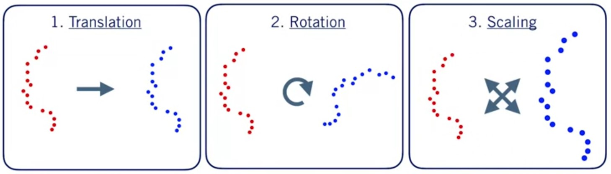
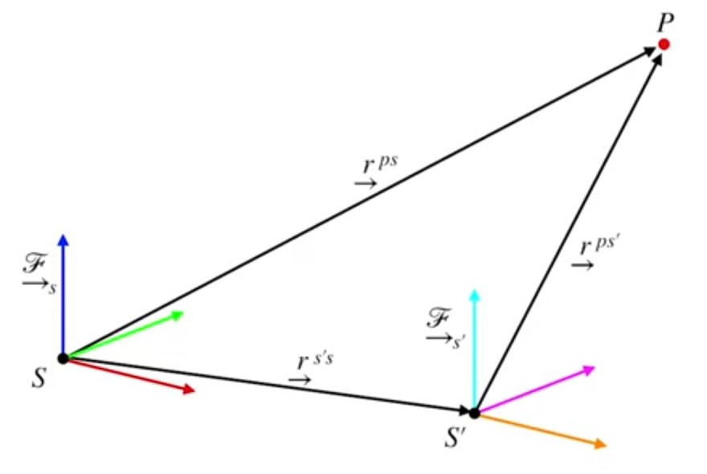
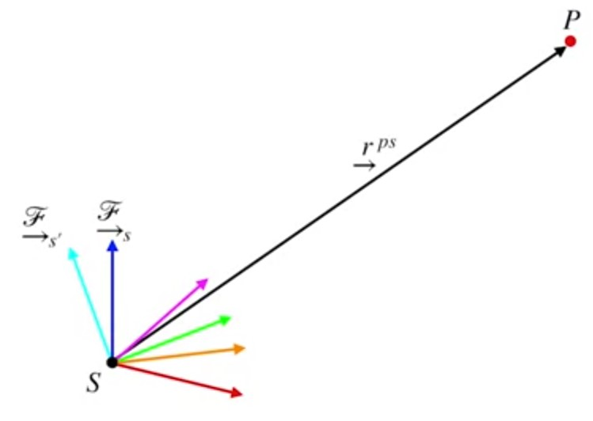
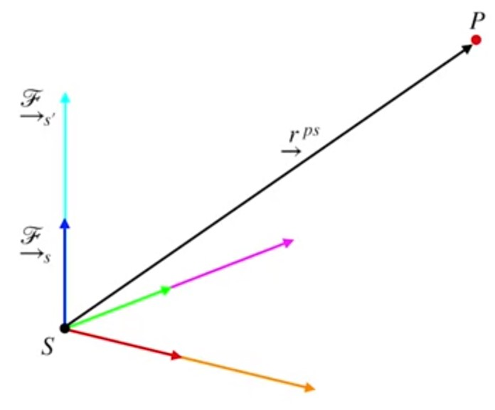

# LIDAR Sensor Models and Point Clouds

$$\begin{bmatrix}x\\y\\z\end{bmatrix}=\bm{h}^{-1}\left(r,\alpha,\epsilon \right)=\begin{bmatrix}r\cos\alpha\cos\epsilon \\
r\sin\alpha\cos\epsilon \\
r\sin\epsilon
\end{bmatrix}$$

$$\bm{p}_s^{(1)}=\begin{bmatrix}x_s^{(1)}\\ y_s^{(1)}\\ z_s^{(1)}\end{bmatrix}$$

$$\bm{p}_s^{(n)}=\begin{bmatrix}x_s^{(n)}\\ y_s^{(n)}\\ z_s^{(n)}\end{bmatrix}$$

$$\bm{P}_s=\begin{bmatrix} \bm{p}_s^{(1)} && \bm{p}_s^{(2)} && \dots && \bm{p}_s^{(n)}\end{bmatrix} = \begin{bmatrix}
x_s^{(1)} && x_s^{(2)}&& \dots && x_s^{(n)} \\
y_s^{(2)} && y_s^{(2)}&& \dots && y_s^{(n)} \\
z_s^{(2)} && z_s^{(2)}&& \dots && z_s^{(n)}
\end{bmatrix}$$

## Operations on Point Clouds

### Translation

From vector addition $$\xrightarrow{r}^{(ps')} =
\xrightarrow{r}^{(ps)} - \xrightarrow{r}^{(s's)}$$

Point coordinates in the translated frame
$$\bm{p}_{s'}^{(j)} = \bm{p}_{s}^{(j)}-\bm{r}_{s}^{s's} \quad\quad \text{For each point}$$
$$\bm{P}_{s'} = \bm{P}_{s}-\bm{R}_{s}^{s's} \quad\quad \text{For whole cloud}$$
$$\bm{R}_{s}^{s's} = \begin{bmatrix}\bm{r}_{s}^{s's} && \bm{r}_{s}^{s's} && \dots && \bm{r}_{s}^{s's}\end{bmatrix}$$

## Rotation

The rotation matrix takes coordinates from frame $s$ to frame $s'$
$$\bm{r}_{s'}=\bm{C}_{s's}\bm{r}_{s}$$

Point coordinates in the rotated frame
$$\bm{p}_{s'}^{(j)}=\bm{C}_{s's}\bm{p}_{s}^{(j)}\quad\quad \text{For each point}$$
$$\bm{P}_{s'}=\bm{C}_{s's}\bm{P}_{s}\quad\quad \text{For whole cloud}$$

## Scaling

The scaling matrix is composed of scaling factors for each basis vector of frame $s$.
$$\bm{r}_{s'}=\begin{bmatrix}
s_x && 0 && 0 \\
0 && s_y && 0 \\
0 && 0 && s_z
\end{bmatrix}\bm{r}_s$$
$$\bm{S}_{s's}=\begin{bmatrix}
s_x && 0 && 0 \\
0 && s_y && 0 \\
0 && 0 && s_z
\end{bmatrix}$$
Point coordinates in the scaled frame
$$\bm{p}_{s'}^{(j)}=\bm{S}_{s's}\bm{p}_{s}^{(j)}\quad\quad \text{For each point}$$
$$\bm{P}_{s'}=\bm{S}_{s's}\bm{P}_{s}\quad\quad \text{For whole cloud}$$

## Putting them all together

Point coordinates in the transformed frame
$$\bm{p}_{s'}^{(j)}=\bm{S}_{s's}\bm{C}_{s's}\left(\bm{p}_{s}^{(j)} - \bm{r}_{s}^{s's}\right)\quad\quad \text{For each point}$$
$$\bm{P}_{s'}=\bm{S}_{s's}\bm{C}_{s's}\left(\bm{P}_{s} - \bm{R}_{s}^{s's}\right)\quad\quad \text{For whole cloud}$$

## Finding the Road with 3D Plane Fitting

Equation of a plane in 3D:
$$z = a +bx + cy$$
We have measurements of $(x, y, z)$ and we want to determine the parameters $(a, b, c)$ — *use least-squares!*

Measurement error:
$$e_j=\hat{z}_j-z_j \\=\left(\hat{a} + \hat{b}x_j+\hat{c}y_j \right)-z_j \quad i=1\dots n$$

We can stack all of the measurement errors into matrix form

$$\begin{bmatrix}e_1\\e_2\\ \vdots\\ e_n\end{bmatrix}=
\begin{bmatrix}
1&&x_1&&y_1\\
1&&x_2&&y_2\\
\vdots && \vdots && \vdots \\
1&&x_n&&y_n
\end{bmatrix}
\begin{bmatrix} a\\b\\c\end{bmatrix} -
\begin{bmatrix}z_1\\z_2\\ \vdots\\ z_n \end{bmatrix}$$

Where:

* $\bm{e}=\begin{bmatrix}e_1\\e_2\\ \vdots\\ e_n\end{bmatrix}$
* $\bm{A}=\begin{bmatrix}
1&&x_1&&y_1\\
1&&x_2&&y_2\\
\vdots && \vdots && \vdots \\
1&&x_n&&y_n
\end{bmatrix}$
* $\bm{x}=\begin{bmatrix} a\\b\\c\end{bmatrix}$
* $\bm{b}=\begin{bmatrix}z_1\\z_2\\ \vdots\\ z_n \end{bmatrix}$

And minimize the squared-error criterion to get the least-squares solution for the parameters

$$\hat{\bm{x}} = \argmin_{\bm{x}} \mathcal{L}_{LS}(\bm{x})$$
$$\mathcal{L}_{LS}(\bm{x})=\bm{e}^T\bm{e}\\
= \left(\bm{A}\bm{x}-\bm{b}\right)^T\left(\bm{A}\bm{x}-\bm{b}\right)\\=
\bm{x}^T\bm{A}^T\bm{A}\bm{x}-\bm{x}^T\bm{A}^T\bm{b}-
\bm{b}^T\bm{A}\bm{x}+\bm{b}^T\bm{b}$$

[See](../Least%20Squares/Squared%20Error%20Criterion.md)

## Additional resources

To learn more about LIDAR sensor models and point clouds, check out the resources below:

Read Chapter 6, Sections 1 and 2 of [Timothy D. Barfoot, State Estimation for Robotics (2016)](http://asrl.utias.utoronto.ca/~tdb/bib/barfoot_ser17.pdf).

Explore the functionality available in the Point Cloud Library (PCL) at http://pointclouds.org/