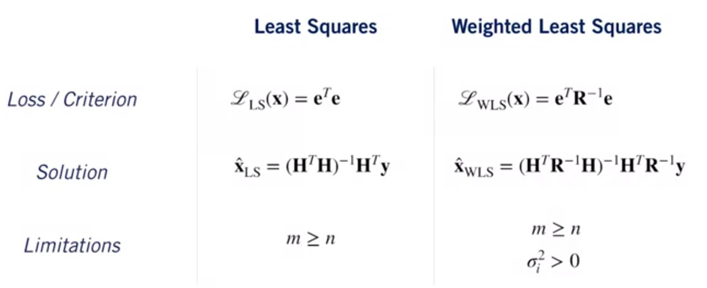

# Squared Error Criterion

$$\bm{e} = \begin{bmatrix} e_1\\e_2\\ \vdots \\e_n\end{bmatrix} = \bm{y}-\bm{H}x$$

Where $\bm{H}$ is a Jacobian matrix.
> Remembering that a Jacobian matrix is $$\bm{H}=\begin{bmatrix} \frac{\partial\bm{f}}{\partial x_1}
\dots \frac{\partial\bm{f}}{\partial x_n}
\end{bmatrix}= \begin{bmatrix}\nabla^Tf_1 \\ \vdots \\ \nabla^Tf_m\end{bmatrix} = \begin{bmatrix}
\frac{\partial f_1}{\partial x_1} && \dots && \frac{\partial f_1}{\partial x_n} \\
\vdots && \ddots && \vdots  \\
\frac{\partial f_m}{\partial x_1} && \dots && \frac{\partial f_m}{\partial x_n}
\end{bmatrix}$$

$$\mathcal{L}(x) = \bm{e}^T\bm{e}= (\bm{y}-\bm{H}x)^T(\bm{y}-\bm{H}x) = \bm{y}^T\bm{y}-x^T\bm{H}^T\bm{y}-\bm{y}^T\bm{H}x+x^T\bm{H}^Tx$$

To minimize this, we can compute the partial derivative with respect to our parameter, set to 0, and solve for an extremum:

$$\left. \frac{{\partial \mathcal{L}}}{\partial x}\right|_{x=\hat{x}} = -2\bm{y}^T\bm{H} + 2\hat{x}^T\bm{H}^T\bm{H} = 0 \\
\hat{x}_{LS}=(\bm{H}^T\bm{H})^{-1}\bm{H}^T\bm{y}$$

If we have $m$ measurements, and $n$ unknown parameters, then:
$$\bm{H}\in \mathbb{R}^{m \times n} \quad \bm{H}^T\bm{H}\mathbb{R}^{n \times n}$$

This means that $(\bm{H}^T\bm{H})^{-1}$ exists only if there are at least as many measurements as there are unknown parameters:
$$m\ge n$$

## Method of weighted least squares

Consider the general linear measurement model for $m$ measurements and $n$ unknowns:
$$\begin{bmatrix} y_1 \\ \vdots\\ y_m \end{bmatrix} = \bm{H}
\begin{bmatrix} x_1 \\ \vdots\\ x_m \end{bmatrix} +
\begin{bmatrix} v_1 \\ \vdots\\ v_m \end{bmatrix}
\\ \bm{y}=\bm{H}\bm{x}+\bm{v}$$

In regular least squares, we implicitly assumed that each noise term was of equal variance:

$$\mathbb{E}[v_i^2] = \sigma^2 \quad(i=1,\dots,m) \quad\quad \bm{R}=\mathbb{E}[\bm{v}\bm{v}^T]=\begin{bmatrix}
\sigma^2 && && 0\\
&&\ddots&&\\0 && && \sigma^2
\end{bmatrix}$$

If we assume each noise term is independent, but of **different variance**,
$$\mathbb{E}[v_i^2] = \sigma^2 \quad(i=1,\dots,m) \quad\quad \bm{R}=\mathbb{E}[\bm{v}\bm{v}^T]=\begin{bmatrix}
\sigma_1^2 && && 0\\
&&\ddots&&\\0 && && \sigma_m^2
\end{bmatrix}$$
Then we can define a *weighted* least squares criterion as:
$$\mathcal{L}_{WLS}(\bm{x})=\bm{e}^T\bm{R}^{-1}\bm{e}=
\frac{e_1^2}{\sigma_1^2}+\frac{e_2^2}{\sigma_2^2}+\dots+\frac{e_m^2}{\sigma_m^2}
$$
Where
$$\bm{e} = \begin{bmatrix} e_1\\e_2\\ \vdots \\ e_n\end{bmatrix} = \begin{bmatrix} y_1\\y_2\\ \vdots \\ y_n\end{bmatrix}-\bm{H} \begin{bmatrix} x_1\\ x_2\\ \vdots \\ x_n\end{bmatrix}$$

*
The higher the expected noise, the lower the weight
we place on the measurement.
*

Expanding our new criterion,
$$\mathcal{L}_{WLS}(\bm{x})=\bm{e}^T\bm{R}^{-1}\bm{e}=(\bm{y}-\bm{H}x)^T\bm{R}^{-1}(\bm{y}-\bm{H}x)$$

We can minimize it as before, but accounting fO 「 the new weighting term:
$$\hat{\bm{x}} = \argmin_x{\mathcal{L}(\bm{x})} \rightarrow \left. \frac{\partial \mathcal{L}}{\partial \bm{x}} \right|_{\bm{x}=\hat{\bm{x}}} = -\bm{y}^T\bm{R}^{-1}\bm{H}+\hat{\bm{x}}^T\bm{R}^T\bm{H}$$
Finally:
$$\hat{\bm{x}}=\left(\bm{H}^T\bm{R}^{-1} \bm{H}\right)^{-1}\bm{H}^T\bm{R}^{-1}\bm{y}$$

## Comparison Least Squares vs Weighted Least Squares

## Additional resources

Matrix Calculus:

* [Cheat sheet](./Matrix_derivatives_cribsheet-e.pdf)
* [The matrix differential](./MatrixCalculus-e.pdf)
* [The matrix cookbook](./matrixcookbook-e.pdf)
* [Interactive least squares fitting simulator](https://phet.colorado.edu/sims/html/least-squares-regression/latest/least-squares-regression_en.html) provided by the PhET Interactive Simulations project at the University of Colorado
* [Overview of the Method of Least Squares](https://textbooks.math.gatech.edu/ila/least-squares.html) in the Georgia Tech online textbook
* Dan Simon, Optimal State Estimation (2006)
