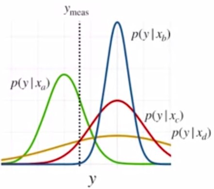
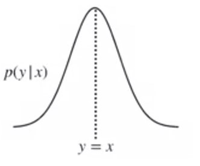
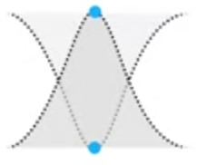

# Linear Recursive Estimator

1. Suppose we have an optimal estimate, $\hat{\bm{x}}_{k-1}$, of our unknown parameters at
time $k—1$
2. Then we obtain a new measurement at time $k:\bm{y}_k=\bm{H}_k\bm{x}+\bm{v}_k$

> **Goal**: compute $\hat{\bm{x}}_k$ as a function of $\bm{y}_k$ and $\hat{\bm{x}}_{k-1}$

We can use a *linear recursive update*:
$$\bm{\hat{x}}_k = \bm{\hat{x}}_{k-1} + \bm{K}_k\left(\bm{y}_k - \bm{H}_k\bm{\hat{x}}_{k-1}) \right)$$

We update our new state as a linear combination of the previous best guess and the current measurement residual (or error), weighted by a gain matrix $\bm{K}_k$

## Recursive Least Squares

But what is the gain matrix $\bm{K}_k$?

We can compute it by minimizing a similar least squares criterion, but this time
we'll use a probabilistic formulation.

We wish to minimize the **expected value of the sum of squared errors** of our current
estimate at time step $k$:
$$\mathcal{L}_{RLS} = \mathbb{E}[(x_k-\hat{x}_k)^2]=\sigma_k^2$$

If we have $n$ unknown parameters at time step k ,we generalize this to
$$\mathcal{L}_{RLS} = \mathbb{E}[(x_{1k}-\hat{x}_{1k})^2+\dots+(x_{nk}-\hat{x}_{nk})^2]=Trace(\bm{P}_k)$$

Where $\bm{P}_k$ is the estimator **covariance**

Using our linear recursive formulation, we can express covariance as a function of $\bm{K}_k$
$$\bm{P}_k = (1-\bm{K}_k\bm{H}_k)\bm{P}_{k-1}(1-\bm{K}_k\bm{H}_k)^T+\bm{K}_k\bm{R}_k\bm{K}_k^T$$

We can show (through matrix calculus) that this is minimized when:
$$\bm{K}_k = \bm{P}_{k-1}\bm{H}_k^T\left(\bm{H}_k\bm{P}_{k-1}\bm{H}_k^T+\bm{R}_k\right)^{-1}$$

With this expression, we can also simplify our expression for $\bm{P}_k$:
$$\bm{P}_k = \bm{P}_{k-1}-\bm{K}_k\bm{H}_k\bm{P}_{k-1}\\=(1-\bm{K}_k\bm{H}_k)\bm{P}_{k-1}$$

> Our covariance *'shrinks'* with each measurement

## Algorithm

1. Initialize the estimator:
$$\bm{\hat{x}}_0=\mathbb{E}[\bm{x}]$$
$$\bm{P}_0=\mathbb{E}[(\bm{x}-\bm{\hat{x}}_0)(\bm{x}-\bm{\hat{x}}_0)^T]$$
2. Set up the measurement model, defining the Jacobian and the measurement
covariance matrix:
$$\bm{y}_k=\bm{H}_k\bm{x}+\bm{v}_k$$
3. Update the estimate of $\bm{\hat{x}}_k$ and the covariance $\bm{\hat{P}}_k$ using:
$$\bm{K}_k = \bm{P}_{k-1}\bm{H}_k^T\left(\bm{H}_k\bm{P}_{k-1}\bm{H}_k^T+\bm{R}_k\right)^{-1}$$
$$\bm{\hat{x}}_k = \bm{\hat{x}}_{k-1} + \bm{K}_k\left(\bm{y}_k - \bm{H}_k\bm{\hat{x}}_{k-1}) \right)$$
$$\bm{P}_k =(1-\bm{K}_k\bm{H}_k)\bm{P}_{k-1}$$

## The Method of Maximum Likelihood

We can ask which x makes our measurement most likely. Or, in other words, which x maximizes the conditional probability of y:
$$\hat{x}=\argmax_x{p(y|x)}$$

### Measurement Model

Recall our simple measurement model:
$$y=x+v$$
We can convert this into a conditional probability on our measurement, by assuming some probability density for v. For example, if
$$v \sim \mathcal{N}(0,\sigma^2)$$
Then:
$$p(y|x)=\mathcal{N}(x,\sigma^2)$$

### Least Squares and Maximum Likelihood

Probability density function of a Gaussian is:
$$\mathcal{N}(z;\mu,\sigma^2)=\frac{1}{\sigma\sqrt{2\pi}}e^{\frac{-(z-\mu)^2}{2\sigma^2}}$$
Our conditional measurement likelihood is:
$$p(y|x)=\mathcal{N}(y;x,\sigma^2)\\=\frac{1}{\sigma\sqrt{2\pi}}e^{\frac{-(y-x)^2}{2\sigma^2}}$$
If we have multiple independent measurements, then:
$$p(\bm{y}|x) \propto \mathcal{N}(y_1;x,\sigma^2)\mathcal{N}(y_2;x,\sigma^2)\times\dots\times\mathcal{N}(y_m;x,\sigma^2)\\=\frac{1}{\sigma^m\sqrt{(2\pi)^m}}e^{\frac{-\sum_{i=1}^m(y_i-x)^2}{2\sigma^2}}$$

The maximal likelihood estimate (MLE) is given by
$$\hat{x}_{MLE}=\argmax_x{p(\bm{y}|x)}$$

Instead of trying to optimize the likelihood directly, we can take its logarithm:
$$\hat{x}_{MLE}=\argmax_x{p(\bm{y}|x)}\\
=\argmax_x{\log{p(\bm{y}|x)}}$$

Resulting in:
$$\log{p(\bm{y}|x)}=-\frac{1}{2R}\left((y_1-x)^2+\dots+
(y_m-x)^2\right)+C$$

Since
$$\argmax_z{f(z)}=\argmax_z{\left(-f(z)\right)}$$

The maximal likelihood problem can therefore be written as
$$\hat{x}_{MLE}=\argmin_x{-\left(\log{p(\bm{y}|x)}\right)}\\
=\argmin_x{\frac{1}{2\sigma^2}}\left((y_1-x)^2+\dots+(y_m-x)^2\right)$$

Finally, if we assume each measurement has a different variance, we can derive:
$$\hat{x}_{MLE}=\argmin_x{\frac{1}{2}\left(
\frac{(y_1-x)^2}{\sigma_1^2}+\dots+\frac{(y_m-x)^2}{\sigma_m^2}
\right)}$$

In both cases,
$$\hat{x}_{MLE}=\hat{x}_{LS}=\argmin_x{\mathcal{L}_{LS}(x)}=\argmin_x{\mathcal{L}_{MLE}(x)}$$

## The Central Limit Theorem

When independent random variables are added, their normalized sum tends towards a normal distribution.

## Least Squares - Some Caveats

'Poor' measurements (e.g. outliers) have a significant effect on the method of least squares

It's important to check that the measurements roughly follow a Gaussian distribution

## Additional resources

* [Interactive explanation](http://mfviz.com/central-limit/) of the Central Limit Theorem by Michael Freeman
* If you are a history buff, you may wish to read this [article](https://arxiv.org/pdf/0804.2996.pdf) *(The Epic Story of Maximum Likelihood - Stephen M. Stigler
)* describing the history of the method of maximum likelihood and its relationship to least squares. Originally printed in the journal Statistical Science and available for free on arXiv
