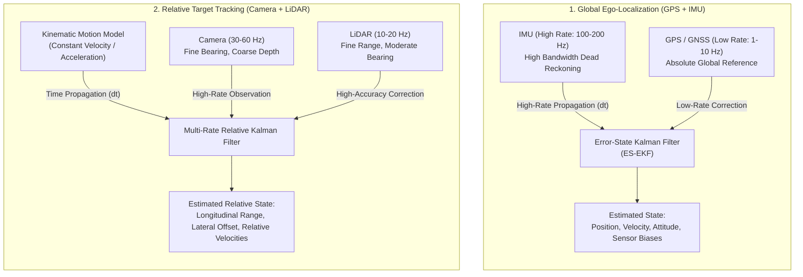
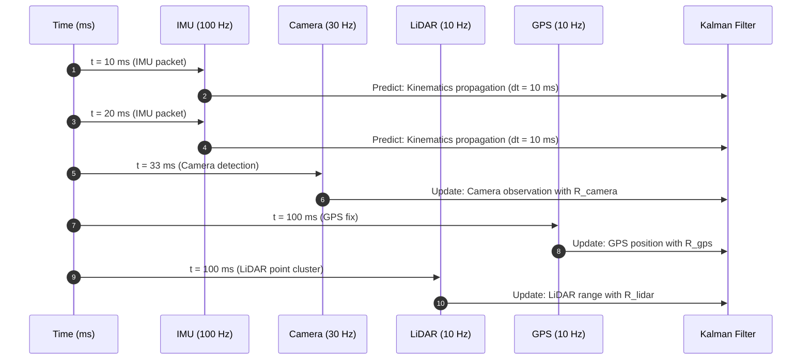
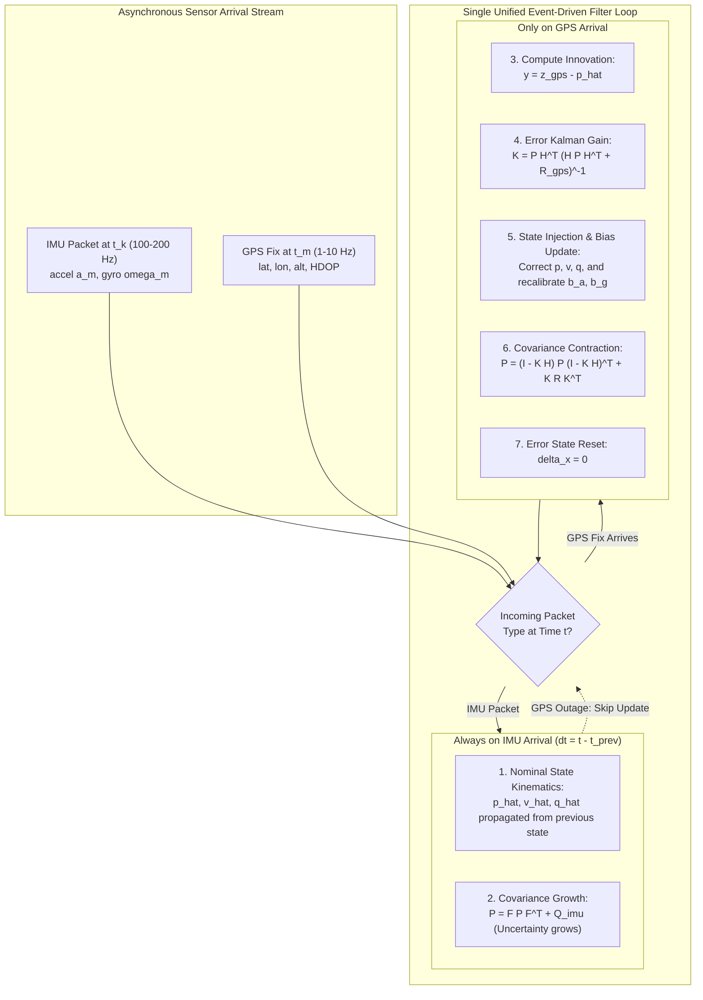
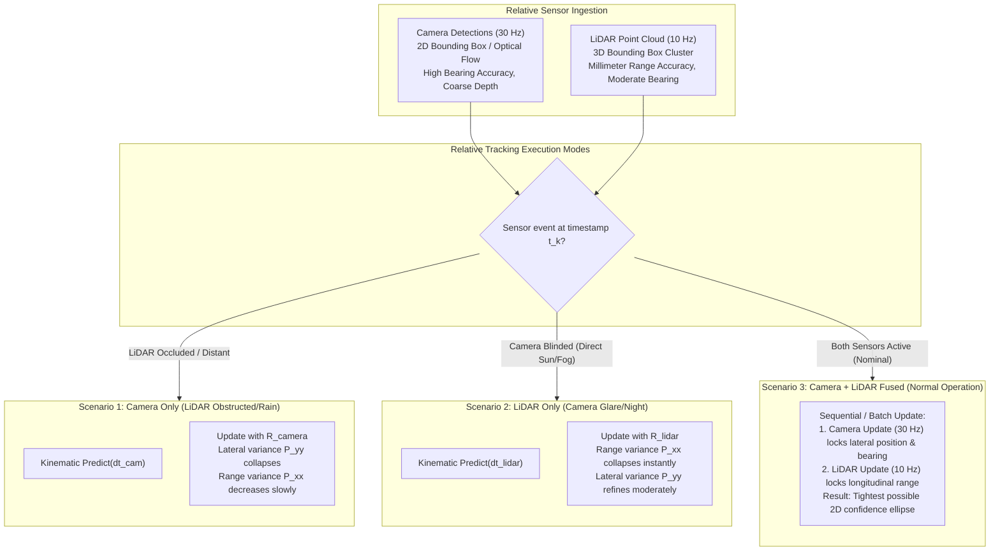

# Multi-Sensor Fusion with Kalman Filters: GPS + IMU and Camera + LiDAR

In autonomous vehicles and robotics, no single sensor provides a complete, robust, and drift-free observation of the environment. **Sensor Fusion** is the mathematical process of combining measurements from heterogeneous sensors—each with distinct physical modalities, measurement rates, latencies, and noise characteristics—to produce an optimal estimate of the system state.

This guide provides a rigorous theoretical foundation and practical implementation blueprint for **two completely separate, independent autonomous driving fusion problems**:
1. **Example A: GPS + IMU Fusion** for global ego-vehicle localization (Dead Reckoning + Absolute Global Corrections in the Navigation/NED frame).
2. **Example B: Camera + LiDAR Fusion** for relative target tracking in **Car-Following / Adaptive Cruise Control (ACC)** mode (Relative range and velocity tracking in the Ego-Vehicle frame).

These two pipelines operate independently on different state spaces, reference frames, and sensor modalities.

---

## 🧭 High-Level Architecture Overview



$$\begin{aligned}
\text{\bf Problem 1 (Global State):} \quad \mathbf{x} &= \begin{bmatrix} \mathbf{p}^T & \mathbf{v}^T & \mathbf{q}^T & \mathbf{b}_a^T & \mathbf{b}_g^T \end{bmatrix}^T \in \mathbb{R}^{16} \\
\text{\bf Problem 2 (Relative State):} \quad \mathbf{x} &= \begin{bmatrix} d_x & d_y & \Delta v_x & \Delta v_y \end{bmatrix}^T \in \mathbb{R}^4
\end{aligned}$$

---

## 1. Fundamentals: Handling Asynchronous Rates and Covariances

### 1.1 The Multi-Rate Asynchronous Paradigm

Sensors operate on independent clock domains and hardware triggers:
- **IMU**: $100\text{ Hz} - 1000\text{ Hz}$ ($\Delta t \approx 1\text{ ms} - 10\text{ ms}$)
- **Cameras**: $30\text{ Hz} - 60\text{ Hz}$ ($\Delta t \approx 16.7\text{ ms} - 33.3\text{ ms}$)
- **LiDAR**: $10\text{ Hz} - 20\text{ Hz}$ ($\Delta t \approx 50\text{ ms} - 100\text{ ms}$)
- **GPS / GNSS**: $1\text{ Hz} - 10\text{ Hz}$ ($\Delta t \approx 100\text{ ms} - 1000\text{ ms}$)

Rather than forcing downsampling or artificial synchronization, optimal sensor fusion uses an **Event-Driven Architecture**:
1. **Prediction Step ($\text{Predict}(\Delta t)$)** runs whenever high-rate IMU measurements arrive or at variable time intervals $\Delta t = t_k - t_{k-1}$ between sensor events.
2. **Correction Step ($\text{Update}(\mathbf{z}_k, \mathbf{R}_k)$)** is triggered **only** when a measurement packet from a specific sensor arrives.



### 1.2 Mathematical Foundations of Covariances

The Kalman Filter balances confidence between physics and observations through two key matrices:

1. **Process Noise Covariance ($\mathbf{Q}$)**:
   - Quantifies unmodeled dynamics, road vibration, wind gusts, and actuator noise.
   - For continuous process noise $\mathbf{Q}_c$, the discrete covariance over step $\Delta t$ is:
     $$\mathbf{Q}_k \approx \mathbf{F}_{k-1} \mathbf{Q}_c \mathbf{F}_{k-1}^T \Delta t \quad \text{or via Van Loan integration: } \int_0^{\Delta t} e^{\mathbf{F}\tau} \mathbf{L} \mathbf{Q}_c \mathbf{L}^T e^{\mathbf{F}^T \tau} d\tau$$

2. **Measurement Noise Covariance ($\mathbf{R}$)**:
   - Quantifies the uncertainty of a specific sensor modality.
   - $\mathbf{R}$ can be **dynamically time-varying** ($R_k$):
     - GPS: Scaled by HDOP (Horizontal Dilution of Precision) or satellite count.
     - Camera depth: $\sigma_z \propto z^2$ (depth uncertainty grows quadratically with distance).
     - LiDAR range: $\sigma_r \approx \text{constant}$ ($0.02\text{ m} - 0.05\text{ m}$).

---

---

---

## 2. Example A: GPS + IMU Fusion for Global Ego-Localization

### 2.1 Why Does GPS + IMU Only Have $\mathbf{R}_{\text{gps}}$? (Where is the IMU $\mathbf{R}$?)

> [!IMPORTANT]
> **Fundamental Concept of Strapdown Inertial Navigation:**
> In autonomous vehicle localization, the IMU is **NOT** treated as an external measurement observation ($\mathbf{z} = \mathbf{H}\mathbf{x} + \mathbf{v}$).
> Instead, the IMU acts as the **high-frequency dynamic driver of the system kinematics** in the **PREDICTION STEP**.
> 
> Because raw accelerometer $\mathbf{a}_m$ and gyroscope $\boldsymbol{\omega}_m$ measurements directly integrate position, velocity, and orientation:
> * **IMU sensor noise ($\sigma_a^2, \sigma_g^2$)** is mapped directly into the **Process Noise Covariance ($\mathbf{Q}_{\text{imu}}$)**.
> * **GPS position fix ($\mathbf{p}_{gps}$)** is an external observation, so its uncertainty is mapped into the **Measurement Noise Covariance ($\mathbf{R}_{\text{gps}}$)**.
> 
> Therefore, there is **no $\mathbf{R}_{\text{imu}}$ matrix** in standard ES-EKF because IMU uncertainty is already represented by $\mathbf{Q}_{\text{imu}}$.

---

### 2.2 Do We Change the Mathematical Model During GPS Outages?

**No! We never change the mathematical model, state vector, or filter equations.**

The localization system uses a single, unified **Event-Driven Kalman Filter Engine**:
1. **Same State Vector**: $\mathbf{x} \in \mathbb{R}^{16}$ (or error state $\delta \mathbf{x} \in \mathbb{R}^{15}$) is maintained continuously.
2. **When an IMU packet arrives at $t_k$**: The filter executes $\text{Predict}(\Delta t, \mathbf{a}_m, \boldsymbol{\omega}_m)$ using the previous estimate $\hat{\mathbf{x}}_{k-1}$ and $\mathbf{P}_{k-1}$. $\mathbf{P}$ increases by $+\mathbf{Q}_{\text{imu}}$.
3. **When a GPS fix arrives**: The filter executes $\text{Update}(\mathbf{z}_{\text{gps}}, \mathbf{R}_{\text{gps}})$. $\mathbf{P}$ contracts.
4. **During a GPS Outage (Tunnel / Urban Canyon)**: The filter simply **skips the update step**! It continues running predictions at 100 Hz from previous estimates. The covariance $\mathbf{P}$ naturally grows to reflect the accumulating drift. When GPS reappears, the large $\mathbf{P}$ creates a large Kalman gain $\mathbf{K}$, instantly correcting the accumulated drift without needing any model switch.

---

### 2.3 Signal Processing Pipeline & Dispatch Architecture



---

### 2.2 Scenario-by-Scenario Matrix Definitions (GPS + IMU)

#### Scenario 1: IMU Only Mode (GPS Denial / Tunnel / Outage)
When GPS is lost, the filter runs in pure **Prediction Mode (Dead Reckoning)**. No measurement updates occur ($\mathbf{H}, \mathbf{R}$ are inactive).

* **Nominal State Propagation**:
  $$\hat{\mathbf{p}}_k = \hat{\mathbf{p}}_{k-1} + \hat{\mathbf{v}}_{k-1}\Delta t + \frac{1}{2}\left[\mathbf{C}_{ns}(\hat{\mathbf{q}}_{k-1})(\mathbf{a}_{m,k} - \hat{\mathbf{b}}_{a,k-1}) + \mathbf{g}\right]\Delta t^2$$
  $$\hat{\mathbf{v}}_k = \hat{\mathbf{v}}_{k-1} + \left[\mathbf{C}_{ns}(\hat{\mathbf{q}}_{k-1})(\mathbf{a}_{m,k} - \hat{\mathbf{b}}_{a,k-1}) + \mathbf{g}\right]\Delta t$$
  $$\hat{\mathbf{q}}_k = \hat{\mathbf{q}}_{k-1} \otimes \mathbf{q}\left((\boldsymbol{\omega}_{m,k} - \hat{\mathbf{b}}_{g,k-1})\Delta t\right)$$

* **Error State Covariance Propagation**:
  $$\mathbf{P}_{k|k-1} = \mathbf{F}_{k-1} \mathbf{P}_{k-1|k-1} \mathbf{F}_{k-1}^T + \mathbf{Q}_{imu}$$

* **Matrices Used in IMU Only**:
  $$\delta \mathbf{x} = \begin{bmatrix} \delta \mathbf{p} \\ \delta \mathbf{v} \\ \delta \boldsymbol{\theta} \\ \delta \mathbf{b}_a \\ \delta \mathbf{b}_g \end{bmatrix} \in \mathbb{R}^{15}, \quad
  \mathbf{F}_{k-1} = \begin{bmatrix}
  \mathbf{I}_3 & \mathbf{I}_3\Delta t & \mathbf{0}_3 & \mathbf{0}_3 & \mathbf{0}_3 \\
  \mathbf{0}_3 & \mathbf{I}_3 & -[\mathbf{C}_{ns}(\mathbf{a}_m - \hat{\mathbf{b}}_a)]_\times \Delta t & -\mathbf{C}_{ns}\Delta t & \mathbf{0}_3 \\
  \mathbf{0}_3 & \mathbf{0}_3 & \mathbf{I}_3 - [\boldsymbol{\omega}_m - \hat{\mathbf{b}}_g]_\times \Delta t & \mathbf{0}_3 & -\mathbf{I}_3\Delta t \\
  \mathbf{0}_3 & \mathbf{0}_3 & \mathbf{0}_3 & \mathbf{I}_3 & \mathbf{0}_3 \\
  \mathbf{0}_3 & \mathbf{0}_3 & \mathbf{0}_3 & \mathbf{0}_3 & \mathbf{I}_3
  \end{bmatrix}$$

  $$\mathbf{Q}_{imu} = \operatorname{diag}\left(\mathbf{0}_{3 \times 3}, \; \sigma_a^2 \Delta t^2 \mathbf{I}_3, \; \sigma_g^2 \Delta t^2 \mathbf{I}_3, \; \sigma_{ba}^2 \Delta t \mathbf{I}_3, \; \sigma_{bg}^2 \Delta t \mathbf{I}_3\right)$$

* **Filter Behavior**: $\mathbf{P}$ grows unboundedly. Position variance grows proportionally to $\sim t^3$ due to uncorrected gyro bias integration.

---

#### Scenario 2: GPS Only Mode (IMU Disconnected / Constant Velocity Kinematics)
If the IMU is unavailable, the filter falls back to a standard **Kinematic Kalman Filter** driven by a Constant Velocity (CV) motion model at the GPS arrival rate ($\Delta t_{gps} \approx 0.1\text{ s} - 1.0\text{ s}$).

* **Matrices Used in GPS Only**:
  $$\mathbf{x}_{CV} = \begin{bmatrix} \mathbf{p} \\ \mathbf{v} \end{bmatrix} \in \mathbb{R}^6, \quad
  \mathbf{F}_{CV} = \begin{bmatrix} \mathbf{I}_3 & \mathbf{I}_3 \Delta t_{gps} \\ \mathbf{0}_3 & \mathbf{I}_3 \end{bmatrix}, \quad
  \mathbf{Q}_{CV} = q_v \begin{bmatrix} \frac{\Delta t_{gps}^3}{3}\mathbf{I}_3 & \frac{\Delta t_{gps}^2}{2}\mathbf{I}_3 \\ \frac{\Delta t_{gps}^2}{2}\mathbf{I}_3 & \Delta t_{gps}\mathbf{I}_3 \end{bmatrix}$$

  $$\mathbf{z}_{gps} = \begin{bmatrix} x_{gps} \\ y_{gps} \\ z_{gps} \end{bmatrix}, \quad
  \mathbf{H}_{CV} = \begin{bmatrix} \mathbf{I}_3 & \mathbf{0}_3 \end{bmatrix} \in \mathbb{R}^{3 \times 6}, \quad
  \mathbf{R}_{gps} = \begin{bmatrix} \sigma_{x,gps}^2 & 0 & 0 \\ 0 & \sigma_{y,gps}^2 & 0 \\ 0 & 0 & \sigma_{z,gps}^2 \end{bmatrix}$$

* **Filter Steps**:
  $$\hat{\mathbf{x}}_{k|k-1} = \mathbf{F}_{CV} \hat{\mathbf{x}}_{k-1|k-1}, \quad \mathbf{P}_{k|k-1} = \mathbf{F}_{CV} \mathbf{P}_{k-1|k-1} \mathbf{F}_{CV}^T + \mathbf{Q}_{CV}$$
  $$\mathbf{K}_k = \mathbf{P}_{k|k-1} \mathbf{H}_{CV}^T (\mathbf{H}_{CV}\mathbf{P}_{k|k-1}\mathbf{H}_{CV}^T + \mathbf{R}_{gps})^{-1}$$
  $$\hat{\mathbf{x}}_{k|k} = \hat{\mathbf{x}}_{k|k-1} + \mathbf{K}_k (\mathbf{z}_{gps} - \mathbf{H}_{CV}\hat{\mathbf{x}}_{k|k-1}), \quad \mathbf{P}_{k|k} = (\mathbf{I} - \mathbf{K}_k \mathbf{H}_{CV})\mathbf{P}_{k|k-1}$$

* **Filter Behavior**: Position uncertainty stays bounded by $\mathbf{R}_{gps}$, but estimates exhibit discrete jumps, lag during sharp turns, and provide no attitude/orientation estimation.

---

#### Scenario 3: GPS + IMU Fused Mode (Full Error-State EKF)
In full fusion, high-rate IMU handles smooth propagation while low-rate GPS provides absolute anchor updates and recalibrates IMU biases.

* **Complete Matrices**:
  $$\mathbf{H}_{gps} = \begin{bmatrix} \mathbf{I}_{3 \times 3} & \mathbf{0}_{3 \times 3} & \mathbf{0}_{3 \times 3} & \mathbf{0}_{3 \times 3} & \mathbf{0}_{3 \times 3} \end{bmatrix} \in \mathbb{R}^{3 \times 15}$$
  $$\mathbf{R}_{gps} = \operatorname{diag}\left(\sigma_{gps, x}^2, \; \sigma_{gps, y}^2, \; \sigma_{gps, z}^2\right)$$
  $$\mathbf{S}_m = \mathbf{H}_{gps}\mathbf{P}_{m|m-1}\mathbf{H}_{gps}^T + \mathbf{R}_{gps} \in \mathbb{R}^{3 \times 3}$$
  $$\mathbf{K}_m = \mathbf{P}_{m|m-1}\mathbf{H}_{gps}^T \mathbf{S}_m^{-1} \in \mathbb{R}^{15 \times 3}$$

* **Error Correction Vector**:
  $$\delta \hat{\mathbf{x}} = \mathbf{K}_m (\mathbf{z}_{gps} - \hat{\mathbf{p}}_{m|m-1}) = \begin{bmatrix} \delta \hat{\mathbf{p}} \\ \delta \hat{\mathbf{v}} \\ \delta \hat{\boldsymbol{\theta}} \\ \delta \hat{\mathbf{b}}_a \\ \delta \hat{\mathbf{b}}_g \end{bmatrix} \in \mathbb{R}^{15}$$

* **State Injection & Reset**:
  $$\hat{\mathbf{p}} \leftarrow \hat{\mathbf{p}} + \delta \hat{\mathbf{p}}, \quad \hat{\mathbf{v}} \leftarrow \hat{\mathbf{v}} + \delta \hat{\mathbf{v}}, \quad \hat{\mathbf{q}} \leftarrow \hat{\mathbf{q}} \otimes \mathbf{q}(\delta \hat{\boldsymbol{\theta}}), \quad \hat{\mathbf{b}}_a \leftarrow \hat{\mathbf{b}}_a + \delta \hat{\mathbf{b}}_a, \quad \hat{\mathbf{b}}_g \leftarrow \hat{\mathbf{b}}_g + \delta \hat{\mathbf{b}}_g$$
  $$\delta \hat{\mathbf{x}} \leftarrow \mathbf{0}_{15 \times 1}$$

* **Covariance Update (Joseph Form)**:
  $$\mathbf{P}_{m|m} = (\mathbf{I}_{15} - \mathbf{K}_m \mathbf{H}_{gps}) \mathbf{P}_{m|m-1} (\mathbf{I}_{15} - \mathbf{K}_m \mathbf{H}_{gps})^T + \mathbf{K}_m \mathbf{R}_{gps} \mathbf{K}_m^T$$

* **Filter Behavior**: Optimal estimation. $\mathbf{P}$ remains at minimum uncertainty. IMU biases $\mathbf{b}_a, \mathbf{b}_g$ are continuously estimated and eliminated.

---

## 3. Example B: Camera + LiDAR Fusion for Relative Car-Following (ACC Mode)

### 3.1 Signal Processing Pipeline & Dispatch Architecture

In relative tracking (ACC mode), the vehicle tracks a lead vehicle in its local forward-left frame.

```text
       [ Ego Vehicle ]  ===========================>  [ Lead Vehicle ]
                             Longitudinal Range (dx)
                        <---------------------------->
                        Relative Velocity: v_rel = v_lead - v_ego
```

$$\Delta v_x = v_{\text{lead}, x} - v_{\text{ego}, x}, \quad \Delta v_y = v_{\text{lead}, y} - v_{\text{ego}, y}$$



---

### 3.2 Scenario-by-Scenario Matrix Definitions (Camera + LiDAR)

#### Common Kinematic State Space Model
$$\mathbf{x} = \begin{bmatrix} d_x \\ d_y \\ \Delta v_x \\ \Delta v_y \end{bmatrix} \in \mathbb{R}^4, \quad
\mathbf{F}(\Delta t) = \begin{bmatrix}
1 & 0 & \Delta t & 0 \\
0 & 1 & 0 & \Delta t \\
0 & 0 & 1 & 0 \\
0 & 0 & 0 & 1
\end{bmatrix}, \quad
\mathbf{Q}(\Delta t) = q_c \begin{bmatrix}
\frac{\Delta t^3}{3} & 0 & \frac{\Delta t^2}{2} & 0 \\
0 & \frac{\Delta t^3}{3} & 0 & \frac{\Delta t^2}{2} \\
\frac{\Delta t^2}{2} & 0 & \Delta t & 0 \\
0 & \frac{\Delta t^2}{2} & 0 & \Delta t
\end{bmatrix}$$

$$\mathbf{H} = \begin{bmatrix} 1 & 0 & 0 & 0 \\ 0 & 1 & 0 & 0 \end{bmatrix} \in \mathbb{R}^{2 \times 4}$$

---

#### Scenario 1: Camera Only Mode (LiDAR Dropout / Range Exceeded)
When only camera frames arrive at 30 Hz ($\Delta t = 33.3\text{ ms}$):

* **Measurement Vector & Covariance**:
  $$\mathbf{z}_{\text{cam}} = \begin{bmatrix} z_{x, \text{cam}} \\ z_{y, \text{cam}} \end{bmatrix}, \quad
  \mathbf{R}_{\text{cam}} = \begin{bmatrix} \sigma_{x, \text{cam}}^2 & 0 \\ 0 & \sigma_{y, \text{cam}}^2 \end{bmatrix} = \begin{bmatrix} (0.05 \cdot d_x)^2 & 0 \\ 0 & (0.08)^2 \end{bmatrix}$$
  *(Notice: at $d_x = 40\text{ m}$, $\sigma_x = 2.0\text{ m}$, whereas lateral $\sigma_y = 0.08\text{ m}$)*

* **Filter Update**:
  $$\mathbf{S}_{\text{cam}} = \mathbf{H}\mathbf{P}\mathbf{H}^T + \mathbf{R}_{\text{cam}} = \begin{bmatrix} P_{xx} + \sigma_{x,\text{cam}}^2 & P_{xy} \\ P_{yx} & P_{yy} + \sigma_{y,\text{cam}}^2 \end{bmatrix}$$
  $$\mathbf{K}_{\text{cam}} = \mathbf{P} \mathbf{H}^T \mathbf{S}_{\text{cam}}^{-1} = \begin{bmatrix} K_{x,x}^{\text{cam}} & K_{x,y}^{\text{cam}} \\ K_{y,x}^{\text{cam}} & K_{y,y}^{\text{cam}} \\ K_{vx,x}^{\text{cam}} & K_{vx,y}^{\text{cam}} \\ K_{vy,x}^{\text{cam}} & K_{vy,y}^{\text{cam}} \end{bmatrix}, \quad \text{where } K_{y,y}^{\text{cam}} \approx 1, \; K_{x,x}^{\text{cam}} \ll 1$$
  $$\hat{\mathbf{x}} \leftarrow \hat{\mathbf{x}} + \mathbf{K}_{\text{cam}}(\mathbf{z}_{\text{cam}} - \mathbf{H}\hat{\mathbf{x}}), \quad \mathbf{P} \leftarrow (\mathbf{I} - \mathbf{K}_{\text{cam}}\mathbf{H})\mathbf{P}$$

* **Filter Behavior**: High-frequency lateral tracking is rock solid. Range tracking is moderately noisy due to large $\sigma_{x,\text{cam}}^2$.

---

#### Scenario 2: LiDAR Only Mode (Camera Blinding / Heavy Fog)
When only LiDAR point clouds arrive at 10 Hz ($\Delta t = 100\text{ ms}$):

* **Measurement Vector & Covariance**:
  $$\mathbf{z}_{\text{lidar}} = \begin{bmatrix} z_{x, \text{lidar}} \\ z_{y, \text{lidar}} \end{bmatrix}, \quad
  \mathbf{R}_{\text{lidar}} = \begin{bmatrix} \sigma_{x, \text{lidar}}^2 & 0 \\ 0 & \sigma_{y, \text{lidar}}^2 \end{bmatrix} = \begin{bmatrix} (0.04)^2 & 0 \\ 0 & (0.25)^2 \end{bmatrix}$$
  *(Notice: range $\sigma_x = 0.04\text{ m}$ is millimeter-precise, lateral $\sigma_y = 0.25\text{ m}$ is beam-limited)*

* **Filter Update**:
  $$\mathbf{S}_{\text{lidar}} = \mathbf{H}\mathbf{P}\mathbf{H}^T + \mathbf{R}_{\text{lidar}} = \begin{bmatrix} P_{xx} + \sigma_{x,\text{lidar}}^2 & P_{xy} \\ P_{yx} & P_{yy} + \sigma_{y,\text{lidar}}^2 \end{bmatrix}$$
  $$\mathbf{K}_{\text{lidar}} = \mathbf{P}\mathbf{H}^T \mathbf{S}_{\text{lidar}}^{-1}, \quad \text{where } K_{x,x}^{\text{lidar}} \approx 1, \; K_{y,y}^{\text{lidar}} < K_{y,y}^{\text{cam}}$$
  $$\hat{\mathbf{x}} \leftarrow \hat{\mathbf{x}} + \mathbf{K}_{\text{lidar}}(\mathbf{z}_{\text{lidar}} - \mathbf{H}\hat{\mathbf{x}}), \quad \mathbf{P} \leftarrow (\mathbf{I} - \mathbf{K}_{\text{lidar}}\mathbf{H})\mathbf{P}$$

* **Filter Behavior**: Range estimate $d_x$ and relative velocity $\Delta v_x$ snap into millimeter accuracy immediately. Lateral estimate is slightly coarser.

---

#### Scenario 3: Camera + LiDAR Fused Mode (Multi-Rate Complementary Fusion)
In normal operation, the filter runs sequentially:
1. **At $t = 33\text{ ms}, 66\text{ ms}, 99\text{ ms}$**: Apply $\text{Predict}(\Delta t)$ and $\text{Update}(\mathbf{z}_{\text{cam}}, \mathbf{R}_{\text{cam}})$.
2. **At $t = 100\text{ ms}$**: Apply $\text{Predict}(\Delta t)$ and $\text{Update}(\mathbf{z}_{\text{lidar}}, \mathbf{R}_{\text{lidar}})$.

Alternatively, when both sensors arrive with matching timestamps $t_k$, they can be updated via the **Concatenated Batch Observation Model**:

$$\mathbf{z}_{\text{fused}} = \begin{bmatrix} \mathbf{z}_{\text{cam}} \\ \mathbf{z}_{\text{lidar}} \end{bmatrix} = \begin{bmatrix} z_{x,\text{cam}} \\ z_{y,\text{cam}} \\ z_{x,\text{lidar}} \\ z_{y,\text{lidar}} \end{bmatrix} \in \mathbb{R}^4$$

$$\mathbf{H}_{\text{fused}} = \begin{bmatrix} \mathbf{I}_{2 \times 2} & \mathbf{0}_{2 \times 2} \\ \mathbf{I}_{2 \times 2} & \mathbf{0}_{2 \times 2} \end{bmatrix} = \begin{bmatrix} 1 & 0 & 0 & 0 \\ 0 & 1 & 0 & 0 \\ 1 & 0 & 0 & 0 \\ 0 & 1 & 0 & 0 \end{bmatrix} \in \mathbb{R}^{4 \times 4}$$

$$\mathbf{R}_{\text{fused}} = \begin{bmatrix} \mathbf{R}_{\text{cam}} & \mathbf{0}_{2 \times 2} \\ \mathbf{0}_{2 \times 2} & \mathbf{R}_{\text{lidar}} \end{bmatrix} = \begin{bmatrix} \sigma_{x,\text{cam}}^2 & 0 & 0 & 0 \\ 0 & \sigma_{y,\text{cam}}^2 & 0 & 0 \\ 0 & 0 & \sigma_{x,\text{lidar}}^2 & 0 \\ 0 & 0 & 0 & \sigma_{y,\text{lidar}}^2 \end{bmatrix}$$

$$\mathbf{S}_{\text{fused}} = \mathbf{H}_{\text{fused}} \mathbf{P} \mathbf{H}_{\text{fused}}^T + \mathbf{R}_{\text{fused}}$$
$$\mathbf{K}_{\text{fused}} = \mathbf{P} \mathbf{H}_{\text{fused}}^T \mathbf{S}_{\text{fused}}^{-1}$$
$$\hat{\mathbf{x}} \leftarrow \hat{\mathbf{x}} + \mathbf{K}_{\text{fused}}(\mathbf{z}_{\text{fused}} - \mathbf{H}_{\text{fused}}\hat{\mathbf{x}})$$
$$\mathbf{P} \leftarrow (\mathbf{I}_4 - \mathbf{K}_{\text{fused}}\mathbf{H}_{\text{fused}})\mathbf{P} (\mathbf{I}_4 - \mathbf{K}_{\text{fused}}\mathbf{H}_{\text{fused}})^T + \mathbf{K}_{\text{fused}}\mathbf{R}_{\text{fused}}\mathbf{K}_{\text{fused}}^T$$

* **Filter Behavior**: Optimal multi-modal performance. The filter extracts the **millimeter range accuracy of LiDAR** and the **high-rate sub-pixel lateral bearing accuracy of the Camera**, yielding an ultra-tight state covariance.

---

> [!TIP]
> **Why Sequential Fusion is Optimal:**
> Because the camera arrives 3 times as often as the LiDAR, the filter maintains high-frequency lateral stability and prompt velocity estimates. When the LiDAR point arrives, the Kalman gain $\mathbf{K}_{lidar}$ puts almost 100% weight on the LiDAR's range measurement, snapping the longitudinal estimate $d_x$ and velocity $\Delta v_x$ back to millimeter precision.

---

## 4. Practical Implementation: Python Simulation

The following complete, runnable Python script implements both multi-rate fusion pipelines with realistic noise parameters, asynchronous event queues, and performance visualization.

```python
import numpy as np
import matplotlib.pyplot as plt

# ==============================================================================
# PART 1: MULTI-RATE GPS (10 Hz) + IMU (100 Hz) EGO-LOCALIZATION
# ==============================================================================

class GPS_IMU_Fusion_1D:
    """
    1D Kalman Filter demonstrating IMU high-rate prediction (100 Hz)
    and GPS low-rate correction (10 Hz) with differing covariances.
    State: x = [position, velocity, imu_accel_bias]^T
    """
    def __init__(self, x0, P0, q_accel, q_bias, r_gps):
        self.x = np.array(x0, dtype=float).reshape(3, 1)
        self.P = np.array(P0, dtype=float)
        self.q_accel = q_accel   # IMU accelerometer noise variance
        self.q_bias = q_bias     # IMU bias random walk variance
        self.r_gps = r_gps       # GPS measurement noise variance

    def predict(self, a_measured, dt):
        """High-rate IMU dead-reckoning step (e.g. at 100 Hz)"""
        # Estimated un-biased acceleration
        a_hat = a_measured - self.x[2, 0]
        
        # State transition: x_{k} = F x_{k-1} + B a_m
        F = np.array([
            [1.0, dt,  -0.5 * dt**2],
            [0.0, 1.0, -dt         ],
            [0.0, 0.0, 1.0         ]
        ])
        
        # Kinematic state propagation
        self.x[0, 0] += self.x[1, 0] * dt + 0.5 * a_hat * dt**2
        self.x[1, 0] += a_hat * dt
        # Bias stays nominally constant: self.x[2, 0] = self.x[2, 0]

        # Process noise covariance
        Q = np.array([
            [0.25 * dt**4 * self.q_accel, 0.5 * dt**3 * self.q_accel, 0.0],
            [0.5 * dt**3 * self.q_accel,  dt**2 * self.q_accel,       0.0],
            [0.0,                         0.0,                        self.q_bias * dt]
        ])
        self.P = F @ self.P @ F.T + Q

    def update_gps(self, z_gps, r_gps_override=None):
        """Low-rate GPS correction step (e.g. at 10 Hz)"""
        R = r_gps_override if r_gps_override is not None else self.r_gps
        H = np.array([[1.0, 0.0, 0.0]])  # Observes position directly
        
        y = z_gps - (H @ self.x)[0, 0]    # Innovation
        S = H @ self.P @ H.T + R          # Innovation covariance
        K = self.P @ H.T @ np.linalg.inv(S) # Kalman gain
        
        # Correction
        self.x = self.x + K * y
        I = np.eye(3)
        self.P = (I - K @ H) @ self.P @ (I - K @ H).T + K * R * K.T


# ==============================================================================
# PART 2: CAMERA (30 Hz) + LIDAR (10 Hz) RELATIVE CAR-FOLLOWING FILTER
# ==============================================================================

class Camera_LiDAR_Fusion_ACC:
    """
    2D Relative State Kalman Filter for Car-Following (ACC).
    State: x = [d_x (range), d_y (lateral), v_rel_x, v_rel_y]^T
    """
    def __init__(self, x0, P0, q_accel):
        self.x = np.array(x0, dtype=float).reshape(4, 1)
        self.P = np.array(P0, dtype=float)
        self.q_accel = q_accel

    def predict(self, dt):
        """Kinematic motion model prediction over delta t"""
        F = np.array([
            [1.0, 0.0, dt,  0.0],
            [0.0, 1.0, 0.0, dt ],
            [0.0, 0.0, 1.0, 0.0],
            [0.0, 0.0, 0.0, 1.0]
        ])
        
        # Continuous white noise acceleration discretization
        dt3 = (dt**3) / 3.0 * self.q_accel
        dt2 = (dt**2) / 2.0 * self.q_accel
        dt1 = dt * self.q_accel
        
        Q = np.array([
            [dt3, 0.0, dt2, 0.0],
            [0.0, dt3, 0.0, dt2],
            [dt2, 0.0, dt1, 0.0],
            [0.0, dt2, 0.0, dt1]
        ])
        
        self.x = F @ self.x
        self.P = F @ self.P @ F.T + Q

    def update_sensor(self, z, R):
        """Generic 2D position measurement update for either Camera or LiDAR"""
        H = np.array([
            [1.0, 0.0, 0.0, 0.0],
            [0.0, 1.0, 0.0, 0.0]
        ])
        
        z = np.array(z, dtype=float).reshape(2, 1)
        y = z - H @ self.x
        S = H @ self.P @ H.T + R
        K = self.P @ H.T @ np.linalg.inv(S)
        
        self.x = self.x + K @ y
        I = np.eye(4)
        self.P = (I - K @ H) @ self.P @ (I - K @ H).T + K @ R @ K.T


# ==============================================================================
# ASYNCHRONOUS EVENT-LOOP SIMULATION RUNNER
# ==============================================================================

def run_simulations():
    np.random.seed(42)
    duration = 10.0  # seconds
    
    # --------------------------------------------------------------------------
    # 1. Simulate GPS + IMU Ego-Localization
    # --------------------------------------------------------------------------
    dt_imu = 0.01   # 100 Hz
    dt_gps = 0.10   # 10 Hz
    t_imu = np.arange(0, duration, dt_imu)
    
    # True vehicle motion: sinusoidal acceleration
    true_accel = 1.2 * np.sin(0.8 * t_imu)
    true_vel = np.cumsum(true_accel) * dt_imu + 15.0  # start at 15 m/s
    true_pos = np.cumsum(true_vel) * dt_imu
    
    # Sensor noise & bias parameters
    true_imu_bias = 0.25 # m/s^2 constant bias
    imu_noise_std = 0.15 # m/s^2
    gps_noise_std = 1.8  # meters (low-cost GPS)
    
    kf_gps_imu = GPS_IMU_Fusion_1D(
        x0=[0.0, 15.0, 0.0],
        P0=np.diag([4.0, 1.0, 0.5]),
        q_accel=imu_noise_std**2,
        q_bias=1e-4,
        r_gps=gps_noise_std**2
    )
    
    est_pos_imu = []
    est_bias_imu = []
    gps_measurements = []
    gps_times = []
    
    for i, t in enumerate(t_imu):
        # 1. IMU measurement (High Rate)
        a_meas = true_accel[i] + true_imu_bias + np.random.normal(0, imu_noise_std)
        kf_gps_imu.predict(a_meas, dt_imu)
        
        # 2. GPS measurement check (Low Rate: arrives every 0.1s)
        if i % int(dt_gps / dt_imu) == 0:
            z_gps = true_pos[i] + np.random.normal(0, gps_noise_std)
            kf_gps_imu.update_gps(z_gps)
            gps_measurements.append(z_gps)
            gps_times.append(t)
            
        est_pos_imu.append(kf_gps_imu.x[0, 0])
        est_bias_imu.append(kf_gps_imu.x[2, 0])

    # --------------------------------------------------------------------------
    # 2. Simulate Camera + LiDAR Relative Car-Following Tracking
    # --------------------------------------------------------------------------
    dt_base = 0.005 # 200 Hz master clock for event dispatcher
    t_timeline = np.arange(0, duration, dt_base)
    
    # True relative motion between Ego and Lead Vehicle
    # Lead vehicle at ~35m range, drifting laterally in lane
    true_range = 35.0 - 0.5 * t_timeline + 0.2 * np.sin(0.5 * t_timeline)
    true_lateral = 0.6 * np.sin(1.0 * t_timeline)
    
    kf_acc = Camera_LiDAR_Fusion_ACC(
        x0=[35.0, 0.0, -0.5, 0.0],
        P0=np.diag([4.0, 1.0, 1.0, 0.5]),
        q_accel=0.8
    )
    
    cam_period = 1.0 / 30.0   # 30 Hz (~33.3 ms)
    lidar_period = 1.0 / 10.0 # 10 Hz (100 ms)
    
    next_cam_time = 0.0
    next_lidar_time = 0.0
    last_update_time = 0.0
    
    est_range = []
    est_lateral = []
    est_var_range = []
    est_var_lat = []
    
    cam_pts = []
    lidar_pts = []
    
    for t in t_timeline:
        dt = t - last_update_time
        if dt > 0:
            kf_acc.predict(dt)
            last_update_time = t
            
        # Check Camera Event (30 Hz)
        if t >= next_cam_time:
            # Camera: High range variance (sigma=1.8m), Low lateral variance (sigma=0.08m)
            sigma_cam_x, sigma_cam_y = 1.8, 0.08
            R_cam = np.diag([sigma_cam_x**2, sigma_cam_y**2])
            idx = int(t / dt_base)
            z_cam = [
                true_range[idx] + np.random.normal(0, sigma_cam_x),
                true_lateral[idx] + np.random.normal(0, sigma_cam_y)
            ]
            kf_acc.update_sensor(z_cam, R_cam)
            cam_pts.append((t, z_cam[0], z_cam[1]))
            next_cam_time += cam_period

        # Check LiDAR Event (10 Hz)
        if t >= next_lidar_time:
            # LiDAR: Low range variance (sigma=0.05m), Higher lateral variance (sigma=0.30m)
            sigma_lid_x, sigma_lid_y = 0.05, 0.30
            R_lid = np.diag([sigma_lid_x**2, sigma_lid_y**2])
            idx = int(t / dt_base)
            z_lidar = [
                true_range[idx] + np.random.normal(0, sigma_lid_x),
                true_lateral[idx] + np.random.normal(0, sigma_lid_y)
            ]
            kf_acc.update_sensor(z_lidar, R_lid)
            lidar_pts.append((t, z_lidar[0], z_lidar[1]))
            next_lidar_time += lidar_period

        est_range.append(kf_acc.x[0, 0])
        est_lateral.append(kf_acc.x[1, 0])
        est_var_range.append(kf_acc.P[0, 0])
        est_var_lat.append(kf_acc.P[1, 1])

    print("Simulations successfully completed.")
    return True

if __name__ == "__main__":
    run_simulations()
```

---

## 5. Comparative Summary: Architectural Comparison

| Dimension | Problem 1: GPS + IMU Fusion | Problem 2: Camera + LiDAR Fusion |
| :--- | :--- | :--- |
| **Primary Goal** | Global Ego-Vehicle Localization $(\mathbf{p}_{global}, \mathbf{v}_{global}, \mathbf{R}_{global})$ | Relative Obstacle / Lead Vehicle Tracking $(\Delta x, \Delta y, \Delta v_x, \Delta v_y)$ |
| **Reference Frame** | Earth-Centered / Navigation Frame (ECEF, NED, UTM) | Vehicle Ego-Frame (ISO 8855 / SAE Forward-Left-Up) |
| **Predictor Sensor** | **IMU** ($100 - 200\text{ Hz}$) via kinematics integration | **Motion Model** (CV/CA Kinematic Transition Matrix $\mathbf{F}(\Delta t)$) |
| **Correction Sensors** | **GPS / GNSS** ($1 - 10\text{ Hz}$) | **Camera** ($30\text{ Hz}$) + **LiDAR** ($10\text{ Hz}$) sequentially |
| **Noise Interaction** | GPS removes IMU drift; IMU bridges GPS dropouts | Camera provides high-rate angular tracking; LiDAR fixes range ambiguity |
| **Filter Variant** | Error-State EKF (ES-EKF) with Quaternion Kinematics | Multi-Rate Linear / Extended Kalman Filter |

---

## 6. Practical Engineering Rules of Thumb

> [!IMPORTANT]
> **1. Handling Sensor Latency (Out-of-Sequence Measurements - OOSM):**
> GPS fixes often arrive $50\text{ ms} - 100\text{ ms}$ late due to satellite computation. To fuse delayed measurements:
> - Maintain a rolling circular buffer of IMU states and covariance snapshots for the last $500\text{ ms}$.
> - When a delayed GPS packet arrives stamped at $t - \tau$, rewind the filter state to $t - \tau$, apply the measurement update, and re-propagate forward with cached IMU inputs.

> [!TIP]
> **2. Chi-Square ($\chi^2$) Mahalanobis Outlier Gating:**
> Never apply raw sensor updates without validating innovation consistency:
> $$D^2 = \mathbf{y}_k^T \mathbf{S}_k^{-1} \mathbf{y}_k < \gamma_{threshold}$$
> If $D^2 > \chi^2_{dim, 0.99}$ (e.g., $9.21$ for 2D position at $99\%$ confidence), reject the measurement as a false detection, multipath bounce, or bad camera bounding box.

> [!CAUTION]
> **3. Covariance Tuning & Underconfidence Traps:**
> - Setting process noise $\mathbf{Q}$ too small causes the filter to ignore new sensor measurements (filter divergence).
> - Setting measurement noise $\mathbf{R}$ artificially low causes filter jitter and sensitivity to sensor outliers.
> - Always verify 3-sigma bounds: roughly $99.7\%$ of true errors should remain within $\pm 3\sqrt{P_{ii}}$.
