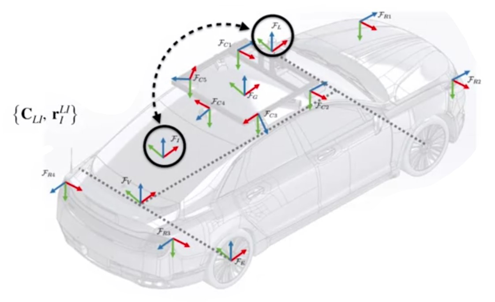

# Sensor Calibration

* Intrinsinc Calibration: Sensor specific paremters (itself)
    1. How can we determine the parameters of our sensor models?
        * Manufacturer specification
        * Measure by hand
        * [Estimate as part of the state](#calibration-by-estimation)
* [Extrinsic Calibration](#extrinsic-sensor-calibration): How are positioned and oriented respect to the system (vehicle)
    1. How do we determine the relative poses of all the sensors?
        * CAD model
        * Measure by hand
        * Estimate as part of the state
* Temporal Calibration: Time offset respect other elements
    1. How do we determine the relative time delays of all the sensors?
        * Assume zero
        * Hardware synchronization
        * Estimate as part of the state

## Calibration by Estimation

## Extrinsic Sensor Calibration

$$\{\bm{C}_{LI},\bm{r}_1^{LI} \}$$
