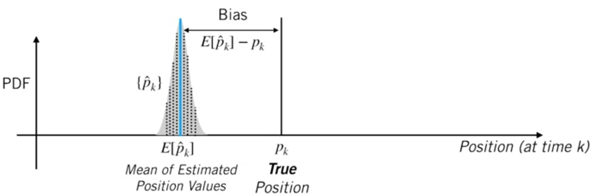
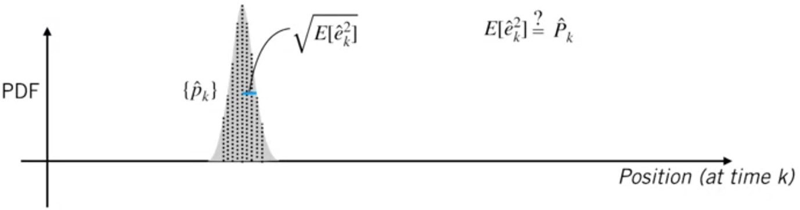

# The **linear** Kalman Filter

The Kalman Filter requires the following motion and measurement models:

* Motion Model: $$\bm{x}_k=\bm{F}_{k-1}\bm{X}_{k-1}+\bm{G}_{k-1}\bm{U}_{k-1}+\bm{w}_{k-1}$$

> $\bm{u}_{k-1}$ is the input  
> $\bm{w}_{k-1}$ is noise

* Measurement model:$$\bm{y}_{k}=\bm{H}_{k}\bm{x}_{k}+\bm{v}_{k}$$

> $\bm{v}_{k}$ is noise

With the following noise properties:

* Measurement noise:
$$\bm{v}_k \sim\mathcal{N}(\bm{0},\bm{R}_k)$$
* Process or motion noise:
$$\bm{w}_k \sim\mathcal{N}(\bm{0},\bm{Q}_k)$$

*The Kalman filter is a **recursive least squares** estimator that **also includes a motion model**.*

1. Prediction
$$\check{\bm{x}}_k=\bm{F}_{k-1}\bm{x}_{k-1}+\bm{G}_{k-1}\bm{u}_{k-1}$$
$$\check{\bm{P}}_k=\bm{F}_{k-1}\hat{\bm{P}}_{k-1}\bm{F}_{k-1}^T+\bm{Q}_{k-1}$$
2. Optimal gain
$$\bm{K}_{k}=\check{\bm{P}}_{k}\bm{H}_{k}^T\left(\bm{H}_{k}\check{\bm{P}}_{k}\bm{H}_{k}^T+\bm{R}_{k}\right)^{-1}$$
3. Correction
$$\hat{\bm{x}}_{k}=\check{\bm{x}}_{k}+\bm{K}_{k}\left(\bm{y}_k-\bm{H}_{k}\check{\bm{x}}_{k}\right)$$
$$\hat{\bm{P}}_{k}=\left(\bm{1}-\bm{K}_{k}\bm{H}_{k}\right)\check{\bm{P}}_{k}$$

> Here
 
>* $\left(\bm{y}_k-\bm{H}_{k}\check{\bm{x}}_{k}\right)$ is often called the *"innovation"*
>* "Checked" variables represents predicted for example, $\check{\bm{x}}_k$ (given motion model) at time k
>* "Hatted" variables represents **corrected prediction** for example, $\hat{\bm{x}}_k$ (given measurement) at time k

## Example

## The Kalman Filter and The Bias BLUEs

Process/Model: $$\bm{x}_k=\bm{F}_{k-1}\bm{X}_{k-1}+\bm{G}_{k-1}\bm{U}_{k-1}+\bm{w}_{k-1}$$

Measurement:$$\bm{y}_{k}=\bm{H}_{k}\bm{x}_{k}+\bm{v}_{k}$$

Drive the car for K time steps, record estimation error, repeat.....

We say an estimator or filter is unbiased if it produces an 'average' error of zero at a particular time step k, over many trials.

This filter is an unbiased if for all k,
$$E[\hat{e}_k]=E[\hat{p}_k-p_k]=E[\hat{p}]-p_k = 0$$

### Bias in State Estimation

Predicted state error $$\check{\bm{e}}_k=\check{\bm{x}}_k-x_k$$
Corrected estimate error $$\hat{\bm{e}}_k=\hat{\bm{x}}_k-\bm{x}_k$$

Using the Kalman Filter equations, we can derive:
$$\check{\bm{e}}_k=\bm{F}_{k-1}\check{\bm{e}}_{k-1}-\bm{w}_k$$
$$\hat{\bm{e}}_k=\left(\bm{1}-\bm{K}_k\bm{H}_k\right)\check{\bm{e}}_k+\bm{K}_k\bm{v}_k$$

For the Kalman Filter, for all $k$,
$$E[\check{\bm{e}}_k]=E[\bm{F}_{k-1}\check{\bm{e}}_{k-1}-\bm{w}]_k\\=\bm{F}_{k-1}E[\check{\bm{e}}_{k-1}]-E[\bm{w}]\\=0
$$
$$E[\hat{\bm{e}}_k]=E[\left(\bm{1}-\bm{K}_k\bm{H}_k\right)\check{\bm{e}}_k+\bm{K}_k\bm{v}_k]\\=\left(\bm{1}-\bm{K}_k\bm{H}_k\right)E[\check{\bm{e}}_k]+\bm{K}_kE[\bm{v}_k]\\=0$$

> Note: this does not mean that the error on a given trial will be zero, but that, with enough trials, our expected error is zero!

### Consistency in State Estimation

This filter is consistent if for all k,$$E[\hat{e}_k^2]=E[(\hat{p}_k-p_k)^2]=\bm{\hat{P}}_k$$

One can also show (with more algebra!) that for all k,
$$E[\check{\bm{e}}_k\check{\bm{e}}_k^T]=\check{\bm{P}}_k\quad
E[\hat{\bm{e}}_k\hat{\bm{e}}_k^T]=\hat{\bm{P}}_k$$
>Consistent predictions!

Provided,
$$E[\bm{\hat{e}}_0\bm{\hat{e}}_0^T]=\bm{\check{P}}_0 \quad E[\bm{v}]=0 + \text{white noise}\quad E[\bm{w}]=0 + \text{white noise}$$

## Additional Material

* [Blog post](https://www.bzarg.com/p/how-a-kalman-filter-works-in-pictures/) by Tim Babb explaining the Kalman filter.  Babb is the Lighting Optimization Lead for Pixar Animation Studios.

* You can find an extensive, detailed treatment of the Kalman filter in Chapter 3, Section 3 of Timothy D. Barfoot, [State Estimation for Robotics](./State%20estimation%20for%20robotics-e.pdf) (2017) (available for free).

* Read another detailed explanation in Chapter 5, Section 1 of Dan Simon, Optimal State Estimation (2006).

* Explore a variety of great resources related to the Kalman filter on [this page](https://www.cs.unc.edu/~welch/kalman/) maintained by Greg Welch from the University of Central Florida and Gary Bishop from the University of North Carolina at Chapel Hill.

* Read Kalman's [original article](https://www.cs.unc.edu/~welch/kalman/kalmanPaper.html) on the linear filter, courtesy of Welch and Bishop and hosted at UNC at Chapel Hill (available for free).

* Overview of the properties of the Kalman filter in Chapter 5, Section 2 of Dan Simon, Optimal State Estimation (2006)
