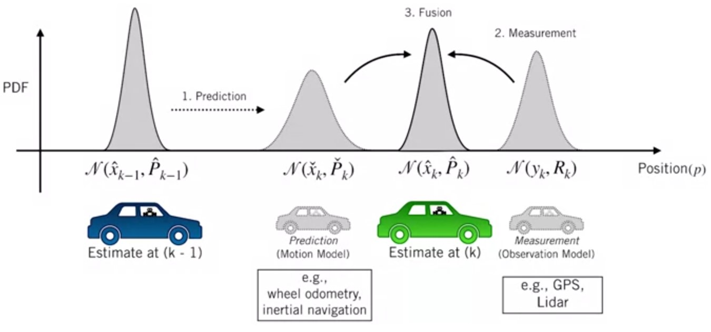
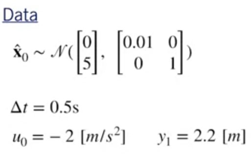
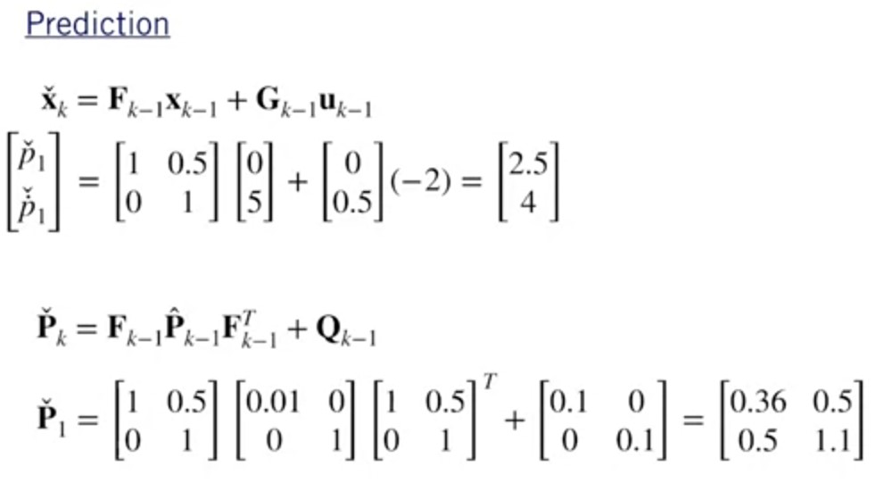
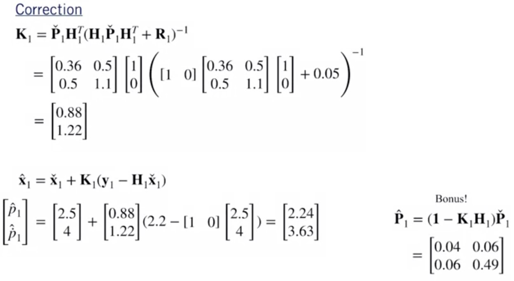

# The **linear** Kalman Filter

The Kalman Filter requires the following motion and measurement models:

* Motion Model: $$\bm{x}_k=\bm{F}_{k-1}\bm{X}_{k-1}+\bm{G}_{k-1}\bm{U}_{k-1}+\bm{w}_{k-1}$$

> $\bm{u}_{k-1}$ is the input  
> $\bm{w}_{k-1}$ is noise

* Measurement model:$$\bm{y}_{k}=\bm{H}_{k}\bm{x}_{k}+\bm{v}_{k}$$

> $\bm{v}_{k}$ is noise

With the following noise properties:

* Measurement noise:
$$\bm{v}_k \sim\mathcal{N}(\bm{0},\bm{R}_k)$$
* Process or motion noise:
$$\bm{w}_k \sim\mathcal{N}(\bm{0},\bm{Q}_k)$$

*The Kalman filter is a **recursive least squares** estimator that **also includes a motion model**.*

1. Prediction
$$\check{\bm{x}}_k=\bm{F}_{k-1}\bm{x}_{k-1}+\bm{G}_{k-1}\bm{u}_{k-1}$$
$$\check{\bm{P}}_k=\bm{F}_{k-1}\hat{\bm{P}}_{k-1}\bm{F}_{k-1}^T+\bm{Q}_{k-1}$$
2. Optimal gain
$$\bm{K}_{k}=\check{\bm{P}}_{k}\bm{H}_{k}^T\left(\bm{H}_{k}\check{\bm{P}}_{k}\bm{H}_{k}^T+\bm{R}_{k}\right)^{-1}$$
3. Correction
$$\hat{\bm{x}}_{k}=\check{\bm{x}}_{k}+\bm{K}_{k}\left(\bm{y}_k-\bm{H}_{k}\check{\bm{x}}_{k}\right)$$
$$\hat{\bm{P}}_{k}=\left(\bm{1}-\bm{K}_{k}\bm{H}_{k}\right)\check{\bm{P}}_{k}$$

> Here
 
>* $\left(\bm{y}_k-\bm{H}_{k}\check{\bm{x}}_{k}\right)$ is often called the *"innovation"*
>* "Checked" variables represents predicted for example, $\check{\bm{x}}_k$ (given motion model) at time k
>* "Hatted" variables represents **corrected prediction** for example, $\hat{\bm{x}}_k$ (given measurement) at time k

## Example

