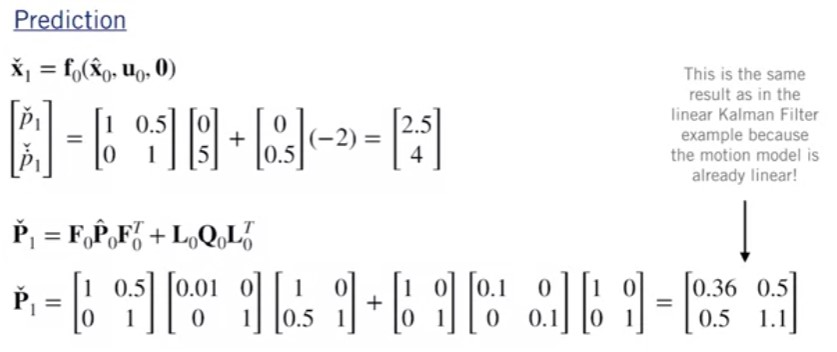
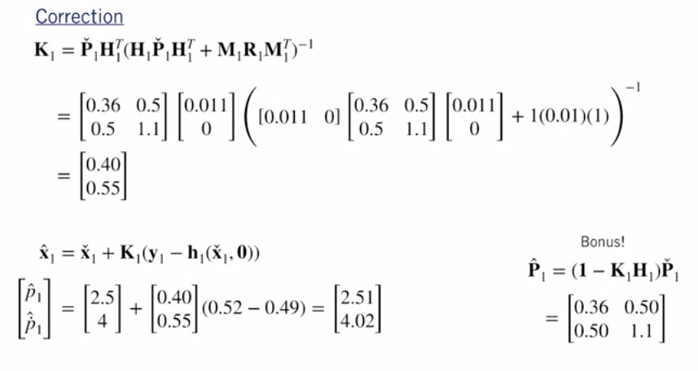

# The Nonlinear Kalman Filter

## The Extended Kalman Filter

## Linearizing a nonlinear system

For the Extended Kalman Filter (EKF), we choose the operating point to be our most recent state estimate, our known input, and zero noise

Linearized motion model:
$$\bm{x}_k=\bm{f}_{k-1}\left(\bm{x}_{k-1},\bm{u}_{k-1},\bm{w}_{k-1}\right)\approx \bm{f}_{k-1} \left(\hat{\bm{x}}_{k-1},\bm{u}_{k-1},0\right)+\left. \frac{\partial \bm{f}_{k-1}}{\partial\bm{x}_{k-1}} \right|_{\hat{\bm{x}}_{k-1},\bm{u}_{k-1},0} \left(\bm{x}_{k-1}-\hat{\bm{x}}_{k-1} \right)+
\left. \frac{\partial \bm{f}_{k-1}}{\partial\bm{w}_{k-1}} \right|_{\hat{\bm{x}}_{k-1},\bm{u}_{k-1},0} \bm{w}_{k-1}
$$
$$\left. \frac{\partial \bm{f}_{k-1}}{\partial\bm{x}_{k-1}} \right|_{\hat{\bm{x}}_{k-1},\bm{u}_{k-1},0} =\bm{F}_{k-1} \quad\quad
\left. \frac{\partial \bm{f}_{k-1}}{\partial\bm{w}_{k-1}} \right|_{\hat{\bm{x}}_{k-1},\bm{u}_{k-1},0} =\bm{L}_{k-1} $$

Linearized measurement model
$$\bm{y}_k=\bm{h}_{k}\left(\bm{x}_{k},\bm{v}_{k}\right)\approx \bm{h}_{k} \left(\check{\bm{x}}_{k},0\right)+\left. \frac{\partial \bm{h}_{k}}{\partial\bm{x}_{k-1}} \right|_{\check{\bm{x}}_{k},0} \left(\bm{x}_{k}-\check{\bm{x}}_{k} \right)+
\left. \frac{\partial \bm{h}_{k}}{\partial\bm{v}_{k}} \right|_{\hat{\bm{x}}_{k},0} \bm{v}_{k}
$$
$$\left. \frac{\partial \bm{h}_{k}}{\partial\bm{x}_{k-1}} \right|_{\check{\bm{x}}_{k},0} =\bm{H}_{k} \quad\quad
\left. \frac{\partial \bm{h}_{k}}{\partial\bm{v}_{k}} \right|_{\hat{\bm{x}}_{k},0} =\bm{M}_{k} $$

We now have a linear system in state-space! The matrices $\bm{F}_{k-1}$, $\bm{L}_{k-1}$, $\bm{H}_{k}$, and $\bm{M}_{k}$ are
called the Jacobian matrices of the system.

Intuitively, the Jacobian matrix tells you how fast each output of the function is changing along each input dimension

## Putting it all together

With our linearized models and Jacobians, we can now use the Kalman Filter equations!

## Example

Using the Extended Kalman Filter equations, what is our updated position?
$$\hat{p}_1$$

## An Improvement EKF - The Error State Extended Kalman Filter

What's in a State?

We can think Of the vehicle state as composed Of two parts:

$$\bm{x}=\bm{\hat{x}}+\delta\bm{x}$$

* $\bm{x}$: True State
* $\bm{\hat{x}}$: Nominal State ("Large")
* $\delta\bm{x}$: Error State ("Small")

* We can continuously update the nominal state by integrating the motion model
* Modelling errors and process noise accumulate into the error state

### The Error-State Extended Kalman Filter

The Error-State Extended Kalman Filter estimates the error state directly and uses it as a correction to the nominal state:

**Linearized motion model**
$$\bm{x}_k = \bm{f}_{k-1}(\bm{\hat{x}}_{k-1},\bm{u}_{k-1},\bm{0})+\bm{F}_{k-1}(\bm{x}_{k-1}-\bm{\hat{x}}_{k-1})+\bm{L}_{k-1}\\\downarrow\\
\bm{x}_k - \bm{f}_{k-1}(\bm{\hat{x}}_{k-1},\bm{u}_{k-1},\bm{0})=\bm{F}_{k-1}(\bm{x}_{k-1}-\bm{\hat{x}}_{k-1})+\bm{L}_{k-1}\\ \downarrow \\
\delta\bm{x}_k= \bm{x}_k - \bm{f}_{k-1}(\bm{\hat{x}}_{k-1},\bm{u}_{k-1},\bm{0}) \quad  \delta\bm{x}_{k-1}= \bm{x}_{k-1} - \bm{\hat{x}}_{k-1}$$

**Linearized measurement model**
$$\bm{y}_k= \bm{h}_k(\bm{\check{x},0})+\bm{H}_k(\bm{x}_k-\check{\bm{x}}_k)+\bm{M}_k\bm{v}_k\\\downarrow\\
\bm{x}_k-\check{\bm{x}}_k=\delta\bm{x}_k$$

> Where $\delta\bm{x}_k$ and $\delta\bm{x}_{k-1}$ are Error States

Loop:

1. Update nominal state with motion model:
$$\check{\bm{x}}_k=\bm{f}_{k-1}(\bm{x}_{k-1},\bm{u}_{k-1},\bm{0}) \quad\quad \bm{x}_{k-1} \text{ could be also } \bm{\check{x}}_{k-1} \text{ or } \bm{\hat{x}}_{k-1}$$
2. Propagate uncertainity
$$\bm{\check{P}}_k=\bm{F}_{k-1}\bm{P}_{k-1}\bm{F}_{k-1}^T+\bm{L}_{k-1}\bm{Q}_{k-1}\bm{L}_{k-1}^T \quad\quad \bm{P}_{k-1} \text{ could be also } \bm{\check{P}}_{k-1} \text{ or } \bm{\hat{P}}_{k-1}$$
3. If a measurement is available:
   1. Compute Kalman Gain
   $$\bm{K}_k= \bm{\check{P}}_{k}\bm{H}_k^T(\bm{H}_k\bm{\check{P}}_{k}\bm{H}_k^T+\bm{R})^-1$$
   2. Compute error state $$\delta\bm{\hat{x}}_k=\bm{K}_k(\bm{y}_k-\bm{h}_k(\check{\bm{x}}_k,0))$$
   3. Correct nominal state $$\bm{\hat{x}}_k=\check{\bm{x}}_k+\delta\bm{\hat{x}}_k$$
   4. Update state covariance $$\hat{\bm{P}}_k=(\bm{1}-\bm{K}_k\bm{H}_k)\check{\bm{P}}_k$$

## Why use the ES-EKF?

**Better performance compared to the vanilla EKF** 
The "small" error state is more amenable to linear filtering than the "large" nominal state, which can be integrated nonlinearly

**Easy to work with constrained quantities (e.g., rotations in 3D)**  
We can also break down the state using a generalized composition operator
$$\bm{x}=\hat{\bm{x}}\oplus\delta\bm{x}$$
>$\bm{x}$ true state 
>$\bm{\hat{x}}$ Nominal State (Overparamatrized, constrained) 
>$\delta\bm{x}$ Error State (Minimal parametrization, unsconstrained)

## Limitation of the EKF

The EKF works by linearizing the nonlinear motion and measurement models to update the mean and covariance of the state.

The difference between the linear approximation and the nonlinear function is called linearization error

In general, linearization error depends on:

1. How nonlinear the function is
2. How far away from the operating point the linear approximation is being used

$$f(x)\approx f(a)+\left. \frac{\partial f(x)}{\partial x} \right|_{x=a} (x-a)$$

The EKF is prone to linearization error when:
1. The system dynamics are highly nonlinear
2. The sensor sampling time is slow relative how fast the system is evolving

This has two important consequences:
1. The estimated mean state can become very different from the true state
2. The estimated state covariance can fail to capture the true uncertainty in the state

> Linearization error can cause the estimator to be
overconfident in a wrong answer!

Computing Jacobian matrices for complicated nonlinear functions is also a common source of error in EKF implementations!

* Analytical differentiation is prone to human error
* Numerical differentiation can be slow and unstable
* Automatic differentiation (e.g., at compile time) can also behave unpredictably

## An Alternative to the EKF - The Unscented Kalman Filter

"It is easier to approximate a probability distribution than it is to approximate an arbitrary nonlinear function" <cite>— S.Julier, J. Uhlmann, and H. Durrant-Whyte (2000)</cite>

### Choosing sigmapoints

For an $N$-dimensional $\mathcal{N}(\bm{\mu_x},\bm{\Sigma_{xx}})$ PDF we need $2N+ 1$ sigma points:

1. Compute the Cholesky Decomposition of the covariance matrix
$$\bm{L}\bm{L}^T=\bm{\Sigma_{xx}} \quad (\bm{L} \text{ lower triangular})$$
2. Calculate the sigma-points
$$\bm{x}_0=\bm{\mu}_x\\
\bm{x}_i=\bm{\mu}_x+\sqrt{N+\kappa} \ col_i\bm{L} \quad i=1,\dots N\\
\bm{x}_{i+N}=\bm{\mu}_x-\sqrt{N+\kappa} \ col_i\bm{L} \quad i=1,\dots N
$$

> Where $\kappa=3-N$ for partial PDFs

#### Transforming and recombining

Next we pass each of our $2N+ 1$ sigma points through the nonlinear function $\bm{h}(\bm{x})$
$$\bm{y}_i=\bm{h}(\bm{x_i}) \quad i=0,\dots,2N$$

And finally compute the mean and covariance of the output PDF

$$\text{Mean: }\bm{\mu}_{y}=\sum_{i=0}^{2N}\alpha_i\bm{y}_i$$
$$\text{Covariance: }\bm{\Sigma}_{yy}=\sum_{i=0}^{2N}\alpha_i(\bm{y}_i-\bm{\mu}_{y})(\bm{y}_i-\bm{\mu}_{y})^T$$

$$\text{Weights: } \bm{\alpha}_i=\left\{
  \begin{aligned}
  \frac{\kappa}{N+\kappa} && i =0 \\
  \frac{1}{2}\frac{1}{N+\kappa} && \text{otherwise}
  \end{aligned}
\right.$$

## The Unscented Kalman Filter (UKF)
We can easily use the Unscented Transform in our Kalman Filtering framework with nonlinear models:

**Nonlinear motion model** $$\bm{x}_k=\bm{f}_{k-1}(\bm{x}_{k-1},\bm{u}_{k-1},\bm{w}_{k-1})\\\bm{w}_k\sim\mathcal{N}(\bm{0},\bm{Q}_k)$$
**Nonlinear measurement model** $$\bm{y}_k=\bm{h}_k(\bm{x}_k,\bm{v}_k)\\\bm{v}_k\sim\mathcal{N}(\bm{0},\bm{R}_k)$$

Instead of approximating the system equations by linearizing, we will calculate sigma points and use the Unscented Transform to approximate the PDFs directly!

### Prediction step
To propagate the state from time $(k— 1)$ to time $k$, apply the Unscented Transform using the current best guess for the mean and covariance

1. Compute sigma points
$$\bm{\hat{L}}_{k-1}\bm{\hat{L}}_{k-1}^T=\bm{\hat{P}}_{k-1}$$
$$\bm{\hat{x}}_{k-1}^{(0)}=\bm{\hat{x}}_{k-1}$$
$$\bm{\hat{x}}_{k-1}^{(i)}=\bm{\hat{x}}_{k-1}+\sqrt{N+\kappa} \ col_i\bm{\hat{L}}_{k-1} \quad i=1,\dots N$$
$$
\bm{\hat{x}}_{k-1}^{(i+N)}=\bm{\hat{x}}_{k-1}-\sqrt{N+\kappa} \ col_i\bm{\hat{L}}_{k-1} \quad i=1,\dots N
$$

2. Propagate sigma points
$$\bm{\check{x}}_k^{(i)}=\bm{f}_{k-1}(\bm{\hat{x}}_{k-1}^{(i)},\bm{u}_{k-1},\bm{0}) \quad i=0,\dots 2N$$

3. Compute predicted mean and covariance
$$\bm{\alpha}^{(i)}=\left\{
  \begin{aligned}
  \frac{\kappa}{N+\kappa} && i =0 \\
  \frac{1}{2}\frac{1}{N+\kappa} && \text{otherwise}
  \end{aligned}
\right.$$
$$\bm{\check{x}}_{k}=\sum_{i=0}^{2N}\alpha^{(i)}\bm{\check{x}}_k^{(i)}$$
$$\bm{\check{P}}_{k}=\sum_{i=0}^{2N}\alpha^{(i)}(\bm{\check{x}}_k^{(i)}-\bm{\check{x}}_{k})(\bm{\check{x}}_k^{(i)}-\bm{\check{x}}_{k})^T+\bm{Q}_{k-1}$$

> $\bm{Q}_{k-1}$ Additive process noise

### Correction step

To correct the state estimate using measurements at time k, use the nonlinear measurement model and the sigma points from the prediction step to predict the measurements

1. Predict measurements from propagated sigma points
$$\bm{\hat{y}}_k^{(i)}=\bm{h}_k(\bm{\check{x}}_k^{(i),\bm{0}})\quad i=0,\dots2N$$
2. Estimate mean and covariance of predicted measurements
$$\bm{\hat{y}}_{k}=\sum_{i=0}^{2N}\alpha^{(i)}\bm{\hat{y}}_k^{(i)}$$
$$\bm{P}_{y}=\sum_{i=0}^{2N}\alpha^{(i)}(\bm{\hat{y}}_k^{(i)}-\bm{\hat{y}}_{k})(\bm{\hat{y}}_k^{(i)}-\bm{\hat{y}}_{k})^T+\bm{R}_{k}$$

3. Compute cross-covariance and Kalman gain
$$\bm{P}_{xy}=\sum_{i=0}^{2N}\alpha^{(i)}(\bm{\check{x}}_k^{(i)}-\bm{\check{x}}_{k})(\bm{\hat{y}}_k^{(i)}-\bm{\hat{y}}_{k})^T$$
$$\bm{K}_k=\bm{P}_{xy}\bm{P}_{y}^{-1}$$

4. Compute corrected mean and covariance
$$\bm{\hat{x}}_k=\check{\bm{x}}_k=\bm{K}_k(\bm{y}_k-\bm{\hat{y}}_k)$$
$$\bm{\hat{P}}_k=\check{\bm{P}}_k-\bm{K}_k\bm{P}_y\bm{K}_k^T$$

>$\bm{R}_{k}$ Additive measurement noise

### UKF | Short example

## Summary

||EKF|ES-EKF|UKF|
|--|---|---|---|
|**Operating Principle**|
Linearization   (Full State)
|
Linearization  (Error State)
|Unscented Transform|
|**Accuracy**|Good|Better|Best|
|**Jacobians**|Required|Required|Not required|
|**Speed**|Slightly faster|Slightly faster|Slightly slower

## Additional Resources

* To learn more about nonlinear Kalman filtering, check out [this article](https://www.embedded.com/using-nonlinear-kalman-filtering-to-estimate-signals/) by Dan Simon (available for free).

* A detailed explanation of linearization and how it relates to the EKF can be found in Chapter 13,  Sections 1 and 2 of Dan Simon, Optimal State Estimation (2006)

* Review an important paper by Stergios Roumeliotis et al. on the use of the error-state Kalman filter for mobile robot localization. This paper deals with the important case of aided localization.

* Read Section 5 of a technical report by Joan Solà, [Quaternion kinematics for the error-state Kalman filter](https://arxiv.org/pdf/1711.02508.pdf), 2017
