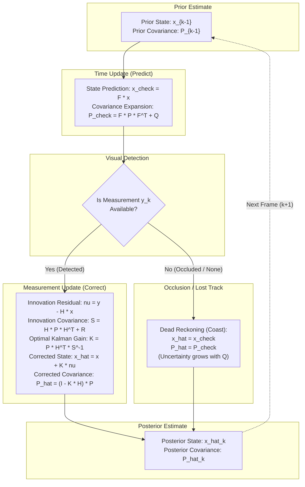

# Mathematical Foundations & NumPy Reference Guide for 2D Kalman Filtering

This guide provides a rigorous mathematical derivation of the **2D Constant Velocity Linear Kalman Filter** along with a reference of **key NumPy linear algebra concepts** (matrix definitions, initialization, transpose, multiplication, and inversion).

---

# Part 1: Mathematical Foundations



---

## 1. State & Measurement Space Formulation

### 1.1 State Vector ($\mathbf{x} \in \mathbb{R}^{4 \times 1}$)
The target is tracked in 2D image coordinates with a 4D kinematic state:
$$\mathbf{x}_k = \begin{bmatrix} p_x \\ p_y \\ v_x \\ v_y \end{bmatrix}$$
* $p_x, p_y$: Horizontal and vertical pixel positions.
* $v_x, v_y$: Horizontal and vertical pixel velocities in pixels per second ($\text{px}/\text{s}$).

### 1.2 Measurement Vector ($\mathbf{y} \in \mathbb{R}^{2 \times 1}$)
The visual detector observes only the 2D bounding-box centroid:
$$\mathbf{y}_k = \begin{bmatrix} p_{x,\text{meas}} \\ p_{y,\text{meas}} \end{bmatrix}$$

---

## 2. Derivation of System Matrices

### 2.1 State Transition Matrix ($\mathbf{F} \in \mathbb{R}^{4 \times 4}$)
Under the constant velocity assumption, the continuous-time kinematic differential equations are:
$$\dot{p}_x(t) = v_x(t), \quad \dot{v}_x(t) = 0$$
$$\dot{p}_y(t) = v_y(t), \quad \dot{v}_y(t) = 0$$

In continuous matrix form:
$$\dot{\mathbf{x}}(t) = \mathbf{A}\mathbf{x}(t), \quad \mathbf{A} = \begin{bmatrix} 0 & 0 & 1 & 0 \\ 0 & 0 & 0 & 1 \\ 0 & 0 & 0 & 0 \\ 0 & 0 & 0 & 0 \end{bmatrix}$$

Discretizing over time step $\Delta t = t_k - t_{k-1}$ using the matrix exponential:
$$\mathbf{F} = e^{\mathbf{A}\Delta t} = \mathbf{I} + \mathbf{A}\Delta t + \frac{(\mathbf{A}\Delta t)^2}{2!} + \dots$$
Because $\mathbf{A}^2 = \mathbf{0}$, the series terminates exactly:
$$\mathbf{F} = \begin{bmatrix}
1 & 0 & \Delta t & 0 \\
0 & 1 & 0 & \Delta t \\
0 & 0 & 1 & 0 \\
0 & 0 & 0 & 1
\end{bmatrix}$$

---

### 2.2 Measurement Observation Matrix ($\mathbf{H} \in \mathbb{R}^{2 \times 4}$)
The linear observation model maps the state $\mathbf{x}_k$ to the observation $\mathbf{y}_k$:
$$\mathbf{y}_k = \mathbf{H}\mathbf{x}_k + \mathbf{v}_k$$
Extracting only $(p_x, p_y)$:
$$\mathbf{H} = \begin{bmatrix}
1 & 0 & 0 & 0 \\
0 & 1 & 0 & 0
\end{bmatrix}$$

---

### 2.3 Process Noise Covariance Matrix ($\mathbf{Q} \in \mathbb{R}^{4 \times 4}$)
Target accelerations are modeled as continuous zero-mean white noise $\tilde{\mathbf{a}}(t) \sim \mathcal{N}(\mathbf{0}, \mathbf{Q}_c)$:
$$\mathbf{Q}_c = \begin{bmatrix} \sigma_a^2 & 0 \\ 0 & \sigma_a^2 \end{bmatrix}$$

The discrete process noise covariance is obtained by evaluating the stochastic convolution integral:
$$\mathbf{Q} = \int_0^{\Delta t} e^{\mathbf{A}(\Delta t - \tau)} \mathbf{L} \mathbf{Q}_c \mathbf{L}^T e^{\mathbf{A}^T(\Delta t - \tau)} d\tau$$
where $\mathbf{L} = \begin{bmatrix} \mathbf{0}_{2\times 2} \\ \mathbf{I}_{2\times 2} \end{bmatrix}$.

Evaluating this integral yields the **Continuous White Noise Acceleration (CWNA)** covariance:
$$\mathbf{Q} = \begin{bmatrix}
\frac{\Delta t^3}{3}\sigma_a^2 & 0 & \frac{\Delta t^2}{2}\sigma_a^2 & 0 \\
0 & \frac{\Delta t^3}{3}\sigma_a^2 & 0 & \frac{\Delta t^2}{2}\sigma_a^2 \\
\frac{\Delta t^2}{2}\sigma_a^2 & 0 & \Delta t\sigma_a^2 & 0 \\
0 & \frac{\Delta t^2}{2}\sigma_a^2 & 0 & \Delta t\sigma_a^2
\end{bmatrix}$$

Letting:
$$q_{\text{pos}} = \frac{\Delta t^3}{3}\sigma_a^2, \quad q_{\text{vel}} = \Delta t\sigma_a^2, \quad q_{pv} = \frac{\Delta t^2}{2}\sigma_a^2$$
$$\mathbf{Q} = \begin{bmatrix}
q_{\text{pos}} & 0 & q_{pv} & 0 \\
0 & q_{\text{pos}} & 0 & q_{pv} \\
q_{pv} & 0 & q_{\text{vel}} & 0 \\
0 & q_{pv} & 0 & q_{\text{vel}}
\end{bmatrix}$$

---

### 2.4 Measurement Noise Covariance Matrix ($\mathbf{R} \in \mathbb{R}^{2 \times 2}$)
Assuming isotropic, uncorrelated detector noise in the image plane with standard deviation $\sigma_{\text{meas}}$:
$$\mathbf{R} = \begin{bmatrix} \sigma_{\text{meas}}^2 & 0 \\ 0 & \sigma_{\text{meas}}^2 \end{bmatrix} = \sigma_{\text{meas}}^2 \mathbf{I}_{2 \times 2}$$

---

### 2.5 Initial Uncertainty Covariance Matrix ($\mathbf{P}_0 \in \mathbb{R}^{4 \times 4}$)
Prior to processing measurements, initial state uncertainty is initialized as:
$$\mathbf{P}_0 = \sigma_0^2 \mathbf{I}_{4 \times 4} = \begin{bmatrix}
\sigma_0^2 & 0 & 0 & 0 \\
0 & \sigma_0^2 & 0 & 0 \\
0 & 0 & \sigma_0^2 & 0 \\
0 & 0 & 0 & \sigma_0^2
\end{bmatrix}$$

---

## 3. Discrete Kalman Filter Algorithm

### 3.1 Time Update (Prediction)
Propagate state and uncertainty ahead in time by $\Delta t$:

1. **State Mean Prediction:**
   $$\check{\mathbf{x}}_k = \mathbf{F}\hat{\mathbf{x}}_{k-1}$$
2. **Covariance Prediction:**
   $$\check{\mathbf{P}}_k = \mathbf{F}\hat{\mathbf{P}}_{k-1}\mathbf{F}^T + \mathbf{Q}$$

---

### 3.2 Measurement Update (Correction)
When an observation $\mathbf{y}_k$ is received:

1. **Innovation (Measurement Residual):**
   $$\bf{\nu}_k = \mathbf{y}_k - \mathbf{H}\check{\mathbf{x}}_k \quad \in \mathbb{R}^{2 \times 1}$$
2. **Innovation Covariance:**
   $$\mathbf{S}_k = \mathbf{H}\check{\mathbf{P}}_k\mathbf{H}^T + \mathbf{R} \quad \in \mathbb{R}^{2 \times 2}$$
3. **Optimal Kalman Gain:**
   $$\mathbf{K}_k = \check{\mathbf{P}}_k\mathbf{H}^T \mathbf{S}_k^{-1} \quad \in \mathbb{R}^{4 \times 2}$$
4. **Updated State Estimate:**
   $$\hat{\mathbf{x}}_k = \check{\mathbf{x}}_k + \mathbf{K}_k\bf{\nu}_k \quad \in \mathbb{R}^{4 \times 1}$$
5. **Updated Error Covariance:**
   $$\hat{\mathbf{P}}_k = (\mathbf{I}_4 - \mathbf{K}_k\mathbf{H})\check{\mathbf{P}}_k \quad \in \mathbb{R}^{4 \times 4}$$

### 3.3 Occlusion (Dead Reckoning)
When no measurement is detected ($\mathbf{y}_k = \emptyset$):
$$\hat{\mathbf{x}}_k = \check{\mathbf{x}}_k, \quad \hat{\mathbf{P}}_k = \check{\mathbf{P}}_k$$

---
---

# Part 2: Key NumPy Concepts for Kalman Filtering

To implement these equations in Python without errors, understand the following foundational NumPy mechanics:

---

## 1. Matrix & Column Vector Definitions

In linear algebra, states and measurements are **column vectors** (matrices with shape $N \times 1$), NOT flat 1D arrays (shape $(N,)$).

### Creating 2D Matrices
```python
# General syntax: np.array([[row_1], [row_2], ...], dtype=np.float64)
A = np.array([
    [1.0, 2.0],
    [3.0, 4.0]
], dtype=np.float64)  # Shape: (2, 2)
```

### Creating Column Vectors vs Flat Arrays
```python
# CORRECT: 2D Column vector (Shape: 4x1)
x = np.array([[px], [py], [vx], [vy]], dtype=np.float64)  # x.shape == (4, 1)

# INCORRECT: Flat 1D array (Shape: (4,))
x_flat = np.array([px, py, vx, vy])  # Causes broadcasting errors during @ operations
```

---

## 2. Matrix Initialization Primitives

### Identity Matrix: `np.eye(N)`
Creates an $N \times N$ matrix with $1.0$ on the main diagonal and $0.0$ elsewhere:
$$\mathbf{I}_4 = \begin{bmatrix} 1 & 0 & 0 & 0 \\ 0 & 1 & 0 & 0 \\ 0 & 0 & 1 & 0 \\ 0 & 0 & 0 & 1 \end{bmatrix}$$

```python
I4 = np.eye(4, dtype=np.float64)
```

### Scaled Identity Matrix
To create $\sigma^2 \mathbf{I}_N$:
```python
# Multiplies every diagonal element by the scalar
P0 = np.eye(4, dtype=np.float64) * initial_variance
R  = np.eye(2, dtype=np.float64) * (measurement_noise_std ** 2)
```

### Zero Matrix / Vector: `np.zeros((rows, cols))`
```python
x = np.zeros((4, 1), dtype=np.float64)  # 4x1 column vector of zeros
```

### Array Copy: `.copy()`
NumPy assignments create views by default. Use `.copy()` to avoid mutating base matrices:
```python
self.P = self.P0.copy()
```

---

## 3. Matrix Transposition: `.T`

The transpose of matrix $\mathbf{A}$ is denoted $\mathbf{A}^T$, where rows and columns are swapped.
$$\mathbf{A} \in \mathbb{R}^{M \times N} \implies \mathbf{A}^T \in \mathbb{R}^{N \times M}$$

```python
# Transpose attribute: .T
F_transpose = self.F.T       # Shape: (4, 4) -> (4, 4)
H_transpose = self.H.T       # Shape: (2, 4) -> (4, 2)
```

Useful algebraic identity:
$$(\mathbf{A}\mathbf{B})^T = \mathbf{B}^T \mathbf{A}^T$$

---

## 4. Matrix Multiplication: `@` vs `*`

### Matrix Multiplication Operator (`@`)
Performs true linear algebraic matrix dot-product multiplication:
$$\mathbf{C}_{i,j} = \sum_k \mathbf{A}_{i,k}\mathbf{B}_{k,j}$$

```python
# Matrix-Vector product: (4x4) @ (4x1) -> (4x1)
x_check = self.F @ self.x

# Triple Matrix product: (4x4) @ (4x4) @ (4x4) -> (4x4)
P_pred = self.F @ self.P @ self.F.T

# Measurement prediction: (2x4) @ (4x1) -> (2x1)
y_pred = self.H @ self.x
```

### Elementwise Multiplication (`*`)
Multiplies corresponding elements individually or broadcasts scalars:
```python
# Scalar multiplication (CORRECT use of *):
R = np.eye(2) * 4.0  # Scales all elements

# WARNING: NEVER use * for matrix products!
# A * B performs elementwise multiplication, NOT matrix multiplication!
```

---

## 5. Matrix Inversion: `np.linalg.inv()`

For an invertible square matrix $\mathbf{S} \in \mathbb{R}^{2 \times 2}$, the inverse $\mathbf{S}^{-1}$ satisfies:
$$\mathbf{S}\mathbf{S}^{-1} = \mathbf{S}^{-1}\mathbf{S} = \mathbf{I}_2$$

```python
# Compute inverse of innovation covariance S (2x2):
S_inv = np.linalg.inv(S)  # Shape: (2, 2)

# Kalman Gain computation: (4x4) @ (4x2) @ (2x2) -> (4x2)
K = self.P @ self.H.T @ np.linalg.inv(S)
```

---

## 6. Comprehensive Dimension & Shape Verification

Always verify matrix dimensions before performing operations:

| Variable | Mathematical Symbol                 | Shape    | Description                         |
|:---------|:------------------------------------|:---------|:------------------------------------|
| `self.x` | $\mathbf{x}$                        | `(4, 1)` | State column vector                 |
| `self.P` | $\mathbf{P}$                        | `(4, 4)` | State uncertainty covariance        |
| `self.F` | $\mathbf{F}$                        | `(4, 4)` | State transition matrix             |
| `self.H` | $\mathbf{H}$                        | `(2, 4)` | Measurement observation matrix      |
| `self.Q` | $\mathbf{Q}$                        | `(4, 4)` | Process noise covariance matrix     |
| `self.R` | $\mathbf{R}$                        | `(2, 2)` | Measurement noise covariance matrix |
| `y`      | $\mathbf{y}$                        | `(2, 1)` | Measurement column vector           |
| `nu`     | $\bf{\nu}$                          | `(2, 1)` | Innovation residual vector          |
| `S`      | $\mathbf{S}$                        | `(2, 2)` | Innovation covariance matrix        |
| `K`      | $\mathbf{K}$                        | `(4, 2)` | Optimal Kalman Gain matrix          |
| `I_KH`   | $\mathbf{I} - \mathbf{K}\mathbf{H}$ | `(4, 4)` | Covariance reduction matrix         |
