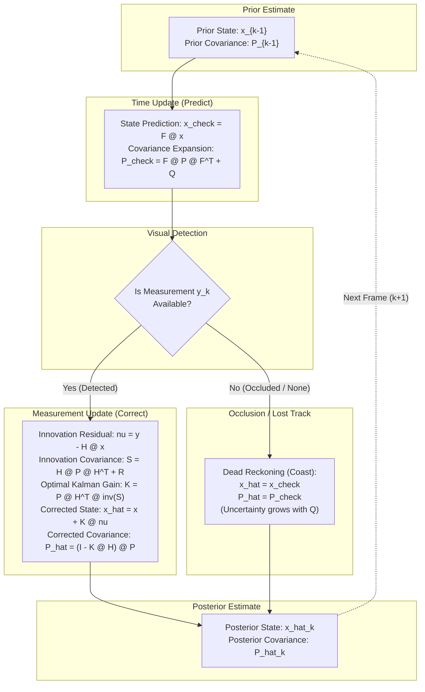

# Student Lab Manual: 2D Kinematic Kalman Filter for Visual Tracking

**Target Source File:** [`src/position_class/student_tracking_exercise.py`](file:///Users/yasuomaidana/Projects/classes/Self-Driving-Cars/State%20Estimation%20and%20Localization%20for%20Self-Driving%20Cars/position_class/src/position_class/student_tracking_exercise.py)  
**Parent Base Class:** [`src/position_class/base_kalman_tracker.py`](file:///Users/yasuomaidana/Projects/classes/Self-Driving-Cars/State%20Estimation%20and%20Localization%20for%20Self-Driving%20Cars/position_class/src/position_class/base_kalman_tracker.py)  
**Interactive Visualizer:** [`src/position_class/interactive_tracking_exercise.py`](file:///Users/yasuomaidana/Projects/classes/Self-Driving-Cars/State%20Estimation%20and%20Localization%20for%20Self-Driving%20Cars/position_class/src/position_class/interactive_tracking_exercise.py)  
**CLI Configuration:** [`src/position_class/tracking_config.py`](file:///Users/yasuomaidana/Projects/classes/Self-Driving-Cars/State%20Estimation%20and%20Localization%20for%20Self-Driving%20Cars/position_class/src/position_class/tracking_config.py)

---

## 1. Lab Objectives

In visual perception for autonomous vehicles and robotics, object detectors (e.g., YOLO, SSD, Faster-RCNN, or classical corner/feature trackers) provide bounding boxes at discrete frame intervals. However, raw visual detections exhibit:
1. **High-frequency sensor jitter** (fluctuations in bounding box boundaries frame-to-frame).
2. **Missing detections / False Negatives** (due to partial or complete occlusions, lighting changes, or blur).
3. **No direct velocity measurements** (detectors output only static bounding box coordinates $[p_x, p_y]$).

In this exercise, you will implement a **2D Discrete Linear Kalman Filter (LKF)** from first principles. By leveraging a **Continuous White Noise Acceleration (CWNA) / Constant Velocity (CV)** kinematic motion model, your filter will:
* Filter out high-frequency detection jitter.
* Continuously estimate unobserved target velocities $[v_x, v_y]^T$.
* Perform **dead reckoning** (forward state projection) through visual occlusions.
* Quantify tracking confidence using a dynamic 2D error covariance ellipse.



---

## 2. State & Measurement Vector Definitions

### 2.1 State Vector ($\mathbf{x} \in \mathbb{R}^{4 \times 1}$)
The internal state is represented as a 4-dimensional column vector comprising 2D image coordinates (in pixels) and 2D pixel velocities:
$$\mathbf{x} = \begin{bmatrix} p_x \\ p_y \\ v_x \\ v_y \end{bmatrix}$$
* $p_x, p_y$: Center of Mass (CoM) pixel coordinates ($x$ horizontal, $y$ vertical downward).
* $v_x, v_y$: Velocity in pixels per second ($\text{px}/\text{s}$).

### 2.2 Measurement Vector ($\mathbf{y} \in \mathbb{R}^{2 \times 1}$)
The camera detector provides only 2D centroid observations:
$$\mathbf{y} = \begin{bmatrix} p_{x,\text{meas}} \\ p_{y,\text{meas}} \end{bmatrix}$$

---

## 3. Deep-Dive: Mathematical Formulations & Matrix Definitions

This section provides the mathematical derivations and physical intuitions required to construct the matrices in `__init__`.

---

### 3.1 State Transition Matrix ($\mathbf{F} \in \mathbb{R}^{4 \times 4}$)

#### Physical Derivation
Under the constant velocity assumption, continuous-time kinematics are:
$$\dot{p}_x(t) = v_x(t), \quad \dot{v}_x(t) = 0$$
$$\dot{p}_y(t) = v_y(t), \quad \dot{v}_y(t) = 0$$

Integrating over the discrete frame interval $\Delta t = t_k - t_{k-1}$:
$$p_x(k) = p_x(k-1) + v_x(k-1)\Delta t$$
$$p_y(k) = p_y(k-1) + v_y(k-1)\Delta t$$
$$v_x(k) = v_x(k-1)$$
$$v_y(k) = v_y(k-1)$$

#### Matrix Structure
$$\mathbf{F} = \begin{bmatrix}
1 & 0 & \Delta t & 0 \\
0 & 1 & 0 & \Delta t \\
0 & 0 & 1 & 0 \\
0 & 0 & 0 & 1
\end{bmatrix}$$

#### Python Definition
```python
self.F = np.array([
    [1.0, 0.0, self.dt, 0.0    ],
    [0.0, 1.0, 0.0,     self.dt],
    [0.0, 0.0, 1.0,     0.0    ],
    [0.0, 0.0, 0.0,     1.0    ]
], dtype=np.float64)
```

---

### 3.2 Measurement Observation Matrix ($\mathbf{H} \in \mathbb{R}^{2 \times 4}$)

#### Physical Derivation
The measurement model relates the true state $\mathbf{x}_k$ to the observation $\mathbf{y}_k$:
$$\mathbf{y}_k = \mathbf{H}\mathbf{x}_k + \mathbf{v}_k$$
Because our visual detector only measures position $(p_x, p_y)$ and has zero sensitivity to velocity $(v_x, v_y)$:
$$\begin{bmatrix} p_{x,\text{meas}} \\ p_{y,\text{meas}} \end{bmatrix} = 
\begin{bmatrix} 1 & 0 & 0 & 0 \\ 0 & 1 & 0 & 0 \end{bmatrix}
\begin{bmatrix} p_x \\ p_y \\ v_x \\ v_y \end{bmatrix} + \mathbf{v}_k$$

#### Matrix Structure
$$\mathbf{H} = \begin{bmatrix}
1 & 0 & 0 & 0 \\
0 & 1 & 0 & 0
\end{bmatrix}$$

#### Python Definition
```python
self.H = np.array([
    [1.0, 0.0, 0.0, 0.0],
    [0.0, 1.0, 0.0, 0.0]
], dtype=np.float64)
```

---

### 3.3 Process Noise Covariance Matrix ($\mathbf{Q} \in \mathbb{R}^{4 \times 4}$)

#### Continuous White Noise Acceleration (CWNA) Model
In reality, targets accelerate, brake, and turn. We model these deviations as a zero-mean continuous white acceleration disturbance $\tilde{a}(t) \sim \mathcal{N}(0, \sigma_a^2)$:
$$\dot{\mathbf{x}}(t) = \mathbf{A}\mathbf{x}(t) + \mathbf{L}\tilde{\mathbf{a}}(t), \quad 
\mathbf{L} = \begin{bmatrix} 0 & 0 \\ 0 & 0 \\ 1 & 0 \\ 0 & 1 \end{bmatrix}$$

The discrete process noise covariance is computed via the matrix exponential integral:
$$\mathbf{Q} = \int_0^{\Delta t} e^{\mathbf{A}(\Delta t - \tau)} \mathbf{L} \mathbf{Q}_c \mathbf{L}^T e^{\mathbf{A}^T(\Delta t - \tau)} d\tau$$

For decoupled 1D axes, this yields:
$$\mathbf{Q}_{1\text{D}} = \sigma_a^2 \begin{bmatrix} \frac{\Delta t^3}{3} & \frac{\Delta t^2}{2} \\ \frac{\Delta t^2}{2} & \Delta t \end{bmatrix}$$

Combining both independent $x$ and $y$ axes into a 4x4 matrix:
$$\mathbf{Q} = \begin{bmatrix}
q_{\text{pos}} & 0 & q_{pv} & 0 \\
0 & q_{\text{pos}} & 0 & q_{pv} \\
q_{pv} & 0 & q_{\text{vel}} & 0 \\
0 & q_{pv} & 0 & q_{\text{vel}}
\end{bmatrix}$$
where:
$$q_{\text{pos}} = \frac{\Delta t^3}{3} \sigma_a^2, \quad q_{\text{vel}} = \Delta t \sigma_a^2, \quad q_{pv} = \frac{\Delta t^2}{2} \sigma_a^2$$

> [!NOTE]
> The cross-term $q_{pv} = \frac{\Delta t^2}{2} \sigma_a^2$ accounts for the physical correlation between acceleration disturbance and position drift over the sampling interval $\Delta t$.

#### Python Definition
```python
sigma_a = self.process_noise_std
q_pos = (self.dt**3) / 3.0 * (sigma_a**2)
q_vel = self.dt * (sigma_a**2)
q_pv = (self.dt**2) / 2.0 * (sigma_a**2)

self.Q = np.array([
    [q_pos, 0.0,   q_pv,  0.0  ],
    [0.0,   q_pos, 0.0,   q_pv ],
    [q_pv,  0.0,   q_vel, 0.0  ],
    [0.0,   q_pv,  0.0,   q_vel]
], dtype=np.float64)
```

---

### 3.4 Measurement Noise Covariance Matrix ($\mathbf{R} \in \mathbb{R}^{2 \times 2}$)

#### Physical Derivation
Detection noise arises from pixel discretization, boundary uncertainty, and optical blur. Assuming uncorrelated pixel noise with standard deviation $\sigma_{\text{meas}}$ in both horizontal and vertical axes:
$$\mathbf{R} = \begin{bmatrix} \sigma_{\text{meas}}^2 & 0 \\ 0 & \sigma_{\text{meas}}^2 \end{bmatrix} = \sigma_{\text{meas}}^2 \mathbf{I}_{2 \times 2}$$

#### Python Definition
```python
self.R = np.eye(2, dtype=np.float64) * (self.measurement_noise_std**2)
```

---

### 3.5 Initial State Uncertainty Matrix ($\mathbf{P}_0 \in \mathbb{R}^{4 \times 4}$)

#### Physical Derivation
When an object is first detected at $k=0$, we set initial velocity to 0 with high uncertainty:
$$\mathbf{P}_0 = \operatorname{diag}(\sigma_{p_0}^2, \sigma_{p_0}^2, \sigma_{v_0}^2, \sigma_{v_0}^2) = \sigma_0^2 \mathbf{I}_{4 \times 4}$$

#### Python Definition
```python
self.P0 = np.eye(4, dtype=np.float64) * self.initial_cov
```

---

## 4. Implementation Walkthrough (`student_tracking_exercise.py`)

Open [`src/position_class/student_tracking_exercise.py`](file:///Users/yasuomaidana/Projects/classes/Self-Driving-Cars/State%20Estimation%20and%20Localization%20for%20Self-Driving%20Cars/position_class/src/position_class/student_tracking_exercise.py) and implement the following three methods:

### 4.1 Constructor: `__init__`
Populate `self.F`, `self.H`, `self.Q`, `self.R`, and `self.P0` using the matrix definitions derived in [Section 3](#3-deep-dive-mathematical-formulations--matrix-definitions).

```python
class StudentKalmanTracker2D(BaseKalmanTracker2D):
    def __init__(
        self,
        dt: float = 1.0 / 30.0,
        process_noise_std: float = 1.5,
        measurement_noise_std: float = 2.0,
        initial_covariance: float = 50.0,
        F: Optional[np.ndarray] = None,
        H: Optional[np.ndarray] = None,
        Q: Optional[np.ndarray] = None,
        R: Optional[np.ndarray] = None,
        P0: Optional[np.ndarray] = None,
    ):
        super().__init__(dt=dt)
        self.process_noise_std = float(process_noise_std)
        self.measurement_noise_std = float(measurement_noise_std)
        self.initial_cov = float(initial_covariance)

        # 1. State Transition Matrix F (4x4)
        if F is not None:
            self.F = np.asarray(F, dtype=np.float64)
        else:
            self.F = np.array([
                [1.0, 0.0, self.dt, 0.0    ],
                [0.0, 1.0, 0.0,     self.dt],
                [0.0, 0.0, 1.0,     0.0    ],
                [0.0, 0.0, 0.0,     1.0    ]
            ], dtype=np.float64)

        # 2. Measurement Matrix H (2x4)
        if H is not None:
            self.H = np.asarray(H, dtype=np.float64)
        else:
            self.H = np.array([
                [1.0, 0.0, 0.0, 0.0],
                [0.0, 1.0, 0.0, 0.0]
            ], dtype=np.float64)

        # 3. Process Noise Covariance Q (4x4)
        if Q is not None:
            self.Q = np.asarray(Q, dtype=np.float64)
        else:
            sigma_a = self.process_noise_std
            q_pos = (self.dt**3) / 3.0 * (sigma_a**2)
            q_vel = self.dt * (sigma_a**2)
            q_pv = (self.dt**2) / 2.0 * (sigma_a**2)
            self.Q = np.array([
                [q_pos, 0.0,   q_pv,  0.0  ],
                [0.0,   q_pos, 0.0,   q_pv ],
                [q_pv,  0.0,   q_vel, 0.0  ],
                [0.0,   q_pv,  0.0,   q_vel]
            ], dtype=np.float64)

        # 4. Measurement Noise Covariance R (2x2)
        if R is not None:
            self.R = np.asarray(R, dtype=np.float64)
        else:
            self.R = np.eye(2, dtype=np.float64) * (self.measurement_noise_std**2)

        # 5. Initial State Covariance P0 (4x4)
        if P0 is not None:
            self.P0 = np.asarray(P0, dtype=np.float64)
        else:
            self.P0 = np.eye(4, dtype=np.float64) * self.initial_cov
```

---

### 4.2 Time Update: `predict`
Propagates state mean and covariance forward in time by $\Delta t$:

$$\check{\mathbf{x}}_k = \mathbf{F} \hat{\mathbf{x}}_{k-1}$$
$$\check{\mathbf{P}}_k = \mathbf{F} \hat{\mathbf{P}}_{k-1} \mathbf{F}^T + \mathbf{Q}$$

```python
def predict(self) -> Tuple[float, float, float, float]:
    if not self.initialized:
        raise RuntimeError("Tracker must be initialized before calling predict().")

    # Step 2.1: State Mean Propagation (4x1 = 4x4 @ 4x1)
    self.x = self.F @ self.x

    # Step 2.2: Covariance Expansion (4x4 = 4x4 @ 4x4 @ 4x4 + 4x4)
    self.P = self.F @ self.P @ self.F.T + self.Q

    return float(self.x[0, 0]), float(self.x[1, 0]), float(self.x[2, 0]), float(self.x[3, 0])
```

---

### 4.3 Measurement Update: `update`
Executes correction when a measurement $[p_x, p_y]^T$ is received, or performs **dead reckoning** when `measurement is None`.

$$\begin{aligned}
\boldsymbol{\nu}_k &= \mathbf{y}_k - \mathbf{H}\check{\mathbf{x}}_k && (\text{Innovation Residual, } 2\times 1) \\
\mathbf{S}_k &= \mathbf{H}\check{\mathbf{P}}_k\mathbf{H}^T + \mathbf{R} && (\text{Innovation Covariance, } 2\times 2) \\
\mathbf{K}_k &= \check{\mathbf{P}}_k\mathbf{H}^T \mathbf{S}_k^{-1} && (\text{Optimal Kalman Gain, } 4\times 2) \\
\hat{\mathbf{x}}_k &= \check{\mathbf{x}}_k + \mathbf{K}_k \boldsymbol{\nu}_k && (\text{Corrected State Mean, } 4\times 1) \\
\hat{\mathbf{P}}_k &= (\mathbf{I}_4 - \mathbf{K}_k\mathbf{H}) \check{\mathbf{P}}_k && (\text{Corrected Covariance, } 4\times 4)
\end{aligned}$$

```python
def update(
    self,
    measurement: Optional[Tuple[float, float]]
) -> Tuple[float, float, float, float]:
    if not self.initialized:
        raise RuntimeError("Tracker must be initialized before calling update().")

    if measurement is not None:
        # Form 2x1 measurement column vector
        y = np.array([[measurement[0]], [measurement[1]]], dtype=np.float64)

        # Step 3.1: Innovation Residual nu = y - H @ x
        nu = y - self.H @ self.x

        # Step 3.2: Innovation Covariance S = H @ P @ H.T + R
        S = self.H @ self.P @ self.H.T + self.R

        # Step 3.3: Optimal Kalman Gain K = P @ H.T @ inv(S)
        K = self.P @ self.H.T @ np.linalg.inv(S)

        # Step 3.4: Correct State Mean x = x + K @ nu
        self.x = self.x + K @ nu

        # Step 3.5: Correct Covariance P = (I - K @ H) @ P
        I_KH = np.eye(self.n, dtype=np.float64) - K @ self.H
        self.P = I_KH @ self.P

    return float(self.x[0, 0]), float(self.x[1, 0]), float(self.x[2, 0]), float(self.x[3, 0])
```

---

## 5. Execution Guide & CLI Commands

You can run your tracker in multiple real-world and simulated vision modes using the command line.

### 5.1 Quick Start Examples

```bash
# 1. Run tracking on sample video in paused mode (click to select target)
python -m src.position_class.student_tracking_exercise --source chasing.mp4 --paused

# 2. Run live webcam feed with YOLO object detection
python -m src.position_class.student_tracking_exercise --camera

# 3. Target a specific class with auto-lock (e.g., 'car', 'person', 'bottle')
python -m src.position_class.student_tracking_exercise --source chasing.mp4 --class car --auto-lock

# 4. Hybrid tracking (YOLO + FAST feature points + Kalman)
python -m src.position_class.student_tracking_exercise --source chasing.mp4 --hybrid --fast

# 5. Feature-only tracking with SIFT or ORB
python -m src.position_class.student_tracking_exercise --source chasing.mp4 --feature-only --orb

# 6. Run realistic KITTI street driving demo
python -m src.position_class.student_tracking_exercise --kitti
```

### 5.2 Command-Line Flags Reference

| Flag | Argument Type | Default | Description |
| :--- | :--- | :--- | :--- |
| `--source` | `str` / path | `None` | Video file, image folder, camera index, or JSON track file |
| `--camera` | flag | `False` | Launch live webcam stream (device index 0) |
| `--camera-id` | `int` | `None` | Specific camera hardware device index |
| `--model` | `str` | `yolov8n.pt` | YOLO weights file or architecture |
| `--class` | `str` | `None` | Target class filter (e.g. `car`, `person`, `cup`) |
| `--hybrid` | flag | `False` | Enable hybrid mode (YOLO + FAST/ORB keypoints) |
| `--fast` / `--orb` / `--sift` | flag | `fast` | Select feature extraction algorithm |
| `--auto-lock` | flag | `False` | Automatically lock the first detected target |
| `--paused` | flag | `False` | Start video stream in paused state to select target |
| `--kitti` | flag | `False` | Run with KITTI street dataset preset |
| `--process-noise` | `float` | `1.5` | Process acceleration noise $\sigma_a$ in $\text{px}/\text{s}^2$ |
| `--measurement-noise` | `float` | `2.0` | Measurement detector noise $\sigma_{\text{meas}}$ in pixels |
| `--no-gui` | flag | `False` | Run in headless mode for automated benchmarks |

---
### 5.3 Running Granular Unit Tests

You can test every step of your Kalman Filter individually using quick `uv run` shortcuts:

```bash
# -------------------------------------------------------------
# 1. Step 1: System Matrices
# -------------------------------------------------------------
uv run test_matrices          # Test all Step 1 matrices at once

# Test individual matrices:
uv run test_f                 # Test Step 1.1 State Transition Matrix F
uv run test_h                 # Test Step 1.2 Measurement Matrix H
uv run test_q                 # Test Step 1.3 Process Noise Matrix Q (CWNA)
uv run test_r                 # Test Step 1.4 Measurement Noise Matrix R
uv run test_p0                # Test Step 1.5 Initial Uncertainty Matrix P0

# -------------------------------------------------------------
# 2. Step 2: Prediction (Time Update)
# -------------------------------------------------------------
uv run test_predict           # Test state propagation & covariance expansion

# -------------------------------------------------------------
# 3. Step 3: Measurement Update & Dead Reckoning
# -------------------------------------------------------------
uv run test_update            # Test innovation, Kalman gain, state & covariance update
uv run test_dead_reckoning    # Test occlusion / dead reckoning (measurement is None)

# -------------------------------------------------------------
# 4. Run All Student / Instructor Tests
# -------------------------------------------------------------
uv run test_student           # Run all student tests
uv run test_sol               # Run verified instructor reference solution
uv run test_all               # Run entire exercise test suite
```

---

## 6. Interactive GUI Controls

When the OpenCV viewer opens, interact with the video stream using the mouse and keyboard:

```
+-------------------------------------------------------------------------------+
| KEY / ACTION           | DESCRIPTION                                          |
+-------------------------------------------------------------------------------+
| Left Mouse Click       | Click inside any bounding box to lock target tracker |
| Spacebar (' ')         | Pause / Resume video stream                          |
| '1' - '9' or Enter     | Quick-select detected candidate targets in IDLE mode |
| 'r'                    | Reset tracker back to IDLE state                     |
| 'q' or ESC             | Cleanly exit application                             |
+-------------------------------------------------------------------------------+
```

---

## 7. Diagnostic & Verification Checklist

| Diagnostic | Expected Visual Behavior | Common Cause of Failure |
| :--- | :--- | :--- |
| **Trajectory Jitter** | Cyan trajectory line is smooth; does not jump wildly. | $R$ is set too low (over-trusting noisy detector) or $Q$ is set too high. |
| **Tracker Lag** | Estimated position lags far behind the moving object. | $Q$ is set too low (filter believes target cannot accelerate). |
| **Velocity Arrow** | Green vector points in the direction of motion. | $\mathbf{F}$ matrix has incorrect $\Delta t$ scaling in off-diagonals. |
| **Covariance Ellipse** | Small and tight during active detections; expands smoothly during occlusions. | Skipped $\check{\mathbf{P}}_k = \mathbf{F}\mathbf{P}\mathbf{F}^T + \mathbf{Q}$ or didn't handle `measurement is None`. |
| **Shape Mismatch Error** | NumPy throws `ValueError: operands could not be broadcast`. | State $\mathbf{x}$ was flattened to 1D shape `(4,)` instead of 2D column `(4, 1)`. |
