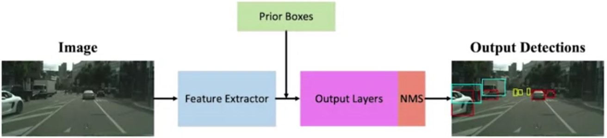

# 2D Object detection with Convolutional Neural Networks

## The Feature Extractor

Feature extractors are the most computationally expensive component of the 2D object detector

The output of feature extractors usually has much lower width and height than those of the input image, but much greater depth

Very active area of research, with new extractors
proposed on regular basis

Most common extractors are:
VGG,
ResNet, and
Inception

## VGG: Feature extractor

## VGG: Output Volume Shape

## Using Anchor Boxes

Ren, Shaoqing, et al. *"Faster r-cnn: Towards real-time object
detection with region proposal networks."* Advances in neural
information processing systems. 2015

## Classification VS Regression Heads

## Additional resources

Everingham, M., Van Gool, L., Williams, C. K., Winn, J., & Zisserman, A. (2010). The pascal visual object classes (voc) challenge. International journal of computer vision, 88(2), 303-338. (For understanding the problem + the metrics)
