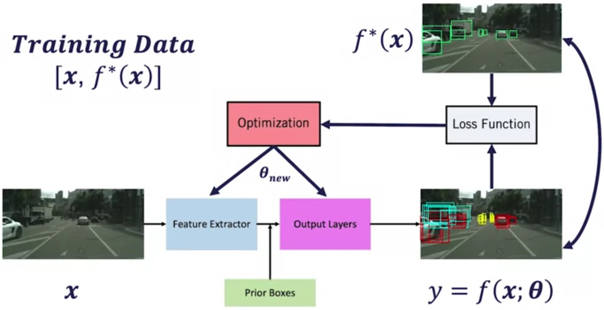

# Training vs Inference

## Training

## MiniBatch Selection

* Negative Member Threshold: < 0.4
* Positive Member Threshold: > 0.6

Negative anchors target:

* Classification: Background
* Regression: None

Positive anchors target:

* Classification: Category of the ground truth bounding box
* Regression: Align box parameters with highest IOU ground truth bounding box

 

> **Problem**: Majority of anchors are negatives results in
neural network will label all detections as background

 

> **Solution**: Sample a chosen minibatch size, with 3:1
ratio of negative to positive anchors to eliminate bias
towards the negative class

Choose negatives with highest classification loss (online
hard negative mining) to be included in the minibatch

* Example: minibatch size is 64 -> 48 hardest negatives
and 16 positives

## Classification Loss $L_{\text{cls}}$

$$L_{\text{cls}} = \frac{1}{N_{\text{total}}}\sum_i\text{CrossEntropy}(s_i^*,s_i)$$

* $N_{\text{total}}$ is the size of our minibatch
* $s_i$ is the output of the neural network
* $s_i^*$ the anchor classification target:
  * **Background** if anchor is negative
  * **Ground truth box class** if anchor is positive

## Regression Loss $L_{\text{reg}}$

$$L_{\text{reg}} = \frac{1}{N_p}\sum_ip_iL_2(b_i^*,b_i)$$

* $p_i$ is 0 if anchor is negative and 1 if anchor is positive
* $N_p$ is the number of positive anchors in the minibatch
* $b_i^*$ is the ground truth bounding box
* $b_i$ is the estimated bounding box, applying the regressed residuals to the anchor box parameters

> Remember that we don't directly estimate box parameters, but rather, we modify the anchor parameters by an additive residual or a multiplicative scale. So bi must be constructed from the estimated residuals.

## Non-Maximum Suppression

## Additional resources

* Ren, S., He, K., Girshick, R., & Sun, J. (2015). Faster r-cnn: Towards real-time object detection with region proposal networks. In Advances in neural information processing systems (pp. 91-99).

* Liu, W., Anguelov, D., Erhan, D., Szegedy, C., Reed, S., Fu, C. Y., & Berg, A. C. (2016, October). [Ssd: Single shot multibox detector. In European conference on computer vision](https://arxiv.org/abs/1512.02325)(pp. 21-37). Springer, Cham.

* Lin, T. Y., Goyal, P., Girshick, R., He, K., & Dollár, P. (2018). Focal loss for dense object detection. IEEE transactions on pattern analysis and machine intelligence. (State of the art)
