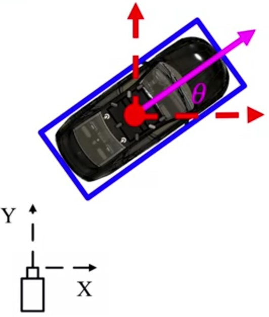
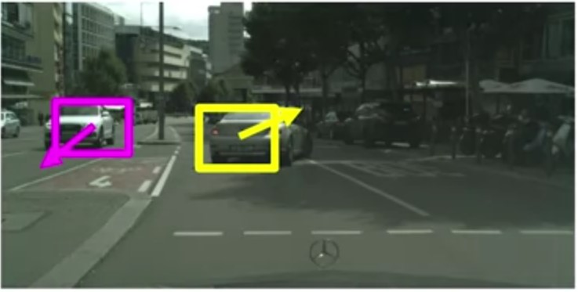
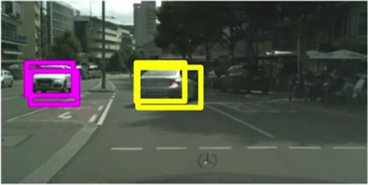

# Using 2D Object Detectors for Self-Driving Cars

## 3D Object Detection

Estimating the:

* Category Classification
* Position of the centroid in 3D
* Extent in 3D
* Orientation in 3D
* Car, pedestrian, cyclist
* $\color{red}\begin{bmatrix}x,y,z\end{bmatrix}$
* $\color{blue}\begin{bmatrix}l,w,h\end{bmatrix}$
* $\color{magenta}\begin{bmatrix}\phi, \psi,\theta\end{bmatrix}$

## From 2D -> 3D Object Detection

Representations:

* $X\ Y \ Z$
* Normalized $X\ Y \ Z$
* Histogram of $X\ Y \ Z$

Advantages of 2D -> 3D Approach:

* Allows exploitation of mature 2D object detectors, with high
precision and recall
* Class already determined from 2D detection
* Does not require prior scene knowledge, such as ground plane
location

Disadvantages:

* The performance of the 3D estimator is bounded by the
performance of the 2D detector
* Occlusion and truncation are hard to handle from 2D only
* 3D estimator needs to wait for 2D detector, inducing latency in our system

## 2D Object Tracking

**Detection**: We detect the object independently in each frame and can record its position over time

**Tracking**: We use image measurements to estimate
position of object, but also incorporate position
predicted by dynamics, i.e., our expectation of
object's motion pattern

Tracking Assumptions:

* Camera is not moving instantly to new viewpoint
* Objects do not disappear and reappear in different places in
the scene
* If the camera is moving, there is a gradual change in pose
between camera and scene

Steps:

1. Prediction
2. Measurement
3. Correlation
4. Measurement Update

For each frame, we start new track if a measurement has no correlated prediction

We also terminate inconsistent tracks, if a predicted object does not correlate with a measurement for a preset number of frames

The same methodology can be used to track objects in 3D!

### Prediction

Each object will have a predefined motion model in
image space

**Example** $$p_k=p_{k-1}+v_k\Delta t + \mathcal{N}(0,\Sigma)$$

### Correlation

Get Measurement Bounding Boxes from 2D
detector.

Correlate prediction with the highest IOU
measurement

### Update

The prediction and measurement are fused as part
of the Kalman Filter Framework

## Traffic Sign and Traffic Signal Detection

Traffic signs and signals appear smaller in size compared to cars, two-wheelers, and pedestrians.

Traffic signs are highly variable with many
classes to be trained on.

Traffic signals have different states that are
required to be detected.

In addition, traffic signals change state as the
car drives!

### Implementation

2D object detectors can be used to perform traffic sign and traffic signal detection without any modifications

However, multi-stage hierarchical models have been shown to outperform the standard single stage object detectors

Tthe first stage outputs class agnostic bounding boxes that point to all traffic signs and signals in the image, without specifying which class each box belongs to.

The second stage then takes all of the bounding boxes from the first stage and classifies them into categories such as red, yellow or green signals stop signs etc.

In addition, some methods also use the second stage to further refine the bounding boxes provided in the first stage. This multi-stage approach is not specific to traffic signs and signals, and many of the general object detection frameworks employ multi-stage methods to generate accurate object class and location.

## Additional resources

Geiger, Andreas, Phillp Lenz. and Raquel Urtasun. "Are we ready for autonomous driving? the KITTI vison benchmark suite" Computer Vision and Pattern Recognition (CVPR), 2012 IEEE Conference on. IEEE, 2012.

Qi, C. R., Liu, W., Wu, C., Su, H., & Guibas, L. J. (2017). Frustum pointnets for 3d object detection from rgb-d data. arXiv preprint arXiv:1711.08488. (3D object detection from 2D)

Forsyth, D.A. and J. Ponce (2003). Computer Vision: a modern approach (2nd edition). New Jersey: Pearson. Read section 18.2 (Tracking)
