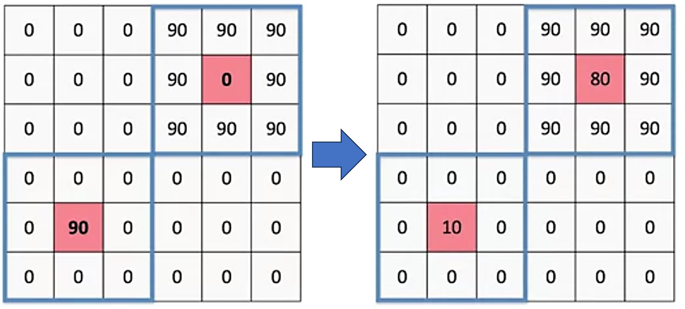
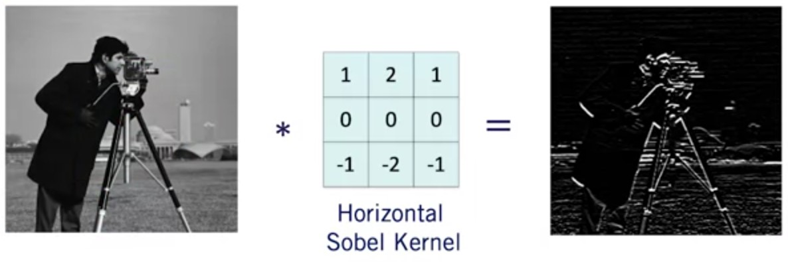

# Image filtering

## Example

$$G[u,v] = \frac{1}{(2k+1)^2}\sum_{i=-k}^K\sum_{j=-k}^KI[u-i,v-i]$$

**$(2K+1)$**: Filter size

**$(u,v)$**: Center pixel coordinates

## Cross-Correlation

$$G[u,v] = \sum_{i=-k}^K\sum_{j=-k}^KH[i,j]I[u-i,v-i]$$

## Convolution

A convolution is a cross-correlation where the filter is flipped both horizontally and vertically before being applied to the image.

Unlike Cross-Correlation, Convolution is associative.
If H and F are filter kernels then:$$H*(F*I)=(H*F)*I$$

Precompute filter convolutions (H * F) then apply it once to the image to reduce runtime!

## Aplications

### Template Matching

* Cross-correlation is useful for template matching
* The pixel with the highest response from Cross- correlation is the location of the template in an image

### Gradient Computation

* Convolution can be used for Image gradient computation
* Define a finite difference kernel, and apply it to the image
to get the image gradient

## Additional resources

* Forsyth, D. A. and J. Ponce. (2003). Computer vision: a modern approach (2nd edition). New Jersey: Pearson. Read sections 7.1, 7.2.

* Szeliski, R. (2010). [Computer vision: algorithms and applications](http://szeliski.org/Book/drafts/SzeliskiBook_20100903_draft.pdf). Springer Science & Business Media. Read sections  3.2, 3.3

* Image filtering (OpenCV), [Detailed Description section](https://docs.opencv.org/3.4.3/d4/d86/group__imgproc__filter.html)
