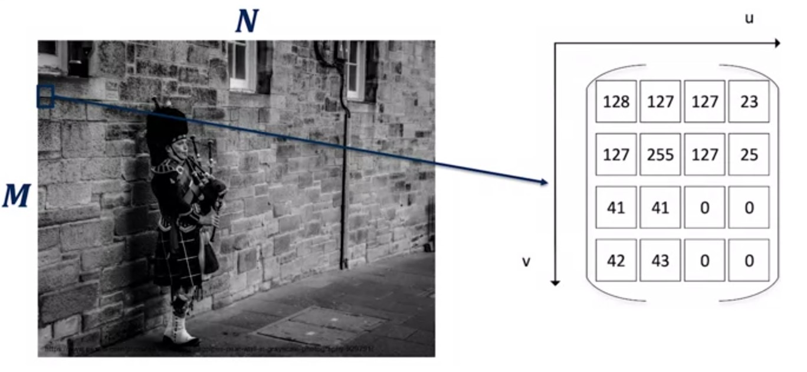
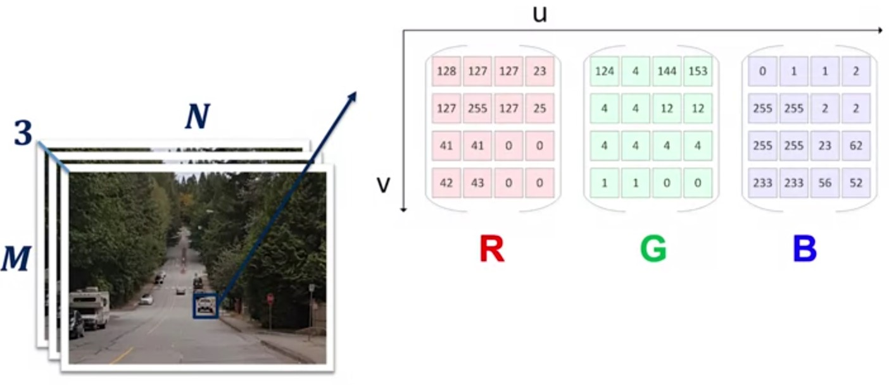

# Camera Projective Geometry

## World -> Image (Real Camera)

.jpg)

## World -> Image (Simplified Camera)

.jpg)

First, we select a world frame $\begin{bmatrix}X_w&Y_w&Z_w\end{bmatrix}^T$ in which to define the coordinates of all objects and the camera. We also define the camera coordinate frame $\begin{bmatrix}X_c&Y_c&Z_c\end{bmatrix}^T$ as the coordinate frame attached to the center of our lens aperture known as the optical sensor.

> We can define a translation vector $\bm{t}$ and a rotation matrix $\bm{R}$ to model any transformation between a world coordinate frame and another, and in this case, we'll use the world coordinate frame and the camera coordinate frame.

We refer to the parameters of the camera pose as the *extrinsic parameters*, as they are external to the camera and specific to the location of the camera in the world coordinate frame. We define our image coordinate frame as the coordinate frame attached to our virtual image plane emanating from the optical center.

The **image pixel coordinate system**   $\begin{bmatrix}U&V\end{bmatrix}^T$ however, **is attached to the top left corner of the virtual image plane**. So we'll need to adjust the pixel locations to the image coordinate frame. Next, we define the focal length $\bm{f}$ is the distance between the camera and the image coordinate frames along the z-axis of the camera coordinate frame

## Computing the projection

From world coordinates to image coordinates

1. Project from World coordinates -> Camera coordinates $$o_{\text{camera}}=[R|t]O_{\text{world}}$$ $$o_{\text{image}}=\begin{bmatrix}f&0&u_0\\
0&f&v_0\\
0&0&1
\end{bmatrix}o_{\text{camera}}=Ko_{\text{camera}}$$
2. Project from Camera coordinates to Image coordinates

> The matrix depends on camera intrinsic parameters, which means it depends on components internal to the camera such as the camera geometry and the camera lens characteristics.

### World -> Image

$$P=K[R|t]$$
$$o_{\text{image}}=PO=K[R|t]O_{\text{world}}$$
> In order to achieve matrix multiplication $O_{\text{world}}=\begin{bmatrix}X\\ Y\\ Z\\ 1\end{bmatrix}$

### World -> pixel

World coordinates to Image coordinates
$$o_{\text{image}}=\begin{bmatrix}x\\ y\\ z\end{bmatrix}=K[R|t]\begin{bmatrix}X\\ Y\\ Z\\ 1\end{bmatrix}$$
Image coordinates to Pixel coordinates
$$\begin{bmatrix}x\\ y\\ z\end{bmatrix}\rightarrow \begin{bmatrix}u\\ v\\ 1\end{bmatrix} =\frac{1}{z} \begin{bmatrix}x\\ y\\ z\end{bmatrix}$$

## The digital Image

### Grayscale

### Color

## Additional material

* Forsyth, D. A. and J. Ponce. (2003). Computer vision: a modern approach (2nd edition). New Jersey: Pearson. Read sections 1.1, 1.2, 2.3, 5.1, 5.2.

* Szeliski, R. (2010). [Computer vision: algorithms and applications](http://szeliski.org/Book/drafts/SzeliskiBook_20100903_draft.pdf). Springer Science & Business Media. Read sections 2.1, 2.2, 2.3

* Hartley, R., & Zisserman, A. (2003). Multiple view geometry in computer vision. Cambridge university press. Read sections 1.1, 1.2, 2.1, 6.1, 6.2
