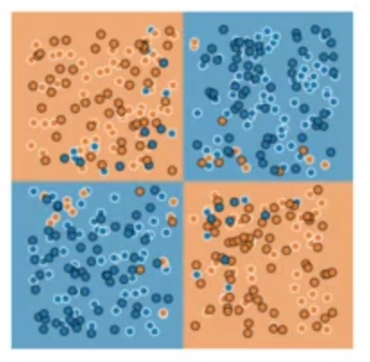
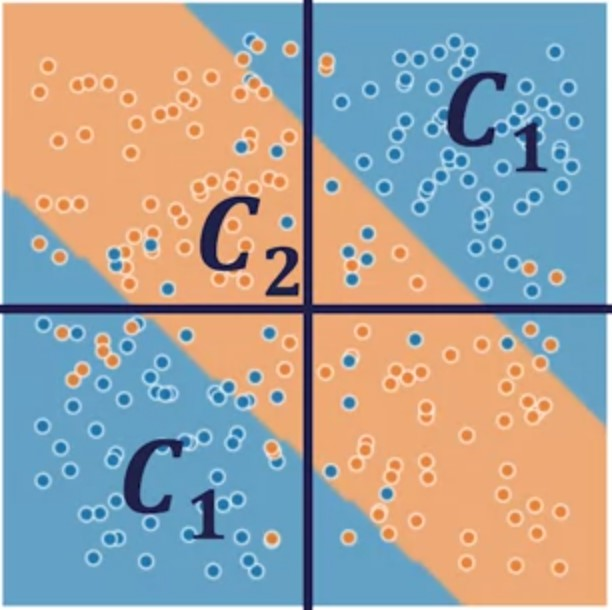
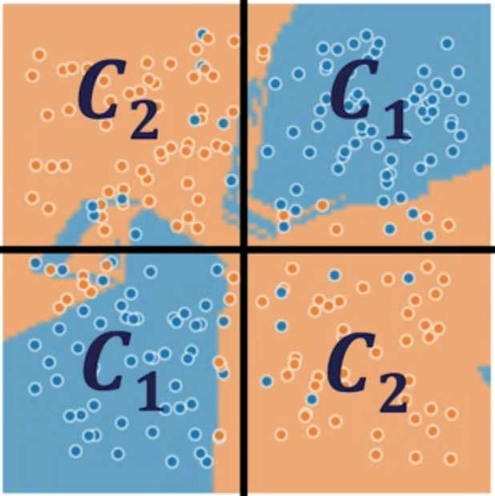
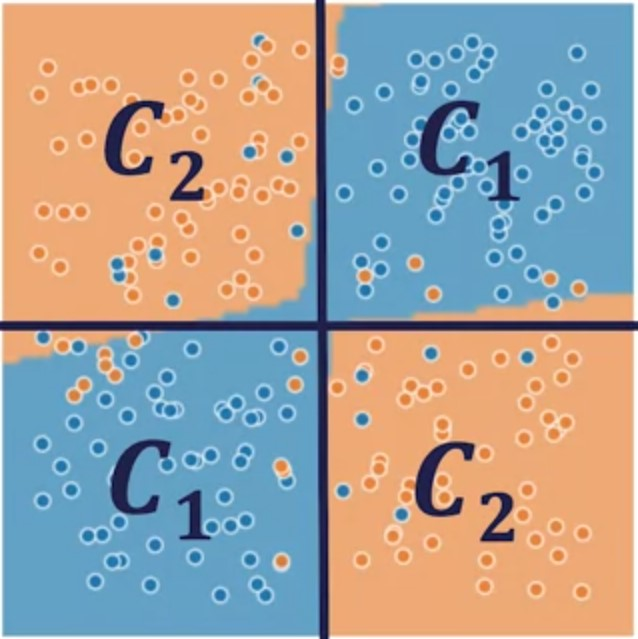

# Neural Network Regularization

|Network Architechture Design|Train set Loss|Val Set Loss|Minimum Loss achievable|Result|
|:--:|:---:|:---:|:--:|:--:|
|||||**Goal** |
|1 Layer NN, 2 Hidden Units/Layer|0.264|0.268|0.1| |
|6 Layer NN, 6 Hidden Units/Layer|0.1|0.45|0.1| |

In the first architechture underfitting is presented but in the second overfitting appears

## Parameter Norm Penalties

This approach limits the capacity of the model by adding the penalty omega of theta to the objective function.

$$J(\bm{\theta})_{\text{reg}} = J(\bm{\theta}) + \alpha\Omega(\bm{\theta})$$

* $\alpha$ is a hyperparameter that weights the relative contribution of the norm penalty to the value of the loss function
* $\Omega(\bm{\theta})$ is a measure of how large $\bm{\theta}$'s value is, usually an **LP Norm.**
* We usually only constrain the size of **weights** and not biases

> When p is 1 we have an absolute sum, and when p is 2 we get the quadratic sum, etc.

### L2-Norm Parameter Penalty

$$\Omega(\bm{W}) = \frac{1}{2}\bm{W}^T\bm{W}=\frac{1}{2}||\bm{W}||^2_2$$

|Network Architechture Design|Train set Loss|Val Set Loss|Minimum Loss achievable|Result|
|:--:|:---:|:---:|:--:|:--:|
|**Before L2**   6 Layer NN, 6 Hidden Units/Layer|0.1|0.45|0.1| |
|**After L2**   6 Layer NN, 6 Hidden Units/Layer|0.176|0.182|0.1| |

## Dropout

* Computationally inexpensive but powerful
regularization method
* Does not significantly limit the type of model or
training procedure that can be used
* Dropout layers are practically implemented in all
neural network libraries.

## Early Stopping

## Additional Material

Goodfellow, I., Bengio, Y., Courville, A., & Bengio, Y. (2016). [Deep learning (Vol. 1)](https://www.deeplearningbook.org/). Cambridge: MIT press. Read sections  7.1, 7.8, 7.12.
