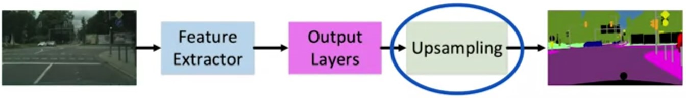
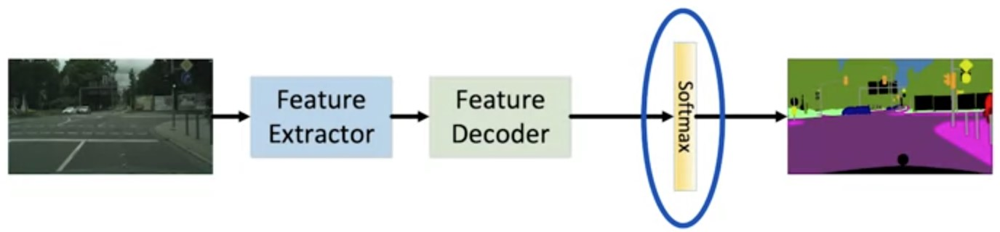
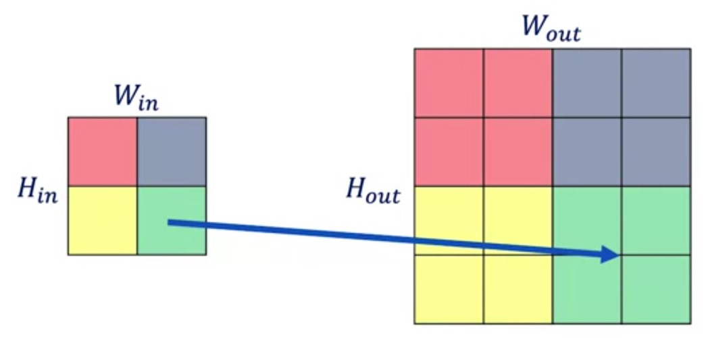

# ConvNets for Semantic Segmentation

## Feature extractor

## Upsampling Layer

Upsampling Multiplier $\bm{S}$

$$\bm{W}_{\text{out}}=S\times \bm{W_{\text{in}}}$$
$$\bm{H}_{\text{out}}=S\times \bm{H_{\text{in}}}$$
$$\bm{D}_{\text{out}}=\bm{D}_{\text{in}}$$

## Learning Same Resolution Feature Maps

## The Feature Decoder

## Output Representation and Loss

$$L_{\text{cls}} = \frac{1}{N_{\text{total}}}\sum_i\text{CrossEntropy}(s_i^*,s_i)$$

* $N_{\text{total}}$ is the number of pixels in all images of our minibatch
* $s_i$ is the output of the neural network
* $s_i^*$ is the ground truth classification

## Additional Resources

* Badrinarayanan, V., Kendall, A., & Cipolla, R. (2015). Segnet: A deep convolutional encoder-decoder architecture for image segmentation. arXiv preprint arXiv:1511.00561.

* Zhao, H., Shi, J., Qi, X., Wang, X., & Jia, J. (2017, July). Pyramid scene parsing network. In IEEE Conf. on Computer Vision and Pattern Recognition (CVPR) (pp. 2881-2890). (State of the art)
