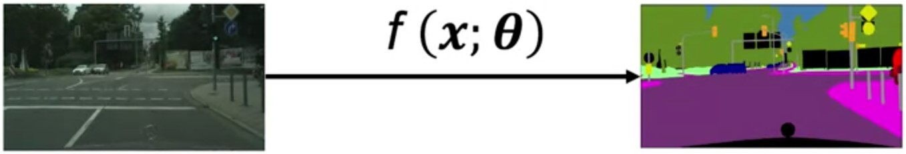

# The Semantic Segmentation Problem

In semantic segmentation we want to assign a label to each pixel

## Model

$$f(\bm{x};\bm{\theta})=\begin{bmatrix}S_{\text{class}_1},\dots,S_{\text{class}_k}\end{bmatrix}$$

So, how do we adapt our generic neural network to work for segmentation?

Given an image, we take every pixel as an input and output a vector of class scores per pixel. A pixel belongs to the class with the highest class score.

Therefore, we want our estimator to give the highest score to the correct class for every pixel in an image.

## Challenges

* Occlusion, truncation, scale, and illumination changes
* Smooth boundaries

## Evaluation Metrics

* True Positive (TP): The number of correctly classified pixels belonging to class X
* False Positive (FP): The number of pixels that do not belong to class X in ground truth but are classified that class by the algorithm
* False Negative (FN): The number of pixels that do belong to class X in ground truth, but are not classified as that class by the algorithm $$IOU_{\text{class}}=\frac{TP}{TP+FP+FN}$$

Class IOU over all the data is calculated by computing the sum of TP, FP, FN for all images first

> Averaging the class IOU is usually not a very good idea. This is because a global IOU measure is biased towards object incidences that cover a large image area.

## Datasets

CityScapes Segmentation Dataset

## Additional resources

* Cordts, M., Omran, M., Ramos, S., Rehfeld, T., Enzweiler, M., Benenson, R., ... & Schiele, B. (2016). The cityscapes dataset for semantic urban scene understanding. In Proceedings of the IEEE conference on computer vision and pattern recognition (pp. 3213-3223). (For understanding the problem + the metrics)

* Neuhold, G., Ollmann, T., Bulò, S. R., & Kontschieder, P. (2017, October). The Mapillary Vistas Dataset for Semantic Understanding of Street Scenes. In ICCV (pp. 5000-5009).
