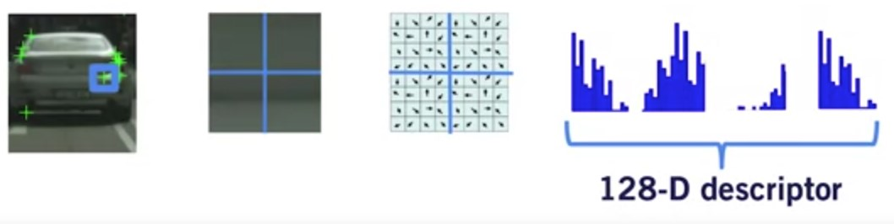

# Image Features and Feature Detectors

## Feature detection

Features are points of interest in an image

**Points of interest** should have the following characteristics:

* Saliency: distinctive, identifiable, and different from its immediate neighborhood
* Repeatability: can be found in multiple images using same operations
* Locality: occupies a relatively small subset of image space
* Quantity: enough points represented In the image
* Efficiency: reasonable computation time

## Feature Extraction

* Repetitive texture less patches are challenging to
detect consistently

* Patches with large contrast changes (gradients) are
easier to detect (edges)

* Gradients in at least two (significantly) different
orientations are the easiest to detect (corners)

## Feature Detection: Algorithms

* Harris {corners}: Easy to compute, but not scale invariant. [Harris and Stephens, 1988]
* Harris-Laplace {corners}: Same procedure as Harris detector, addition of scale selection based on Laplacian. Scale invariance. [Mikolajczyk, 2001]
* Features from accelerated segment test (FAST) {corners}: Machine learning approach for fast corner detection. [Rosten and Drummond, 2006]
* Laplacian of Gaussian (LOG) detector (blobs): Uses the concept of scale space in a large neighborhood (blob). Somewhat scale invariant. [Lindeberg, 1998]
* Difference of Gaussian (DOG) detector {blobs}: Approximates LOG but is faster to compute. [Lowe, 2004]

## Feature Descriptors

* Feature: Point of interest in an image defined by its image pixel coordinates $[u, v]$
* Descriptor: An N-dimensional vector that provides a summary of the image information around the detected feature

* Feature descriptors should have the following characteristics:
  * Repeatability: manifested as robustness and invariance to translation, rotation, scale, and illumination changes
  * Distinctiveness: should allow us to distinguish between two close by features, very important for matching later on
  * Compactness & Efficiency: reasonable computation time

## Designing Invariant Descriptors: SIFT

Scale Invariant Feature Transform (SIFT) descriptors:
[Lowe 1999]

1. 16 x 16 window around detected feature
2. Separate into 4 cells, each comprised of 4 x 4 patch of pixels
3. Compute edge orientation of each pixel in the cell
4. Suppress weak edges using a predefined threshold
5. Construct 32 dimensional histogram of orientations for each
cell, then concatenate to get 128 dimensional descriptor

## Other descriptors

* Speeded-Up Robust Features (SURF)
* Gradient Location-Orientation Histogram (GLOH)
* Binary Robust Independent Elementary Features (BRIEF)
* Oriented Fast and Rotated Brief (ORB)

## Additional material

* You can find implementation resources [here](https://opencv-python-tutroals.readthedocs.io/en/latest/py_tutorials/py_feature2d/py_table_of_contents_feature2d/py_table_of_contents_feature2d.html)

* Textbook: Forsyth, D.A. and J. Ponce (2003). Computer Vision: a modern approach (2nd edition). New Jersey: Pearson. Read section 9.4.

* [Haris Corner Detection](https://docs.opencv.org/4.0.0/dc/d0d/tutorial_py_features_harris.html)

* Introduction to [SIFT](https://docs.opencv.org/4.0.0/da/df5/tutorial_py_sift_intro.html) (Scale-Invariant Feature Transform)
